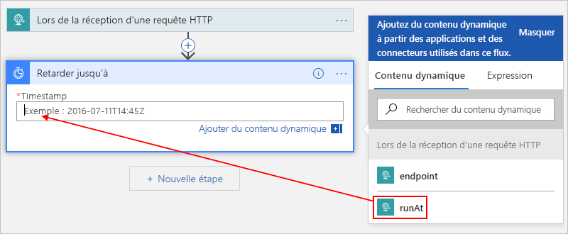
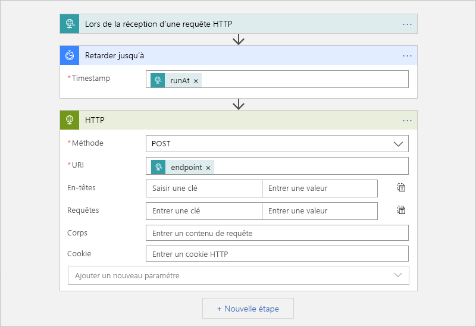

# <a name="migrate-azure-scheduler-jobs-to-azure-logic-apps"></a>Migrer des travaux Azure Scheduler vers Azure Logic Apps

> [!IMPORTANT]
> [Azure Logic Apps](../logic-apps/logic-apps-overview.md) remplace Azure Scheduler, qui est en phase de [mise hors service](#retire-date). Pour continuer à traiter les travaux que vous avez configurés dans Scheduler, migrez vers Azure Logic Apps dès que possible en suivant les instructions de cet article. 
>
> Scheduler n’est plus disponible dans le portail Azure, mais l’[API REST](/rest/api/scheduler) et les [applets de commande Azure Scheduler PowerShell](scheduler-powershell-reference.md) restent disponibles pour vous permettre de gérer vos travaux et collections de travaux.

Cet article vous montre comment planifier des travaux ponctuels et des travaux récurrents en créant des workflows automatisés avec Azure Logic Apps au lieu d’Azure Scheduler. La création de travaux planifiés avec Logic Apps présente les avantages suivants :

* Générez votre travail à l’aide d’un concepteur visuel et de [connecteurs prêts à l’emploi](../connectors/apis-list.md) parmi des centaines de services, tels que Stockage d’objets blob Azure, Azure Service Bus, Office 365 Outlook et SAP.

* Gérez chaque workflow planifié comme une ressource Azure de première classe. Vous n’avez pas à vous soucier du concept de *collection de tâches* , car chaque application logique est une ressource Azure distincte.

* Exécutez plusieurs travaux ponctuels à l’aide d’une seule application logique.

* Définissez des planifications qui prennent en charge les fuseaux horaires et s’ajustent automatiquement à l’heure d’été (DST).

Pour plus d’informations, voir [Qu’est-ce qu’Azure Logic Apps ?](../logic-apps/logic-apps-overview.md). Vous pouvez également tenter de créer votre première application logique en suivant les instructions de ce guide de démarrage rapide : [Créer votre première application logique](../logic-apps/quickstart-create-first-logic-app-workflow.md).

## <a name="prerequisites"></a>Prérequis

* Un abonnement Azure. Si vous n’avez pas d’abonnement Azure, [inscrivez-vous pour bénéficier d’un compte Azure gratuit](https://azure.microsoft.com/free/).

* Pour déclencher votre application logique en envoyant des requêtes HTTP, utilisez un outil tel que [l’application de bureau Postman](https://www.getpostman.com/apps).

## <a name="migrate-by-using-a-script"></a>Migrer à l’aide d’un script

Chaque tâche du planificateur étant unique, il n’existe pas d’outil standard pour la migration des tâches du planificateur vers Azure Logic Apps. En revanche, vous pouvez [modifier ce script](https://github.com/Azure/logicapps/tree/master/scripts/scheduler-migration) pour l’adapter à vos besoins.

## <a name="schedule-one-time-jobs"></a>Planifier des travaux ponctuels

Vous pouvez exécuter plusieurs travaux ponctuels en créant simplement une application logique.

1. Dans le [portail Azure](https://portal.azure.com), créez une application logique vide dans le concepteur d’application logique.

   Pour découvrir les étapes de base, suivez ce [guide de démarrage rapide : Créer votre première application logique](../logic-apps/quickstart-create-first-logic-app-workflow.md).

1. Dans la zone de recherche, entrez `when a http request` pour rechercher le déclencheur de requête. Dans la liste des déclencheurs, sélectionnez ce déclencheur : **Lors de la réception d’une requête HTTP**

   

1. Pour le déclencheur Requête, vous pouvez éventuellement fournir un schéma JSON qui permet au concepteur d’application logique de comprendre la structure des entrées incluses dans l’appel entrant du déclencheur Requête, et facilite la sélection ultérieure des sorties dans votre workflow.

   Dans la zone **Schéma JSON du corps de la demande** , entrez le schéma, par exemple :

   

   Si vous n’avez pas de schéma, mais un exemple de charge utile au format JSON, vous pouvez générer un schéma à partir de cette charge utile.

   1. Dans le déclencheur de requête, sélectionnez **Utiliser l’exemple de charge utile pour générer le schéma** .

   1. Sous **Entrer ou coller un exemple de charge utile JSON** , fournissez votre exemple de charge utile, puis sélectionnez **Terminé** . Par exemple :

      

      ```json
      {
         "runat": "2012-08-04T00:00Z",
         "endpoint": "https://www.bing.com"
      }
      ```

1. Sous le déclencheur, sélectionnez **Étape suivante** .

1. Dans la zone de recherche, entrez `delay until` en guise de filtre. Dans la liste des actions, sélectionnez cette action : **Retarder jusqu’à**

   Cette action interrompt le workflow de votre application logique jusqu’à la date et l’heure spécifiées.

   

1. Entrez l’horodatage pour définir le moment où démarrer le workflow de l’application logique.

   Quand vous cliquez dans la zone **Horodatage** , une liste de contenu dynamique s’affiche, dans laquelle vous pouvez éventuellement sélectionner une sortie du déclencheur.

   

1. Ajoutez les autres actions que vous souhaitez exécuter parmi des [centaines de connecteurs prêts à l’utilisation](../connectors/apis-list.md).

   Par exemple, vous pouvez ajouter une action HTTP qui envoie une requête à une URL, ou des actions qui interagissent avec les files d’attente de stockage, les files d’attente Service Bus ou les rubriques Service Bus :

   

1. Lorsque vous avez terminé, enregistrez votre application logique.

   

   Quand vous enregistrez votre application logique pour la première fois, l’URL de point de terminaison associée au déclencheur Requête de votre application logique s’affiche dans la zone **URL HTTP POST** . Si vous souhaitez appeler votre application logique et lui envoyer les entrées à traiter, utilisez cette URL comme destination de l’appel.

   

1. Copiez et enregistrez cette URL de point de terminaison, car vous en aurez besoin plus loin pour envoyer une requête manuelle qui déclenche votre application logique.

## <a name="start-a-one-time-job"></a>Démarrer un travail ponctuel

Pour exécuter ou déclencher un travail ponctuel manuellement, envoyez un appel à l’URL de point de terminaison associée au déclencheur Requête de votre application logique. Dans cet appel, spécifiez l’entrée ou la charge utile à envoyer, que vous avez peut-être déjà décrite précédemment quand vous avez spécifié un schéma.

Par exemple, dans l’application Postman, vous pouvez créer une requête POST avec les paramètres similaires à cet exemple, puis sélectionnez **Envoyer** pour effectuer la demande.

| Méthode de requête | URL | body | headers |
|----------------|-----|------|---------|
| **POST** | <*endpoint-URL*> | **raw** <p>**JSON(application/json)** <p>Dans la zone **raw** , entrez la charge utile à envoyer dans la demande. <p>**Remarque**  : Ce paramètre configure automatiquement les valeurs d’en-tête sous **Headers** . | **Clé**  : Content-Type <br>**Valeur** : application/json |
|||||


Après l’envoi de l’appel, la réponse de votre application logique s’affiche dans la zone **raw** sous l’onglet **Body** . 

<a name="workflow-run-id"></a>

> [!IMPORTANT]
>
> Si vous souhaitez ultérieurement annuler le travail, sélectionnez l’onglet **Headers** (En-têtes). Recherchez et copiez la valeur de l’en-tête **x-ms-workflow-run-id** dans la réponse. 
>
> 

## <a name="cancel-a-one-time-job"></a>Annuler un travail ponctuel

Dans Logic Apps, chaque travail ponctuel s’exécute comme une seule instance d’exécution dans l’application logique. Pour annuler un travail ponctuel, vous pouvez utiliser l’opération [Annuler les exécutions de workflow](/rest/api/logic/workflowruns/cancel) dans l’API REST Logic Apps. Quand vous envoyez un appel au déclencheur, entrez [l’ID d’exécution de workflow](#workflow-run-id).

## <a name="schedule-recurring-jobs"></a>Planifier des travaux récurrents

1. Dans le [portail Azure](https://portal.azure.com), créez une application logique vide dans le concepteur d’application logique.

   Pour découvrir les étapes de base, suivez ce [guide de démarrage rapide : Créer votre première application logique](../logic-apps/quickstart-create-first-logic-app-workflow.md).

1. Dans la zone de recherche, entrez « récurrence » comme filtre. Dans la liste des déclencheurs, sélectionnez ce déclencheur : **Périodicité**

   

1. Configurez une planification plus avancée, si vous le souhaitez.

   

   Pour plus d’informations sur les options de planification avancée, consultez [Créer et exécuter des travaux et des workflows récurrents avec Azure Logic Apps](../connectors/connectors-native-recurrence.md).

1. Ajoutez les autres actions que vous souhaitez exécuter parmi des [centaines prêtes à l’utilisation](../connectors/apis-list.md). Sous le déclencheur, sélectionnez **Étape suivante** . Recherchez et sélectionnez les actions souhaitées.

   Par exemple, vous pouvez ajouter une action HTTP qui envoie une requête à une URL, ou des actions qui interagissent avec les files d’attente de stockage, les files d’attente Service Bus ou les rubriques Service Bus :

   

1. Lorsque vous avez terminé, enregistrez votre application logique.

   

## <a name="advanced-setup"></a>Configuration avancée

Voici d’autres façons de personnaliser vos travaux.

### <a name="retry-policy"></a>Stratégie de nouvelle tentative

Pour déterminer la façon dont une action réessaie de s’exécuter dans votre application logique après des défaillances intermittentes, vous pouvez définir une [stratégie de nouvelles tentatives](../logic-apps/logic-apps-exception-handling.md#retry-policies) dans les paramètres de chaque action. Par exemple :

1. Ouvrez le menu **...** de l’action, puis sélectionnez **Paramètres** .

   

1. Sélectionnez la stratégie de nouvelles tentatives souhaitée. Pour plus d’informations sur chaque stratégie, consultez [Stratégies de nouvelles tentatives](../logic-apps/logic-apps-exception-handling.md#retry-policies).

   

## <a name="handle-exceptions-and-errors"></a>Gérer les erreurs et les exceptions

Dans Azure Scheduler, si l’action par défaut échoue à s’exécuter, vous pouvez exécuter une autre action qui gère la condition d’erreur. C’est également possible dans Azure Logic Apps.

1. Dans le concepteur d’application logique, au-dessus de l’action à gérer, déplacez votre pointeur sur la flèche entre les étapes, puis sélectionnez **Ajouter une branche parallèle** .

   

1. Recherchez et sélectionnez l’action à exécuter comme action de remplacement.

   

1. Sur l’autre action, ouvrez le menu **...** , puis sélectionnez **Configure run after** (Configurer l’exécution après).

   

1. Décochez la case de la propriété **is successful** (a réussi). Cochez les propriétés **has failed** (a échoué), **is skipped** (est ignorée) et **has timed out** (a expiré)

   

1. Quand vous avez terminé, cliquez sur **Terminé** .

Pour en savoir plus sur la gestion des exceptions, consultez [Gérer les erreurs et exceptions - Propriété RunAfter](../logic-apps/logic-apps-exception-handling.md#control-run-after-behavior).

## <a name="faq"></a>Questions fréquentes (FAQ)

<a name="retire-date"></a>

**Q**  : Quand Azure Scheduler sera-t-il mis hors service ? <br>
**R**  : La mise hors service d’Azure Scheduler est prévue pour le 31 décembre 2019. Pour connaître les mesures importantes à prendre avant cette date et accéder à une chronologie détaillée, voir [Date de suppression du Scheduler repoussée au 31 décembre 2019](https://azure.microsoft.com/updates/extending-retirement-date-of-scheduler/). Pour des mises à jour générales, voir [Mises à jour Azure – Planificateur](https://azure.microsoft.com/updates/?product=scheduler).

**Q**  : Que deviendront mes travaux et collections de travaux après la mise hors service ? <br>
**R**  : L’ensemble des travaux et des collections de travaux Scheduler seront arrêtés et supprimés du système.

**Q**  : Dois-je sauvegarder mon travail ou effectuer d’autres tâches avant de migrer mes travaux Scheduler vers Logic Apps ? <br>
**R**  : La bonne pratique est de toujours sauvegarder votre travail. Vérifiez que vos nouvelles applications logiques s’exécutent comme prévu avant de supprimer ou désactiver vos travaux Scheduler.

**Q**  : Existe-t-il un outil qui peut m’aider à migrer mes travaux de Scheduler vers Logic Apps ? <br>
**R**  : Il n’existe pas d’outil universel, car chaque travail Scheduler est unique. Toutefois, en fonction de vos besoins, vous pouvez [modifier ce script pour migrer des tâches du Planificateur Azure vers Azure Logic Apps](https://github.com/Azure/logicapps/tree/master/scripts/scheduler-migration).

**Q**  : Où puis-je obtenir de l’aide pour migrer mes travaux Scheduler ? <br>
**R**  : Voici quelques moyens d’obtenir de l’aide :

**Azure portal**

Si votre abonnement Azure s’accompagne d’un plan de support payant, vous pouvez créer une demande de support technique dans le portail Azure. Sinon, choisissez une autre option de support.

1. Dans le menu principal du [portail Azure](https://portal.azure.com), sélectionnez **Aide + support** .

1. Dans le menu **Support** , sélectionnez **Nouvelle demande de support** . Fournissez les informations suivantes sur votre demande :

   | Propriété | Valeur |
   |---------|-------|
   | **Type de problème** | **Technique** |
   | **Abonnement** | <*votre-abonnement-Azure*> |
   | **Service** | Sous **Supervision et gestion** , sélectionnez **Scheduler** . Si vous ne trouvez pas **Scheduler** , commencez par sélectionner **Tous les services** . |
   ||| 

1. Sélectionnez l’option de support souhaitée. Si vous avez un plan de support payant, sélectionnez **Suivant** .

**Communauté**

* [Page de questions Microsoft Q&R sur Azure Logic Apps](/answers/topics/azure-logic-apps.html)
* [Stack Overflow](https://stackoverflow.com/questions/tagged/azure-scheduler)

## <a name="next-steps"></a>Étapes suivantes

* [Créer et exécuter des travaux et des workflows récurrents avec Azure Logic Apps](../connectors/connectors-native-recurrence.md)