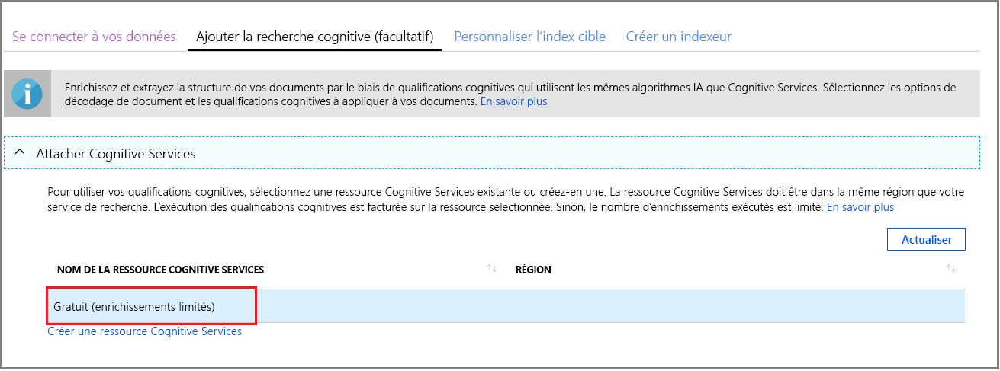
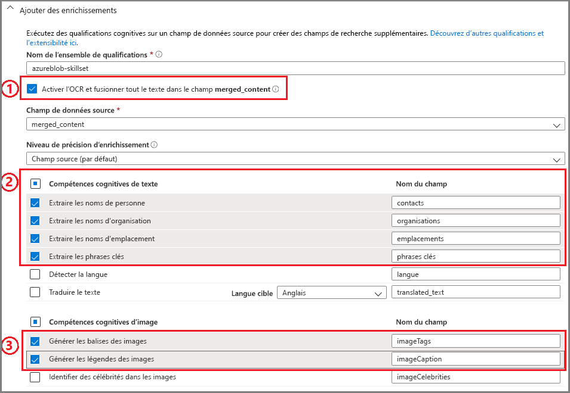
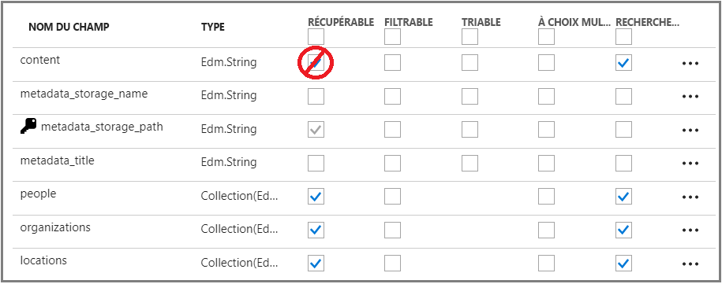
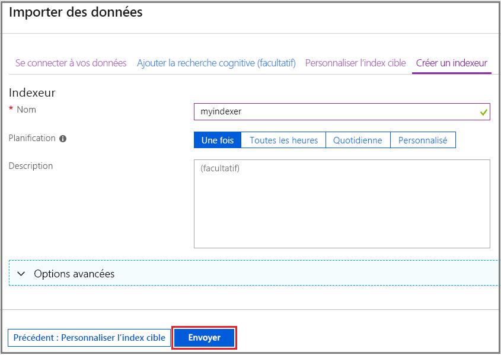
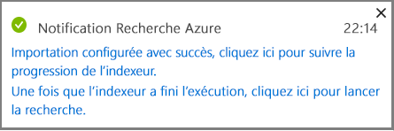
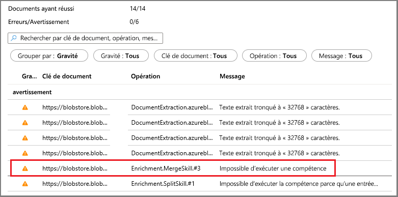
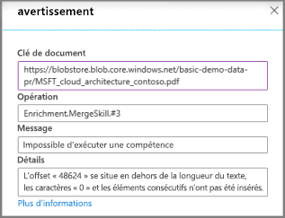
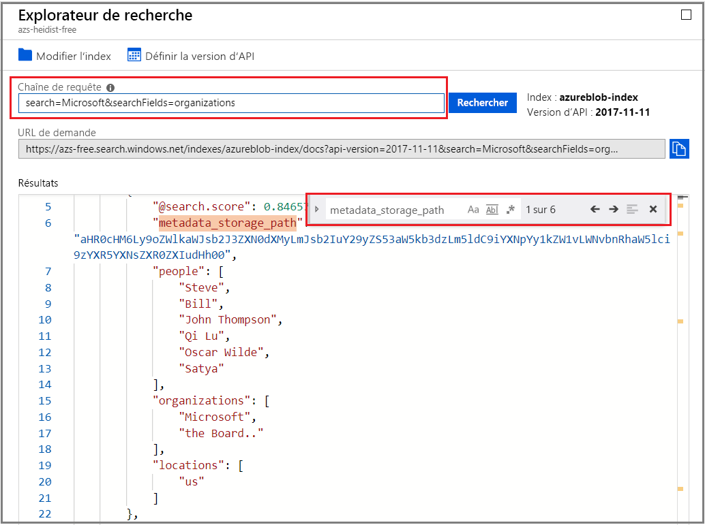

# Démarrage rapide : Créer un ensemble de compétences cognitives pour la Recherche cognitive Azure dans le portail Azure

Un ensemble de compétences est une fonctionnalité basée sur l’IA (intelligence artificielle) qui extrait des informations et une structure à partir de fichiers texte ou de fichiers image non différenciés et volumineux, et qui rend le contenu indexable et offrant des possibilités de recherche dans Recherche cognitive Azure. 

Dans ce guide de démarrage rapide, vous allez combiner les services et les données du cloud Azure pour créer l’ensemble de compétences. Une fois que tout est en place, vous exécutez l’Assistant **Importer des données** dans le portail Azure pour tout préparer. Le résultat final est un index de recherche qui contient des données créées par le traitement IA, que vous pouvez interroger dans le portail ([Explorateur de recherche](search-explorer.md)).

## Prérequis

Avant de commencer la lecture cet article, vous devez disposer des éléments suivants :

+ Compte Azure avec un abonnement actif. [Créez un compte gratuitement](https://azure.microsoft.com/free/).

+ Service Recherche cognitive Azure. [Créez un service](search-create-service-portal.md) ou [recherchez un service existant](https://ms.portal.azure.com/#blade/HubsExtension/BrowseResourceBlade/resourceType/Microsoft.Search%2FsearchServices) dans votre abonnement actuel. Vous pouvez utiliser un service gratuit pour ce guide de démarrage rapide. 

+ Un compte de stockage Azure avec un [stockage blob](../storage/blobs/index.yml).

> [!NOTE]
> Ce guide de démarrage rapide utilise également [Azure Cognitive Services](https://azure.microsoft.com/services/cognitive-services/) pour l’intelligence artificielle. Parce que la charge de travail est vraiment petite, Cognitive Services est utilisé en arrière-plan pour traiter gratuitement jusqu’à 20 transactions. Cela signifie que vous pouvez effectuer cet exercice sans avoir à créer une ressource Cognitive Services supplémentaire.

## Configurer vos données

Dans les étapes suivantes, configurez un conteneur d’objets blob dans Stockage Azure pour stocker des fichiers de contenu hétérogènes.

1. [Téléchargez les exemples de données](https://1drv.ms/f/s!As7Oy81M_gVPa-LCb5lC_3hbS-4) consistant en un petit ensemble de fichiers de types différents. Décompressez les fichiers

1. [Créez un compte de stockage Azure](../storage/common/storage-account-create.md?tabs=azure-portal) ou [recherchez un compte existant](https://ms.portal.azure.com/#blade/HubsExtension/BrowseResourceBlade/resourceType/Microsoft.Storage%2storageAccounts/). 

   + Choisissez la même région que celle de la Recherche cognitive Azure pour éviter des frais de bande passante. 

   + Choisissez le type de compte StorageV2 (V2 à usage général) si vous souhaitez tester la fonctionnalité de base de connaissances plus tard, au cours d’une autre procédure pas à pas. Sinon, choisissez n’importe quel type.

1. Ouvrez les pages des services BLOB et créez un conteneur. Vous pouvez utiliser le niveau d’accès public par défaut. 

1. Dans le conteneur, cliquez sur **Charger** pour charger les exemples de fichiers que vous avez téléchargés au cours de la première étape. Notez que vous disposez d’un large éventail de types de contenu, notamment des images et des fichiers d’application qui ne peuvent pas faire l’objet de recherches en texte intégral dans leurs formats natifs.

   

Vous êtes maintenant prêt à passer à l’Assistant Importation de données.

## Exécuter l’Assistant Importation de données

1. Connectez-vous au [portail Azure](https://portal.azure.com/) avec votre compte Azure.

1. [Recherchez votre service de recherche](https://ms.portal.azure.com/#blade/HubsExtension/BrowseResourceBlade/resourceType/Microsoft.Storage%2storageAccounts/). Ensuite, dans la page Vue d’ensemble, cliquez sur **Importer des données** sur la barre de commandes pour configurer l’enrichissement cognitif en quatre étapes.

   

### Étape 1 : Créer une source de données

1. Dans **Connexion à vos données**, choisissez **Stockage Blob Azure**, sélectionnez le compte de stockage et le conteneur que vous avez créés. Donnez un nom à la source de données et utilisez les valeurs par défaut pour le reste. 

   

    Passez à la page suivante.

### Étape 2 : Ajouter des compétences cognitives

Ensuite, configurez l’enrichissement par IA pour appeler l’OCR, l’analyse des images et le traitement en langage naturel. 

1. Pour ce guide de démarrage rapide, nous utilisons la ressource Cognitive Services au niveau **Gratuit**. Les exemples de données se composent de 14 fichiers. L’allocation gratuite de 20 transactions sur Cognitive Services est donc suffisante pour ce guide de démarrage rapide. 

   

1. Développez **Ajouter des enrichissements** et effectuez quatre sélections. 

   Activez l’OCR pour ajouter des compétences d’analyse d’images à la page de l’Assistant.

   Définissez la précision sur Pages pour scinder le texte en morceaux plus petits. Plusieurs compétences en texte sont limitées à des entrées de 5 Ko.

   Choisissez des compétences de reconnaissance d’entité (personnes, organisations, emplacements) et d’analyse d’image.

   

   Passez à la page suivante.

### Étape 3 : Configurer l’index

Un index contient le contenu pouvant faire l’objet de recherches. L’Assistant **Importation de données** peut généralement créer le schéma à votre place en échantillonnant la source de données. Au cours de cette étape, examinez le schéma généré, puis modifiez éventuellement les paramètres. Vous trouverez ci-dessous le schéma par défaut créé pour le jeu de données d’objets blob de démonstration.

Pour ce guide de démarrage rapide, l’Assistant effectue un travail de qualité en termes de définition de valeurs par défaut raisonnables :  

+ Les champs par défaut sont basés sur les propriétés des objets blob existants ainsi que sur les nouveaux champs destinés à contenir une sortie d’enrichissement (par exemple, `people`, `organizations`, `locations`). Les types de données sont déduits à partir des métadonnées et des échantillonnages de données.

+ La clé de document par défaut est *metadata_storage_path* (ce champ est sélectionné, car il contient des valeurs uniques).

+ Les attributs par défaut sont **Récupérable** et **PossibilitéRecherche**. **PossibilitéRecherche** permet la recherche en texte intégral dans un champ. **Récupérable** signifie que les valeurs des champs peuvent être retournées dans les résultats. L’Assistant suppose que vous souhaitez ces champs récupérables et interrogeables, car vous les avez créés par l’intermédiaire de compétences.

  

Remarquez la zone barrée et le point d’interrogation sur l’attribut **Récupérable** près du champ `content`. Pour les documents d’objets blob comportant beaucoup de texte, le champ `content` contient la majeure partie du fichier qui peut atteindre des milliers de lignes. Un champ comme celui-ci pouvant alourdir les résultats de la recherche, vous devez l’exclure de cette démonstration. 

Toutefois, si vous devez transmettre le contenu du fichier au code client, assurez-vous que **Récupérable** reste sélectionné. Sinon, pensez à décocher cet attribut sur `content` si les éléments extraits (tels que `people`, `organizations`, `locations`, etc.) sont suffisants.

Marquer un champ comme étant **Récupérable** ne signifie pas que le champ *doit* être présent dans les résultats de recherche. Vous pouvez contrôler avec précision la composition des résultats de recherche à l’aide du paramètre de requête **$select** pour spécifier les champs à inclure. Pour les champs comportant beaucoup de texte, tels que `content`, le paramètre **$select** constitue votre solution pour fournir aux utilisateurs humains de votre application des résultats de recherche faciles à gérer, tout en garantissant au code client l’accès à toutes les informations dont il a besoin via l’attribut **Récupérable**.
  
Passez à la page suivante.

### Étape 4 : Configurer l’indexeur

L’indexeur est une ressource de niveau supérieur qui gère le processus d’indexation. Il spécifie le nom de la source de données, un index cible et la fréquence d’exécution. L’Assistant **Importation de données** crée plusieurs objets, dont un indexeur qui est toujours présent et que vous pouvez exécuter à plusieurs reprises.

1. Dans la page **Indexeur**, vous pouvez accepter le nom par défaut et cliquer sur l’option de planification **Une fois** pour l’exécuter immédiatement. 

   

1. Cliquez sur **Envoyer** pour créer et exécuter simultanément l’indexeur.

## Superviser l’état

L’indexation des compétences cognitives prend plus de temps que l’indexation textuelle classique, notamment l’OCR et l’analyse d’image. Pour superviser la progression, accédez à la page Vue d’ensemble, puis cliquez sur **Indexeurs** au centre de la page.

  

Les avertissements sont normaux compte tenu de la large gamme de types de contenu. Certains types de contenu ne sont pas valides pour certaines compétences et, à des niveaux inférieurs, il est courant de rencontrer des [limites d’indexeur](search-limits-quotas-capacity.md#indexer-limits). Par exemple, les notifications de troncation de 32 000 caractères sont une limite d’indexeur au niveau Gratuit. Si vous exécutiez cette démonstration à un niveau supérieur, de nombreux avertissements de troncation disparaîtraient.

Pour vérifier les avertissements ou les erreurs, cliquez sur l’état Avertissement dans la liste Indexeurs afin d’ouvrir la page Historique d’exécution.

Dans cette page, recliquez sur l’état Avertissement pour afficher la liste des avertissements similaires à celui illustré ci-dessous. 

  

Les détails s’affichent quand vous cliquez sur une ligne d’état spécifique. Cet avertissement indique que la fusion s’est arrêtée après avoir atteint un seuil maximal (le fichier PDF en question est volumineux).

  

## Requête dans l’Explorateur de recherche

Après la création d’un index, vous pouvez exécuter des requêtes pour retourner des résultats. Dans le portail, utilisez l’**Explorateur de recherche** pour cette tâche. 

1. Sur la page de tableau de bord du service de recherche, cliquez sur **Explorateur de recherche** sur la barre de commandes.

1. Cliquez sur **Modifier l’index** en haut pour sélectionner l’index créé.

1. Entrez une chaîne de recherche pour interroger l’index, telle que `search=Microsoft&$select=people,organizations,locations,imageTags`.

Les résultats sont retournés au format JSON, qui peut être long et difficile à lire, en particulier dans des documents volumineux provenant d’objets blob Azure. Voici quelques conseils pour effectuer des recherches dans cet outil :

+ Ajoutez `$select` pour spécifier les champs à inclure dans les résultats. 
+ Utilisez CTRL-F pour rechercher des termes ou des propriétés spécifiques dans les résultats au format JSON.

Les chaînes de requête respectent la casse. Ainsi, si vous recevez un message « champ inconnu », consultez l’onglet **Champs** ou **Définition d’index (JSON)** pour vérifier le nom et la casse. 

  

## Éléments importants à retenir

Vous avez créé votre premier ensemble de compétences et appris d’importants concepts utiles pour le prototypage d’une solution de recherche enrichie à l’aide de vos propres données.

Parmi les concepts clés, que nous espérons que vous avez compris, figurent la dépendance à l’égard des sources de données Azure. Un ensemble de compétences est lié à un indexeur. Les indexeurs sont spécifiques à Azure et à la source. Bien que ce guide de démarrage rapide utilise le stockage Blob Azure, d’autres sources de données Azure sont possibles. Pour plus d’informations, consultez [Indexeurs dans la Recherche cognitive Azure](search-indexer-overview.md). 

Un autre concept important est que les compétences fonctionnent sur les types de contenu et que, lors de l’utilisation de contenu hétérogène, certaines entrées sont ignorées. En outre, les fichiers ou les champs volumineux peuvent dépasser les limites d’indexeur de votre niveau de service. Il est normal de voir des avertissements quand ces événements se produisent. 

La sortie est dirigée vers un index de recherche. Il existe un mappage entre les paires nom-valeur créées durant l’indexation et les champs individuels de votre index. En interne, le portail configure les [annotations](cognitive-search-concept-annotations-syntax.md) et définit un [ensemble de compétences](cognitive-search-defining-skillset.md), en établissant l’ordre des opérations et le flux général. Ces étapes sont masquées dans le portail, mais lorsque vous démarrez l’écriture de code, ces concepts deviennent importants.

Enfin, vous avez appris que vous pouvez vérifier le contenu en interrogeant l’index. Pour finir, la Recherche cognitive Azure fournit un index offrant des possibilités de recherche, que vous pouvez interroger à l’aide de la [syntaxe de requête simple](/rest/api/searchservice/simple-query-syntax-in-azure-search) ou de la [syntaxe de recherche entièrement étendue](/rest/api/searchservice/lucene-query-syntax-in-azure-search). Un index contenant des champs enrichis ressemble à n’importe quel autre index. Si vous souhaitez intégrer des analyseurs standard ou [personnalisés](search-analyzers.md), des [profils de scoring](/rest/api/searchservice/add-scoring-profiles-to-a-search-index), des [synonymes](search-synonyms.md), des [filtres à facettes](search-filters-facets.md), une recherche géographique ou toute autre fonctionnalité liée à la Recherche cognitive Azure, vous pouvez le faire sans problème.

## Nettoyer les ressources

Lorsque vous travaillez dans votre propre abonnement, il est recommandé, à la fin de chaque projet, de déterminer si vous avez toujours besoin des ressources que vous avez créées. Les ressources laissées en cours d’exécution peuvent vous coûter de l’argent. Vous pouvez supprimer les ressources une par une, ou choisir de supprimer le groupe de ressources afin de supprimer l’ensemble des ressources.

Vous pouvez rechercher et gérer les ressources dans le portail à l’aide des liens **Toutes les ressources** ou **Groupes de ressources** situés dans le volet de navigation de gauche.

Si vous utilisez un service gratuit, n’oubliez pas que vous êtes limité à trois index, indexeurs et sources de données. Vous pouvez supprimer des éléments un par un dans le portail pour ne pas dépasser la limite. 

## Étapes suivantes

Vous pouvez créer des ensembles de compétences à l’aide du portail, du kit SDK .NET ou de l’API REST. Pour approfondir vos connaissances, essayez l’API REST avec Postman et d’autres exemples de données.

> [!div class="nextstepaction"]
> [Tutoriel : Extraire du texte et une structure à partir d’objets blob JSON à l’aide d’API REST](cognitive-search-tutorial-blob.md)

> [!Tip]
> Si vous souhaitez répéter cet exercice ou essayer une autre procédure pas à pas d’enrichissement par IA, supprimez l’indexeur du portail. La suppression de l’indexeur réinitialise le compteur de transactions quotidiennes gratuites à zéro pour le traitement Cognitive Services.