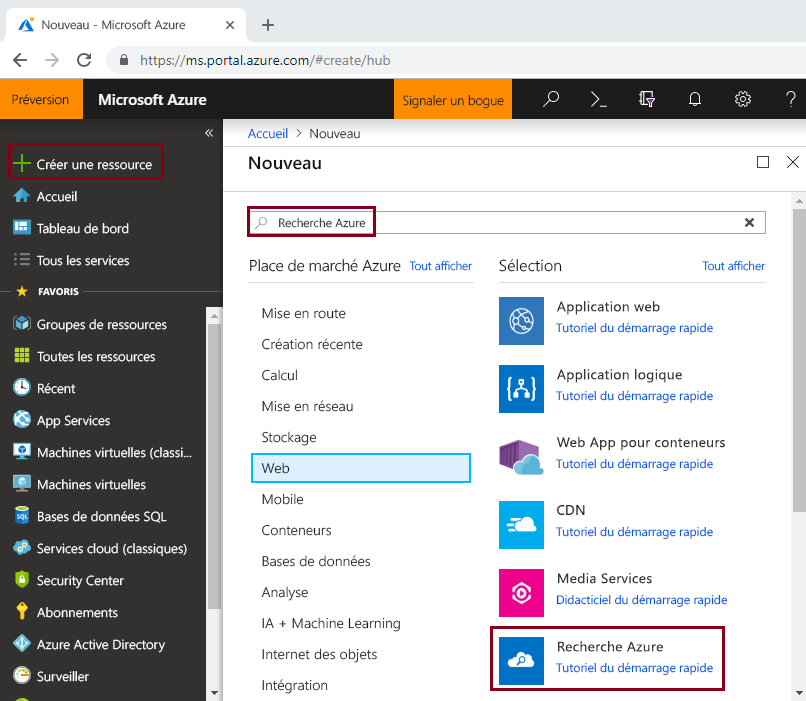
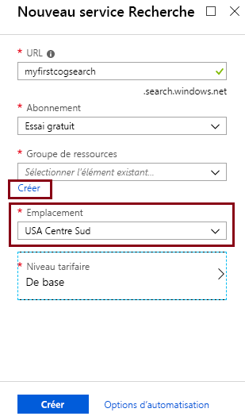
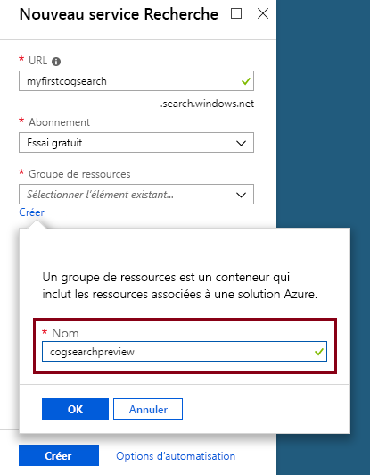
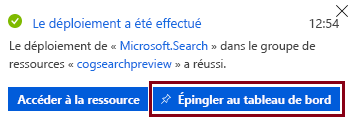

# Démarrage rapide : Créer un pipeline de recherche cognitive à l’aide de compétences et d’exemples de données

La recherche cognitive (version préliminaire) ajoute des compétences en matière d’extraction de données, de traitement en langage naturel (NLP) et de traitement d’image à un pipeline d’indexation Recherche Azure pour faciliter la recherche dans les contenus non structurés ou dans lesquels il est impossible d’effectuer des recherches. Les informations créées par une compétence, telles que la reconnaissance d’entité ou l’analyse d’image sont ajoutées à un index dans Recherche Azure.

Dans ce guide de démarrage rapide, essayez le pipeline d’enrichissement dans le [portail Azure](https://portal.azure.com) avant d’écrire une seule ligne de code :

* Commencer avec les exemples de données dans le stockage d’objets blob Azure
* Configurer l’[Assistant Importer des données](search-import-data-portal.md) pour l’indexation et l’enrichissement 
* Exécutez l’Assistant (une compétence d’entité détecte les personnes, l’emplacement et les organisations)
* Utilisez l’[Explorateur de recherche](search-explorer.md) pour interroger l’index enrichi.

##  Régions prises en charge

Vous pouvez essayer la recherche cognitive dans un service Recherche Azure créé dans les régions suivantes :

* USA Centre-Ouest
* USA Centre Sud
* USA Est
* USA Est 2
* USA Ouest 2
* Centre du Canada
* Europe Ouest
* Sud du Royaume-Uni
* Europe Nord
* Brésil Sud
* Asie Sud-Est
* Inde Centre
* Australie Est

Si vous n’avez pas d’abonnement Azure, créez un [compte gratuit](https://azure.microsoft.com/free/?WT.mc_id=A261C142F) avant de commencer.

> [!NOTE]
> À compter du 21 décembre 2018, vous pouvez associer une ressource Cognitive Services à un ensemble de qualifications Recherche Azure. Cela nous permet de commencer la facturation pour l’exécution des ensembles de qualifications. À compter de cette date, nous commençons également à facturer l’extraction d’images dans le cadre de notre étape de décodage de documents. L’extraction de texte à partir de documents continue d’être offerte sans frais supplémentaires.
>
> L’exécution des compétences intégrées est facturée au prix actuel du [paiement à l’utilisation de Cognitive Services](https://azure.microsoft.com/pricing/details/cognitive-services/). Les tarifs de l’extraction d’images sont ceux de la préversion. Ils sont décrits dans la page [Tarification de Recherche Azure](https://go.microsoft.com/fwlink/?linkid=2042400). [En savoir plus](cognitive-search-attach-cognitive-services.md).

## Prérequis

[« Qu’est-ce que la recherche cognitive ? »](cognitive-search-concept-intro.md) Présente l’architecture d’enrichissement et ses composants. 

Les services Azure sont utilisés exclusivement dans ce scénario. La création des services dont vous avez besoin fait partie de la préparation.

+ Le stockage Blob Azure fournit les données source.
+ Recherche Azure gère l’ingestion et l’indexation de données, l’enrichissement de la recherche cognitive et les requêtes de recherche en texte intégral.

### Configurer Recherche Azure

Tout d’abord, inscrivez-vous au service Recherche Azure. 

1. Accédez au [portail Azure](https://portal.azure.com) et connectez-vous avec votre compte Azure.

1. Cliquez sur **Créer une ressource**, recherchez Recherche Azure et cliquez sur **Créer**. Consultez [Créer un service Recherche Azure dans le portail](search-create-service-portal.md) si vous configurez un service de recherche pour la première fois et avez besoin d’aide supplémentaire.

  

1. Pour Groupe de ressources, créez un groupe de ressources qui contiendra toutes les ressources que vous créerez dans ce guide de démarrage rapide. Cela facilite le nettoyage des ressources lorsque vous avez terminé le guide de démarrage rapide.

1. Concernant l’endroit, choisissez l’une des [régions prises en charge](#supported-regions) pour la Recherche cognitive.

1. Pour le niveau tarifaire, vous pouvez créer un service **Gratuit** pour effectuer les tutoriels et les guides de démarrage rapide. Pour un examen plus approfondi à l’aide de vos propres données, créez un [service payant](https://azure.microsoft.com/pricing/details/search/), tel qu’un service **De base** ou **Standard**. 

  Un service gratuit est limité à 3 index, à une taille maximale d’objet blob de 16 Mo et à 2 minutes d’indexation, ce qui est insuffisant pour exercer toutes les fonctionnalités de recherche cognitive. Pour passer en revue les limites des différents niveaux, consultez [Limites du service](search-limits-quotas-capacity.md).

  
  
  > [!NOTE]
  > La recherche cognitive est disponible en préversion publique. L’exécution des compétences est actuellement disponible dans tous les niveaux, y compris le niveau gratuit. Vous serez en mesure d’effectuer un nombre limité d’enrichissements sans associer une ressource Cognitive Services payante. [En savoir plus](cognitive-search-attach-cognitive-services.md).

1. Épinglez le service au tableau de bord pour accéder rapidement aux informations du service.

  

### Configurer le service Blob Azure et charger les données d’exemple

Le pipeline d’enrichissement procède à l’extraction à partir des sources de données Azure prises en charge par les [indexeurs de recherche Azure](search-indexer-overview.md). Notez que Stockage Table Azure n’est pas pris en charge pour la recherche cognitive. Pour cet exercice, nous utilisons le stockage d’objets blob pour présenter plusieurs types de contenu.

1. [Téléchargez les exemples de données](https://1drv.ms/f/s!As7Oy81M_gVPa-LCb5lC_3hbS-4) consistant en un petit ensemble de fichiers de types différents. 

1. Inscrivez-vous pour le stockage d’objets blob Azure, créez un compte de stockage, connectez-vous à l’Explorateur Stockage et créez un conteneur. Consultez [Démarrage rapide d’Explorateur Stockage Azure](../storage/blobs/storage-quickstart-blobs-storage-explorer.md) pour obtenir des instructions sur toutes les étapes.

1. À l’aide de l’Explorateur Stockage Azure, dans le conteneur que vous avez créé, cliquez sur **Charger pour charger les fichiers d’exemples.

  

## Créer le pipeline d’enrichissement

Revenez à la page de tableau de bord du service Recherche Azure et cliquez sur **Importer des données** sur la barre de commandes pour configurer l’enrichissement en quatre étapes.

### Étape 1 : Création d'une source de données

Dans **Se connecter à vos données** > **Stockage Blob Azure**, sélectionnez le compte et le conteneur que vous avez créés. Donnez un nom à la source de données et utilisez les valeurs par défaut pour le reste. 

   

Cliquez sur **OK** pour créer la source de données.

L’un des avantages liés à l’utilisation de l’**Assistant Importer des données** est qu’il peut également créer votre index. Une fois la source de données créée, l’Assistant construit simultanément un schéma d’index. La création de l’index peut prendre quelques secondes.

### Étape 2 : Ajouter des compétences cognitives

Ensuite, ajoutez des étapes d’enrichissement au pipeline d’indexation. Le portail vous donne des compétences cognitives prédéfinies pour l’analyse d’image et de texte. Dans le portail, un ensemble de compétences s’exécute sur un champ source unique. Cela peut sembler être une cible de petite taille, mais pour les objets BLOB Azure le champ `content` contient la plupart du document de l’objet blob (par exemple, un document Word ou un jeu PowerPoint). Par conséquent, ce champ est une entrée idéale, car tous les contenus d’un objet blob s’y trouvent.

Parfois, vous souhaitez extraire la représentation textuelle de fichiers qui sont composés principalement d’images numérisées, comme un fichier PDF généré par un scanneur. Recherche Azure peut extraire automatiquement le contenu à partir d’images incorporées dans le document. Pour ce faire, sélectionnez l’option **Enable OCR and merge all text into merged_content field**. Cette opération crée automatiquement un champ `merged_content` qui contient à la fois le texte extrait du document, ainsi que la représentation textuelle des images incorporées dans le document. Lorsque vous sélectionnez cette option le `Source data field` sera défini sur `merged_content`.

Dans **Ajouter des compétences cognitives**, choisissez les compétences qui effectuent le traitement en langage naturel. Pour ce guide démarrage rapide, choisissez la reconnaissance d’entité pour les personnes, les organisations et les emplacements.

Cliquez sur **OK** pour accepter la définition.
   
  

Les compétences en matière de traitement en langage naturel fonctionnent sur le contenu de texte dans l’exemple de jeu de données. Étant donné que nous n’avons sélectionné aucune option de traitement des images, les fichiers JPEG trouvés dans l’exemple de jeu de données ne seront pas traités dans ce guide de démarrage rapide. 

### Étape 3 : Configurer l’index

Vous vous souvenez de l’index créé avec la source de données ? Dans cette étape, vous pouvez afficher son schéma et potentiellement modifier les paramètres. 

Pour ce guide de démarrage rapide, l’Assistant effectue un travail de qualité en termes de définition de valeurs par défaut raisonnables : 

+ Chaque index doit avoir un nom. Pour ce type de source de données, le nom par défaut est *azureblob-index*.

+ Chaque document doit avoir une clé. L’Assistant choisit un champ comportant des valeurs uniques. Dans ce guide de démarrage rapide, la clé est *metadata_storage_path*.

+ Chaque collection de champs doit comporter des champs dont le type de données décrit ses valeurs, et chaque champ doit avoir des attributs d’index décrivant son utilisation dans un scénario de recherche. 

Étant donné que vous avez défini un ensemble de compétences, l’Assistant suppose que vous souhaitez le champ de données source, ainsi que les champs de sortie créés par les compétences. Pour cette raison, le portail ajoute des champs d’index pour `content`, `people`, `organizations`, et `locations`. Notez que l’Assistant active automatiquement Récupérable et possibilité de recherche pour ces champs.

Dans **Personnaliser l’index**, passez en revue les attributs sur les champs pour voir comment ils sont utilisés dans un index. Possibilité de recherche indique qu’un champ peut faire l’objet d’une recherche. Récupérable signifie qu’il peut être renvoyé dans les résultats. 

Envisagez d’effacer Récupérable du champ `content`. Dans les objets blob, ce champ peut être exécuté sur des milliers de lignes, ce qui peut être difficile à lire dans un outil comme **l’Explorateur de recherche**.

Cliquez sur **OK** pour accepter la définition d’index.

  

> [!NOTE]
> Les champs inutilisés ont été retirés de la capture d’écran par souci de concision. Si vous poursuivez dans le portail, votre liste affiche les champs supplémentaires.

### Étape 4 : Configurer l’indexeur

L’indexeur est une ressource de niveau supérieur qui gère le processus d’indexation. Il spécifie le nom de la source de données, l’index et la fréquence d’exécution. Le résultat final de l’Assistant **Importer des données** est toujours un indexeur que vous pouvez exécuter à plusieurs reprises.

Dans la page **Indexeur**, donnez un nom à l’indexeur et utilisez la valeur par défaut « exécuter une fois » pour l’exécuter immédiatement. 

  

Cliquez sur **OK** pour importer, enrichir et indexer les données.

  

L’indexation et l’enrichissement peuvent prendre de temps, c’est pourquoi l’utilisation de jeux de données de plus petite taille est recommandée pour l’exploration anticipée. Vous pouvez surveiller l’indexation dans la page Notifications du portail Azure. 

## Requête dans l’Explorateur de recherche

Une fois l’index créé, vous pouvez soumettre des requêtes pour renvoyer des documents à partir de l’index. Dans le portail, utilisez **l’Explorateur de recherche** pour exécuter des requêtes et afficher les résultats. 

1. Sur la page de tableau de bord du service de recherche, cliquez sur **Explorateur de recherche** sur la barre de commandes.

1. Cliquez sur **Modifier l’index** en haut pour sélectionner l’index créé.

1. Entrez une chaîne de recherche pour interroger l’index, telles que « John F. Kennedy ».

Les résultats sont renvoyés au format JSON, qui peut être long et difficile à lire, en particulier dans des documents volumineux provenant d’objets BLOB Azure. 

Si vous ne parvenez pas à analyser facilement les résultats, utilisez CTRL + F pour effectuer une recherche dans les documents. Pour cette requête, vous pouvez rechercher « John F. Kennedy » dans le JSON pour afficher les instances de ce terme de recherche. 

CTRL + F peut également vous permettre de déterminer le nombre de documents figurant dans un jeu de résultats donné. Pour les objets BLOB Azure, le portail choisit « metadata_storage_path » comme clé, car chaque valeur est unique pour le document. À l’aide de CTRL + F, recherchez « metadata_storage_path » pour obtenir le nombre de documents. Pour cette requête, deux documents du jeu de résultats contiennent le terme « John F. Kennedy ».

  

## Éléments importants à retenir

Vous avez maintenant terminé votre premier exercice d’indexation enrichie. Ce guide de démarrage rapide visait à présenter des concepts importants et à vouq faire utiliser l’Assistant pour que vous puissiez rapidement développer un prototype de recherche cognitive à l’aide de vos propres données.

Parmi les concepts clés, que nous espérons que vous avez compris, figurent la dépendance à l’égard des sources de données Azure. L’enrichissement de la recherche cognitive est lié à des indexeurs, qui sont spécifiques d’Azure et de la source. Bien que ce guide de démarrage rapide utilise le stockage Blob Azure, d’autres sources de données Azure sont possibles. Pour plus d’informations, consultez [Indexeurs dans Recherche Azure](search-indexer-overview.md).

Un autre concept important réside dans le fait que les compétences fonctionnent sur les champs d’entrée. Dans le portail, vous devez choisir un champ source unique pour toutes les compétences. Dans le code, les entrées peuvent être d’autres champs, ou la sortie d’une compétence en amont.

 Les entrées relatives à une compétence sont mappées sur un champ de sortie dans un index. En interne, le portail configure les [annotations](cognitive-search-concept-annotations-syntax.md) et définit un [ensemble de compétences](cognitive-search-defining-skillset.md), en établissant l’ordre des opérations et le flux général. Ces étapes sont masquées dans le portail, mais lorsque vous démarrez l’écriture de code, ces concepts deviennent importants.

Enfin, vous avez appris que l’affichage des résultats est effectué en interrogeant l’index. Au final, Recherche Azure fournit un index dans lequel il est possible d’effectuer une recherche et que vous pouvez interroger à l’aide de la [syntaxe de requête simple](https://docs.microsoft.com/rest/api/searchservice/simple-query-syntax-in-azure-search) ou [entièrement étendue](https://docs.microsoft.com/rest/api/searchservice/lucene-query-syntax-in-azure-search). Un index contenant des champs enrichis ressemble à n’importe quel autre index. Si vous souhaitez intégrer des [analyseurs personnalisés](search-analyzers.md) ou standard, des [profils de notation](https://docs.microsoft.com/rest/api/searchservice/add-scoring-profiles-to-a-search-index), des [synonymes](search-synonyms.md), des [filtres à facettes](search-filters-facets.md), une recherche géographique ou tout autre fonctionnalité Recherche Azure, vous pouvez certainement le faire.

## Supprimer des ressources

Le moyen le plus rapide pour nettoyer après une exploration consiste à supprimer le groupe de ressources contenant le service Recherche Azure et le service Blob Azure.  

En supposant que vous avez placé ces deux services dans le même groupe, supprimez maintenant le groupe de ressources pour supprimer définitivement tout ce qu’il contient, y compris les services et tout le contenu stocké que vous avez créé pour cet exercice. Dans le portail, le nom du groupe de ressources figure dans la page Vue d’ensemble de chaque service.

## Étapes suivantes

Vous pouvez expérimenter l’indexation et l’enrichissement en réexécutant l’Assistant avec diverses compétences et champs de données source. Pour répéter les étapes, supprimez l’index et un indexeur, puis recréez l’indexeur avec un nouveau mélange de sélections.

+ Dans **Vue d’ensemble** > **Index**, sélectionnez l’index que vous avez créé, puis cliquez sur **Supprimer**.

+ Dans **Vue d’ensemble**, double-cliquez sur la vignette **Indexeurs**. Recherchez l’indexeur créé et supprimez-le.

Vous pouvez également réutiliser les exemples de données et de services créés et apprendre à effectuer les mêmes tâches par programme dans le tutoriel suivant. 

> [!div class="nextstepaction"]
> [Tutoriel : Découvrir les API REST de la recherche cognitive](cognitive-search-tutorial-blob.md)
