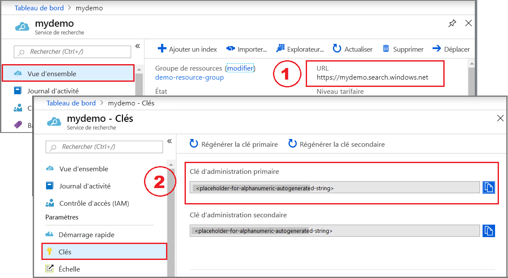
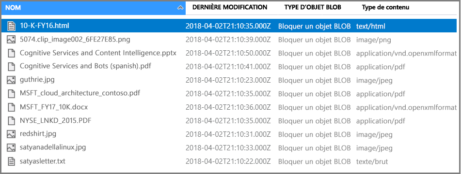

# <a name="tutorial-create-an-ai-enrichment-pipeline-using-rest-and-python"></a>Tutoriel : Créer un pipeline d’enrichissement par IA à l’aide de REST et de Python

Dans ce tutoriel, vous découvrez les mécanismes de programmation de l’enrichissement des données dans la Recherche cognitive Azure avec des *compétences cognitives*. Les compétences sont secondées par des fonctions d’analyse des images et de traitement en langage naturel (NLP) dans Cognitive Services. Par le biais de la configuration et de la composition de compétences, vous pouvez extraire du texte et des représentations sous forme de texte d’un fichier image ou document analysé. Vous pouvez également détecter la langue, les entités, les expressions clés et bien plus encore. Le résultat est un contenu supplémentaire riche dans un index de recherche, créé avec des enrichissements par IA dans un pipeline d’indexation. 

Dans ce tutoriel, vous allez utiliser Python pour effectuer les tâches suivantes :

> [!div class="checklist"]
> * Créer un pipeline d’indexation qui enrichit les exemples de données destinés à un index
> * Appliquer des compétences intégrées : reconnaissance d’entité, détection de la langue, manipulation de texte et extraction d’expression clé
> * Découvrir comment chaîner des compétences en mappant les entrées aux sorties dans un ensemble de compétences
> * Exécuter des demandes et passer en revue les résultats
> * Réinitialiser l’index et les indexeurs pour un développement ultérieur

La sortie obtenue est un index de recherche en texte intégral sur Recherche cognitive Azure. Vous pouvez améliorer cet index avec d’autres fonctionnalités standard, telles que des [synonymes](search-synonyms.md), des [profils de score](https://docs.microsoft.com/rest/api/searchservice/add-scoring-profiles-to-a-search-index), des [analyseurs](search-analyzers.md) et des [filtres](search-filters.md). 

Ce tutoriel s’exécute sur le service gratuit. Toutefois, le nombre de transactions gratuites est limité à 20 documents par jour. Si vous souhaitez exécuter ce tutoriel plusieurs fois le même jour, supprimez l’indexeur pour réinitialiser le compteur.

> [!NOTE]
> Si vous élargissez le champ en augmentant la fréquence des traitements, en ajoutant des documents supplémentaires ou en ajoutant plusieurs algorithmes d’IA, vous devez [attacher une ressource Cognitive Services facturable](cognitive-search-attach-cognitive-services.md). Des frais s’appliquent durant l’appel des API dans Cognitive Services ainsi que pour l’extraction d’images dans le cadre de la phase de craquage de document de la Recherche cognitive Azure. L’extraction de texte à partir des documents est gratuite.
>
> L'exécution des compétences intégrées est facturée au prix actuel du [paiement à l'utilisation de Cognitive Services](https://azure.microsoft.com/pricing/details/cognitive-services/). Les prix appliqués pour l’extraction d’images sont présentés sur la [page de tarification du service Recherche cognitive Azure](https://go.microsoft.com/fwlink/?linkid=2042400).

Si vous n’avez pas d’abonnement Azure, créez un [compte gratuit](https://azure.microsoft.com/free/?WT.mc_id=A261C142F) avant de commencer.

## <a name="prerequisites"></a>Prérequis

Voici les services, outils et données utilisés dans ce tutoriel. 

+ [Créez un compte de stockage Azure](https://docs.microsoft.com/azure/storage/common/storage-quickstart-create-account) pour stocker les exemples de données. Vérifiez que le compte de stockage se trouve dans la même région que Recherche cognitive Azure.

+ [Anaconda 3.x](https://www.anaconda.com/distribution/#download-section), qui fournit des notebooks Python 3.x et Jupyter.

+ Les [exemples de données](https://1drv.ms/f/s!As7Oy81M_gVPa-LCb5lC_3hbS-4) se composent d’un petit ensemble de fichiers de types différents. 

+ [Créez un service Recherche cognitive Azure](search-create-service-portal.md) ou [recherchez un service existant](https://ms.portal.azure.com/#blade/HubsExtension/BrowseResourceBlade/resourceType/Microsoft.Search%2FsearchServices) dans votre abonnement actuel. Vous pouvez utiliser un service gratuit pour ce tutoriel.

## <a name="get-a-key-and-url"></a>Obtenir une clé et une URL

Pour interagir avec votre service Recherche cognitive Azure, vous devez disposer de l’URL du service et d’une clé d’accès. Un service de recherche est créé avec les deux. Ainsi, si vous avez ajouté la Recherche cognitive Azure à votre abonnement, effectuez ce qui suit pour obtenir les informations nécessaires :

1. [Connectez-vous au portail Azure](https://portal.azure.com/), puis dans la page **Vue d’ensemble** du service de recherche, récupérez l’URL. Voici un exemple de point de terminaison : `https://mydemo.search.windows.net`.

1. Dans **Paramètres** > **Clés**, obtenez une clé d’administration pour avoir des droits d’accès complets sur le service. Il existe deux clés d’administration interchangeables, fournies pour assurer la continuité de l’activité au cas où vous deviez en remplacer une. Vous pouvez utiliser la clé primaire ou secondaire sur les demandes d’ajout, de modification et de suppression d’objets.



Toutes les demandes nécessitent une clé API sur chaque demande envoyée à votre service. Une clé valide permet d’établir, en fonction de chaque demande, une relation de confiance entre l’application qui envoie la demande et le service qui en assure le traitement.

## <a name="prepare-sample-data"></a>Préparer l’exemple de données

Le pipeline d’enrichissement extrait des données des sources de données Azure. Les données sources doivent provenir d’un type de source de données pris en charge pour un [indexeur de Recherche cognitive Azure](search-indexer-overview.md). Pour cet exercice, nous utilisons le stockage d’objets blob pour présenter plusieurs types de contenu.

1. [Connectez-vous au portail Azure](https://portal.azure.com), accédez à votre compte de stockage Azure, cliquez sur **Objets blob**, puis sur **+ Conteneur**.

1. [Créez un conteneur d’objets blob](https://docs.microsoft.com/azure/storage/blobs/storage-quickstart-blobs-portal) pour contenir des exemples de données. Vous pouvez définir le niveau d’accès public sur l’une de ses valeurs valides.

1. Une fois que le conteneur est créé, ouvrez-le, puis sélectionnez **Charger** dans la barre de commandes pour charger les exemples de fichiers que vous avez téléchargés lors de l’étape précédente.

   

1. Une fois que les fichiers d’exemple sont chargés, obtenez le nom du conteneur et une chaîne de connexion pour votre stockage d’objets Blob. Pour ce faire, accédez à votre compte de stockage dans le portail Azure. Cliquez sur **Clés d’accès**, puis copiez le champ **Chaîne de connexion**.

La chaîne de connexion aura ce format : `DefaultEndpointsProtocol=https;AccountName=<YOUR-STORAGE-ACCOUNT-NAME>;AccountKey=<YOUR-STORAGE-ACCOUNT-KEY>;EndpointSuffix=core.windows.net`

Conservez la chaîne de connexion à portée de main. Vous en aurez besoin à une étape ultérieure.

Il existe d’autres manières de spécifier la chaîne de connexion, par exemple en fournissant une signature d’accès partagé. Pour en savoir plus sur les informations d’identification de source de données, consultez [Indexation du stockage d’objets blob Azure](search-howto-indexing-azure-blob-storage.md#Credentials).

## <a name="create-a-jupyter-notebook"></a>Créer un bloc-notes Jupyter

> [!Note]
> Cet article vous montre comment créer une source de données, un index, un indexeur et un ensemble de compétences à l’aide d’une série de scripts Python. Pour télécharger l’exemple de notebook complet, accédez au [dépôt Azure-Search-python-samples](https://github.com/Azure-Samples/azure-search-python-samples/tree/master/Tutorial-AI-Enrichment).

Utilisez Anaconda Navigator pour lancer Jupyter Notebook et créer un notebook Python 3.

## <a name="connect-to-azure-cognitive-search"></a>Se connecter à la Recherche cognitive Azure

Dans le notebook, exécutez ce script pour charger les bibliothèques permettant d’exploiter JSON et de formuler des requêtes HTTP.

```python
import json
import requests
from pprint import pprint
```

Ensuite, définissez les noms de la source de données, de l’index, de l’indexeur et de l’ensemble de compétences. Exécutez ce script afin de configurer les noms pour ce tutoriel.

```python
# Define the names for the data source, skillset, index and indexer
datasource_name = "cogsrch-py-datasource"
skillset_name = "cogsrch-py-skillset"
index_name = "cogsrch-py-index"
indexer_name = "cogsrch-py-indexer"
```

> [!Tip]
> Sur un service gratuit, vous êtes limité à trois index, indexeurs et sources de données. Ce didacticiel crée une occurrence de chaque élément. Avant d’aller plus loin, vérifiez que vous disposez de suffisamment de place pour créer des objets.

Dans le script suivant, remplacez les espaces réservés par vos service de recherche (YOUR-SEARCH-SERVICE-NAME) et clé API d’administration (YOUR-ADMIN-API-KEY), puis exécutez-le pour configurer le point de terminaison de service de la recherche.

```python
# Setup the endpoint
endpoint = 'https://<YOUR-SEARCH-SERVICE-NAME>.search.windows.net/'
headers = {'Content-Type': 'application/json',
           'api-key': '<YOUR-ADMIN-API-KEY>'}
params = {
    'api-version': '2019-05-06'
}
```

## <a name="create-a-data-source"></a>Création d'une source de données

Maintenant que vos services et fichiers sources sont préparés, commencez à assembler les composants de votre pipeline d’indexation. Commencez par un objet source de données qui indique à Recherche cognitive Azure comment récupérer des données d’une source externe.

Dans le script suivant, remplacez l’espace réservé YOUR-BLOB-RESOURCE-CONNECTION-STRING par la chaîne de connexion de l’objet blob que vous avez créé à l’étape précédente. Ensuite, exécutez le script pour créer une source de données nommée `cogsrch-py-datasource`.

```python
# Create a data source
datasourceConnectionString = "<YOUR-BLOB-RESOURCE-CONNECTION-STRING>"
datasource_payload = {
    "name": datasource_name,
    "description": "Demo files to demonstrate cognitive search capabilities.",
    "type": "azureblob",
    "credentials": {
        "connectionString": datasourceConnectionString
    },
    "container": {
        "name": "basic-demo-data-pr"
    }
}
r = requests.put(endpoint + "/datasources/" + datasource_name,
                 data=json.dumps(datasource_payload), headers=headers, params=params)
print(r.status_code)
```

La demande doit retourner un code d’état 201 confirmant la réussite.

Dans le portail Azure, dans la page de tableau de bord du service de recherche, vérifiez que cogsrch-py-datasource apparaît dans la liste **Sources de données**. Cliquez sur **Actualiser** pour mettre à jour la page.


## <a name="create-a-skillset"></a>Créer un ensemble de compétences

Dans cette étape, vous allez définir un ensemble d’étapes d’enrichissement à appliquer à vos données. Vous appelez chaque étape d’enrichissement une *compétence* et l’ensemble des étapes d’enrichissement un *ensemble de compétences*. Ce tutoriel utilise des [compétences cognitives prédéfinies](cognitive-search-predefined-skills.md) pour l’ensemble de compétences :

+ [Détection de la langue](cognitive-search-skill-language-detection.md) pour identifier la langue du contenu.

+ [Fractionnement de texte](cognitive-search-skill-textsplit.md) pour découper un grand contenu en plus petits morceaux avant d’appeler la compétence d’extraction de phrases clés. L’extraction de phrases clés accepte des entrées de 50 000 caractères au maximum. Certains fichiers d’exemple doivent être fractionnés pour satisfaire cette limite.

+ [Reconnaissance d’entité](cognitive-search-skill-entity-recognition.md) pour extraire les noms d’organisations du contenu dans le conteneur d’objets blob.

+ [Extraction de phrases clés](cognitive-search-skill-keyphrases.md) pour extraire les principales expressions clés. 

### <a name="python-script"></a>Script Python
Utilisez le script suivant pour créer un ensemble de compétences appelé `cogsrch-py-skillset`.

```python
# Create a skillset
skillset_payload = {
    "name": skillset_name,
    "description":
    "Extract entities, detect language and extract key-phrases",
    "skills":
    [
        {
            "@odata.type": "#Microsoft.Skills.Text.EntityRecognitionSkill",
            "categories": ["Organization"],
            "defaultLanguageCode": "en",
            "inputs": [
                {
                    "name": "text", "source": "/document/content"
                }
            ],
            "outputs": [
                {
                    "name": "organizations", "targetName": "organizations"
                }
            ]
        },
        {
            "@odata.type": "#Microsoft.Skills.Text.LanguageDetectionSkill",
            "inputs": [
                {
                    "name": "text", "source": "/document/content"
                }
            ],
            "outputs": [
                {
                    "name": "languageCode",
                    "targetName": "languageCode"
                }
            ]
        },
        {
            "@odata.type": "#Microsoft.Skills.Text.SplitSkill",
            "textSplitMode": "pages",
            "maximumPageLength": 4000,
            "inputs": [
                {
                    "name": "text",
                    "source": "/document/content"
                },
                {
                    "name": "languageCode",
                    "source": "/document/languageCode"
                }
            ],
            "outputs": [
                {
                    "name": "textItems",
                    "targetName": "pages"
                }
            ]
        },
        {
            "@odata.type": "#Microsoft.Skills.Text.KeyPhraseExtractionSkill",
            "context": "/document/pages/*",
            "inputs": [
                {
                    "name": "text", "source": "/document/pages/*"
                },
                {
                    "name": "languageCode", "source": "/document/languageCode"
                }
            ],
            "outputs": [
                {
                    "name": "keyPhrases",
                    "targetName": "keyPhrases"
                }
            ]
        }
    ]
}

r = requests.put(endpoint + "/skillsets/" + skillset_name,
                 data=json.dumps(skillset_payload), headers=headers, params=params)
print(r.status_code)
```

La demande doit retourner un code d’état 201 confirmant la réussite.

La compétence d’extraction de phrases clés est appliquée pour chaque page. En définissant le contexte sur `"document/pages/*"`, vous exécutez cette enrichisseur pour chaque membre du document/tableau de pages (pour chaque page dans le document).

Chaque compétence s’exécute sur le contenu du document. Au cours du traitement, Recherche cognitive Azure ouvre chaque document pour lire le contenu de différents formats de fichiers. Le texte trouvé dans le fichier source est placé dans un champ `content`, un pour chaque document. Ainsi, définissez l’entrée en tant que `"/document/content"`.

Une représentation graphique de l’ensemble de compétences est présentée ci-dessous.


Les sorties peuvent être mappées à un index, utilisées comme entrée d’une compétence en aval, ou les deux, comme c’est le cas avec le code de langue. Dans l’index, un code de langue est utile pour le filtrage. En tant qu’entrée, le code de langue est utilisé par les compétences d’analyse de texte pour informer les règles linguistiques en matière de césure de mots.

Pour plus d’informations sur les principes de base des ensembles de compétences, consultez [Guide pratique pour définir un ensemble de compétences](cognitive-search-defining-skillset.md).

## <a name="create-an-index"></a>Création d'un index

Dans cette section, vous définissez le schéma d’index en spécifiant les champs à inclure dans l’index de recherche et en définissant les attributs de recherche pour chaque champ. Les champs ont un type et peuvent prendre des attributs qui déterminent la façon dont le champ est utilisé (pour la recherche, le tri, etc.). Les noms des champs dans un index ne sont pas tenus de correspondre exactement aux noms des champs dans la source. Dans une étape ultérieure, vous ajoutez des mappages de champs dans un indexeur pour connecter les champs sources et de destination. Pour cette étape, définissez l’index à l’aide de conventions d’affectation de noms de champs appropriées à votre application de recherche.

Cet exercice utilise les champs et les types de champ suivants :

| Noms de champs : | id         | content   | languageCode | keyPhrases         | organizations     |
|--------------|----------|-------|----------|--------------------|-------------------|
| Types de champ : | Edm.String|Edm.String| Edm.String| List<Edm.String>  | List<Edm.String>  |

Exécutez ce script pour créer l’index nommé `cogsrch-py-index`.

```python
# Create an index
index_payload = {
    "name": index_name,
    "fields": [
        {
            "name": "id",
            "type": "Edm.String",
            "key": "true",
            "searchable": "true",
            "filterable": "false",
            "facetable": "false",
            "sortable": "true"
        },
        {
            "name": "content",
            "type": "Edm.String",
            "sortable": "false",
            "searchable": "true",
            "filterable": "false",
            "facetable": "false"
        },
        {
            "name": "languageCode",
            "type": "Edm.String",
            "searchable": "true",
            "filterable": "false",
            "facetable": "false"
        },
        {
            "name": "keyPhrases",
            "type": "Collection(Edm.String)",
            "searchable": "true",
            "filterable": "false",
            "facetable": "false"
        },
        {
            "name": "organizations",
            "type": "Collection(Edm.String)",
            "searchable": "true",
            "sortable": "false",
            "filterable": "false",
            "facetable": "false"
        }
    ]
}

r = requests.put(endpoint + "/indexes/" + index_name,
                 data=json.dumps(index_payload), headers=headers, params=params)
print(r.status_code)
```

La demande doit retourner un code d’état 201 confirmant la réussite.

Pour en savoir plus sur la définition d’un index, consultez [Créer un index (API REST de la Recherche cognitive Azure)](https://docs.microsoft.com/rest/api/searchservice/create-index).

## <a name="create-an-indexer-map-fields-and-execute-transformations"></a>Créer un indexeur, mapper les champs et exécuter des transformations

À ce stade, vous avez créé une source de données, un ensemble de compétences et un index. Ces trois composants deviennent partie intégrante d’un [indexeur](search-indexer-overview.md) qui extrait chaque élément pour l’insérer dans une opération unique à plusieurs phases. Pour lier ces objets en un indexeur, vous devez définir des mappages de champs.

+ Les fieldMappings sont traités avant l’ensemble de compétences, en mappant les champs sources de la source de données sur des champs cibles dans un index. Si les noms et types de champ sont identiques aux deux extrémités, aucun mappage n’est nécessaire.

+ Les outputFieldMappings sont traités après l’ensemble de compétences, en référençant les sourceFieldNames qui n’existent pas tant que le décodage de document ou l’enrichissement ne les ont pas créés. targetFieldName est un champ dans un index.

En plus de raccrocher des entrées à des sorties, vous pouvez également utiliser les mappages de champs pour aplatir les structures de données. Pour plus d’informations, consultez [Guide pratique pour mapper des champs enrichis sur un index pouvant faire l’objet d’une recherche](cognitive-search-output-field-mapping.md).

Exécutez ce script pour créer un indexeur nommé `cogsrch-py-indexer`.

```python
# Create an indexer
indexer_payload = {
    "name": indexer_name,
    "dataSourceName": datasource_name,
    "targetIndexName": index_name,
    "skillsetName": skillset_name,
    "fieldMappings": [
        {
            "sourceFieldName": "metadata_storage_path",
            "targetFieldName": "id",
            "mappingFunction":
            {"name": "base64Encode"}
        },
        {
            "sourceFieldName": "content",
            "targetFieldName": "content"
        }
    ],
    "outputFieldMappings":
    [
        {
            "sourceFieldName": "/document/organizations",
            "targetFieldName": "organizations"
        },
        {
            "sourceFieldName": "/document/pages/*/keyPhrases/*",
            "targetFieldName": "keyPhrases"
        },
        {
            "sourceFieldName": "/document/languageCode",
            "targetFieldName": "languageCode"
        }
    ],
    "parameters":
    {
        "maxFailedItems": -1,
        "maxFailedItemsPerBatch": -1,
        "configuration":
        {
            "dataToExtract": "contentAndMetadata",
            "imageAction": "generateNormalizedImages"
        }
    }
}

r = requests.put(endpoint + "/indexers/" + indexer_name,
                 data=json.dumps(indexer_payload), headers=headers, params=params)
print(r.status_code)
```

La demande doit retourner rapidement un code d’état 201 ; toutefois, le traitement peut prendre plusieurs minutes. Bien que le jeu de données soit petit, les compétences analytiques, telles que l’analyse d’image, sont gourmandes en ressources de calcul et en temps.

Utilisez le script [Vérifier l’état de l’indexeur](#check-indexer-status) dans la section suivante pour déterminer si le processus de l’indexeur est terminé.

> [!TIP]
> La création d’un indexeur appelle le pipeline. Tout problème lié à l’accès aux données, au mappage des entrées et des sorties ou à l’ordre des opérations apparaît à ce stade. Pour réexécuter le pipeline avec des modifications de code ou de script, vous pouvez être amené à supprimer d’abord des objets. Pour plus d’informations, consultez [Réinitialiser et réexécuter](#reset).

#### <a name="explore-the-request-body"></a>Explorer le corps de la demande

Le script affecte à `"maxFailedItems"` la valeur -1, ce qui indique au moteur d’indexation d’ignorer les erreurs au cours de l’importation des données. Cela est utile car très peu de documents figurent dans la source de données de démonstration. Pour une source de données plus volumineuse, vous définiriez une valeur supérieure à 0.

Notez également l’instruction `"dataToExtract":"contentAndMetadata"` dans les paramètres de configuration. Cette instruction indique à l’indexeur d’extraire le contenu de fichiers de différents formats et les métadonnées associées à chaque fichier.

Lorsque le contenu est extrait, vous pouvez définir `imageAction` pour extraire le texte des images trouvées dans la source de données. La configuration `"imageAction":"generateNormalizedImages"`, associée à la compétence de reconnaissance optique des caractères et à la compétence de fusion de texte, indique à l’indexeur d’extraire le texte des images (par exemple, le mot « stop » d’un panneau de signalisation Stop) et de l’incorporer dans le champ de contenu. Ce comportement s’applique aux images intégrées dans les documents (pensez à une image dans un fichier PDF) et aux images trouvées dans la source de données, par exemple un fichier JPG.

<a name="check-indexer-status"></a>

## <a name="check-indexer-status"></a>Vérifier l’état de l’indexeur

Une fois l’indexeur défini, il s’exécute automatiquement lorsque vous envoyez la demande. Selon les compétences cognitives que vous avez définies, l’indexation peut prendre plus de temps que prévu. Pour savoir si le traitement de l’indexeur est terminé, exécutez le script suivant.

```python
# Get indexer status
r = requests.get(endpoint + "/indexers/" + indexer_name +
                 "/status", headers=headers, params=params)
pprint(json.dumps(r.json(), indent=1))
```

Dans la réponse, supervisez les valeurs « status » et « endTime » de « lastResult ». Exécuter le script régulièrement pour vérifier l’état. Quand l’indexeur a terminé, l’état est défini sur « success », une valeur « endTime » est spécifiée et la réponse inclut les erreurs et avertissements qui se sont éventuellement produits au cours de l’enrichissement.


Les avertissements sont courants avec certaines combinaisons de fichiers sources et de compétences et n’indiquent pas toujours un problème. Dans ce tutoriel, les avertissements sont sans conséquence. Par exemple, un des fichiers JPEG qui n’a pas de texte engendre l’affichage de l’avertissement dans la capture d’écran ci-après.


## <a name="query-your-index"></a>Interroger votre index

Une fois l’indexation terminée, exécutez des requêtes qui retournent le contenu de champs individuels. Par défaut, le service Recherche cognitive Azure retourne les 50 meilleurs résultats. Les données d’exemple sont petites si bien que la configuration par défaut fonctionne correctement. Toutefois, lorsque vous travaillez avec des jeux de données plus volumineux, vous pouvez être amené à inclure des paramètres dans la chaîne de requête pour retourner plus de résultats. Pour obtenir des instructions, consultez [Guide pratique pour présenter les résultats dans la Recherche cognitive Azure](search-pagination-page-layout.md).

Comme étape de vérification, interrogez l’index au sujet de tous les champs.

```python
# Query the index for all fields
r = requests.get(endpoint + "/indexes/" + index_name,
                 headers=headers, params=params)
pprint(json.dumps(r.json(), indent=1))
```

Les résultats doivent ressembler à l’exemple suivant. La capture d’écran montre uniquement une partie de la réponse.


La sortie est le schéma d’index, avec le nom, le type et les attributs de chaque champ.

Envoyez une deuxième requête pour `"*"` afin de retourner tout le contenu d’un champ individuel, tel que `organizations`.

```python
# Query the index to return the contents of organizations
r = requests.get(endpoint + "/indexes/" + index_name +
                 "/docs?&search=*&$select=organizations", headers=headers, params=params)
pprint(json.dumps(r.json(), indent=1))
```

Les résultats doivent ressembler à l’exemple suivant. La capture d’écran montre uniquement une partie de la réponse.


Répétez ces étapes pour les champs supplémentaires : content, languageCode, keyPhrases et organizations dans cet exercice. Vous pouvez retourner plusieurs champs via `$select` à l’aide d’une liste délimitée par des virgules.

Vous pouvez utiliser GET ou POST, en fonction de la longueur et de la complexité de la chaîne de requête. Pour plus d’informations, consultez [Exécuter des requêtes à l’aide de l’API REST](https://docs.microsoft.com/rest/api/searchservice/search-documents).

<a name="reset"></a>

## <a name="reset-and-rerun"></a>Réinitialiser et réexécuter

Dans les premières étapes expérimentales de développement d’un pipeline, l’approche la plus pratique pour les itérations de conception consiste à supprimer les objets de Recherche cognitive Azure et à autoriser votre code à les reconstruire. Les noms des ressources sont uniques. La suppression d’un objet vous permet de le recréer en utilisant le même nom.

Pour réindexer vos documents avec les nouvelles définitions :

1. Supprimez l’index pour supprimer les données persistantes. Supprimez l’indexeur pour le recréer sur votre service.
2. Modifiez l’ensemble de compétences et la définition d’index.
3. Recréez un index et un indexeur sur le service pour exécuter le pipeline.

Vous pouvez utiliser le portail pour supprimer des index, des indexeurs et des ensembles de compétences. Quand vous supprimez l’indexeur, vous pouvez si vous le souhaitez, sélectivement supprimer l’index, l’ensemble de compétences et la source de données en même temps.


Vous pouvez également les supprimer à l’aide d’un script. Le script suivant supprime l’ensemble de compétences que nous avons créé. Vous pouvez facilement modifier la demande de suppression de l’index, de l’indexeur et de la source de données.

```python
# delete the skillset
r = requests.delete(endpoint + "/skillsets/" + skillset_name,
                    headers=headers, params=params)
pprint(json.dumps(r.json(), indent=1))
```

Lorsque votre code arrive à maturité, vous pouvez affiner une stratégie de regénération. Pour plus d’informations, consultez [How to rebuild an Azure Search index](search-howto-reindex.md) (Régénérer un index Recherche Azure).

## <a name="takeaways"></a>Éléments importants à retenir

Ce tutoriel présente les étapes de base pour générer un pipeline d’indexation enrichie via la création de composants : une source de données, un ensemble de compétences, un index et un indexeur.

Des [compétences intégrées](cognitive-search-predefined-skills.md) ont été introduites, ainsi que des définitions d’ensemble de compétences et un moyen de chaîner les compétences entre elles via des entrées et des sorties. Vous avez également appris que `outputFieldMappings` est requis dans la définition de l’indexeur pour acheminer les valeurs enrichies du pipeline dans un index de recherche, sur un service de Recherche cognitive Azure.

Enfin, vous avez appris à tester les résultats et réinitialiser le système pour des itérations ultérieures. Vous avez appris qu’émettre des requêtes par rapport à l’index retourne la sortie créée par le pipeline d’indexation enrichie. Dans cette version, il existe un mécanisme permettant d’afficher les constructions internes (documents enrichis créés par le système). Vous avez également appris à vérifier l’état de l’indexeur et quels objets supprimer avant de réexécuter un pipeline.

## <a name="clean-up-resources"></a>Nettoyer les ressources

Le moyen le plus rapide de procéder à un nettoyage après un tutoriel consiste à supprimer le groupe de ressources contenant le service Recherche cognitive Azure et le service Blob Azure. En supposant que vous avez placé ces deux services dans le même groupe, supprimez le groupe de ressources pour supprimer définitivement tout ce qu’il contient, y compris les services et tout le contenu stocké que vous avez créé pour ce tutoriel. Dans le portail, le nom du groupe de ressources figure dans la page Vue d’ensemble de chaque service.

## <a name="next-steps"></a>Étapes suivantes

Personnalisez ou étendez le pipeline avec des compétences personnalisées. La création d’une compétence personnalisée et son ajout dans un ensemble de compétences vous permet d’intégrer une analyse de texte ou d’image que vous écrivez vous-même.

> [!div class="nextstepaction"]
> [Exemple : Création d’une compétence personnalisée pour l’enrichissement par l’IA](cognitive-search-create-custom-skill-example.md)
