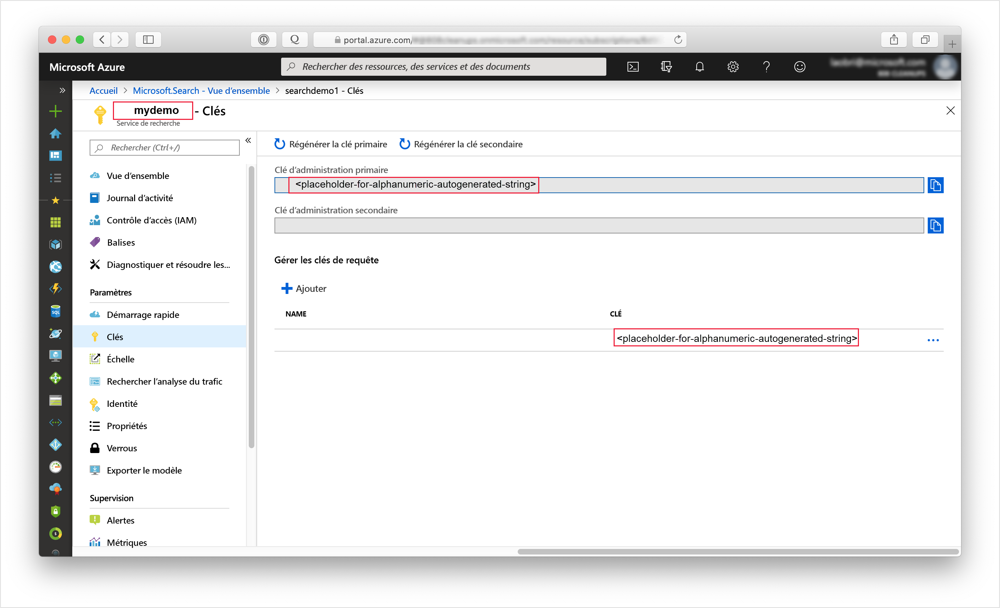

# <a name="tutorial-use-python-and-ai-to-generate-searchable-content-from-azure-blobs"></a>Tutoriel : Utiliser Python et l’IA pour générer du contenu pouvant faire l’objet de recherches à partir d’objets blob Azure

Si vous avez du texte non structuré ou des images dans Stockage Blob Azure, un [pipeline d’enrichissement par IA](cognitive-search-concept-intro.md) peut extraire des informations et créer du contenu utile pour les scénarios de recherche en texte intégral ou d’exploration de connaissances. Bien qu’un pipeline puisse traiter des images, ce tutoriel Python se concentre sur du texte, en appliquant la détection de la langue et le traitement en langage naturel pour créer des champs exploitables dans des requêtes, des facettes et des filtres.

Ce tutoriel utilise Python et les [API REST de Recherche](https://docs.microsoft.com/rest/api/searchservice/) pour effectuer les tâches suivantes :

> [!div class="checklist"]
> * Commencez avec des documents entiers (texte non structuré), comme des documents PDF, HTML, DOCX et PPTX, dans Stockage Blob Azure.
> * Définissez un pipeline qui extrait du texte, détecte la langue, reconnaît les entités et détecte les expressions clés.
> * Définissez un index pour stocker la sortie (contenu brut et paires nom-valeur générées par le pipeline).
> * Exécutez le pipeline pour démarrer des transformations et une analyse, ainsi que pour créer et charger l’index.
> * Explorez les résultats à l’aide de la recherche en texte intégral et d’une syntaxe de requête enrichie.

Si vous n’avez pas d’abonnement Azure, ouvrez un [compte gratuit](https://azure.microsoft.com/free/?WT.mc_id=A261C142F) avant de commencer.

## <a name="prerequisites"></a>Prérequis

+ [Stockage Azure](https://azure.microsoft.com/services/storage/)
+ [Anaconda 3.7](https://www.anaconda.com/distribution/#download-section)
+ [Créer](search-create-service-portal.md) ou [rechercher un service de recherche existant](https://ms.portal.azure.com/#blade/HubsExtension/BrowseResourceBlade/resourceType/Microsoft.Search%2FsearchServices) 

> [!Note]
> Vous pouvez utiliser le service gratuit pour ce tutoriel. Avec un service de recherche gratuit, vous êtes limité à trois index, trois indexeurs et trois sources de données. Ce didacticiel crée une occurrence de chaque élément. Avant de commencer, veillez à disposer de l’espace suffisant sur votre service pour accepter les nouvelles ressources.

## <a name="download-files"></a>Télécharger les fichiers

1. Ouvrez ce [dossier OneDrive](https://1drv.ms/f/s!As7Oy81M_gVPa-LCb5lC_3hbS-4) et en haut à gauche, cliquez sur **Télécharger** pour copier les fichiers sur votre ordinateur. 

1. Cliquez avec le bouton droit sur le fichier zip et sélectionnez **Tout extraire**. Il y a 14 fichiers de différents types. Vous en utiliserez 7 dans le cadre de cet exercice.

## <a name="1---create-services"></a>1 - Créer les services

Ce tutoriel utilise Recherche cognitive Azure pour l’indexation et les requêtes, Cognitive Services pour l’enrichissement par IA sur le back-end, et Stockage Blob Azure pour fournir les données. Ce tutoriel reste sous l’allocation gratuite de 20 transactions par indexeur par jour sur Cognitive Services : les seuls services que vous devez créer sont donc la recherche et le stockage.

Si possible, créez les deux services dans la même région et le même groupe de ressources pour des raisons de proximité et de facilité de gestion. Dans la pratique, votre compte de stockage Azure peut être dans une région quelconque.

### <a name="start-with-azure-storage"></a>Démarrer avec le stockage Azure

1. [Connectez-vous au portail Azure](https://portal.azure.com/) et cliquez sur **+ Créer une ressource**.

1. Recherchez un *compte de stockage* et sélectionnez l’offre de compte de stockage Microsoft.

   

1. Sous l’onglet Bases, les éléments suivants sont obligatoires. Acceptez les valeurs par défaut pour tout le reste.

   + **Groupe de ressources**. Sélectionnez un groupe existant ou créez-en un, mais utilisez le même groupe pour tous les services afin de pouvoir les gérer collectivement.

   + **Nom du compte de stockage**. Si vous pensez que vous pouvez avoir plusieurs ressources du même type, utilisez le nom pour lever l’ambiguïté par type et par région, par exemple *blobstoragewestus*. 

   + **Emplacement**. Si possible, choisissez le même emplacement que celui utilisé pour Recherche cognitive Azure et Cognitive Services. Un emplacement unique annule les frais liés à la bande passante.

   + **Type de compte**. Choisissez la valeur par défaut, *StorageV2 (v2 universel)* .

1. Cliquez sur **Vérifier + créer** pour créer le service.

1. Une fois qu’il est créé, cliquez sur **Accéder à la ressource** pour ouvrir la page Vue d’ensemble.

1. Cliquez sur le service **Objets blob**.

1. Cliquez sur **+ Conteneur** pour créer un conteneur et nommez-le *cog-search-demo*.

1. Sélectionnez *cog-search-demo*, puis cliquez sur **Charger** pour ouvrir le dossier dans lequel vous avez enregistré les fichiers téléchargés. Sélectionnez tous les fichiers autres que des images. Vous devez disposer de 7 fichiers. Cliquez sur **OK** pour effectuer le chargement.

   

1. Avant de quitter Stockage Azure, obtenez une chaîne de connexion afin de pouvoir formuler une connexion dans Recherche cognitive Azure. 

   1. Revenez à la page Vue d’ensemble de votre compte de stockage (nous avons utilisé *blobstragewestus* comme exemple). 
   
   1. Dans le volet de navigation gauche, sélectionnez **Clés d’accès** et copiez l’une des chaînes de connexion. 

   La chaîne de connexion est une URL similaire à l’exemple suivant :

      ```http
      DefaultEndpointsProtocol=https;AccountName=<storageaccountname>;AccountKey=<your account key>;EndpointSuffix=core.windows.net
      ```

1. Enregistrez la chaîne de connexion dans le Bloc-Notes. Vous en aurez besoin plus tard lors de la configuration de la connexion à la source de données.

### <a name="cognitive-services"></a>Cognitive Services

L’enrichissement par IA s’appuie sur Cognitive Services, notamment Analyse de texte et Vision par ordinateur pour le traitement des images et du langage naturel. Si votre objectif était de réaliser un prototype ou un projet réel, vous devriez à ce stade provisionner Cognitive Services (dans la même région que Recherche cognitive Azure) afin de pouvoir l’attacher aux opérations d’indexation.

Étant donné que ce tutoriel n’utilise que 7 transactions, vous pouvez ignorer le provisionnement des ressources, car Recherche cognitive Azure peut se connecter à Cognitive Services pour 20 transactions gratuites par exécution de l’indexeur. L’allocation gratuite est suffisante. Pour les projets de plus grande envergure, prévoyez de provisionner Cognitive Services au niveau S0 du paiement à l’utilisation. Pour plus d’informations, consultez [Attacher Cognitive Services](cognitive-search-attach-cognitive-services.md).

### <a name="azure-cognitive-search"></a>Recherche cognitive Azure

Le troisième composant est Recherche cognitive Azure, que vous pouvez [créer dans le portail](search-create-service-portal.md). Vous pouvez utiliser le niveau Gratuit pour effectuer cette procédure pas à pas. 

Comme avec le stockage Blob Azure, prenez un moment pour collecter la clé d’accès. Par ailleurs, lorsque vous commencez à structurer les demandes, vous devez fournir le point de terminaison et la clé API d’administration utilisés pour authentifier chaque demande.

### <a name="get-an-admin-api-key-and-url-for-azure-cognitive-search"></a>Obtenir une clé API d’administration et une URL pour Recherche cognitive Azure

1. [Connectez-vous au Portail Azure](https://portal.azure.com/), puis dans la page **Vue d’ensemble** du service de recherche, récupérez le nom de votre service de recherche. Vous pouvez confirmer le nom de votre service en passant en revue l’URL du point de terminaison. Si votre URL de point de terminaison est `https://mydemo.search.windows.net`, le nom du service doit être `mydemo`.

2. Dans **Paramètres** > **Clés**, obtenez une clé d’administration pour avoir des droits d’accès complets sur le service. Il existe deux clés d’administration interchangeables, fournies pour assurer la continuité de l’activité au cas où vous deviez en remplacer une. Vous pouvez utiliser la clé primaire ou secondaire sur les demandes d’ajout, de modification et de suppression d’objets.

   Obtenez aussi la clé de requête. Il est recommandé d’émettre des demandes de requête avec un accès en lecture seule.

   

Une clé API est nécessaire dans l’en-tête de chaque requête envoyée à votre service. Une clé valide permet d’établir, en fonction de chaque demande, une relation de confiance entre l’application qui envoie la demande et le service qui en assure le traitement.

## <a name="2---start-a-notebook"></a>2 - Démarrer un notebook

Créez le bloc-notes en suivant les instructions ci-dessous ou téléchargez un notebook terminé à partir du [dépôt Azure-Search-python-samples](https://github.com/Azure-Samples/azure-search-python-samples/tree/master/Tutorial-AI-Enrichment).

Utilisez Anaconda Navigator pour lancer Jupyter Notebook et créer un notebook Python 3.

Dans le notebook, exécutez ce script pour charger les bibliothèques permettant d’exploiter JSON et de formuler des requêtes HTTP.

```python
import json
import requests
from pprint import pprint
```

Dans le même notebook, définissez les noms de la source de données, de l’index, de l’indexeur et de l’ensemble de compétences. Exécutez ce script afin de configurer les noms pour ce tutoriel.

```python
# Define the names for the data source, skillset, index and indexer
datasource_name = "cogsrch-py-datasource"
skillset_name = "cogsrch-py-skillset"
index_name = "cogsrch-py-index"
indexer_name = "cogsrch-py-indexer"
```

Dans le script suivant, remplacez les espaces réservés par vos service de recherche (YOUR-SEARCH-SERVICE-NAME) et clé API d’administration (YOUR-ADMIN-API-KEY), puis exécutez-le pour configurer le point de terminaison de service de la recherche.

```python
# Setup the endpoint
endpoint = 'https://<YOUR-SEARCH-SERVICE-NAME>.search.windows.net/'
headers = {'Content-Type': 'application/json',
           'api-key': '<YOUR-ADMIN-API-KEY>'}
params = {
    'api-version': '2020-06-30'
}
```

## <a name="3---create-the-pipeline"></a>3 - Créer le pipeline

Dans Recherche cognitive Azure, le traitement de l’IA se produit pendant l’indexation (ou l’ingestion de données). Cette partie de la procédure pas à pas crée quatre objets : source de données, définition d’index, ensemble de compétences, indexeur. 

### <a name="step-1-create-a-data-source"></a>Étape 1 : Création d'une source de données

Un [objet Source de données](https://docs.microsoft.com/rest/api/searchservice/create-data-source) fournit la chaîne de connexion au conteneur d’objets blob contenant les fichiers.

Dans le script suivant, remplacez l’espace réservé YOUR-BLOB-RESOURCE-CONNECTION-STRING par la chaîne de connexion de l’objet blob que vous avez créé à l’étape précédente. Remplacez le texte de l’espace réservé pour le conteneur. Ensuite, exécutez le script pour créer une source de données nommée `cogsrch-py-datasource`.

```python
# Create a data source
datasourceConnectionString = "<YOUR-BLOB-RESOURCE-CONNECTION-STRING>"
datasource_payload = {
    "name": datasource_name,
    "description": "Demo files to demonstrate cognitive search capabilities.",
    "type": "azureblob",
    "credentials": {
        "connectionString": datasourceConnectionString
    },
    "container": {
        "name": "<YOUR-BLOB-CONTAINER-NAME>"
    }
}
r = requests.put(endpoint + "/datasources/" + datasource_name,
                 data=json.dumps(datasource_payload), headers=headers, params=params)
print(r.status_code)
```

La demande doit retourner un code d’état 201 confirmant la réussite.

Dans le portail Azure, dans la page de tableau de bord du service de recherche, vérifiez que cogsrch-py-datasource apparaît dans la liste **Sources de données**. Cliquez sur **Actualiser** pour mettre à jour la page.


### <a name="step-2-create-a-skillset"></a>Étape 2 : Créer un ensemble de compétences

Dans cette étape, vous allez définir un ensemble d’étapes d’enrichissement à appliquer à vos données. Vous appelez chaque étape d’enrichissement une *compétence* et l’ensemble des étapes d’enrichissement un *ensemble de compétences*. Ce tutoriel utilise des [compétences cognitives prédéfinies](cognitive-search-predefined-skills.md) pour l’ensemble de compétences :

+ [Reconnaissance d’entité](cognitive-search-skill-entity-recognition.md) pour extraire les noms d’organisations du contenu dans le conteneur d’objets blob.

+ [Détection de la langue](cognitive-search-skill-language-detection.md) pour identifier la langue du contenu.

+ [Fractionnement de texte](cognitive-search-skill-textsplit.md) pour découper un grand contenu en plus petits morceaux avant d’appeler la compétence d’extraction de phrases clés. L’extraction de phrases clés accepte des entrées de 50 000 caractères au maximum. Certains fichiers d’exemple doivent être fractionnés pour satisfaire cette limite.

+ [Extraction de phrases clés](cognitive-search-skill-keyphrases.md) pour extraire les principales expressions clés. 

Utilisez le script suivant pour créer un ensemble de compétences appelé `cogsrch-py-skillset`.

```python
# Create a skillset
skillset_payload = {
    "name": skillset_name,
    "description":
    "Extract entities, detect language and extract key-phrases",
    "skills":
    [
        {
            "@odata.type": "#Microsoft.Skills.Text.EntityRecognitionSkill",
            "categories": ["Organization"],
            "defaultLanguageCode": "en",
            "inputs": [
                {
                    "name": "text", 
                    "source": "/document/content"
                }
            ],
            "outputs": [
                {
                    "name": "organizations", 
                    "targetName": "organizations"
                }
            ]
        },
        {
            "@odata.type": "#Microsoft.Skills.Text.LanguageDetectionSkill",
            "inputs": [
                {
                    "name": "text", 
                    "source": "/document/content"
                }
            ],
            "outputs": [
                {
                    "name": "languageCode",
                    "targetName": "languageCode"
                }
            ]
        },
        {
            "@odata.type": "#Microsoft.Skills.Text.SplitSkill",
            "textSplitMode": "pages",
            "maximumPageLength": 4000,
            "inputs": [
                {
                    "name": "text",
                    "source": "/document/content"
                },
                {
                    "name": "languageCode",
                    "source": "/document/languageCode"
                }
            ],
            "outputs": [
                {
                    "name": "textItems",
                    "targetName": "pages"
                }
            ]
        },
        {
            "@odata.type": "#Microsoft.Skills.Text.KeyPhraseExtractionSkill",
            "context": "/document/pages/*",
            "inputs": [
                {
                    "name": "text", 
                    "source": "/document/pages/*"
                },
                {
                    "name": "languageCode", 
                    "source": "/document/languageCode"
                }
            ],
            "outputs": [
                {
                    "name": "keyPhrases",
                    "targetName": "keyPhrases"
                }
            ]
        }
    ]
}

r = requests.put(endpoint + "/skillsets/" + skillset_name,
                 data=json.dumps(skillset_payload), headers=headers, params=params)
print(r.status_code)
```

La demande doit retourner un code d’état 201 confirmant la réussite.

La compétence d’extraction de phrases clés est appliquée pour chaque page. En définissant le contexte sur `"document/pages/*"`, vous exécutez cette enrichisseur pour chaque membre du document/tableau de pages (pour chaque page dans le document).

Chaque compétence s’exécute sur le contenu du document. Au cours du traitement, Recherche cognitive Azure ouvre chaque document pour lire le contenu de différents formats de fichiers. Le texte trouvé dans le fichier source est placé dans un champ `content`, un pour chaque document. Ainsi, définissez l’entrée en tant que `"/document/content"`.

Une représentation graphique de l’ensemble de compétences est présentée ci-dessous.


Les sorties peuvent être mappées à un index, utilisées comme entrée d’une compétence en aval, ou les deux, comme c’est le cas avec le code de langue. Dans l’index, un code de langue est utile pour le filtrage. En tant qu’entrée, le code de langue est utilisé par les compétences d’analyse de texte pour informer les règles linguistiques en matière de césure de mots.

Pour plus d’informations sur les principes de base des ensembles de compétences, consultez [Guide pratique pour définir un ensemble de compétences](cognitive-search-defining-skillset.md).

### <a name="step-3-create-an-index"></a>Étape 3 : Création d'un index

Dans cette section, vous définissez le schéma d’index en spécifiant les champs à inclure dans l’index de recherche et en définissant les attributs de recherche pour chaque champ. Les champs ont un type et peuvent prendre des attributs qui déterminent la façon dont le champ est utilisé (pour la recherche, le tri, etc.). Les noms des champs dans un index ne sont pas tenus de correspondre exactement aux noms des champs dans la source. Dans une étape ultérieure, vous ajoutez des mappages de champs dans un indexeur pour connecter les champs sources et de destination. Pour cette étape, définissez l’index à l’aide de conventions d’affectation de noms de champs appropriées à votre application de recherche.

Cet exercice utilise les champs et les types de champ suivants :

| Noms de champs : | id         | content   | languageCode | keyPhrases         | organizations     |
|--------------|----------|-------|----------|--------------------|-------------------|
| Types de champ : | Edm.String|Edm.String| Edm.String| List<Edm.String>  | List<Edm.String>  |

Exécutez ce script pour créer l’index nommé `cogsrch-py-index`.

```python
# Create an index
index_payload = {
    "name": index_name,
    "fields": [
        {
            "name": "id",
            "type": "Edm.String",
            "key": "true",
            "searchable": "true",
            "filterable": "false",
            "facetable": "false",
            "sortable": "true"
        },
        {
            "name": "content",
            "type": "Edm.String",
            "sortable": "false",
            "searchable": "true",
            "filterable": "false",
            "facetable": "false"
        },
        {
            "name": "languageCode",
            "type": "Edm.String",
            "searchable": "true",
            "filterable": "false",
            "facetable": "false"
        },
        {
            "name": "keyPhrases",
            "type": "Collection(Edm.String)",
            "searchable": "true",
            "filterable": "false",
            "facetable": "false"
        },
        {
            "name": "organizations",
            "type": "Collection(Edm.String)",
            "searchable": "true",
            "sortable": "false",
            "filterable": "false",
            "facetable": "false"
        }
    ]
}

r = requests.put(endpoint + "/indexes/" + index_name,
                 data=json.dumps(index_payload), headers=headers, params=params)
print(r.status_code)
```

La demande doit retourner un code d’état 201 confirmant la réussite.

Pour en savoir plus sur la définition d’un index, consultez [Créer un index (API REST de la Recherche cognitive Azure)](https://docs.microsoft.com/rest/api/searchservice/create-index).

### <a name="step-4-create-and-run-an-indexer"></a>Étape 4 : Créer et exécuter un indexeur

Un [indexeur](https://docs.microsoft.com/rest/api/searchservice/create-indexer) pilote le pipeline. Les trois composants que vous avez créés jusqu’à présent (source de données, ensemble de compétences, index) sont les entrées d’un indexeur. La création de l’indexeur sur Recherche cognitive Azure est l’événement qui met en mouvement la totalité du pipeline. 

Pour lier ces objets en un indexeur, vous devez définir des mappages de champs.

+ Les `"fieldMappings"` sont traités avant l’ensemble de compétences, en mappant les champs sources de la source de données sur des champs cibles dans un index. Si les noms et types de champ sont identiques aux deux extrémités, aucun mappage n’est nécessaire.

+ Les `"outputFieldMappings"` sont traités après l’ensemble de compétences, en référençant les `"sourceFieldNames"` qui n’existent pas tant que le craquage de document ou l’enrichissement ne les ont pas créés. `"targetFieldName"` est un champ dans un index.

En plus de raccrocher des entrées à des sorties, vous pouvez également utiliser les mappages de champs pour aplatir les structures de données. Pour plus d’informations, consultez [Guide pratique pour mapper des champs enrichis sur un index pouvant faire l’objet d’une recherche](cognitive-search-output-field-mapping.md).

Exécutez ce script pour créer un indexeur nommé `cogsrch-py-indexer`.

```python
# Create an indexer
indexer_payload = {
    "name": indexer_name,
    "dataSourceName": datasource_name,
    "targetIndexName": index_name,
    "skillsetName": skillset_name,
    "fieldMappings": [
        {
            "sourceFieldName": "metadata_storage_path",
            "targetFieldName": "id",
            "mappingFunction":
            {"name": "base64Encode"}
        },
        {
            "sourceFieldName": "content",
            "targetFieldName": "content"
        }
    ],
    "outputFieldMappings":
    [
        {
            "sourceFieldName": "/document/organizations",
            "targetFieldName": "organizations"
        },
        {
            "sourceFieldName": "/document/pages/*/keyPhrases/*",
            "targetFieldName": "keyPhrases"
        },
        {
            "sourceFieldName": "/document/languageCode",
            "targetFieldName": "languageCode"
        }
    ],
    "parameters":
    {
        "maxFailedItems": -1,
        "maxFailedItemsPerBatch": -1,
        "configuration":
        {
            "dataToExtract": "contentAndMetadata",
            "imageAction": "generateNormalizedImages"
        }
    }
}

r = requests.put(endpoint + "/indexers/" + indexer_name,
                 data=json.dumps(indexer_payload), headers=headers, params=params)
print(r.status_code)
```

La demande doit retourner sous peu un code d’état 201, bien que le traitement puisse cependant durer plusieurs minutes. Bien que le jeu de données soit petit, les compétences analytiques, telles que l’analyse d’image, sont gourmandes en ressources de calcul et en temps.

Vous pouvez [superviser l’état de l’indexeur](#check-indexer-status) pour déterminer à quel moment il est en cours d’exécution ou terminé.

> [!TIP]
> La création d’un indexeur appelle le pipeline. Tout problème lié à l’accès aux données, au mappage des entrées et des sorties ou à l’ordre des opérations apparaît à ce stade. Pour réexécuter le pipeline avec des modifications de code ou de script, vous pouvez être amené à supprimer d’abord des objets. Pour plus d’informations, consultez [Réinitialiser et réexécuter](#reset).

#### <a name="about-the-request-body"></a>À propos du corps de la demande

Le script affecte à `"maxFailedItems"` la valeur -1, ce qui indique au moteur d’indexation d’ignorer les erreurs au cours de l’importation des données. Cela est utile car très peu de documents figurent dans la source de données de démonstration. Pour une source de données plus volumineuse, vous définiriez une valeur supérieure à 0.

Notez également l’instruction `"dataToExtract":"contentAndMetadata"` dans les paramètres de configuration. Cette instruction indique à l’indexeur d’extraire le contenu de fichiers de différents formats et les métadonnées associées à chaque fichier.

Lorsque le contenu est extrait, vous pouvez définir `imageAction` pour extraire le texte des images trouvées dans la source de données. La configuration `"imageAction":"generateNormalizedImages"`, associée à la compétence de reconnaissance optique des caractères et à la compétence de fusion de texte, indique à l’indexeur d’extraire le texte des images (par exemple, le mot « stop » d’un panneau de signalisation Stop) et de l’incorporer dans le champ de contenu. Ce comportement s’applique aux images intégrées dans les documents (pensez à une image dans un fichier PDF) et aux images trouvées dans la source de données, par exemple un fichier JPG.

<a name="check-indexer-status"></a>

## <a name="4---monitor-indexing"></a>4 - Surveiller l’indexation

Une fois l’indexeur défini, il s’exécute automatiquement lorsque vous envoyez la demande. Selon les compétences cognitives que vous avez définies, l’indexation peut prendre plus de temps que prévu. Pour savoir si le traitement de l’indexeur est terminé, exécutez le script suivant.

```python
# Get indexer status
r = requests.get(endpoint + "/indexers/" + indexer_name +
                 "/status", headers=headers, params=params)
pprint(json.dumps(r.json(), indent=1))
```

Dans la réponse, supervisez `"lastResult"` pour ses valeurs `"status"` et `"endTime"`. Exécuter le script régulièrement pour vérifier l’état. Quand l’indexeur a terminé, l’état est défini sur « success », une valeur « endTime » est spécifiée et la réponse inclut les erreurs et avertissements qui se sont éventuellement produits au cours de l’enrichissement.


Les avertissements sont courants avec certaines combinaisons de fichiers sources et de compétences et n’indiquent pas toujours un problème. De nombreux avertissements ont une importance mineure. Par exemple, si vous indexez un fichier JPEG qui n’a pas de texte, vous voyez l’avertissement dans la capture d’écran ci-après.


## <a name="5---search"></a>5 - Recherche

Une fois l’indexation terminée, exécutez des requêtes qui retournent le contenu de champs individuels. Par défaut, le service Recherche cognitive Azure retourne les 50 meilleurs résultats. Les données d’exemple sont petites si bien que la configuration par défaut fonctionne correctement. Toutefois, lorsque vous travaillez avec des jeux de données plus volumineux, vous pouvez être amené à inclure des paramètres dans la chaîne de requête pour retourner plus de résultats. Pour obtenir des instructions, consultez [Guide pratique pour présenter les résultats dans la Recherche cognitive Azure](search-pagination-page-layout.md).

En guise d’étape de vérification, récupérez la définition de l’index montrant tous les champs.

```python
# Query the service for the index definition
r = requests.get(endpoint + "/indexes/" + index_name,
                 headers=headers, params=params)
pprint(json.dumps(r.json(), indent=1))
```

Les résultats doivent ressembler à l’exemple suivant. La capture d’écran montre uniquement une partie de la réponse.


La sortie est le schéma d’index, avec le nom, le type et les attributs de chaque champ.

Envoyez une deuxième requête pour `"*"` afin de retourner tout le contenu d’un champ individuel, tel que `organizations`.

```python
# Query the index to return the contents of organizations
r = requests.get(endpoint + "/indexes/" + index_name +
                 "/docs?&search=*&$select=organizations", headers=headers, params=params)
pprint(json.dumps(r.json(), indent=1))
```

Les résultats doivent ressembler à l’exemple suivant. La capture d’écran montre uniquement une partie de la réponse.


Répétez cette opération pour les champs supplémentaires : `content`, `languageCode`, `keyPhrases` et `organizations` dans cet exercice. Vous pouvez retourner plusieurs champs via `$select` à l’aide d’une liste délimitée par des virgules.

Vous pouvez utiliser GET ou POST, en fonction de la longueur et de la complexité de la chaîne de requête. Pour plus d’informations, consultez [Exécuter des requêtes à l’aide de l’API REST](https://docs.microsoft.com/rest/api/searchservice/search-documents).

<a name="reset"></a>

## <a name="reset-and-rerun"></a>Réinitialiser et réexécuter

Dans les premières étapes expérimentales du développement, l’approche la plus pratique pour les itérations de conception consiste à supprimer les objets de Recherche cognitive Azure et à autoriser votre code à les reconstruire. Les noms des ressources sont uniques. La suppression d’un objet vous permet de le recréer en utilisant le même nom.

Vous pouvez utiliser le portail pour supprimer les index, les indexeurs et les ensembles de compétences. Quand vous supprimez l’indexeur, vous pouvez si vous le souhaitez, sélectivement supprimer l’index, l’ensemble de compétences et la source de données en même temps.


Vous pouvez également les supprimer à l’aide d’un script. Le script suivant montre comment supprimer un ensemble de compétences. 

```python
# delete the skillset
r = requests.delete(endpoint + "/skillsets/" + skillset_name,
                    headers=headers, params=params)
pprint(json.dumps(r.json(), indent=1))
```

Le code d’état 204 est retourné lorsque la suppression réussit.

## <a name="takeaways"></a>Éléments importants à retenir

Ce tutoriel présente les étapes de base pour générer un pipeline d’indexation enrichie via la création de composants : une source de données, un ensemble de compétences, un index et un indexeur.

Des [compétences intégrées](cognitive-search-predefined-skills.md) ont été introduites, ainsi que des définitions d’ensemble de compétences et un moyen de chaîner les compétences entre elles via des entrées et des sorties. Vous avez également appris que `outputFieldMappings` est requis dans la définition de l’indexeur pour acheminer les valeurs enrichies du pipeline dans un index de recherche, sur un service de Recherche cognitive Azure.

Enfin, vous avez appris à tester les résultats et réinitialiser le système pour des itérations ultérieures. Vous avez appris qu’émettre des requêtes par rapport à l’index retourne la sortie créée par le pipeline d’indexation enrichie. Dans cette version, il existe un mécanisme permettant d’afficher les constructions internes (documents enrichis créés par le système). Vous avez également appris à vérifier l’état de l’indexeur et quels objets supprimer avant de réexécuter un pipeline.

## <a name="clean-up-resources"></a>Nettoyer les ressources

Lorsque vous travaillez dans votre propre abonnement, il est judicieux à la fin d’un projet de supprimer les ressources dont vous n’avez plus besoin. Les ressources laissées en cours d’exécution peuvent vous coûter de l’argent. Vous pouvez supprimer les ressources une par une, ou choisir de supprimer le groupe de ressources afin de supprimer l’ensemble des ressources.

Vous pouvez rechercher et gérer les ressources dans le portail à l’aide des liens Toutes les ressources ou Groupes de ressources situés dans le volet de navigation de gauche.

## <a name="next-steps"></a>Étapes suivantes

Maintenant que vous êtes familiarisé avec tous les objets d’un pipeline d’enrichissement par IA, examinons de plus près les définitions des ensembles de compétences et les compétences individuelles.

> [!div class="nextstepaction"]
> [Guide pratique pour créer un ensemble de compétences](cognitive-search-defining-skillset.md)
