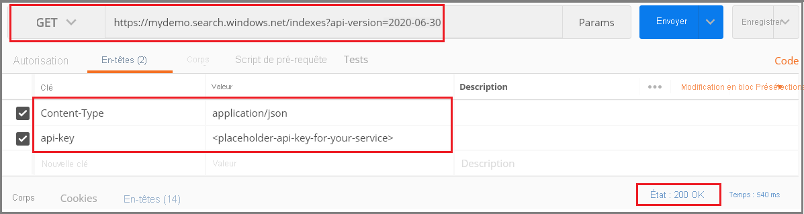

# <a name="tutorial-use-rest-and-ai-to-generate-searchable-content-from-azure-blobs"></a>Tutoriel : Utiliser REST et l’IA pour générer du contenu pouvant faire l’objet de recherches à partir d’objets blob Azure

Si vous avez du texte non structuré ou des images dans le stockage Blob Azure, un [pipeline d’enrichissement par IA](cognitive-search-concept-intro.md) peut extraire des informations et créer du contenu à partir des blobs utiles pour les scénarios de recherche en texte intégral ou d’exploration des connaissances. Bien qu’un pipeline puisse traiter des images, ce tutoriel REST se concentre sur du texte, en appliquant la détection de la langue et le traitement en langage naturel pour créer des champs exploitables dans des requêtes, des facettes et des filtres.

Ce tutoriel utilise Postman et les [API REST de Recherche](/rest/api/searchservice/) pour effectuer les tâches suivantes :

> [!div class="checklist"]
> * Configurez des services et une collection Postman.
> * Créez un pipeline d’enrichissement qui extrait du texte, détecte la langue, reconnaît les entités et détecte les expressions clés.
> * Créez un index pour stocker la sortie (contenu brut et paires nom/valeur générées par le pipeline).
> * Exécutez le pipeline pour effectuer des transformations et une analyse ainsi que pour charger l’index.
> * Explorez les résultats à l’aide de la recherche en texte intégral et d’une syntaxe de requête enrichie.

Si vous n’avez pas d’abonnement Azure, ouvrez un [compte gratuit](https://azure.microsoft.com/free/?WT.mc_id=A261C142F) avant de commencer.

## <a name="overview"></a>Vue d’ensemble

Ce tutoriel utilise C# et les API REST Recherche cognitive Azure pour créer une source de données, un index, un indexeur et des compétences. Vous allez commencer par des documents entiers (texte non structuré) tels que PDF, HTML, DOCX et PPTX dans le stockage Blob Azure, puis les exécuter via des compétences pour extraire des entités, des expressions clés et d’autres textes dans les fichiers de contenu.

Cet ensemble de compétences utilise des compétences intégrées basées sur les API Cognitive Services. Les étapes du pipeline incluent la détection de la langue d’un texte, l’extraction des expressions clés et la reconnaissance d’entités (organisations). Les nouvelles informations sont stockées dans de nouveaux champs que vous pouvez exploiter dans les requêtes, les facettes et les filtres.

## <a name="prerequisites"></a>Prérequis

+ [Stockage Azure](https://azure.microsoft.com/services/storage/)
+ [Application de bureau Postman](https://www.getpostman.com/)
+ [Créer](search-create-service-portal.md) ou [rechercher un service de recherche existant](https://ms.portal.azure.com/#blade/HubsExtension/BrowseResourceBlade/resourceType/Microsoft.Search%2FsearchServices) 

> [!Note]
> Vous pouvez utiliser le service gratuit pour ce tutoriel. Avec un service de recherche gratuit, vous êtes limité à trois index, trois indexeurs et trois sources de données. Ce didacticiel crée une occurrence de chaque élément. Avant de commencer, veillez à disposer de l’espace suffisant sur votre service pour accepter les nouvelles ressources.

## <a name="download-files"></a>Télécharger les fichiers

1. Ouvrez ce [dossier OneDrive](https://1drv.ms/f/s!As7Oy81M_gVPa-LCb5lC_3hbS-4) et en haut à gauche, cliquez sur **Télécharger** pour copier les fichiers sur votre ordinateur. 

1. Cliquez avec le bouton droit sur le fichier zip et sélectionnez **Tout extraire**. Il y a 14 fichiers de différents types. Vous en utiliserez 7 dans le cadre de cet exercice.

Si vous le souhaitez, vous pouvez également télécharger le code source, un fichier de collection Postman, pour ce tutoriel. Le code source est disponible sur [https://github.com/Azure-Samples/azure-search-postman-samples/tree/master/Tutorial](https://github.com/Azure-Samples/azure-search-postman-samples/tree/master/Tutorial).

## <a name="1---create-services"></a>1 - Créer les services

Ce tutoriel utilise Recherche cognitive Azure pour l’indexation et les requêtes, Cognitive Services pour l’enrichissement par IA sur le back-end, et Stockage Blob Azure pour fournir les données. Ce tutoriel reste sous l’allocation gratuite de 20 transactions par indexeur par jour sur Cognitive Services : les seuls services que vous devez créer sont donc la recherche et le stockage.

Si possible, créez les deux services dans la même région et le même groupe de ressources pour des raisons de proximité et de facilité de gestion. Dans la pratique, votre compte de stockage Azure peut être dans une région quelconque.

### <a name="start-with-azure-storage"></a>Démarrer avec le stockage Azure

1. [Connectez-vous au portail Azure](https://portal.azure.com/) et cliquez sur **+ Créer une ressource**.

1. Recherchez un *compte de stockage* et sélectionnez l’offre de compte de stockage Microsoft.

   

1. Sous l’onglet Bases, les éléments suivants sont obligatoires. Acceptez les valeurs par défaut pour tout le reste.

   + **Groupe de ressources**. Sélectionnez un groupe existant ou créez-en un, mais utilisez le même groupe pour tous les services afin de pouvoir les gérer collectivement.

   + **Nom du compte de stockage**. Si vous pensez que vous pouvez avoir plusieurs ressources du même type, utilisez le nom pour lever l’ambiguïté par type et par région, par exemple *blobstoragewestus*. 

   + **Emplacement**. Si possible, choisissez le même emplacement que celui utilisé pour Recherche cognitive Azure et Cognitive Services. Un emplacement unique annule les frais liés à la bande passante.

   + **Type de compte**. Choisissez la valeur par défaut, *StorageV2 (v2 universel)* .

1. Cliquez sur **Vérifier + créer** pour créer le service.

1. Une fois qu’il est créé, cliquez sur **Accéder à la ressource** pour ouvrir la page Vue d’ensemble.

1. Cliquez sur le service **Objets blob**.

1. Cliquez sur **+ Conteneur** pour créer un conteneur et nommez-le *cog-search-demo*.

1. Sélectionnez *cog-search-demo*, puis cliquez sur **Charger** pour ouvrir le dossier dans lequel vous avez enregistré les fichiers téléchargés. Sélectionnez tous les fichiers autres que des images. Vous devez disposer de 7 fichiers. Cliquez sur **OK** pour effectuer le chargement.

   

1. Avant de quitter Stockage Azure, obtenez une chaîne de connexion afin de pouvoir formuler une connexion dans Recherche cognitive Azure. 

   1. Revenez à la page Vue d’ensemble de votre compte de stockage (nous avons utilisé *blobstragewestus* comme exemple). 
   
   1. Dans le volet de navigation gauche, sélectionnez **Clés d’accès** et copiez l’une des chaînes de connexion. 

   La chaîne de connexion est une URL similaire à l’exemple suivant :

      ```http
      DefaultEndpointsProtocol=https;AccountName=cogsrchdemostorage;AccountKey=<your account key>;EndpointSuffix=core.windows.net
      ```

1. Enregistrez la chaîne de connexion dans le Bloc-Notes. Vous en aurez besoin plus tard lors de la configuration de la connexion à la source de données.

### <a name="cognitive-services"></a>Cognitive Services

L’enrichissement par IA s’appuie sur Cognitive Services, notamment Analyse de texte et Vision par ordinateur pour le traitement des images et du langage naturel. Si votre objectif était de réaliser un prototype ou un projet réel, vous devriez à ce stade provisionner Cognitive Services (dans la même région que Recherche cognitive Azure) afin de pouvoir l’attacher aux opérations d’indexation.

Cependant, dans le cadre de cet exercice, vous pouvez ignorer le provisionnement des ressources, car Recherche cognitive Azure peut se connecter à Cognitive Services en arrière-plan et vous fournir 20 transactions gratuites par exécution de l’indexeur. Comme ce tutoriel utilise 7 transactions, l’allocation gratuite est suffisante. Pour les projets de plus grande envergure, prévoyez de provisionner Cognitive Services au niveau S0 du paiement à l’utilisation. Pour plus d’informations, consultez [Attacher Cognitive Services](cognitive-search-attach-cognitive-services.md).

### <a name="azure-cognitive-search"></a>Recherche cognitive Azure

Le troisième composant est Recherche cognitive Azure, que vous pouvez [créer dans le portail](search-create-service-portal.md). Vous pouvez utiliser le niveau gratuit pour effectuer cette procédure pas à pas. 

Comme avec le stockage Blob Azure, prenez un moment pour collecter la clé d’accès. Par ailleurs, lorsque vous commencez à structurer les demandes, vous devez fournir le point de terminaison et la clé API d’administration utilisés pour authentifier chaque demande.

### <a name="copy-an-admin-api-key-and-url-for-azure-cognitive-search"></a>Copier une clé API d’administration et une URL pour Recherche cognitive Azure

1. [Connectez-vous au Portail Azure](https://portal.azure.com/), puis dans la page **Vue d’ensemble** du service de recherche, récupérez le nom de votre service de recherche. Vous pouvez confirmer le nom de votre service en passant en revue l’URL du point de terminaison. Si votre URL de point de terminaison est `https://mydemo.search.windows.net`, le nom du service doit être `mydemo`.

2. Dans **Paramètres** > **Clés**, obtenez une clé d’administration pour avoir des droits d’accès complets sur le service. Il existe deux clés d’administration interchangeables, fournies pour assurer la continuité de l’activité au cas où vous deviez en remplacer une. Vous pouvez utiliser la clé primaire ou secondaire sur les demandes d’ajout, de modification et de suppression d’objets.

   Obtenez aussi la clé de requête. Il est recommandé d’émettre des demandes de requête avec un accès en lecture seule.

   

Une clé API est nécessaire dans l’en-tête de chaque requête envoyée à votre service. Une clé valide permet d’établir, en fonction de chaque demande, une relation de confiance entre l’application qui envoie la demande et le service qui en assure le traitement.

## <a name="2---set-up-postman"></a>2 - Configurer Postman

Démarrez Postman et paramétrez une requête HTTP. Si vous ne connaissez pas bien cet outil, consultez [Explorer les API REST de la Recherche cognitive Azure](search-get-started-rest.md).

Les méthodes de requête utilisées dans ce tutoriel sont **POST**, **PUT** et **GET**. Vous allez utiliser les méthodes permettant d’effectuer quatre appels d’API vers votre service de recherche afin de créer une source de données, un ensemble de compétences, un index et un indexeur.

Dans les en-têtes, définissez « Content-type » sur `application/json` et `api-key` sur la clé API d’administration de votre service Recherche cognitive Azure. Une fois que vous avez défini les en-têtes, vous pouvez les utiliser pour chaque demande de cet exercice.

  

## <a name="3---create-the-pipeline"></a>3 - Créer le pipeline

Dans la Recherche cognitive Azure, l’enrichissement se produit pendant l’indexation (ou l’ingestion de données). Cette partie de la procédure pas à pas crée quatre objets : source de données, définition d’index, ensemble de compétences, indexeur. 

### <a name="step-1-create-a-data-source"></a>Étape 1 : Création d'une source de données

Un [objet Source de données](/rest/api/searchservice/create-data-source) fournit la chaîne de connexion au conteneur d’objets blob contenant les fichiers.

1. Utilisez **POST** et l’URL suivante, en remplaçant YOUR-SERVICE-NAME par le véritable nom de votre service.

   ```http
   https://[YOUR-SERVICE-NAME].search.windows.net/datasources?api-version=2020-06-30
   ```

1. Dans le **corps** de la demande, copiez la définition JSON suivante, en remplaçant `connectionString` par la connexion réelle de votre compte de stockage. 

   Pensez à modifier également le nom du conteneur. Nous avons suggéré "cog-search-demo" comme nom du conteneur dans une étape précédente.

    ```json
    {
      "name" : "cog-search-demo-ds",
      "description" : "Demo files to demonstrate cognitive search capabilities.",
      "type" : "azureblob",
      "credentials" :
      { "connectionString" :
        "DefaultEndpointsProtocol=https;AccountName=<YOUR-STORAGE-ACCOUNT>;AccountKey=<YOUR-ACCOUNT-KEY>;"
      },
      "container" : { "name" : "<YOUR-BLOB-CONTAINER-NAME>" }
    }
    ```
1. Envoyez la demande. Vous devriez voir un code d’état 201 confirmant la réussite. 

Si vous avez obtenu une erreur 403 ou 404, vérifiez la construction de la demande : `api-version=2020-06-30` doit être sur le point de terminaison, `api-key` doit être dans l’en-tête après `Content-Type` et sa valeur doit être valide pour un service de recherche. Vous souhaiterez peut-être exécuter le document JSON via un validateur JSON en ligne pour vous assurer que la syntaxe est correcte. 

### <a name="step-2-create-a-skillset"></a>Étape 2 : Créer un ensemble de compétences

Un [objet Ensemble de compétences](/rest/api/searchservice/create-skillset) est un ensemble d’étapes d’enrichissement appliquées à votre contenu. 

1. Utilisez **PUT** et l’URL suivante, en remplaçant YOUR-SERVICE-NAME par le véritable nom de votre service.

    ```http
    https://[YOUR-SERVICE-NAME].search.windows.net/skillsets/cog-search-demo-sd?api-version=2020-06-30
    ```

1. Dans le **corps** de la demande, copiez la définition JSON ci-dessous. Cet ensemble de compétences comprend les compétences intégrées suivantes.

   | Compétence                 | Description    |
   |-----------------------|----------------|
   | [Reconnaissance d’entités](cognitive-search-skill-entity-recognition.md) | Extrait les noms des personnes, des organisations et des emplacements à partir du contenu figurant dans le conteneur d’objets blob. |
   | [Détection de la langue](cognitive-search-skill-language-detection.md) | Détecte la langue du contenu. |
   | [Fractionnement de texte](cognitive-search-skill-textsplit.md)  | Divise un long contenu en plus petits morceaux avant d’appeler la compétence d’extraction de phrases clés. L’extraction de phrases clés accepte des entrées de 50 000 caractères au maximum. Certains fichiers d’exemple doivent être fractionnés pour satisfaire cette limite. |
   | [Extraction d’expressions clés](cognitive-search-skill-keyphrases.md) | Extrait les principales expressions clés. |

   Chaque compétence s’exécute sur le contenu du document. Au cours du traitement, Recherche cognitive Azure ouvre chaque document pour lire le contenu de différents formats de fichiers. Le texte trouvé originaire du fichier source est placé dans un champ ```content``` généré, un pour chaque document. Par conséquent, l’entrée devient ```"/document/content"```.

   Pour l’extraction d’expressions clés, comme nous utilisons la compétence de division de texte pour découper des fichiers volumineux en pages, le contexte de la compétence d’extraction d’expressions clés est ```"document/pages/*"``` (pour chaque page du document) au lieu de ```"/document/content"```.

    ```json
    {
      "description": "Extract entities, detect language and extract key-phrases",
      "skills":
      [
        {
          "@odata.type": "#Microsoft.Skills.Text.EntityRecognitionSkill",
          "categories": [ "Person", "Organization", "Location" ],
          "defaultLanguageCode": "en",
          "inputs": [
            { "name": "text", "source": "/document/content" }
          ],
          "outputs": [
            { "name": "persons", "targetName": "persons" },
            { "name": "organizations", "targetName": "organizations" },
            { "name": "locations", "targetName": "locations" }
          ]
        },
        {
          "@odata.type": "#Microsoft.Skills.Text.LanguageDetectionSkill",
          "inputs": [
            { "name": "text", "source": "/document/content" }
          ],
          "outputs": [
            { "name": "languageCode", "targetName": "languageCode" }
          ]
        },
        {
          "@odata.type": "#Microsoft.Skills.Text.SplitSkill",
          "textSplitMode" : "pages",
          "maximumPageLength": 4000,
          "inputs": [
            { "name": "text", "source": "/document/content" },
            { "name": "languageCode", "source": "/document/languageCode" }
          ],
          "outputs": [
            { "name": "textItems", "targetName": "pages" }
          ]
        },
        {
          "@odata.type": "#Microsoft.Skills.Text.KeyPhraseExtractionSkill",
          "context": "/document/pages/*",
          "inputs": [
            { "name": "text", "source": "/document/pages/*" },
            { "name":"languageCode", "source": "/document/languageCode" }
          ],
          "outputs": [
            { "name": "keyPhrases", "targetName": "keyPhrases" }
          ]
        }
      ]
    }
    ```
    Une représentation graphique de l’ensemble de compétences est présentée ci-dessous. 

    

1. Envoyez la demande. Postman doit retourner un code d’état 201 confirmant la réussite. 

> [!NOTE]
> Les sorties peuvent être mappées à un index, utilisées comme entrée d’une compétence en aval, ou les deux, comme c’est le cas avec le code de langue. Dans l’index, un code de langue est utile pour le filtrage. En tant qu’entrée, le code de langue est utilisé par les compétences d’analyse de texte pour informer les règles linguistiques en matière de césure de mots. Pour plus d’informations sur les principes de base des ensembles de compétences, consultez [Guide pratique pour définir un ensemble de compétences](cognitive-search-defining-skillset.md).

### <a name="step-3-create-an-index"></a>Étape 3 : Création d'un index

Un [index](/rest/api/searchservice/create-index) fournit le schéma utilisé pour créer l’expression physique de votre contenu dans les index inversés et d’autres constructions dans Recherche cognitive Azure. Le plus grand composant d’un index est la collection de champs, où le type de données et les attributs déterminent le contenu et les comportements dans Recherche cognitive Azure.

1. Utilisez **PUT** et l’URL suivante, en remplaçant YOUR-SERVICE-NAME par le véritable nom de votre service, pour nommer votre index.

   ```http
   https://[YOUR-SERVICE-NAME].search.windows.net/indexes/cog-search-demo-idx?api-version=2020-06-30
   ```

1. Dans le **corps** de la demande, copiez la définition JSON suivante. Le champ `content` stocke le document lui-même. Les champs supplémentaires `languageCode`, `keyPhrases` et `organizations` représentent de nouvelles informations (champs et valeurs) créées par l’ensemble de compétences.

    ```json
    {
      "fields": [
        {
          "name": "id",
          "type": "Edm.String",
          "key": true,
          "searchable": true,
          "filterable": false,
          "facetable": false,
          "sortable": true
        },
        {
          "name": "metadata_storage_name",
          "type": "Edm.String",
          "searchable": false,
          "filterable": false,
          "facetable": false,
          "sortable": false
        },
        {
          "name": "content",
          "type": "Edm.String",
          "sortable": false,
          "searchable": true,
          "filterable": false,
          "facetable": false
        },
        {
          "name": "languageCode",
          "type": "Edm.String",
          "searchable": true,
          "filterable": false,
          "facetable": false
        },
        {
          "name": "keyPhrases",
          "type": "Collection(Edm.String)",
          "searchable": true,
          "filterable": false,
          "facetable": false
        },
        {
          "name": "persons",
          "type": "Collection(Edm.String)",
          "searchable": true,
          "sortable": false,
          "filterable": true,
          "facetable": true
        },
        {
          "name": "organizations",
          "type": "Collection(Edm.String)",
          "searchable": true,
          "sortable": false,
          "filterable": true,
          "facetable": true
        },
        {
          "name": "locations",
          "type": "Collection(Edm.String)",
          "searchable": true,
          "sortable": false,
          "filterable": true,
          "facetable": true
        }
      ]
    }
    ```

1. Envoyez la demande. Postman doit retourner un code d’état 201 confirmant la réussite. 

### <a name="step-4-create-and-run-an-indexer"></a>Étape 4 : Créer et exécuter un indexeur

Un [indexeur](/rest/api/searchservice/create-indexer) pilote le pipeline. Les trois composants que vous avez créés jusqu’à présent (source de données, ensemble de compétences, index) sont les entrées d’un indexeur. La création de l’indexeur sur Recherche cognitive Azure est l’événement qui met en mouvement la totalité du pipeline. 

1. Utilisez **PUT** et l’URL suivante, en remplaçant YOUR-SERVICE-NAME par le véritable nom de votre service, pour nommer votre indexeur.

   ```http
   https://[servicename].search.windows.net/indexers/cog-search-demo-idxr?api-version=2020-06-30
   ```

1. Dans le **corps** de la demande, copiez la définition JSON ci-dessous. Notez les éléments de mappage de champs : ces mappages sont importants car ils définissent le flux de données. 

   Les éléments `fieldMappings` sont traités avant l’ensemble de compétences, en envoyant le contenu de la source de données aux champs cibles dans un index. Vous utiliserez des mappages de champs pour envoyer du contenu existant non modifié à l’index. Si les noms et types de champ sont identiques aux deux extrémités, aucun mappage n’est nécessaire.

   Les éléments `outputFieldMappings` sont pour les champs créés par les compétences et donc traités après l’exécution de l’ensemble de compétences. Les références à `sourceFieldNames` dans `outputFieldMappings` n’existent pas tant que l’enrichissement ou le craquage de document ne les a pas créées. L’élément `targetFieldName` est un champ dans un index, défini dans le schéma d’index.

    ```json
    {
      "name":"cog-search-demo-idxr",
      "dataSourceName" : "cog-search-demo-ds",
      "targetIndexName" : "cog-search-demo-idx",
      "skillsetName" : "cog-search-demo-ss",
      "fieldMappings" : [
        {
          "sourceFieldName" : "metadata_storage_path",
          "targetFieldName" : "id",
          "mappingFunction" :
            { "name" : "base64Encode" }
        },
        {
          "sourceFieldName" : "metadata_storage_name",
          "targetFieldName" : "metadata_storage_name",
          "mappingFunction" :
            { "name" : "base64Encode" }
        },
        {
          "sourceFieldName" : "content",
          "targetFieldName" : "content"
        }
      ],
      "outputFieldMappings" :
      [
        {
          "sourceFieldName" : "/document/persons",
          "targetFieldName" : "persons"
        },
        {
          "sourceFieldName" : "/document/organizations",
          "targetFieldName" : "organizations"
        },
        {
          "sourceFieldName" : "/document/locations",
          "targetFieldName" : "locations"
        },
        {
          "sourceFieldName" : "/document/pages/*/keyPhrases/*",
          "targetFieldName" : "keyPhrases"
        },
        {
          "sourceFieldName": "/document/languageCode",
          "targetFieldName": "languageCode"
        }
      ],
      "parameters":
      {
        "maxFailedItems":-1,
        "maxFailedItemsPerBatch":-1,
        "configuration":
        {
          "dataToExtract": "contentAndMetadata",
          "parsingMode": "default",
          "firstLineContainsHeaders": false,
          "delimitedTextDelimiter": ","
        }
      }
    }
    ```

1. Envoyez la demande. Postman doit retourner un code d’état 201 confirmant la réussite du processus. 

   Attendez-vous à ce que cette étape prenne plusieurs minutes. Même si le jeu de données est petit, les compétences analytiques exigent des calculs intensifs. 

> [!NOTE]
> La création d’un indexeur appelle le pipeline. En cas de problèmes pour atteindre les données, mapper les entrées et les sorties, ou ordonner les opérations, ceux-ci apparaissent à ce stade. Pour réexécuter le pipeline avec des modifications de code ou de script, vous pouvez être amené à supprimer d’abord des objets. Pour plus d’informations, consultez [Réinitialiser et réexécuter](#reset).

#### <a name="about-indexer-parameters"></a>À propos des paramètres de l’indexeur

Le script affecte à ```"maxFailedItems"``` la valeur -1, ce qui indique au moteur d’indexation d’ignorer les erreurs au cours de l’importation des données. C’est acceptable car très peu de documents figurent dans la source de données de démonstration. Pour une source de données plus volumineuse, vous définiriez une valeur supérieure à 0.

Cette instruction ```"dataToExtract":"contentAndMetadata"``` indique à l’indexeur d’extraire automatiquement le contenu de fichiers de différents formats, ainsi que les métadonnées associées à chaque fichier. 

Lorsque le contenu est extrait, vous pouvez définir ```imageAction``` pour extraire le texte des images trouvées dans la source de données. La configuration ```"imageAction":"generateNormalizedImages"```, associée à la compétence de reconnaissance optique des caractères et à la compétence de fusion de texte, indique à l’indexeur d’extraire le texte des images (par exemple, le mot « stop » d’un panneau de signalisation Stop) et de l’incorporer dans le champ de contenu. Ce comportement s’applique aux images intégrées dans les documents (pensez à une image dans un fichier PDF), ainsi qu’aux images trouvées dans la source de données, par exemple un fichier JPG.

## <a name="4---monitor-indexing"></a>4 - Surveiller l’indexation

L’indexation et l’enrichissement commencent dès que vous envoyez la demande de création d’indexeur. Selon les compétences cognitives que vous avez définies, l’indexation peut durer longtemps. Pour déterminer si l’indexeur est toujours en cours d’exécution, envoyez la demande suivante pour vérifier l’état de l’indexeur.

1. Utilisez **GET** et l’URL suivante, en remplaçant YOUR-SERVICE-NAME par le véritable nom de votre service, pour nommer votre indexeur.

   ```http
   https://[YOUR-SERVICE-NAME].search.windows.net/indexers/cog-search-demo-idxr/status?api-version=2020-06-30
   ```

1. Passez en revue la réponse pour savoir si l’indexeur est en cours d’exécution ou pour voir les informations d’erreur et d’avertissement.  

Si vous utilisez le niveau Gratuit, le message suivant est attendu : « Impossible d’extraire le contenu ou les métadonnées de votre document. Texte extrait tronqué à '32768' caractères ». Ce message s’affiche parce que l’indexation d’objets blob au niveau Gratuit a une [limite d’extraction de caractères égale à 32 000](search-limits-quotas-capacity.md#indexer-limits). Vous ne verrez pas ce message pour ce jeu de données sur des niveaux supérieurs. 

> [!NOTE]
> Les avertissements sont courants dans certains scénarios et n’indiquent pas toujours un problème. Par exemple, si un conteneur d’objets blob comprend des fichiers image et que le pipeline ne gère pas les images, vous obtenez un avertissement indiquant que les images n’ont pas été traitées.

## <a name="5---search"></a>5 - Recherche

Maintenant que vous avez créé des champs et des informations, nous allons exécuter certaines requêtes pour comprendre la valeur de la recherche cognitive par rapport à un scénario de recherche standard.

Rappelez-vous que nous avons commencé avec le contenu d’objets blob là où le document entier est empaqueté dans un champ `content` unique. Vous pouvez rechercher dans ce champ et trouver des correspondances pour vos requêtes.

1. Utilisez **GET** et l’URL suivante, en remplaçant YOUR-SERVICE-NAME par le nom réel de votre service, pour rechercher des instances d’un terme ou d'une expression et retourner le champ `content` et le nombre des documents correspondants.

   ```http
   https://[YOUR-SERVICE-NAME].search.windows.net/indexes/cog-search-demo-idx/docs?search=*&$count=true&$select=content&api-version=2020-06-30
   ```
   
   Les résultats de cette requête retournent le contenu du document, ce qui donne le même résultat que si vous utilisiez l’indexeur d’objets blob sans le pipeline de recherche cognitive. Ce champ peut faire l’objet d’une recherche, mais il ne peut pas être utilisé si vous souhaitez utiliser des facettes, des filtres ou la saisie semi-automatique.

   
   
1. Pour la deuxième requête, retournez certains des nouveaux champs créés par le pipeline (personnes, organisations, emplacements, languageCode). Nous omettons keyPhrases par souci de concision, mais vous devez l’inclure si vous souhaitez voir ces valeurs.

   ```http
   https://[YOUR-SERVICE-NAME].search.windows.net/indexes/cog-search-demo-idx/docs?search=*&$count=true&$select=metadata_storage_name,persons,organizations,locations,languageCode&api-version=2020-06-30
   ```
   Les champs de l’instruction $select contiennent de nouvelles informations créées à partir des fonctionnalités de traitement du langage naturel de Cognitive Services. Comme vous pouvez vous y attendre, il existe un certain bruit dans les résultats et une certaine variation entre les documents, mais dans de nombreuses instances, les modèles analytiques produisent des résultats précis.

   L’image suivante montre les résultats pour la lettre ouverte de Satya Nadella lorsqu’il a endossé le rôle de Directeur général de Microsoft.

   

1. Pour voir comment tirer parti de ces champs, ajoutez un paramètre de facette pour retourner une agrégation de documents correspondants par emplacement.

   ```http
   https://[YOUR-SERVICE-NAME].search.windows.net/indexes/cog-search-demo-idx/docs?search=*&facet=locations&api-version=2020-06-30
   ``` 

   Dans cet exemple, il existe 2 ou 3 correspondances pour chaque emplacement.

   
   

1. Dans ce dernier exemple, appliquez un filtre à la collection des organisations pour retourner deux correspondances pour les critères de filtre basés sur le NASDAQ.

   ```http
   https://[YOUR-SERVICE-NAME].search.windows.net/indexes/cog-search-demo-idx/docs?search=*&$filter=organizations/any(organizations: organizations eq 'NASDAQ')&$select=metadata_storage_name,organizations&$count=true&api-version=2020-06-30
   ```

Ces requêtes illustrent quelques-unes des façons dont vous pouvez travailler avec la syntaxe de requête et les filtres sur les nouveaux champs créés par Recherche cognitive. Pour obtenir plus d’exemples de requêtes, consultez [Exemples dans l’API REST de recherche de documents](/rest/api/searchservice/search-documents#bkmk_examples), [Exemples de requêtes de syntaxe simple](search-query-simple-examples.md) et [Exemples complets de requêtes Lucene](search-query-lucene-examples.md).

<a name="reset"></a>

## <a name="reset-and-rerun"></a>Réinitialiser et réexécuter

Dans les premières étapes expérimentales du développement, l’approche la plus pratique pour les itérations de conception consiste à supprimer les objets de Recherche cognitive Azure et à autoriser votre code à les reconstruire. Les noms des ressources sont uniques. La suppression d’un objet vous permet de le recréer en utilisant le même nom.

Vous pouvez utiliser le portail pour supprimer les index, les indexeurs et les ensembles de compétences. Quand vous supprimez l’indexeur, vous pouvez si vous le souhaitez, sélectivement supprimer l’index, l’ensemble de compétences et la source de données en même temps.


Vous pouvez aussi utiliser **DELETE** et fournir des URL vers chaque objet. La commande suivante supprime un indexeur.

```http
DELETE https://[YOUR-SERVICE-NAME].search.windows.net/indexers/cog-search-demo-idxr?api-version=2020-06-30
```

Le code d’état 204 est retourné lorsque la suppression réussit.

## <a name="takeaways"></a>Éléments importants à retenir

Ce tutoriel présente les étapes de base pour générer un pipeline d’indexation enrichie via la création de composants : une source de données, un ensemble de compétences, un index et un indexeur.

Les [compétences intégrées](cognitive-search-predefined-skills.md) ont été introduites, ainsi que la définition d’un ensemble de compétences et les mécanismes de chaînage de compétences via des entrées et des sorties. Vous avez également appris que `outputFieldMappings` est requis dans la définition de l’indexeur pour acheminer les valeurs enrichies du pipeline dans un index de recherche, sur un service de Recherche cognitive Azure.

Enfin, vous avez appris à tester les résultats et réinitialiser le système pour des itérations ultérieures. Vous avez appris qu’émettre des requêtes par rapport à l’index retourne la sortie créée par le pipeline d’indexation enrichie. 

## <a name="clean-up-resources"></a>Nettoyer les ressources

Lorsque vous travaillez dans votre propre abonnement, il est judicieux à la fin d’un projet de supprimer les ressources dont vous n’avez plus besoin. Les ressources laissées en cours d’exécution peuvent vous coûter de l’argent. Vous pouvez supprimer les ressources une par une, ou choisir de supprimer le groupe de ressources afin de supprimer l’ensemble des ressources.

Vous pouvez rechercher et gérer les ressources dans le portail à l’aide des liens Toutes les ressources ou Groupes de ressources situés dans le volet de navigation de gauche.

## <a name="next-steps"></a>Étapes suivantes

Maintenant que vous êtes familiarisé avec tous les objets d’un pipeline d’enrichissement par IA, examinons de plus près les définitions des ensembles de compétences et les compétences individuelles.

> [!div class="nextstepaction"]
> [Guide pratique pour créer un ensemble de compétences](cognitive-search-defining-skillset.md)
