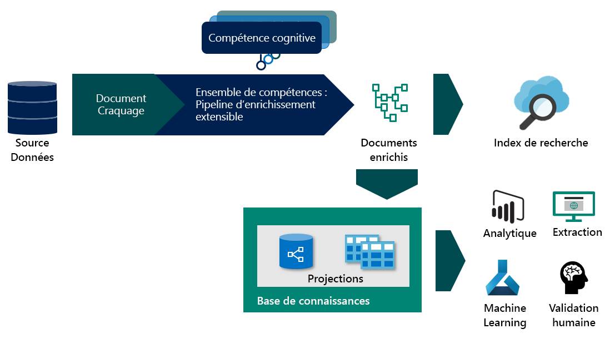

# <a name="skillset-concepts-and-composition-in-azure-cognitive-search"></a>Concepts et composition des ensembles de compétences dans Recherche cognitive Azure

Cet article est destiné aux développeurs qui souhaitent approfondir leurs connaissances sur le fonctionnement du pipeline d’enrichissement et suppose que vous avez des notions de base sur les concepts du processus d’enrichissement de l’IA. Si ce concept est nouveau pour vous, commencez par :
+ [Enrichissement de l’IA dans Recherche cognitive Azure](cognitive-search-concept-intro.md)
+ [Base de connaissances (préversion)](knowledge-store-concept-intro.md)

## <a name="specify-the-skillset"></a>Spécifier l’ensemble de compétences
Un ensemble de compétences est une ressource réutilisable dans Recherche cognitive Azure qui spécifie une collection de compétences cognitives servant à analyser, transformer et enrichir du texte ou des images durant l’indexation. Vous pouvez créer un ensemble de compétences pour ensuite attacher des enrichissements de texte et d’image dans la phase d’ingestion des données, en extrayant et en générant de nouvelles informations et structures à partir du contenu brut.

Un ensemble de compétences a trois propriétés :

+   ```skills```, une collection non triée de compétences dont la séquence d’exécution est déterminée par la plateforme en fonction des entrées requises pour chaque compétence
+   ```cognitiveServices```, la clé Cognitive Services nécessaire pour la facturation des compétences cognitives appelées
+   ```knowledgeStore```, le compte de stockage dans lequel seront projetés vos documents


Les ensembles de compétences sont créés dans JSON. Vous pouvez créer des ensembles de compétences complexes, avec des boucles et des [branches](https://docs.microsoft.com/azure/search/cognitive-search-skill-conditional), à l’aide du [langage d’expression](https://docs.microsoft.com/azure/search/cognitive-search-skill-conditional). Le langage d’expression utilise la notation du [pointeur JSON](https://tools.ietf.org/html/rfc6901) pour les chemins, légèrement modifiée afin d’identifier les nœuds dans l’arborescence d’enrichissements. Un ```"/"``` fait passer à un niveau inférieur dans l’arborescence et ```"*"``` est utilisé comme un opérateur for-each dans le contexte. Ces concepts sont plus faciles à comprendre avec un exemple. Pour illustrer quelques-uns des concepts et fonctionnalités, nous allons examiner un exemple d’ensemble de compétences relatif à des [avis sur les hôtels](knowledge-store-connect-powerbi.md). Pour voir l’ensemble de compétences après avoir suivi le workflow d’importation des données, vous devez [obtenir l’ensemble de compétences](https://docs.microsoft.com/rest/api/searchservice/get-skillset) à partir d’un client d’API REST.

### <a name="enrichment-tree"></a>Arborescence d’enrichissements

Pour comprendre de quelle manière un ensemble de compétences enrichit progressivement un document, commençons par regarder à quoi le document ressemble avant tout enrichissement. La sortie du craquage du document varie selon la source de données et le mode d’analyse spécifique qui ont été sélectionnés. C’est également l’état du document à partir duquel les [mappages de champs](search-indexer-field-mappings.md) peuvent extraire le contenu lors de l’ajout de données à l’index de recherche.


Une fois qu’un document se trouve dans le pipeline d’enrichissement, il est représenté sous la forme d’une arborescence du contenu et des enrichissements associés. Cette arborescence est instanciée en tant que sortie du craquage du document. Le format de l’arborescence d’enrichissements permet au pipeline d’enrichissement d’attacher des métadonnées même à des types de données primitifs ; ce n’est pas un objet JSON valide, mais il peut être projeté dans un format JSON valide. Le tableau suivant indique l’état d’un document qui entre dans le pipeline d’enrichissement :

|Data Source\Parsing Mode|Default|JSON, JSON Lines & CSV|
|---|---|---|
|Stockage Blob|/document/content<br>/document/normalized_images/*<br>…|/document/{key1}<br>/document/{key2}<br>…|
|SQL|/document/{column1}<br>/document/{column2}<br>…|N/A |
|Cosmos DB|/document/{key1}<br>/document/{key2}<br>…|N/A|

 À mesure que les compétences s’exécutent, elles ajoutent de nouveaux nœuds à l’arborescence d’enrichissements. Ces nouveaux nœuds peuvent ensuite être utilisés comme entrées pour les compétences en aval, en les projetant dans la base de connaissances ou en les mappant aux champs d’index. Les enrichissements ne sont pas mutables : une fois créés, les nœuds ne peuvent pas être modifiés. Plus votre ensemble de compétences est complexe, plus votre arborescence d’enrichissements l’est aussi. Toutefois, vous n’avez pas besoin d’inclure systématiquement tous les nœuds de l’arborescence d’enrichissements dans l’index ou la base de connaissances. Vous pouvez choisir de conserver uniquement une partie des enrichissements dans l’index ou la base de connaissances.

Vous pouvez choisir de conserver uniquement une partie des enrichissements dans l’index ou la base de connaissances.
Dans la suite de ce document, nous faisons référence à l’[exemple des avis sur les hôtels](https://docs.microsoft.com/azure/search/knowledge-store-connect-powerbi), mais vous pouvez appliquer les mêmes concepts pour enrichir des documents issus d’autres sources de données.

### <a name="context"></a>Context
Chaque compétence demande un contexte. Un contexte détermine :
+   Le nombre de fois que la compétence est exécutée, en fonction des nœuds sélectionnés. Pour les valeurs de contexte d’une collection, l’ajout de ```/*``` à la fin spécifie que la compétence est appelée une fois pour chaque instance dans la collection. 
+   L’endroit dans l’arborescence d’enrichissements où les sorties de la compétence sont ajoutées. Les sorties sont toujours ajoutées à l’arborescence en tant qu’enfants du nœud de contexte. 
+   La forme des entrées. Pour les collections à plusieurs niveaux, la définition du contexte sur la collection parente détermine la forme des entrées de la compétence. Par exemple, dans une arborescence d’enrichissements avec une liste de pays, chaque entrée est enrichie avec une liste d’états contenant elle-même une liste de codes postaux.

|Context|Entrée|Forme de l’entrée|Appel de compétence|
|---|---|---|---|
|```/document/countries/*``` |```/document/countries/*/states/*/zipcodes/*``` |Liste de tous les codes postaux du pays |Une fois par pays |
|```/document/countries/*/states/*``` |```/document/countries/*/states/*/zipcodes/*``` |Liste de tous les codes postaux de l’état | Une fois par paire pays/état|

### <a name="sourcecontext"></a>SourceContext

`sourceContext` s’utilise uniquement dans les [compétences de modélisation](cognitive-search-skill-shaper.md) et dans les [projections](knowledge-store-projection-overview.md). Il permet de construire des objets imbriqués à plusieurs niveaux. Avec `sourceContext`, vous pouvez construire un objet hiérarchique de type anonyme, ce qui nécessiterait plusieurs compétences si vous utilisiez uniquement le contexte. L’utilisation de `sourceContext` est expliquée dans la section suivante.

### <a name="projections"></a>Projections

La projection est le processus qui consiste à sélectionner les nœuds de l’arborescence d’enrichissements à enregistrer dans la base de connaissances. Les projections sont des formes personnalisées du document (contenu et enrichissements) qui peuvent être générées en sortie sous forme de projections de tables ou d’objets. Pour en savoir plus sur l’utilisation des projections, consultez [Utilisation de projections](knowledge-store-projection-overview.md).


Le diagramme ci-dessus montre le sélecteur à utiliser en fonction de l’endroit où vous vous trouvez dans le pipeline d’enrichissement.

## <a name="generate-enriched-data"></a>Générer des données enrichies 

Examinons maintenant l’ensemble de compétences des avis sur les hôtels. Vous pouvez effectuer le [tutoriel](knowledge-store-connect-powerbi.md) pour créer l’ensemble de compétences, ou simplement [afficher](https://github.com/Azure-Samples/azure-search-postman-samples/blob/master/samples/skillset.json) l’ensemble de compétences. Nous allons voir de quelle façon :

* L’arborescence d’enrichissements évolue au fur et à mesure de l’exécution de chaque compétence 
* Le contexte et les entrées déterminent le nombre de fois qu’une compétence s’exécute 
* Le contexte impacte la forme de l’entrée. 

Étant donné que nous utilisons le mode d’analyse de texte délimité pour l’indexeur, un document dans le processus d’enrichissement représente une ligne unique dans le fichier CSV.

### <a name="skill-1-split-skill"></a>Compétence n° 1 : Division 


Avec le contexte de compétence ```"/document/reviews_text"```, cette compétence s’exécute une fois pour `reviews_text`. La sortie de la compétence est une liste où `reviews_text` est segmenté en 5 000 séquences de caractères. La sortie de la compétence de division est nommée `pages` et elle est ajoutée à l’arborescence d’enrichissements. Avec `targetName`, vous pouvez renommer une sortie de compétence avant de l’ajouter à l’arborescence d’enrichissements.

L’arborescence d’enrichissements comporte maintenant un nouveau nœud, situé sous le contexte de la compétence. Ce nœud peut être utilisé pour d’autres compétences, projections ou mappages de champs de sortie.


Le nœud racine de tous les enrichissements est `"/document"`. Quand vous utilisez des indexeurs d’objets blob, le nœud `"/document"` contient les nœuds enfants `"/document/content"` et `"/document/normalized_images"`. Si vous utilisez des données CSV, comme dans cet exemple, les noms de colonne sont mappés aux nœuds figurant sous `"/document"`. Pour accéder à un enrichissement qui a été ajouté à un nœud par une compétence, vous devez indiquer le chemin complet de l’enrichissement. Par exemple, si vous souhaitez utiliser le texte du nœud ```pages``` comme entrée dans une autre compétence, vous devez spécifier le chemin de cette façon : ```"/document/reviews_text/pages/*"```.
 
 

### <a name="skill-2-language-detection"></a>Compétence n° 2 : Détection de la langue
 La compétence de détection de la langue est la troisième compétence (compétence n° 3) définie dans l’ensemble de compétences, mais c’est la compétence suivante à exécuter. Comme elle n’est pas bloquée dans l’attente d’entrées, elle s’exécute parallèlement à la compétence précédente. À l’instar de la compétence de division qui l’a précédée, la compétence de détection de la langue est également appelée une fois pour chaque document. L’arborescence d’enrichissements comporte désormais un nouveau nœud pour la langue.
 
 
 ### <a name="skill-3-key-phrases-skill"></a>Compétence n° 3 : Expressions clés 

Avec le contexte ```/document/reviews_text/pages/*```, la compétence des expressions clés est appelée une fois pour chacun des éléments dans la collection `pages`. La sortie de la compétence est un nœud placé sous l’élément page associé. 

 Vous pouvez maintenant examiner le reste des compétences dans l’ensemble de compétences et regarder comment l’arborescence des enrichissements continue de croître à l’exécution de chaque compétence. Certaines compétences, telles que la compétence de fusion et la compétence de modélisation, créent également des nœuds, mais utilisent uniquement les données de nœuds existants et ne créent pas d’enrichissements supplémentaires.


Les couleurs des connecteurs dans l’arborescence ci-dessus indiquent que les enrichissements ont été créés par différentes compétences, c’est-à-dire que les nœuds devront être traités individuellement et qu’ils ne feront pas partie de l’objet retourné lors de la sélection du nœud parent.

## <a name="save-enrichments-in-a-knowledge-store"></a>Enregistrer les enrichissements dans une base de connaissances 

Les ensembles de compétences définissent également une base de connaissances dans laquelle vos documents enrichis peuvent être projetés sous forme de tables ou d’objets. Pour enregistrer les données enrichies dans la base de connaissances, vous définissez un ensemble de projections du document enrichi. Pour en savoir plus sur la base de connaissances, consultez [Vue d’ensemble de la base de connaissances](knowledge-store-concept-intro.md)

### <a name="slicing-projections"></a>Découpage de projections

Quand vous définissez un groupe de projections de tables, un nœud de l’arborescence d’enrichissements peut être divisé pour être projeté dans plusieurs tables associées. Si vous ajoutez une table dont le chemin source est un nœud enfant d’une projection de table existante, le nœud enfant qui en résulte n’est pas un enfant de cette projection, mais il est projeté à la place dans la nouvelle table associée. Cette technique de découpage vous permet de définir un nœud unique dans une compétence de modélisation qui peut être la source de toutes vos projections de tables. 

### <a name="shaping-projections"></a>Mise en forme de projections

Il existe deux façons de définir une projection. Vous pouvez utiliser une compétence de modélisation pour créer un nœud qui est le nœud racine pour tous les enrichissements que vous projetez. Ensuite, dans vos projections, vous référencez uniquement la sortie de la compétence de modélisation. Vous pouvez également inclure la mise en forme d’une projection dans la définition de la projection.

L’approche de la modélisation est plus détaillée que la mise en forme incluse, mais elle garantit que toutes les mutations de l’arborescence d’enrichissements sont présentes dans les compétences et que la sortie est un objet réutilisable. La mise en forme incluse vous permet de créer la forme dont vous avez besoin, mais elle constitue un objet anonyme qui est utilisable uniquement dans la projection pour laquelle elle est définie. Les approches peuvent s’utiliser ensemble ou séparément. L’ensemble de compétences créé pour vous dans le workflow du portail contient les deux. Il utilise une compétence de modélisation pour les projections de tables, mais aussi une mise en forme incluse pour projeter la table d’expressions clés.

Pour compléter l’exemple, vous pouvez choisir de supprimer la mise en forme incluse et d’utiliser une compétence de modélisation afin de créer un nœud spécifique pour les expressions clés. Pour créer une forme projetée dans trois tables (`hotelReviewsDocument`, `hotelReviewsPages` et `hotelReviewsKeyPhrases`), vous utilisez les deux options décrites dans les sections suivantes.


#### <a name="shaper-skill-and-projection"></a>Compétence de modélisation et projection 

> [!Note]
> Certaines colonnes de la table de documents ont été supprimées de cet exemple par souci de concision.
>
```json
{
    "@odata.type": "#Microsoft.Skills.Util.ShaperSkill",
    "name": "#5",
    "description": null,
    "context": "/document",
    "inputs": [        
        {
            "name": "reviews_text",
            "source": "/document/reviews_text",
            "sourceContext": null,
            "inputs": []
        },
        {
            "name": "reviews_title",
            "source": "/document/reviews_title",
            "sourceContext": null,
            "inputs": []
        },
        {
            "name": "AzureSearch_DocumentKey",
            "source": "/document/AzureSearch_DocumentKey",
            "sourceContext": null,
            "inputs": []
        },  
        {
            "name": "pages",
            "source": null,
            "sourceContext": "/document/reviews_text/pages/*",
            "inputs": [
                {
                    "name": "SentimentScore",
                    "source": "/document/reviews_text/pages/*/Sentiment",
                    "sourceContext": null,
                    "inputs": []
                },
                {
                    "name": "LanguageCode",
                    "source": "/document/Language",
                    "sourceContext": null,
                    "inputs": []
                },
                {
                    "name": "Page",
                    "source": "/document/reviews_text/pages/*",
                    "sourceContext": null,
                    "inputs": []
                },
                {
                    "name": "keyphrase",
                    "sourceContext": "/document/reviews_text/pages/*/Keyphrases/*",
                    "inputs": [
                        {
                            "source": "/document/reviews_text/pages/*/Keyphrases/*",
                            "name": "Keyphrases"
                        }
                    ]
                }
            ]
        }
    ],
    "outputs": [
        {
            "name": "output",
            "targetName": "tableprojection"
        }
    ]
}
```

Avec le nœud `tableprojection` défini dans la section `outputs` ci-dessus, nous pouvons maintenant utiliser la fonctionnalité de découpage pour projeter les éléments du nœud `tableprojection` dans des tables différentes :

> [!Note]
> Il s’agit uniquement d’un extrait de la projection configurée dans la base de connaissances.
>
```json
"projections": [
    {
        "tables": [
            {
                "tableName": "hotelReviewsDocument",
                "generatedKeyName": "Documentid",
                "source": "/document/tableprojection"
            },
            {
                "tableName": "hotelReviewsPages",
                "generatedKeyName": "Pagesid",
                "source": "/document/tableprojection/pages/*"
            },
            {
                "tableName": "hotelReviewsKeyPhrases",
                "generatedKeyName": "KeyPhrasesid",
                "source": "/document/tableprojection/pages/*/keyphrase/*"
            }
        ]
    }
]
```

#### <a name="inline-shaping-projections"></a>Mise en forme incluse pour les projections

L’approche de la mise en forme incluse ne nécessite pas de compétence de modélisation, car toutes les formes nécessaires aux projections sont créées au fur et à mesure des besoins. Pour projeter les mêmes données que l’exemple précédent, nous utilisons une option de projection incluse similaire à ceci :

```json
"projections": [
    {
        "tables": [
            {
                "tableName": "hotelReviewsInlineDocument",
                "generatedKeyName": "Documentid",
                "sourceContext": "/document",     
                "inputs": [
                    {
                        "name": "reviews_text",
                        "source": "/document/reviews_text"
                    },
                    {
                        "name": "reviews_title",
                        "source": "/document/reviews_title"
                    },
                    {
                        "name": "AzureSearch_DocumentKey",
                        "source": "/document/AzureSearch_DocumentKey"
                    }                             
                ]
            },
            {
                "tableName": "hotelReviewsInlinePages",
                "generatedKeyName": "Pagesid",
                "sourceContext": "/document/reviews_text/pages/*",
                "inputs": [
                        {
                    "name": "SentimentScore",
                    "source": "/document/reviews_text/pages/*/Sentiment"
                    },
                    {
                        "name": "LanguageCode",
                        "source": "/document/Language"
                    },
                    {
                        "name": "Page",
                        "source": "/document/reviews_text/pages/*"
                    }
                ]
            },
            {
                "tableName": "hotelReviewsInlineKeyPhrases",
                "generatedKeyName": "KeyPhraseId",
                "sourceContext": "/document/reviews_text/pages/*/Keyphrases/*",
                "inputs": [
                    {
                        "name": "Keyphrases",
                        "source": "/document/reviews_text/pages/*/Keyphrases/*"
                    }
                ]
            }
        ]
    }
]
```
  
Dans les deux approches, nous pouvons observer comment les valeurs de `"Keyphrases"` sont projetées à l’aide de `"sourceContext"`. Le nœud `"Keyphrases"`, qui contient une collection de chaînes, est lui-même un enfant du texte de la page. Toutefois, étant donné que les projections requièrent un objet JSON et que la page est de type primitif (chaîne), `"sourceContext"` est utilisé pour inclure l’expression clé dans un objet avec une propriété nommée. Cette technique permet aussi de projeter des primitives de manière indépendante.

## <a name="next-steps"></a>Étapes suivantes

Vous pouvez maintenant créer votre premier ensemble de compétences avec des compétences cognitives.

> [!div class="nextstepaction"]
> [Créez votre premier ensemble de compétences](cognitive-search-defining-skillset.md).
