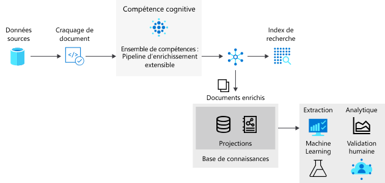

# <a name="knowledge-store-in-azure-cognitive-search"></a>Base de connaissances dans Recherche cognitive Azure

La base de connaissances est une fonctionnalité de la Recherche cognitive Azure. Elle permet de conserver la sortie d’un [pipeline d’enrichissement par l’IA](cognitive-search-concept-intro.md) en vue d’une analyse indépendante ou d’un traitement en aval. Un *document enrichi* est la sortie d’un pipeline, créée à partir d’un contenu qui a été extrait, structuré et analysé à l’aide de processus IA. Dans un pipeline IA standard, les documents enrichis sont temporaires, utilisés uniquement pendant l’indexation, puis ignorés. Le choix de créer une base de connaissances vous permettra de conserver les documents enrichis. 

Si vous avez déjà utilisé des compétences cognitives par le passé, vous savez que des *ensembles de compétences* déplacent un document dans une séquence d’enrichissements. Le résultat peut être un index de recherche ou des projections dans une base de connaissances. Les deux sorties, l’index de recherche et la base de connaissances sont des produits du même pipeline, dérivés des mêmes entrées, mais qui produisent une sortie structurée, stockée et utilisée de manières très différentes.

Physiquement, une base de connaissances représente un [stockage Azure](../storage/common/storage-account-overview.md), soit le stockage Table Azure, soit le stockage Blob Azure, ou les deux. Tout outil ou processus pouvant se connecter au Stockage Azure peut utiliser le contenu d’un magasin de connaissances.


> [!VIDEO https://www.youtube.com/embed/XWzLBP8iWqg?version=3&start=235&end=426]




## <a name="benefits-of-knowledge-store"></a>Avantages de la base de connaissances

Une base de connaissances vous fournit une structure, un contexte et un contenu réel, extraits de fichiers de données non structurés et semi-structurés, tels que des objets blob, des fichiers image ayant fait l’objet d’une analyse, ou même des données structurées remodelées dans nouveaux formulaires. Une [procédure pas à pas](knowledge-store-create-rest.md) montre comment un document JSON dense de source sure est partitionné en sous-structures, reconstitué en nouvelles structures et mis à disposition pour des processus en aval, comme des charges de travail liées au Machine Learning et à la science des données.

Bien qu’il soit utile de voir ce qu’un pipeline d’enrichissement par l’IA peut produire, le véritable potentiel d’une base de connaissances réside dans sa capacité à remodeler les données. Vous pouvez commencer avec un ensemble de compétences de base, puis procéder à une itération sur celui-ci afin d’ajouter des niveaux de structure croissants, que vous pouvez ensuite combiner en nouvelles structures, utilisables dans des applications autres que la Recherche cognitive Azure.

La base de connaissances vous offre notamment les avantages suivants :

+ Utilisez des documents enrichis dans des [outils d'analyse et de génération d'états](#tools-and-apps) autres que des outils de recherche. Power BI avec Power Query est un excellent choix, mais tout outil ou application capable de se connecter à Stockage Azure peut puiser dans une base de connaissances que vous avez créée.

+ Affinez un pipeline d'indexation IA lors des étapes de débogage et de la définition des ensembles de compétences. Une base de connaissances vous présente le produit de la définition d'un ensemble de compétences dans un pipeline d'indexation IA. Vous pouvez utiliser ces résultats afin de concevoir un ensemble de compétences plus performant car vous voyez exactement à quoi ressemblent les enrichissements. Vous pouvez utiliser l’[Explorateur Stockage](../vs-azure-tools-storage-manage-with-storage-explorer.md?tabs=windows) de Stockage Azure pour afficher le contenu d’une base de connaissances.

+ Modelez les données pour les transformer en nouveaux formulaires. Le remodelage est codifié en ensembles de compétences, mais le fait est qu'un ensemble de compétences peut désormais fournir cette capacité. La [compétence Modélisateur](cognitive-search-skill-shaper.md) de la Recherche cognitive Azure a été étendue pour s’adapter à cette tâche. Le remodelage vous permet de définir une projection alignée sur l'utilisation que vous prévoyez de faire des données tout en préservant les relations.

> [!Note]
> Vous ne connaissez pas l’enrichissement et les compétences cognitives de l’intelligence artificielle ? La Recherche cognitive Azure s’intègre aux fonctionnalités de vision et de langage de Cognitive Services pour extraire et enrichir les données sources à l’aide de la reconnaissance optique de caractères sur des fichiers image, de la reconnaissance d’entités et de l’extraction d’expressions clés à partir de fichiers texte et autres. Pour plus d’informations, consultez [Enrichissement de l’IA dans la Recherche cognitive Azure](cognitive-search-concept-intro.md).

## <a name="physical-storage"></a>Stockage physique


> [!VIDEO https://www.youtube.com/embed/XWzLBP8iWqg?version=3&start=455&end=542]


L’expression physique d’une base de connaissances est articulée au travers de l’élément `projections` d’une définition `knowledgeStore` dans un ensemble de compétences. La projection définit une structure de la sortie afin qu’elle corresponde à votre utilisation prévue.

Des projections peuvent être articulées en tant que tables, objets ou fichiers.

```json
"knowledgeStore": { 
    "storageConnectionString": "<YOUR-AZURE-STORAGE-ACCOUNT-CONNECTION-STRING>", 
    "projections": [ 
        { 
            "tables": [ ], 
            "objects": [ ], 
            "files": [ ]
        },
                { 
            "tables": [ ], 
            "objects": [ ], 
            "files": [ ]
        }
```

Le type de projection que vous spécifiez dans cette structure détermine le type de stockage utilisé par la base de connaissances.

+ Un stockage Table est utilisé lorsque vous définissez `tables`. Définissez une projection de table lorsque vous avez besoin de structures de rapports tabulaires pour des entrées dans des outils analytiques, ou les exporter en tant que trames de données dans d’autres magasins de données. Vous pouvez spécifier plusieurs `tables` pour obtenir un sous-ensemble ou une section transversale de documents enrichis. Dans le même groupe de projection, les relations entre tables sont conservées afin que vous puissiez les utiliser toutes.

+ Un stockage Blob est utilisé lorsque vous définissez `objects` ou `files`. La représentation physique d’un `object` est une structure JSON hiérarchique représentant un document enrichi. Un `file` est une image extraite d’un document, transférée intacte vers un stockage Blob.

Un objet projection unique contient un ensemble de `tables`, `objects`, `files`, et, pour de nombreux scénarios, la création d’une seule projection peut suffire. 

Toutefois, il est possible de créer plusieurs ensembles de projections `table`-`object`-`file`, et vous pouvez le faire si vous souhaitez des relations entrer données différentes. Dans un ensemble, les données sont liées, en supposant que ces relations existent et peuvent être détectées. Si vous créez des ensembles supplémentaires, les documents de chaque groupe ne sont jamais liés. Voici un exemple de ce que pourrait donner une utilisation de plusieurs groupes de projection si vous souhaitez que les mêmes données soient projetées pour une utilisation avec votre système en ligne, qu’elles soient représentées de manière spécifique, et que les mêmes données soient projetées pour une utilisation dans un pipeline de science des données représenté différemment.

## <a name="requirements"></a>Spécifications 

Un [Stockage Azure](../storage/index.yml) est requis. Il fournit le stockage physique. Vous pouvez utiliser un stockage Blob, un stockage Table ou les deux. Un stockage Blob est utilisé pour des documents enrichis intacts, généralement lorsque la sortie est acheminée vers des processus en aval. Un stockage Table est destiné à des tranches de documents enrichis, couramment utilisées à des fins d’analyse et de rapport.

Un [ensemble de compétences](cognitive-search-working-with-skillsets.md) est requis. Il contient la définition de `knowledgeStore` et détermine la structure et la composition d’un document enrichi. Vous ne pouvez pas créer une base de connaissances à l’aide d’un ensemble de compétences vide. Vous devez avoir au moins une compétence dans un ensemble compétences.

Un [indexeur](search-indexer-overview.md) est requis. Un ensemble de compétences est appelé par un indexeur qui pilote l’exécution. Les indexeurs sont fournis avec leur propre ensemble d’exigences et d’attributs. Plusieurs de ces attributs ont une incidence directe sur une base de connaissances :

+ Les indexeurs requièrent une [source de données Azure pris en charge](search-indexer-overview.md#supported-data-sources) (le pipeline qui crée finalement la base de connaissances commence par extraire des données d’une source prise en charge sur Azure). 

+ Les indexeurs requièrent un index de recherche. Un indexeur requiert que vous fournissiez un schéma d’index, même si vous n’envisagez pas de l’utiliser. Un index minimal comprend un champ de chaîne désigné comme clé.

+ Les indexeurs fournissent des mappages de champs facultatifs, utilisés pour attribuer en tant qu’alias un champ source à un champ de destination. Si un mappage de champs par défaut nécessite une modification (pour utiliser un autre nom ou type), vous pouvez créer un [mappage de champs](search-indexer-field-mappings.md) dans un indexeur. Pour la sortie de la base de connaissances, la destination peut être un champ dans un objet blob ou une table.

+ Les indexeurs ont des planifications, et d’autres propriétés telles que des mécanismes de détection des modifications fournis par diverses sources de données peuvent également être appliquées à une base de connaissances. Par exemple, vous pouvez [planifier](search-howto-schedule-indexers.md) un enrichissement à intervalles réguliers pour actualiser le contenu. 

## <a name="how-to-create-a-knowledge-store"></a>Comment créer une base de connaissances

Pour créer une base de connaissances, utilisez le portail ou l’API REST (`api-version=2020-06-30`).

### <a name="use-the-azure-portal"></a>Utilisation du portail Azure

L’Assistant **Importation de données** contient des options pour la création d’une base de connaissances. Pour l’exploration initiale, [créez votre première base de connaissances en quatre étapes](knowledge-store-connect-power-bi.md).

1. Sélectionnez une source de données prise en charge.

1. Spécifiez un enrichissement : joignez une ressource, sélectionnez des compétences et spécifiez une base de connaissances. 

1. Créez un schéma d’index. L’Assistant l’exige et peut en inférer un pour vous.

1. Exécutez l’Assistant. L’extraction, l’enrichissement et le stockage se produisent dans cette dernière étape.

### <a name="use-create-skillset-rest-api"></a>Utiliser Créer un ensemble de compétences (API REST)]

Une `knowledgeStore` est définie au sein d’un [ensemble de compétences](cognitive-search-working-with-skillsets.md) qui est appelé à son tour par un [indexeur](search-indexer-overview.md). Pendant l’enrichissement, la Recherche cognitive Azure crée un espace dans votre compte de stockage Azure et projette les documents enrichis en tant qu’objets blob ou dans des tables, en fonction de votre configuration.

L’API REST est un mécanisme qui vous permet de créer une base de connaissances par programme. Une manière facile d’explorer consiste à [créer votre première base de connaissances à l’aide de Postman et de l’API REST](knowledge-store-create-rest.md).

<a name="tools-and-apps"></a>

## <a name="how-to-connect-with-tools-and-apps"></a>Comment se connecter avec des outils et applications

Une fois les enrichissements disponibles dans le stockage, n'importe quel outil ou technologie capable de se connecter à Stockage Blob ou Table Azure peut être utilisé pour explorer, analyser ou utiliser le contenu. La liste suivante est un début :

+ L'[Explorateur Stockage](knowledge-store-view-storage-explorer.md) permet d'afficher la structure et le contenu des documents enrichis. Considérez-le comme votre outil de référence pour afficher le contenu de la base de connaissances.

+ [Power BI](knowledge-store-connect-power-bi.md) pour la création de rapports et l’analyse. 

+ [Azure Data Factory](../data-factory/index.yml) permet d'effectuer d'autres manipulations.

<a name="kstore-rest-api"></a>

## <a name="api-reference"></a>Informations de référence sur l'API

La version `2020-06-30` de l’API REST fournit une base de connaissances via des définitions supplémentaires sur des ensembles de compétences. En plus de la référence, consultez [créer une base de connaissances à l’aide de Postman](knowledge-store-create-rest.md) pour plus d’informations sur la façon d’appeler les API.

+ [Créer un ensemble de compétences (api-version=2020-06-30)](/rest/api/searchservice/create-skillset)
+ [Mettre à jour un ensemble de compétences (api-version=2020-06-30)](/rest/api/searchservice/update-skillset)


## <a name="next-steps"></a>Étapes suivantes

La base de connaissances offre la persistance de documents enrichis, utile lors de la conception d’un ensemble de compétences, ou la création de structures et de contenu pour une consommation par les applications clientes qui peuvent accéder à un compte de stockage Azure.

L’approche la plus simple pour créer des documents enrichis consiste à [utiliser le portail](knowledge-store-create-portal.md), mais vous pouvez également utiliser Postman et l’API REST, ce qui est plus utile si vous souhaitez obtenir des insights sur la façon dont les objets sont créés et référencés.

> [!div class="nextstepaction"]
> [Créer une base de connaissances à l’aide de Postman et de REST](knowledge-store-create-rest.md)

Découvrez les projections, les fonctionnalités et la façon dont vous [les définissez dans un ensemble de compétences](knowledge-store-projection-overview.md).

> [!div class="nextstepaction"]
> [Projections dans une base de connaissances](knowledge-store-projection-overview.md)

Pour un tutoriel sur les concepts de projections avancées, tels que le découpage, la mise en forme inline et les relations, commencez par [définir des projections dans une base de connaissances](knowledge-store-projections-examples.md).

> [!div class="nextstepaction"]
> [Définir des projections dans une base de connaissances](knowledge-store-projections-examples.md)