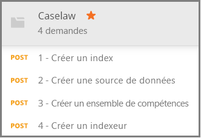

# <a name="how-to-get-started-with-knowledge-store-in-azure-search"></a>Prise en main de la base de connaissances dans Recherche Azure

> [!Note]
> La base de connaissances est en préversion et n’a pas été conçue pour la production. L’[API REST version 2019-05-06-Preview](search-api-preview.md) fournit cette fonctionnalité. Il n’y a pas de prise en charge de .NET SDK pour l’instant.
>
La [base de connaissances](knowledge-store-concept-intro.md) enregistre les documents enrichis par l’intelligence artificielle créés lors de l’indexation dans votre compte de stockage Azure pour l’exploration de données en aval dans d’autres applications. Vous pouvez également utiliser des enrichissements enregistrés pour comprendre et affiner un pipeline d'indexation Recherche Azure. 

Une base de connaissances est définie par un *ensemble de compétences* et créée par un *indexeur*. L’expression physique d’une base de connaissances est spécifiée via des *projections* qui déterminent les structures de données dans le stockage. Au terme de cette procédure pas à pas, vous aurez créé tous ces objets et saurez comment ils s’assemblent. 

Dans cet exercice, vous allez commencer avec des exemples de données, de services et d'outils pour vous familiariser avec les bases de la création et de l'utilisation d'une base de connaissances, en mettant l'accent sur la définition des compétences.

## <a name="prerequisites"></a>Prérequis

La base de connaissances est au centre de plusieurs services, avec Stockage Blob Azure et Stockage Table Azure qui assurent le stockage physique, et Recherche Azure et Cognitive Services pour les mises à jour et la création d’objets. La connaissance de l’[architecture de base](knowledge-store-concept-intro.md) est un prérequis pour cette procédure pas à pas.

Les services et les outils qui suivent sont utilisés dans ce guide de démarrage rapide. 

+ [Obtenez l’application de bureau Postman](https://www.getpostman.com/), qui permet d’envoyer des requêtes HTTP au service Recherche Azure.

+ [Créez un compte de stockage Azure](https://docs.microsoft.com/azure/storage/common/storage-quickstart-create-account) pour stocker les exemples de données et la base de connaissances. Votre base de connaissances sera présente dans Stockage Azure.

+ [Créez une ressource Cognitive Services](https://docs.microsoft.com/azure/cognitive-services/cognitive-services-apis-create-account) au niveau paiement à l'utilisation S0 pour un accès à large spectre à la gamme complète des compétences utilisées dans le cadre des enrichissements IA. Cognitive Services et votre service Recherche Azure doivent se trouver dans la même région.

+ [Créez un service Recherche Azure](search-create-service-portal.md) ou [recherchez un service existant](https://ms.portal.azure.com/#blade/HubsExtension/BrowseResourceBlade/resourceType/Microsoft.Search%2FsearchServices) dans votre abonnement actuel. Vous pouvez utiliser un service gratuit pour ce tutoriel. 

Des exemples de documents JSON et un fichier de la collection Postman sont également requis. Des instructions permettant de localiser et charger des fichiers supplémentaires sont fournies dans la section [Préparer l’exemple de données](#prepare-sample-data).

## <a name="get-a-key-and-url"></a>Obtenir une clé et une URL

Les appels REST requièrent l’URL du service et une clé d’accès et ce, sur chaque demande. Un service de recherche est créé avec les deux. Ainsi, si vous avez ajouté votre abonnement à la fonction Recherche Azure, procédez comme suit pour obtenir les informations nécessaires :

1. [Connectez-vous au portail Azure](https://portal.azure.com/), puis dans la page **Vue d’ensemble** du service de recherche, récupérez l’URL. Voici un exemple de point de terminaison : `https://mydemo.search.windows.net`.

1. Dans **Paramètres** > **Clés**, obtenez une clé d’administration pour avoir des droits d’accès complets sur le service. Il existe deux clés d’administration interchangeables, fournies pour assurer la continuité de l’activité au cas où vous deviez en remplacer une. Vous pouvez utiliser la clé primaire ou secondaire sur les demandes d’ajout, de modification et de suppression d’objets.

    

Toutes les demandes nécessitent une clé API sur chaque demande envoyée à votre service. Vous allez fournir le nom du service et la clé API dans chaque requête HTTP dans les sections suivantes.

<a name="prepare-sample-data"></a>

## <a name="prepare-sample-data"></a>Préparer l’exemple de données

Une base de connaissances contient la sortie d’un pipeline d’enrichissement. Les entrées se composent de données « inutilisables » qui deviennent finalement « utilisables » quand elles passent par le pipeline. Des exemples de données inutilisables peuvent inclure des fichiers image qui doivent être analysés pour identifier les caractéristiques de texte ou d’image, ou des fichiers de texte dense qui peuvent être analysés pour identifier les entités, les expressions clés ou les sentiments. 

Cet exercice utilise des fichiers de texte dense (informations de jurisprudence) provenant de la page de téléchargement de Public Bulk Data [Caselaw Access Project](https://case.law/bulk/download/). Nous avons chargé un échantillon de 10 documents sur GitHub pour cet exercice. 

Dans cette tâche, vous allez créer un conteneur d’objets blob Azure pour ces documents à utiliser en tant qu’entrée pour le pipeline. 

1. Téléchargez et extrayez le dépôt [Exemple de données Recherche Azure](https://github.com/Azure-Samples/azure-search-sample-data/tree/master/caselaw) pour obtenir le [jeu de données Caselaw](https://github.com/Azure-Samples/azure-search-sample-data/tree/master/caselaw). 

1. [Connectez-vous au portail Azure](https://portal.azure.com), accédez à votre compte de stockage Azure, cliquez sur **Objets blob**, puis sur **+ Conteneur**.

1. [Créez un conteneur d’objets blob](https://docs.microsoft.com/azure/storage/blobs/storage-quickstart-blobs-portal) qui doit contenir des exemples de données : 

   1. Nommez le conteneur `caselaw-test`. 
   
   1. Définissez le niveau d’accès public sur l’une de ses valeurs valides.

1. Une fois le conteneur créé, ouvrez-le et sélectionnez **Charger** dans la barre de commandes.

   

1. Accédez au dossier contenant l'exemple de fichier **caselaw-sample.json**. Sélectionnez le fichier, puis cliquez sur **Charger**.

1. Tant que vous vous trouvez dans le stockage Azure, obtenez le nom de conteneur et la chaîne de connexion.  Vous aurez besoin de ces deux chaînes dans [Créer une source de données](#create-data-source) :

   1. Dans la page Vue d’ensemble, cliquez sur **Clés d’accès** et copiez une *chaîne de connexion*. Elle commence par `DefaultEndpointsProtocol=https;` et se termine par `EndpointSuffix=core.windows.net`. Votre nom de compte et votre clé sont entre les deux. 

   1. Le nom du conteneur doit être `caselaw-test` ou tout autre nom que vous avez choisi.


## <a name="set-up-postman"></a>Configurer Postman

Postman est l’application cliente que vous allez utiliser pour envoyer des requêtes et documents JSON à Recherche Azure. Plusieurs des requêtes peuvent être formulées en employant seulement les informations dans cet article. Toutefois, deux des requêtes les plus importantes (création d’un index, création d’un ensemble de compétences) contiennent du code JSON détaillé qui est trop volumineux pour figurer dans un article. 

Pour rendre l’ensemble des requêtes et documents JSON entièrement disponibles, nous avons créé un fichier de la collection Postman. Le téléchargement, puis l’importation de ce fichier constituent votre première tâche de configuration du client.

1. Téléchargez et décompressez le dépôt [Exemples Postman Recherche Azure](https://github.com/Azure-Samples/azure-search-postman-samples).

1. Démarrez Postman et importez la collection Postman Caselaw :

   1. Cliquez sur **Importer** > **Importer des fichiers** > **Choisir des fichiers**. 

   1. Accédez au dossier \azure-search-postman-samples-master\azure-search-postman-samples-master\Caselaw.

   1. Sélectionnez **Caselaw.postman_collection_v2.json**. Vous devez voir quatre requêtes **POST** dans la collection.

   
   

## <a name="create-an-index"></a>Création d'un index
    
La première requête utilise l’[API de création d’index](https://docs.microsoft.com/rest/api/searchservice/create-data-source), qui permet de créer un index Recherche Azure pour stocker toutes les données pouvant faire l’objet de recherches. Un index spécifie tous les champs, paramètres et attributs.

Vous n'avez pas nécessairement besoin d'un index pour l'exploration des connaissances, mais un indexeur ne s'exécutera que si un index est fourni. 

1. Dans l’URL `https://YOUR-AZURE-SEARCH-SERVICE-NAME.search.windows.net/indexes?api-version=2019-05-06-Preview`, remplacez `YOUR-AZURE-SEARCH-SERVICE-NAME` par le nom de votre service de recherche. 

1. Dans la section d’en-tête, remplacez `<YOUR AZURE SEARCH ADMIN API-KEY>` par une clé API d’administration pour Recherche Azure.

1. Dans la section de corps, le document JSON est un schéma d’index. Réduite pour une meilleure visibilité, l’enveloppe extérieure d’un index est constituée des éléments suivants. La collection fields correspond aux champs dans le jeu de données Caselaw.

   ```json
   {
      "name": "caselaw",
      "defaultScoringProfile": null,
      "fields": [],
      "scoringProfiles": [],
      "corsOptions": null,
      "suggesters": [],
      "analyzers": [],
      "tokenizers": [],
      "tokenFilters": [],
      "charFilters": [],
      "encryptionKey": null
   }
   ```

1. Développez la collection `fields`. Elle contient la majeure partie de la définition d’index, composée de champs simples, de [champs complexes](search-howto-complex-data-types.md) avec des sous-structures imbriquées et des collections.

   Prenez un moment pour examiner la définition de champ pour le champ complexe `casebody` sur les lignes 302 à 384. Notez qu'un champ complexe peut contenir d'autres champs complexes lorsque des représentations hiérarchiques sont nécessaires. Les structures hiérarchiques peuvent être modélisées dans un index, comme illustré ici, et également comme une projection dans un ensemble de compétences, créant ainsi une structure de données imbriquée dans la base de connaissances.

   ```json
   {
    "name": "casebody",
    "type": "Edm.ComplexType",
    "fields": [
        {
            "name": "status",
            "type": "Edm.String",
            "searchable": true,
            "filterable": true,
            "retrievable": true,
            "sortable": true,
            "facetable": true,
            "key": false,
            "indexAnalyzer": null,
            "searchAnalyzer": null,
            "analyzer": null,
            "synonymMaps": []
        },
        {
            "name": "data",
            "type": "Edm.ComplexType",
            "fields": [
                {
                    "name": "head_matter",
                    "type": "Edm.String",
                    "searchable": true,
                    "filterable": false,
                    "retrievable": true,
                    "sortable": false,
                    "facetable": false,
                    "key": false,
                    "indexAnalyzer": null,
                    "searchAnalyzer": null,
                    "analyzer": null,
                    "synonymMaps": []
                },
                {
                    "name": "opinions",
                    "type": "Collection(Edm.ComplexType)",
                    "fields": [
                        {
                            "name": "author",
                            "type": "Edm.String",
                            "searchable": true,
                            "filterable": true,
                            "retrievable": true,
                            "sortable": false,
                            "facetable": true,
                            "key": false,
                            "indexAnalyzer": null,
                            "searchAnalyzer": null,
                            "analyzer": null,
                            "synonymMaps": []
                        },
                        {
                            "name": "text",
                            "type": "Edm.String",
                            "searchable": true,
                            "filterable": false,
                            "retrievable": true,
                            "sortable": false,
                            "facetable": false,
                            "key": false,
                            "indexAnalyzer": null,
                            "searchAnalyzer": null,
                            "analyzer": null,
                            "synonymMaps": []
                        },
                        {
                            "name": "type",
                            "type": "Edm.String",
                            "searchable": true,
                            "filterable": true,
                            "retrievable": true,
                            "sortable": false,
                            "facetable": true,
                            "key": false,
                            "indexAnalyzer": null,
                            "searchAnalyzer": null,
                            "analyzer": null,
                            "synonymMaps": []
                        }
                    ]
                },
    . . .
   ```

1. Cliquez sur **Envoyer** pour exécuter la requête.  Vous devez obtenir un message **État : 201 Créé** comme réponse.

<a name="create-data-source"></a>

## <a name="create-a-data-source"></a>Création d'une source de données

La deuxième requête utilise l’[API de création de source de données](https://docs.microsoft.com/rest/api/searchservice/create-data-source) pour se connecter au Stockage Blob Azure. 

1. Dans l’URL `https://YOUR-AZURE-SEARCH-SERVICE-NAME.search.windows.net/datasources?api-version=2019-05-06-Preview`, remplacez `YOUR-AZURE-SEARCH-SERVICE-NAME` par le nom de votre service de recherche. 

1. Dans la section d’en-tête, remplacez `<YOUR AZURE SEARCH ADMIN API-KEY>` par une clé API d’administration pour Recherche Azure.

1. Dans la section de corps, le document JSON contient la chaîne de connexion de votre compte de stockage et le nom du conteneur d’objets blob. La chaîne de connexion est disponible dans le portail Azure, dans la section **Clés d’accès** de votre compte de stockage. 

    ```json
    {
        "name": "caselaw-ds",
        "description": null,
        "type": "azureblob",
        "subtype": null,
        "credentials": {
            "connectionString": "DefaultEndpointsProtocol=https;AccountName=<YOUR-STORAGE-ACCOUNT>;AccountKey=<YOUR-STORAGE-KEY>;EndpointSuffix=core.windows.net"
        },
        "container": {
            "name": "<YOUR-BLOB-CONTAINER-NAME>",
            "query": null
        },
        "dataChangeDetectionPolicy": null,
        "dataDeletionDetectionPolicy": null
    }
    ```

1. Cliquez sur **Envoyer** pour exécuter la requête.  Vous devez obtenir un message **État : 201 Créé** comme réponse.


<a name="create-skillset"></a>

## <a name="create-a-skillset-and-knowledge-store"></a>Créer un ensemble de compétences et une base de connaissances

La troisième requête utilise l’[API de création d’un ensemble de compétences](https://docs.microsoft.com/rest/api/searchservice/create-skillset), qui permet de créer un objet Recherche Azure qui spécifie quelles compétences cognitives appeler, comment chaîner les compétences et, plus important encore pour cette procédure pas à pas, comment spécifier une base de connaissances.

1. Dans l’URL `https://YOUR-AZURE-SEARCH-SERVICE-NAME.search.windows.net/skillsets?api-version=2019-05-06-Preview`, remplacez `YOUR-AZURE-SEARCH-SERVICE-NAME` par le nom de votre service de recherche. 

1. Dans la section d’en-tête, remplacez `<YOUR AZURE SEARCH ADMIN API-KEY>` par une clé API d’administration pour Recherche Azure.

1. Dans la section de corps, le document JSON est la définition d’un ensemble de compétences. Réduite pour une meilleure visibilité, l’enveloppe extérieure d’un ensemble de compétences est constituée des éléments suivants. La collection `skills` définit les enrichissements présents en mémoire, mais la définition de la `knowledgeStore` spécifie le mode de stockage de la sortie. La définition de `cognitiveServices` constitue votre lien avec les moteurs d'enrichissement IA.

   ```json
   {
    "name": "caselaw-ss",
    "description": null,
    "skills": [],
    "cognitiveServices": [],
    "knowledgeStore": []
   }
   ```

1. Développez `cognitiveServices` et `knowledgeStore` afin de pouvoir fournir des informations de connexion. Dans l'exemple, ces chaînes se trouvent après la définition de l'ensemble de compétences, vers la fin du corps de la requête. 

   Pour `cognitiveServices`, provisionnez une ressource au niveau S0, située dans la même région que Recherche Azure. Vous pouvez obtenir le nom cognitiveServices et la clé à partir de la même page dans le portail Azure. 
   
   Pour `knowledgeStore`, vous pouvez utiliser la même chaîne de connexion utilisée pour le conteneur d’objets blob Caselaw.

    ```json
    "cognitiveServices": {
        "@odata.type": "#Microsoft.Azure.Search.CognitiveServicesByKey",
        "description": "YOUR-SAME-REGION-S0-COGNITIVE-SERVICES-RESOURCE",
        "key": "YOUR-COGNITIVE-SERVICES-KEY"
    },
    "knowledgeStore": {
        "storageConnectionString": "YOUR-STORAGE-ACCOUNT-CONNECTION-STRING",
    ```

1. Développez la collection de compétences, en particulier les compétences Modélisateur des lignes 85 et 179, respectivement. La compétence Modélisateur est importante car elle assemble les structures de données que vous souhaitez utiliser pour l'exploration des connaissances. Pendant l'exécution de l'ensemble de compétences, ces structures sont uniquement disponibles en mémoire, mais lorsque vous passerez à l'étape suivante, vous verrez comment cette sortie peut être enregistrée dans une base de connaissances pour une exploration ultérieure.

   L’extrait de code suivant provient de la ligne 217. 

    ```json
    "name": "Opinions",
    "source": null,
    "sourceContext": "/document/casebody/data/opinions/*",
    "inputs": [
        {
            "name": "Text",
            "source": "/document/casebody/data/opinions/*/text"
        },
        {
            "name": "Author",
            "source": "/document/casebody/data/opinions/*/author"
        },
        {
            "name": "Entities",
            "source": null,
            "sourceContext": "/document/casebody/data/opinions/*/text/pages/*/entities/*",
            "inputs": [
                {
                    "name": "Entity",
                    "source": "/document/casebody/data/opinions/*/text/pages/*/entities/*/value"
                },
                {
                    "name": "EntityType",
                    "source": "/document/casebody/data/opinions/*/text/pages/*/entities/*/category"
                }
            ]
        }
    ]
   . . .
   ```

1. Développez l’élément `projections` de `knowledgeStore`, à partir de la ligne 262. Les projections spécifient la composition de la base de connaissances. Les projections sont spécifiées dans des paires tables-objets, mais une seule à la fois pour le moment. Comme vous pouvez le constater dans la première projection, `tables` est spécifié, mais pas `objects`. Dans la seconde, c'est le contraire.

   Dans Stockage Azure, des tables seront créées dans Stockage Tables pour chaque table que vous créez, et chaque objet recevra un conteneur dans Stockage Blob.

   Les objets blob contiennent généralement l’expression complète d’un enrichissement. Les tables contiennent généralement des enrichissements partiels, dans des combinaisons que vous organisez à des fins spécifiques. Cet exemple présente une table Cases et une table Opinions, mais les autres tables comme Entities, Attorneys, Judges et Parties ne sont pas affichées.

    ```json
    "projections": [
        {
            "tables": [
                {
                    "tableName": "Cases",
                    "generatedKeyName": "CaseId",
                    "source": "/document/Case"
                },
                {
                    "tableName": "Opinions",
                    "generatedKeyName": "OpinionId",
                    "source": "/document/Case/OpinionsSnippets/*"
                }
            ],
            "objects": []
        },
        {
            "tables": [],
            "objects": [
                {
                    "storageContainer": "enrichedcases",
                    
                    "source": "/document/CaseFull"
                }
            ]
        }
    ]
    ```

1. Cliquez sur **Envoyer** pour exécuter la requête. La réponse doit être **201**, et être semblable à l'exemple suivant, avec la première partie de la réponse.

    ```json
    {
    "name": "caselaw-ss",
    "description": null,
    "skills": [
        {
            "@odata.type": "#Microsoft.Skills.Text.SplitSkill",
            "name": "SplitSkill#1",
            "description": null,
            "context": "/document/casebody/data/opinions/*/text",
            "defaultLanguageCode": "en",
            "textSplitMode": "pages",
            "maximumPageLength": 5000,
            "inputs": [
                {
                    "name": "text",
                    "source": "/document/casebody/data/opinions/*/text
                }
            ],
            "outputs": [
                {
                    "name": "textItems",
                    "targetName": "pages"
                }
            ]
        },
        . . .
    ```

## <a name="create-and-run-an-indexer"></a>Créer et exécuter un indexeur

La quatrième requête utilise l’[API de création d’indexeur](https://docs.microsoft.com/rest/api/searchservice/create-indexer), qui permet de créer un indexeur Recherche Azure. Un indexeur est le moteur d’exécution du pipeline d’indexation. Toutes les définitions que vous avez créées jusqu'à présent sont mises en œuvre lors de cette étape.

1. Dans l’URL `https://YOUR-AZURE-SEARCH-SERVICE-NAME.search.windows.net/indexers?api-version=2019-05-06-Preview`, remplacez `YOUR-AZURE-SEARCH-SERVICE-NAME` par le nom de votre service de recherche. 

1. Dans la section d’en-tête, remplacez `<YOUR AZURE SEARCH ADMIN API-KEY>` par une clé API d’administration pour Recherche Azure.

1. Dans la section de corps, le document JSON spécifie le nom de l’indexeur. Une source de données et un index sont requis par l'indexeur. Un ensemble de compétences est facultatif pour un indexeur, mais obligatoire pour l'enrichissement IA.

    ```json
    {
        "name": "caselaw-idxr",
        "description": null,
        "dataSourceName": "caselaw-ds",
        "skillsetName": "caselaw-ss",
        "targetIndexName": "caselaw",
        "disabled": null,
        "schedule": null,
        "parameters": { },
        "fieldMappings": [],
        "outputFieldMappings": [ ]
    ```

1. Développez outputFieldMappings. Contrairement aux fieldMappings, qui sont utilisés pour le mappage personnalisé entre les champs d’une source de données et les champs d’un index, les outputFieldMappings sont utilisés pour le mappage de champs enrichis, créés et remplis par le pipeline, aux champs de sortie dans un index ou une projection.

    ```json
    "outputFieldMappings": [
        {
            "sourceFieldName": "/document/casebody/data/opinions/*/text/pages/*/people/*",
            "targetFieldName": "people",
            "mappingFunction": null
        },
        {
            "sourceFieldName": "/document/casebody/data/opinions/*/text/pages/*/organizations/*",
            "targetFieldName": "orginizations",
            "mappingFunction": null
        },
        {
            "sourceFieldName": "/document/casebody/data/opinions/*/text/pages/*/locations/*",
            "targetFieldName": "locations",
            "mappingFunction": null
        },
        {
            "sourceFieldName": "/document/Case/OpinionsSnippets/*/Entities/*",
            "targetFieldName": "entities",
            "mappingFunction": null
        },
        {
            "sourceFieldName": "/document/casebody/data/opinions/*/text/pages/*/keyPhrases/*",
            "targetFieldName": "keyPhrases",
            "mappingFunction": null
        }
    ]
    ```

1. Cliquez sur **Envoyer** pour exécuter la requête. La réponse doit être **201**, et le corps de la réponse doit être presque identique à la charge utile de la requête que vous avez fournie (par souci de concision).

    ```json
    {
        "name": "caselaw-idxr",
        "description": null,
        "dataSourceName": "caselaw-ds",
        "skillsetName": "caselaw-ss",
        "targetIndexName": "caselaw",
        "disabled": null,
        "schedule": null,
        "parameters": { },
        "fieldMappings": [],
        "outputFieldMappings": [ ]
    }
    ```

## <a name="explore-knowledge-store"></a>Explorer la base de connaissances

Vous pouvez entamer l'exploration dès que le premier document est importé. Pour cette tâche, utilisez l'[**Explorateur Stockage**](https://docs.microsoft.com/azure/storage/blobs/storage-quickstart-blobs-storage-explorer) du portail.

Vous devez bien comprendre qu'une base de connaissances est entièrement détachée de Recherche Azure. L'index Recherche Azure et la base de connaissances contiennent tous deux une représentation des données et du contenu, mais il s'agit de leurs seuls points communs. Utilisez l'index pour la recherche en texte intégral, la recherche filtrée et tous les scénarios pris en charge dans Recherche Azure. Vous pouvez également associer d'autres outils à votre base de connaissances pour analyser le contenu.

## <a name="takeaways"></a>Éléments importants à retenir

Vous venez de créer votre première base de connaissances dans Stockage Azure et d'utiliser l'Explorateur Stockage pour visualiser les enrichissements. Il s'agit de l'expérience de base pour travailler avec des enrichissements stockés. 

## <a name="next-steps"></a>Étapes suivantes

La compétence Modélisateur permet de créer des formulaires de données granulaires qui peuvent être combinés pour créer de nouveaux formulaires. L'étape suivante consiste à consulter la page de référence de cette compétence pour obtenir des informations sur son utilisation.

> [!div class="nextstepaction"]
> [Référence relative à la compétence Modélisateur](cognitive-search-skill-shaper.md)


<!---
## Keep This

How to convert unformatted JSON into an indented JSON document structure that allows you to quickly identify nested structures. Useful for creating an index that includes complex types.

1. Use Visual Studio Code.
2. Open data.jsonl
--->
