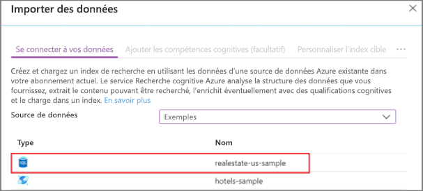
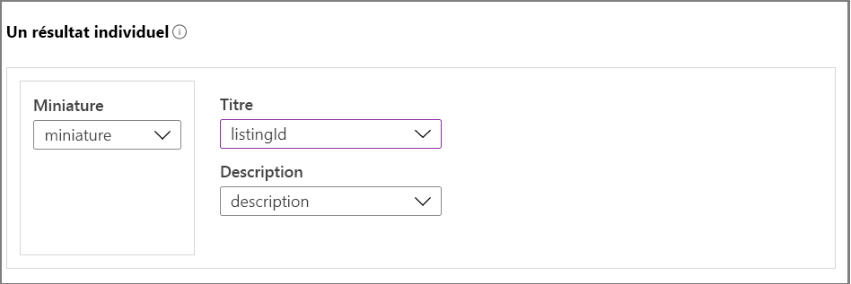
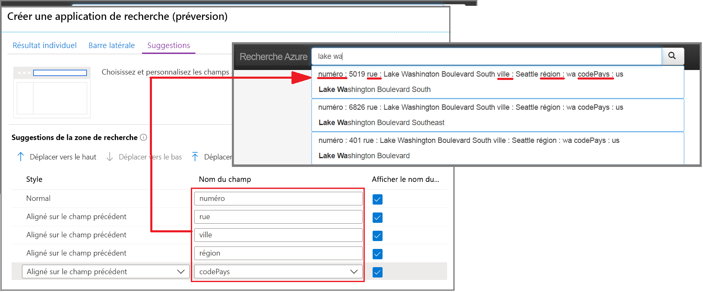
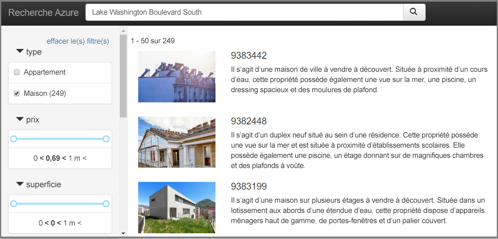

# Démarrage rapide : Créer une application de recherche dans le portail (Recherche cognitive Azure)

Utilisez l’Assistant **Créer une application de recherche** du portail pour générer une application web de type « localhost » téléchargeable qui s’exécute dans un navigateur. En fonction de sa configuration, l’application générée est opérationnelle dès la première utilisation, avec une connexion active à un index distant. Une application par défaut peut inclure une barre de recherche, une zone de résultats, des filtres dans une barre latérale et prendre en charge la saisie semi-automatique.

Si vous n’avez pas d’abonnement Azure, créez un [compte gratuit](https://azure.microsoft.com/free/?WT.mc_id=A261C142F) avant de commencer. 

## Conditions préalables requises

Vous devez effectuer la mise à niveau vers la [dernière version de Microsoft Edge](https://www.microsoft.com/edge) ou utiliser le navigateur Chrome de Google pour ce guide de démarrage rapide à ce stade.

[Créez un service Recherche cognitive Azure](search-create-service-portal.md) ou [recherchez un service existant](https://ms.portal.azure.com/#blade/HubsExtension/BrowseResourceBlade/resourceType/Microsoft.Search%2FsearchServices) dans votre abonnement actuel. Vous pouvez utiliser un service gratuit pour ce guide de démarrage rapide. 

[Créez un index](search-create-index-portal.md) à utiliser comme base de votre application. 

Ce guide de démarrage rapide utilise l’exemple prédéfini de données et d’index Real Estate, car il contient des images miniatures. Pour créer l’index utilisé dans cet exercice, exécutez l’Assistant **Importer des données**, en choisissant la source de données *realestate-us-sample*.

Quand l’index est prêt à être utilisé, passez à l’étape suivante.

## Démarrer l’Assistant

1. Connectez-vous au [portail Azure](https://portal.azure.com), puis [trouvez votre service de recherche](https://ms.portal.azure.com/#blade/HubsExtension/BrowseResourceBlade/resourceType/Microsoft.Search%2FsearchServices).

1. Dans la page Vue d’ensemble, à partir des liens situés au milieu de la page, sélectionnez **Index**. 

1. Choisissez *realestate-us-sample-index* dans la liste des index existants.

1. Dans la page de l’index, en haut, sélectionnez **Créer une application de recherche (préversion)** pour démarrer l’Assistant.

1. Dans la première page de l’Assistant, sélectionnez **Activer le partage des ressources inter-origines (CORS)** pour ajouter la prise en charge du mécanisme CORS à votre définition d’index. Cette étape est facultative, mais votre application web locale ne se connecte pas à l’index distant sans elle.

## Configurer les résultats de la recherche

L’Assistant fournit une disposition de base pour l’affichage des résultats de la recherche qui inclut un espace pour une image miniature, un titre et une description. En complément de tous ces éléments se trouve un champ dans votre index qui fournit les données. 

1. Dans Miniature, choisissez le champ *miniature* dans l’index *realestate-us-sample*. Cet exemple inclut des miniatures d’image sous la forme d’images contenant des adresses URL stockées dans un champ appelé *miniature*. Si votre index n’a pas d’images, laissez ce champ vide.

1. Dans Titre, choisissez un champ qui reflète l’unicité de chaque document. Dans cet exemple, l’ID de liste est une sélection acceptable.

1. Dans Description, choisissez un champ qui fournit des détails pouvant faciliter la décision de cliquer ou non pour accéder à ce document particulier.

## Ajouter une barre latérale

Le service de recherche prend en charge la navigation par facettes, souvent rendue sous forme de barre latérale. Les facettes reposent sur des champs filtrables et à choix multiples, comme exprimé dans le schéma d’index.

Dans Recherche cognitive Azure, la navigation par facettes est une expérience de filtrage cumulative. Au sein d’une catégorie, la sélection de plusieurs filtres développe les résultats (par exemple, en sélectionnant Seattle et Bellevue dans Ville). Parmi les catégories, la sélection de plusieurs filtres affine les résultats.

> [!TIP]
> Vous pouvez voir le schéma d’index complet dans le portail. Recherchez le lien **Définition d’index (JSON)** dans la page de vue d’ensemble de chaque index. Les champs éligibles à la navigation par facettes ont des attributs « filtrable : true » et « à choix multiples : true ».

Acceptez la sélection actuelle des facettes et passez à la page suivante.

## Ajouter la saisie semi-automatique

La fonctionnalité de saisie semi-automatique est disponible sous la forme de suggestions d’autocomplétion et de requête. L’Assistant prend en charge les suggestions de requête. En fonction des séquences de touches entrées par l’utilisateur, le service de recherche retourne la liste des chaînes de requête « complétées » pouvant être sélectionnées comme entrée.

Les suggestions sont activées sur des définitions de champs spécifiques. L’Assistant vous laisse la possibilité de configurer la quantité d’informations incluses dans une suggestion. 

La capture d’écran suivante montre les options de l’Assistant, en regard d’une page rendue dans l’application. Vous pouvez voir comment les sélections de champs sont utilisées et comment l’option « Afficher le nom du champ » est utilisée pour inclure ou exclure un étiquetage au sein de la suggestion.

## Créer, télécharger et exécuter

1. Sélectionnez **Créer une application de recherche** pour générer le fichier HTML.

1. À l’invite, sélectionnez **Télécharger votre application** pour télécharger le fichier.

1. Ouvrez le fichier. Une page similaire à la capture d’écran suivante doit s’afficher. Entrez un terme et utilisez des filtres pour affiner les résultats. 

L’index sous-jacent se compose de données générées et fictives qui ont été dupliquées dans tous les documents, et les descriptions ne correspondent parfois pas à l’image. Vous pouvez vous attendre à une expérience plus cohérente quand vous créez une application basée sur vos propres index.

## Nettoyer les ressources

Lorsque vous travaillez dans votre propre abonnement, il est recommandé, à la fin de chaque projet, de déterminer si vous avez toujours besoin des ressources que vous avez créées. Les ressources laissées en cours d’exécution peuvent vous coûter de l’argent. Vous pouvez supprimer les ressources une par une, ou choisir de supprimer le groupe de ressources afin de supprimer l’ensemble des ressources.

Vous pouvez rechercher et gérer les ressources dans le portail à l’aide des liens **Toutes les ressources** ou **Groupes de ressources** situés dans le volet de navigation de gauche.

Si vous utilisez un service gratuit, n’oubliez pas que vous êtes limité à trois index, indexeurs et sources de données. Vous pouvez supprimer des éléments un par un dans le portail pour ne pas dépasser la limite. 

## Étapes suivantes

L’application par défaut est pratique pour une première exploration et les petites tâches, tandis que l’examen préalable des API vous aidera à comprendre les concepts et le workflow à un niveau plus approfondi :

> [!div class="nextstepaction"]
> [Création d’un index à l’aide du Kit de développement logiciel .NET](https://docs.microsoft.com/azure/search/search-create-index-dotnet)