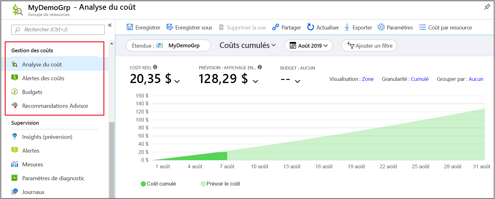
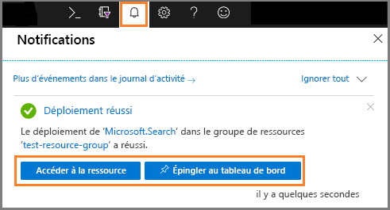
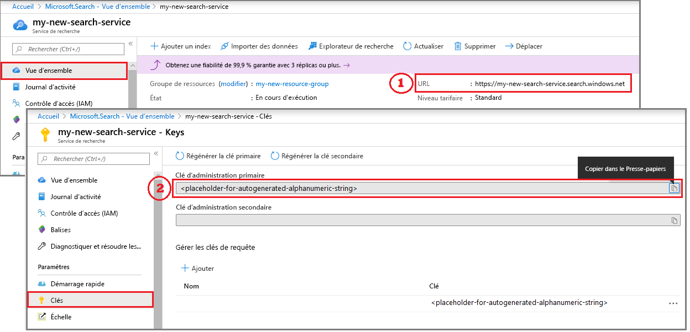

# Démarrage rapide : Création d'un service Azure Search dans le portail

La Recherche Azure est une ressource autonome utilisée pour ajouter une expérience de recherche à des applications personnalisées. Bien que la Recherche Azure s’intègre facilement à de nombreux autres services Azure, vous pouvez également l’utiliser comme un composant autonome. Vous pouvez aussi l’intégrer à des applications situées sur des serveurs réseau ou à des logiciels s’exécutant sur d’autres plateformes cloud.

Dans cet article, découvrez comment créer une ressource de Recherche Azure dans le [portail Microsoft Azure](https://portal.azure.com/).

Vous préférez PowerShell ? Utilisez le [modèle de service](https://azure.microsoft.com/resources/templates/101-azure-search-create/) Azure Resource Manager. Pour obtenir de l’aide et bien démarrer, consultez [Gérer votre service Recherche Azure avec PowerShell](search-manage-powershell.md).

## S’abonner (payant ou gratuit)

[Ouvrez un compte Azure gratuit](https://azure.microsoft.com/pricing/free-trial/?WT.mc_id=A261C142F) et utilisez les crédits gratuits pour essayer les services payants d’Azure. Une fois les crédits épuisés, conservez le compte et continuez à utiliser les services Azure gratuits, tels que les sites Web. Votre carte de crédit n’est pas débitée tant que vous n’avez pas explicitement modifié vos paramètres pour demander à l’être.

Vous pouvez également [activer les avantages d’abonnement MSDN](https://azure.microsoft.com/pricing/member-offers/msdn-benefits-details/?WT.mc_id=A261C142F). Un abonnement MSDN vous donne droit chaque mois à des crédits dont vous pouvez vous servir pour les services Azure payants. 

## Localiser Recherche Azure

1. Connectez-vous au [Portail Azure](https://portal.azure.com/).
2. Cliquez sur le signe plus (« + Créer une ressource ») en haut à gauche.
3. Utilisez la barre de recherche pour rechercher « Recherche Azure », ou accédez à la ressource via **Web** > **Recherche Azure**.

## Sélectionner un abonnement

Si vous avez plusieurs abonnements, choisissez celui qui a également des services de stockage de données ou de fichiers. Recherche Azure peut détecter automatiquement Table Azure, Stockage Blob, SQL Database et Azure Cosmos DB pour l’indexation via des [*indexeurs*](search-indexer-overview.md), mais seulement pour des services dans le même abonnement.

## Définir un groupe de ressources

Un groupe de ressources est nécessaire et utile pour gérer les ressources, y compris la gestion des coûts. Un groupe de ressources peut se composer d’un service ou de plusieurs services utilisés ensemble. Par exemple, si vous utilisez Recherche Azure pour indexer une base de données Azure Cosmos DB, vous pouvez faire en sorte que les deux services fassent partie du même groupe de ressources à des fins de gestion. 

Si vous ne combinez pas des ressources dans un même groupe, ou si les groupes de ressources existants sont remplis de ressources utilisées dans des solutions non liées, créez un autre groupe de ressources spécialement pour votre ressource de Recherche Azure. 

Lorsque vous utilisez le service, vous pouvez effectuer le suivi des coûts actuels et prévus (comme indiqué dans la capture d’écran) ou faire défiler vers le haut pour afficher les frais des différentes ressources.

> [!TIP]
> La suppression d’un groupe de ressources supprime également les services qu’il contient. Pour les projets de prototype utilisant plusieurs services, le fait de les placer tous dans le même groupe de ressources facilite le nettoyage une fois le projet terminé.

## Nommer le service

Dans Détails de l’instance, indiquez un nom de service dans le champ **URL**. Le nom fait partie du point de terminaison URL par le biais duquel les appels d’API sont émis : `https://your-service-name.search.windows.net`. Par exemple, si vous souhaitez que le point de terminaison soit `https://myservice.search.windows.net`, vous devez entrer `myservice`.

Configuration requise du nom du service :

* il doit être unique dans l’espace de noms search.windows.net ;
* entre 2 et 60 caractères ;
* contenir des lettres minuscules, des chiffres ou des tirets (« - ») ;
* éviter les tirets (« - ») pour les 2 premiers caractères ou le dernier ;
* pas de tirets consécutifs (« -- »).

> [!TIP]
> Si vous pensez utiliser plusieurs services, nous vous recommandons d’inclure la région (ou l’emplacement) dans le nom du service comme convention d’affectation de noms. Les services au sein de la même région peuvent échanger des données gratuitement. Ainsi, si Recherche Azure se trouve dans l’ouest des États-Unis et que vous avez d’autres services dans cette région, un nom tel que `mysearchservice-westus` peut vous éviter un passage sur la page Propriétés lorsque vous décidez de la façon dont vous souhaitez associer ou joindre des ressources.

## Choisir un emplacement

En sa qualité de service Azure, Recherche Azure peut être hébergé dans les centres de données du monde entier. Vous trouverez la liste des régions prises en charge dans la [page de tarification](https://azure.microsoft.com/pricing/details/search/). 

Vous pouvez réduire ou éviter les frais de bande passante en choisissant le même emplacement pour plusieurs services. Par exemple, si vous indexez des données fournies par un autre service Azure (Stockage Azure, Azure Cosmos DB, Azure SQL Database), le fait de créer votre service Recherche Azure dans la même région évite les frais liés à la bande passante (il n’y a aucun frais lié aux données sortantes lorsque les services se trouvent dans la même région).

De plus, si vous utilisez des enrichissements IA pour la recherche cognitive, créez votre service dans la même région que votre ressource Cognitive Services. *La colocalisation de la Recherche Azure et de Cognitive Services dans une même région est indispensable à l’enrichissement de l’intelligence artificielle*.

> [!Note]
> Inde Centre est actuellement indisponible pour les nouveaux services. Pour les services déjà dans la région Inde Centre, vous pouvez effectuer un scale-up sans aucune restriction, et votre service est entièrement pris en charge dans cette région. La restriction appliquée à cette région est temporaire et ne concerne que les nouveaux services. Nous supprimerons cette note lorsque la restriction ne s’appliquera plus.

## Sélectionner un niveau tarifaire (SKU)

[Recherche Azure est actuellement disponible dans différents niveaux tarifaires](https://azure.microsoft.com/pricing/details/search/) : Gratuit, De base ou Standard. Chaque niveau a ses propres [capacité et limites](search-limits-quotas-capacity.md). Pour obtenir de l’aide, voir [Choisir un niveau tarifaire ou une référence (SKU)](search-sku-tier.md) .

De base et Standard sont les options les plus courantes pour les charges de production, mais la plupart des clients démarrent avec le service gratuit. Les principales différences entre les niveaux sont la taille et la vitesse des partitions, ainsi que les limites du nombre d’objets que vous pouvez créer.

Nous vous rappelons que vous ne pouvez pas changer de niveau tarifaire une fois le service créé. Si vous souhaitez un niveau plus élevé ou moins élevé, vous devez recréer le service.

## Créer votre service

Une fois que vous avez fourni les entrées nécessaires, continuez et créez le service. 

Votre service est déployé en quelques minutes. Vous pouvez superviser la progression du déploiement en utilisant les notifications Azure. Vous pouvez épingler le service à votre tableau de bord afin d’y accéder plus facilement la prochaine fois.

## Obtenir une clé et un point de terminaison d’URL

Si vous n’utilisez pas le portail, l’accès programmatique à votre nouveau service nécessite de spécifier le point de terminaison d’URL et une clé d’API d’authentification.

1. Dans la page Vue d’ensemble du service, recherchez et copiez le point de terminaison d’URL sur le côté droit de la page.

2. Dans le volet de navigation gauche, sélectionnez **Clés**, puis copiez une des clés d’administrateur (elles sont équivalentes). Les clés d’API d’administrateur sont nécessaires pour la création, la mise à jour et la suppression d’objets sur votre service.

   

Un point de terminaison et une clé ne sont pas nécessaires pour les tâches effectuées via le portail. Le portail est déjà lié à votre ressource Recherche Azure avec des droits d’administrateur. Pour obtenir une procédure pas à pas à effectuer dans le portail, commencez par [Guide de démarrage rapide : Créer un index de Recherche Azure dans le portail](search-get-started-portal.md).

## Mettre à l’échelle le service

Une fois votre service approvisionné, vous pouvez le mettre à l’échelle en fonction de vos besoins. Si vous avez choisi le niveau Standard pour votre service Recherche Azure, vous pouvez le mettre à l’échelle dans deux dimensions : réplicas et partitions. Si vous choisissez le niveau De base, vous pouvez uniquement ajouter des réplicas. Si vous configurez le service gratuit, la mise à l’échelle n’est pas disponible.

Les ***partitions*** permettent à votre service de stocker plus de documents et d’effectuer des recherches dans un plus grand nombre de documents.

Les ***réplicas*** permettent à votre service de gérer une charge supérieure de requêtes de recherche.

L’ajout de ressources augmente votre facture mensuelle. Le [calculatrice de prix](https://azure.microsoft.com/pricing/calculator/) peut vous aider à comprendre les conséquences de l’ajout de ressources pour la facturation. N’oubliez pas que vous pouvez ajuster les ressources en fonction de la charge. Par exemple, vous pouvez augmenter les ressources pour créer un index initial complet, puis les réduire ultérieurement à un niveau plus approprié pour l’indexation incrémentielle.

> [!Important]
> Un service doit avoir [2 réplicas pour SLA en lecture seule et 3 réplicas pour SLA en lecture/écriture](https://azure.microsoft.com/support/legal/sla/search/v1_0/).

1. Accédez à la page du service de recherche dans le portail Azure.
2. Dans le volet de navigation de gauche, sélectionnez **Paramètres** > **Mise à l’échelle**.
3. Utilisez le curseur pour ajouter des ressources de chaque type.

> [!Note]
> Le stockage par partition et la vitesse sont plus élevés dans les niveaux de service supérieurs. Pour plus d’informations, consultez [Capacité et limitations](search-limits-quotas-capacity.md).

## Quand ajouter un deuxième service

La plupart des clients n’utilisent qu’un seul service provisionné à un niveau qui fournit le [bon équilibre des ressources](search-sku-tier.md). Un service peut héberger plusieurs index, soumis aux [limites maximales du niveau sélectionné](search-capacity-planning.md), chaque index étant isolé des autres. Dans la Recherche Azure, les requêtes ne peuvent être dirigées que vers un seul index, ce qui réduit les risques de récupération des données accidentelle ou intentionnelle à partir d’autres index du même service.

Bien que la plupart des clients utilisent un seul service, une redondance des services peut être nécessaire en cas d’exigences opérationnelles particulières, notamment :

* Récupération d’urgence (panne du centre de données). La Recherche Azure ne fournit pas de basculement instantané en cas de panne. Pour obtenir de l’aide et des recommandations, consultez la page [Administration des services](search-manage.md).
* Vos recherches sur la modélisation d’une architecture mutualisée ont déterminé que des services supplémentaires représentent la conception optimale. Pour plus d’informations, consultez la page [Conception pour une architecture mutualisée](search-modeling-multitenant-saas-applications.md).
* Dans le cas d’applications déployées dans le monde entier, vous pouvez avoir besoin de disposer d’une instance de la Recherche Azure dans plusieurs régions afin de réduire la latence du trafic international de votre application.

> [!NOTE]
> Dans Recherche Azure, vous ne pouvez pas séparer les opérations d’indexation et de requête. Par conséquent, il n’est jamais question de créer plusieurs services pour des charges de travail séparées. Un index est toujours interrogé sur le service dans lequel il a été créé (vous ne pouvez pas créer un index dans un service et le copier dans un autre).

Il n’est pas nécessaire de disposer d’un second service pour la haute disponibilité. La haute disponibilité des requêtes est atteinte si vous utilisez au moins deux réplicas dans le même service. Les mises à jour des réplicas sont séquentielles, ce qui signifie qu’au moins l’un d’eux est opérationnel lors du déploiement d’une mise à jour de service. Pour plus d’informations sur la disponibilité, consultez la page [Contrats de niveau de service](https://azure.microsoft.com/support/legal/sla/search/v1_0/).

## Étapes suivantes

Après avoir approvisionné un service Recherche Azure, vous pouvez rester dans le portail et créer votre premier index.

> [!div class="nextstepaction"]
> [Démarrage rapide : Créer un index de Recherche Azure dans le portail](search-get-started-portal.md)
