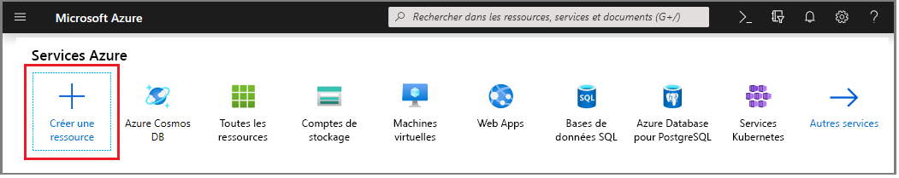
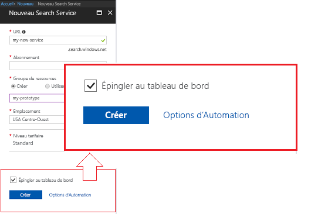
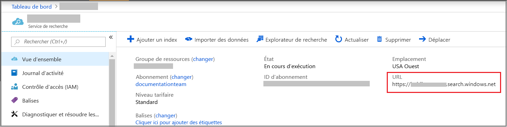
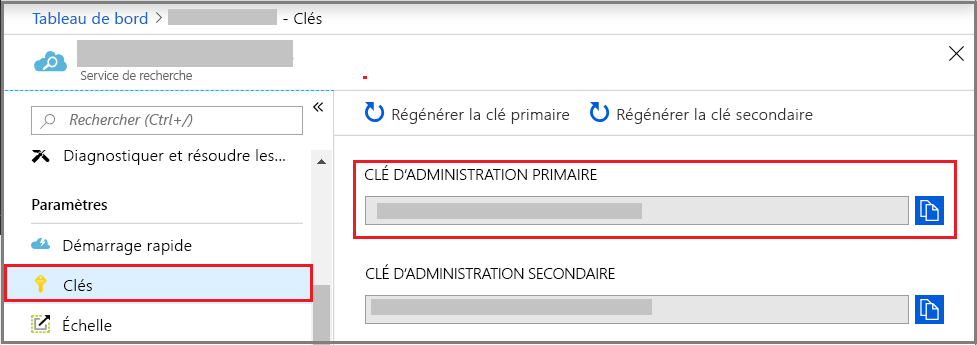
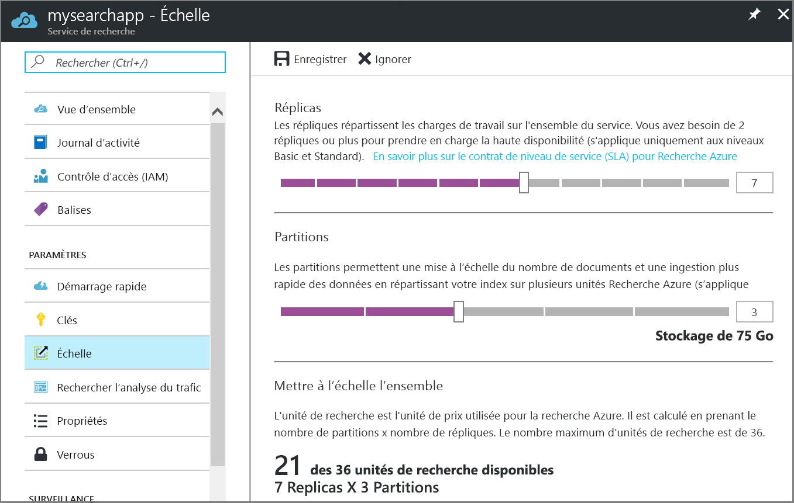

# Création d'un service Azure Search dans le portail

La Recherche Azure est une ressource autonome utilisée pour ajouter une expérience de recherche à des applications personnalisées. Bien que la Recherche Azure s’intègre facilement à de nombreux autres services Azure, vous pouvez également l’utiliser de manière autonome, avec des applications situées sur des serveurs réseau ou avec des logiciels s’exécutant sur d’autres plateformes cloud.

Dans cet article, découvrez comment créer une ressource de Recherche Azure dans le [portail Microsoft Azure](https://portal.azure.com/).

Vous préférez PowerShell ? Utilisez le [modèle de service](https://azure.microsoft.com/resources/templates/101-azure-search-create/) Azure Resource Manager. Pour obtenir de l’aide et bien démarrer, consultez [Gérer votre service Recherche Azure avec PowerShell](search-manage-powershell.md).

## S’abonner (payant ou gratuit)

[Ouvrez un compte Azure gratuit](https://azure.microsoft.com/pricing/free-trial/?WT.mc_id=A261C142F) et utilisez les crédits gratuits pour essayer les services payants d’Azure. Une fois les crédits épuisés, conservez le compte et continuez à utiliser les services Azure gratuits, tels que les sites Web. Votre carte de crédit n’est pas débitée tant que vous n’avez pas explicitement modifié vos paramètres pour demander à l’être.

Vous pouvez également [activer les avantages d’abonnement MSDN](https://azure.microsoft.com/pricing/member-offers/msdn-benefits-details/?WT.mc_id=A261C142F). Un abonnement MSDN vous donne droit chaque mois à des crédits dont vous pouvez vous servir pour les services Azure payants. 

## Localiser Recherche Azure

1. Connectez-vous au [Portail Azure](https://portal.azure.com/).
2. Cliquez sur le signe plus (« + Créer une ressource ») en haut à gauche.
3. Utilisez la barre de recherche pour rechercher « Recherche Azure », ou accédez à la ressource via **Web** > **Recherche Azure**.

## Nommer le service et le point de terminaison URL

Un nom de service fait partie du point de terminaison URL par le biais duquel les appels d’API sont émis : `https://your-service-name.search.windows.net`. Tapez le nom de votre service dans le champ **URL**.

Par exemple, si vous souhaitez que le point de terminaison soit `https://my-app-name-01.search.windows.net`, vous devez entrer `my-app-name-01`.

Configuration requise du nom du service :

* il doit être unique dans l’espace de noms search.windows.net ;
* entre 2 et 60 caractères ;
* contenir des lettres minuscules, des chiffres ou des tirets (« - ») ;
* éviter les tirets (« - ») pour les 2 premiers caractères ou le dernier ;
* pas de tirets consécutifs (« -- »).

## Sélectionner un abonnement

Si vous avez plusieurs abonnements, choisissez celui qui a également des services de stockage de données ou de fichiers. Recherche Azure peut détecter automatiquement Table Azure, Stockage Blob, SQL Database et Azure Cosmos DB pour l’indexation via des [*indexeurs*](search-indexer-overview.md), mais seulement pour des services dans le même abonnement.

## Sélectionner un groupe de ressources

Un groupe de ressources correspond à une collection de services et de ressources Azure utilisés ensemble. Par exemple, si vous utilisez Recherche Azure pour indexer une base de données SQL, ces deux services doivent faire partie du même groupe de ressources.

Si vous ne combinez pas des ressources dans un même groupe, ou si les groupes de ressources existants sont remplis de ressources utilisées dans des solutions non liées, créez un autre groupe de ressources spécialement pour votre ressource de Recherche Azure.

> [!TIP]
> La suppression d’un groupe de ressources supprime également les services qu’il contient. Pour les projets de prototype utilisant plusieurs services, le fait de les placer tous dans le même groupe de ressources facilite le nettoyage une fois le projet terminé.

## Sélectionner un emplacement

En sa qualité de service Azure, Recherche Azure peut être hébergé dans les centres de données du monde entier. Vous trouverez la liste des régions prises en charge dans la [page de tarification](https://azure.microsoft.com/pricing/details/search/). 

Si vous indexez des données fournies par un autre service Azure (Stockage Azure, Azure Cosmos DB, Azure SQL Database), nous vous recommandons de créer votre service Recherche Azure dans la même région pour éviter les frais liés à la bande passante. Il n’y a aucuns frais liés aux données sortantes lorsque les services se trouvent dans la même région.

Si vous utilisez des enrichissements IA pour la recherche cognitive, créez votre service dans la même région que votre ressource Cognitive Services. La colocalisation de services est une exigence pour un enrichissement IA.

> [!Note]
> Inde Centre est actuellement indisponible pour les nouveaux services. Pour les services déjà dans la région Inde Centre, vous pouvez effectuer un scale-up sans aucune restriction, et votre service est entièrement pris en charge dans cette région. La restriction sur cette région est temporaire et nous supprimerons cette remarque dès qu’elle ne sera plus d’application.

## Sélectionner un niveau de tarification (SKU)

[Recherche Azure est actuellement disponible dans différents niveaux tarifaires](https://azure.microsoft.com/pricing/details/search/) : Gratuit, De base ou Standard. Chaque niveau a ses propres [capacité et limites](search-limits-quotas-capacity.md). Pour obtenir de l’aide, voir [Choisir un niveau tarifaire ou une référence (SKU)](search-sku-tier.md) .

Standard est généralement choisi pour les charges de production, mais la plupart des clients démarrent avec le service gratuit.

Vous ne pouvez pas changer de niveau tarifaire une fois le service créé. Si vous souhaitez un niveau plus élevé ou moins élevé, vous devez recréer le service.

## Créer votre service

N’oubliez pas d’épingler votre service au tableau de bord pour y accéder facilement à chaque fois que vous vous connectez.

## Obtenir une clé et un point de terminaison d’URL

À quelques exceptions près, l’utilisation de votre nouveau service nécessite de spécifier le point de terminaison d’URL et une clé d’API d’autorisation. Les démarrages rapides, les tutoriels comme [Explorer les API REST de Recherche Azure (Postman)](search-get-started-postman.md) et [Guide pratique pour utiliser Recherche Azure à partir de .NET](search-howto-dotnet-sdk.md), les exemples et le code personnalisé ont tous besoin d’un point de terminaison et d’une clé pour s’exécuter sur votre ressource particulière.

1. Dans la page Vue d’ensemble du service, recherchez et copiez le point de terminaison d’URL sur le côté droit de la page.

   

2. Dans le volet de navigation gauche, sélectionnez **Clés**, puis copiez une des clés d’administrateur (elles sont équivalentes). Les clés d’API d’administrateur sont nécessaires pour la création, la mise à jour et la suppression d’objets sur votre service.

   

Un point de terminaison et une clé ne sont pas nécessaires pour les tâches effectuées via le portail. Le portail est déjà lié à votre ressource Recherche Azure avec des droits d’administrateur. Pour un tutoriel sur le portail, commencez par [Tutoriel : Importer, indexer et interroger dans Recherche Azure](search-get-started-portal.md).

## Mettre à l’échelle le service

La création d’un service peut prendre plusieurs minutes (15 minutes ou plus selon le niveau). Une fois votre service approvisionné, vous pouvez le mettre à l’échelle en fonction de vos besoins. Comme vous avez choisi le niveau Standard pour votre service Azure Search, vous pouvez le mettre à l’échelle dans deux dimensions : réplicas et partitions. Si vous choisissez le niveau De base, vous pouvez uniquement ajouter des réplicas. Si vous configurez le service gratuit, la mise à l’échelle n’est pas disponible.

Les ***partitions*** permettent à votre service de stocker plus de documents et d’effectuer des recherches dans un plus grand nombre de documents.

Les ***réplicas*** permettent à votre service de gérer une charge supérieure de requêtes de recherche.

L’ajout de ressources augmente votre facture mensuelle. Le [calculatrice de prix](https://azure.microsoft.com/pricing/calculator/) peut vous aider à comprendre les conséquences de l’ajout de ressources pour la facturation. N’oubliez pas que vous pouvez ajuster les ressources en fonction de la charge. Par exemple, vous pouvez augmenter les ressources pour créer un index initial complet, puis les réduire ultérieurement à un niveau plus approprié pour l’indexation incrémentielle.

> [!Important]
> Un service doit avoir [2 réplicas pour SLA en lecture seule et 3 réplicas pour SLA en lecture/écriture](https://azure.microsoft.com/support/legal/sla/search/v1_0/).

1. Accédez à la page du service de recherche dans le portail Azure.
2. Dans le volet de navigation de gauche, sélectionnez **Paramètres** > **Mise à l’échelle**.
3. Utilisez le curseur pour ajouter des ressources de chaque type.

> [!Note]
> Chaque niveau a des [limites](search-limits-quotas-capacity.md) différentes quant au nombre total d’unités de recherche autorisées dans un même service (replicas * partitions = nombre total d’unités de recherche).

## Quand ajouter un deuxième service

La plupart des clients n’utilisent qu’un seul service provisionné à un niveau qui fournit le [bon équilibre des ressources](search-sku-tier.md). Un service peut héberger plusieurs index, soumis aux [limites maximales du niveau sélectionné](search-capacity-planning.md), chaque index étant isolé des autres. Dans la Recherche Azure, les requêtes ne peuvent être dirigées que vers un seul index, ce qui réduit les risques de récupération des données accidentelle ou intentionnelle à partir d’autres index du même service.

Bien que la plupart des clients utilisent un seul service, une redondance des services peut être nécessaire en cas d’exigences opérationnelles particulières, notamment :

* Récupération d’urgence (panne du centre de données). La Recherche Azure ne fournit pas de basculement instantané en cas de panne. Pour obtenir de l’aide et des recommandations, consultez la page [Administration des services](search-manage.md).
* Vos recherches sur la modélisation d’une architecture mutualisée ont déterminé que des services supplémentaires représentent la conception optimale. Pour plus d’informations, consultez la page [Conception pour une architecture mutualisée](search-modeling-multitenant-saas-applications.md).
* Dans le cas d’applications déployées dans le monde entier, vous pouvez avoir besoin de disposer d’une instance de la Recherche Azure dans plusieurs régions afin de réduire la latence du trafic international de votre application.

> [!NOTE]
> Dans la Recherche Azure, vous ne pouvez pas séparer les charges de travail d’indexation et de requête ; par conséquent, il n’est jamais question de créer plusieurs services pour des charges de travail séparées. Un index est toujours interrogé sur le service dans lequel il a été créé (vous ne pouvez pas créer un index dans un service et le copier dans un autre).

Il n’est pas nécessaire de disposer d’un second service pour la haute disponibilité. La haute disponibilité des requêtes est atteinte si vous utilisez au moins deux réplicas dans le même service. Les mises à jour des réplicas sont séquentielles, ce qui signifie qu’au moins l’un d’eux est opérationnel lors du déploiement d’une mise à jour de service. Pour plus d’informations sur la disponibilité, consultez la page [Contrats de niveau de service](https://azure.microsoft.com/support/legal/sla/search/v1_0/).

## Étapes suivantes

Après avoir approvisionné un service Recherche Azure, vous pouvez rester dans le portail et créer votre premier index.

> [!div class="nextstepaction"]
> [Tutoriel : importer des données, indexer et exécuter des requêtes dans le portail](search-get-started-portal.md)
