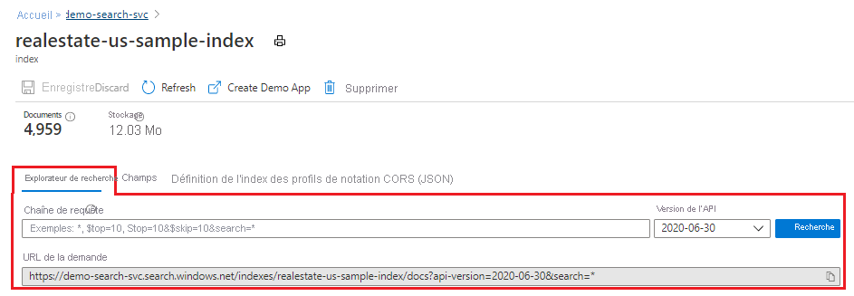
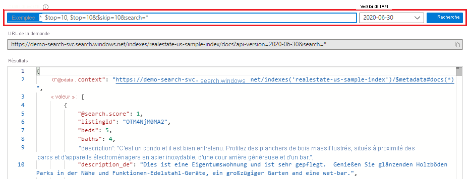
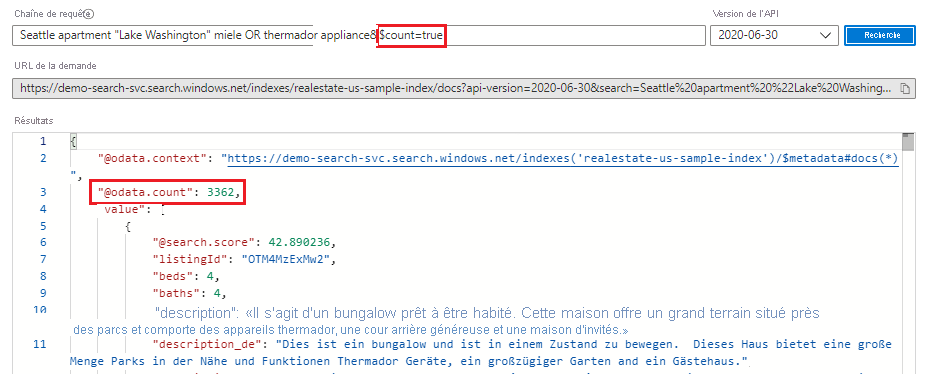
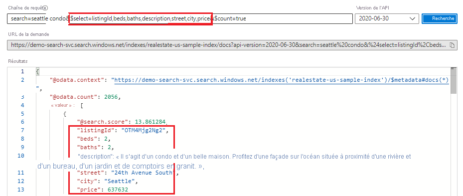
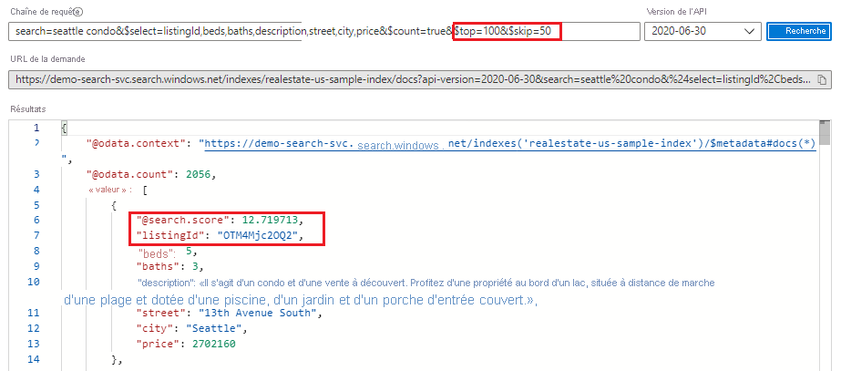
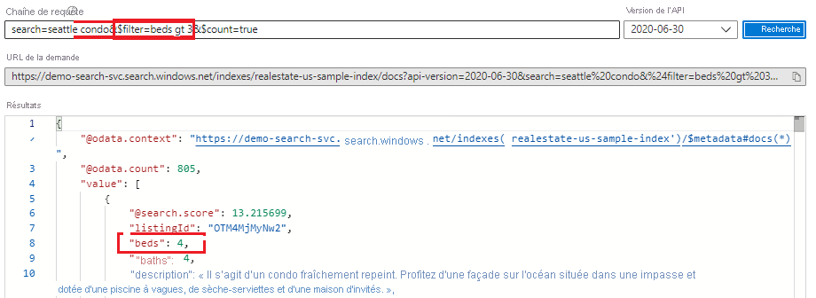
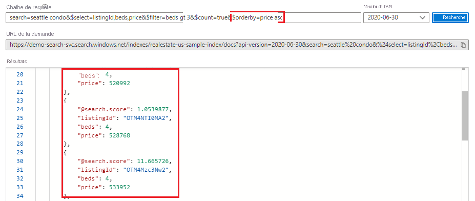

# <a name="quickstart-use-search-explorer-to-run-queries-in-the-portal"></a>Démarrage rapide : Utiliser l’Explorateur de recherche pour exécuter des requêtes dans le portail

**L’Explorateur de recherche** est un outil de requête intégré utilisé pour exécuter des requêtes sur un index de recherche dans Recherche cognitive Azure. Cet outil facilite l’apprentissage de la syntaxe des requêtes, le test d’une requête ou d’une expression de filtre, ou la confirmation de l’actualisation des données en vérifiant si du nouveau contenu existe dans l’index.

Ce guide de démarrage rapide utilise un index existant pour illustrer l’explorateur de recherche. Les requêtes sont formulées à l’aide de [l’API REST Search](/rest/api/searchservice/), avec les réponses retournées sous forme de documents JSON.

## <a name="prerequisites"></a>Prérequis

Avant de commencer la lecture cet article, vous devez disposer des éléments suivants :

+ Compte Azure avec un abonnement actif. [Créez un compte gratuitement](https://azure.microsoft.com/free/).

+ Service Recherche cognitive Azure. [Créez un service](search-create-service-portal.md) ou [recherchez un service existant](https://ms.portal.azure.com/#blade/HubsExtension/BrowseResourceBlade/resourceType/Microsoft.Search%2FsearchServices) dans votre abonnement actuel. Vous pouvez utiliser un service gratuit pour ce guide de démarrage rapide. 

+ *realestate-us-sample-index* est utilisé pour ce guide de démarrage rapide. Utilisez l’Assistant [**Importer des données**](search-import-data-portal.md) pour créer l’index. Dans la première étape, lorsque vous êtes invité à entrer la source de données, choisissez **Exemples** puis sélectionnez la source de données **realestate-us-sample**. Acceptez tous les paramètres par défaut de l’Assistant pour créer l’index.

## <a name="start-search-explorer"></a>Démarrer l’Explorateur de recherche

1. Dans le [portail Azure](https://portal.azure.com), ouvrez la page du service de recherche à partir du tableau de bord, ou [recherchez votre service](https://ms.portal.azure.com/#blade/HubsExtension/BrowseResourceBlade/resourceType/Microsoft.Search%2FsearchServices).

1. Ouvrez l’Explorateur de recherche dans la barre de commandes :

   

    Ou utilisez l’onglet **Explorateur de recherche** intégré sur un index ouvert :

   

## <a name="unspecified-query"></a>Requête non spécifiée

Pour un premier aperçu du contenu, exécutez une recherche vide en cliquant sur **Rechercher** sans indiquer de termes. Une recherche vide est utile en tant que première requête, car elle renvoie des documents entiers pour vous permettre d'examiner leur composition. Une recherche vide ne présente aucun classement et les documents sont renvoyés dans une ordre arbitraire (`"@search.score": 1` pour tous les documents). Par défaut, 50 documents sont renvoyés dans une requête de recherche.

La syntaxe équivalente d'une recherche vide est `*` ou `search=*`.
   
   ```http
   search=*
   ```

   **Résultats**
   
   

## <a name="free-text-search"></a>Recherche en texte libre

Les requêtes de forme libre, avec ou sans opérateurs, permettent de simuler les requêtes définies par l’utilisateur envoyées à partir d’une application personnalisée vers la Recherche cognitive Azure. Seuls les champs attribués en tant que **Recherche possible** dans la définition de l’index sont analysés pour rechercher les correspondances. 

Notez que lorsque vous indiquez des critères de recherche, comme des termes ou expressions de requête, le classement de la recherche intervient. L'exemple suivant illustre une recherche de texte libre.

   ```http
   Seattle apartment "Lake Washington" miele OR thermador appliance
   ```

   **Résultats**

   Vous pouvez utiliser Ctrl+F pour rechercher des termes spécifiques dans les résultats.

   

## <a name="count-of-matching-documents"></a>Nombre de documents correspondants 

Ajoutez **$count=true** pour obtenir le nombre de correspondances trouvées dans un index. Dans une recherche vide, ce nombre correspond au nombre total de documents dans l’index. Dans une recherche qualifiée, il correspond au nombre de documents correspondant à l’entrée de requête.

   ```http
   $count=true
   ```

   **Résultats**

   

## <a name="limit-fields-in-search-results"></a>Limiter les champs dans les résultats de la recherche

Ajoutez [ **$select**](search-query-odata-select.md) pour limiter les résultats aux champs explicitement nommés et disposer d’une sortie plus lisible dans **l’Explorateur de recherche**. Pour conserver la chaîne de recherche et **$count = true**, faites précéder les arguments de **&** . 

   ```http
   search=seattle condo&$select=listingId,beds,baths,description,street,city,price&$count=true
   ```

   **Résultats**

   

## <a name="return-next-batch-of-results"></a>Retourner le jeu de résultats suivant

La Recherche cognitive Azure retourne les 50 premières correspondances selon le classement de la recherche. Pour obtenir le jeu de documents correspondants suivant, ajoutez **$top = 100 & $skip = 50** afin d'augmenter le jeu de résultats à 100 documents (50 par défaut, 1 000 maximum), en ignorant les 50 premiers documents. N'oubliez pas qu'il vous faut fournir des critères de recherche, terme ou expression de requête, pour obtenir des résultats classés. Notez que les scores de recherche diminuent au fil des résultats de la recherche.

   ```http
   search=seattle condo&$select=listingId,beds,baths,description,street,city,price&$count=true&$top=100&$skip=50
   ```

   **Résultats**

   

## <a name="filter-expressions-greater-than-less-than-equal-to"></a>Filtrer les expressions (supérieur à, inférieur à, égal à)

Utilisez le paramètre [ **$filter**](search-query-odata-filter.md) lorsque vous souhaitez spécifier des critères précis plutôt qu’une recherche de texte libre. Le champ doit être attribué comme **Filtrable** dans l’index. Cet exemple recherche plus de 3 chambres :

   ```http
   search=seattle condo&$filter=beds gt 3&$count=true
   ```
   
   **Résultats**

   

## <a name="order-by-expressions"></a>Expressions OrderBy

Ajoutez [ **$orderby**](search-query-odata-orderby.md) pour trier les résultats selon un autre champ, à côté du score de recherche. Le champ doit être attribué comme **Triable** dans l’index. Pour le tester, vous pouvez utiliser l'exemple d'expression suivant :

   ```http
   search=seattle condo&$select=listingId,beds,price&$filter=beds gt 3&$count=true&$orderby=price asc
   ```
   
   **Résultats**

   

Les expressions **$filter** et **$orderby** sont des constructions OData. Pour plus d’informations, consultez l’article [Filter OData syntax](/rest/api/searchservice/odata-expression-syntax-for-azure-search) (Syntaxe d’expression de filtre OData).

<a name="start-search-explorer"></a>

## <a name="takeaways"></a>Éléments importants à retenir

Dans ce guide de démarrage rapide, vous avez utilisé **l’Explorateur de recherche** pour interroger un index à l’aide de l’API REST.

+ Les résultats sont renvoyés sous forme de documents JSON détaillés afin de vous permettre de les consulter dans leur intégralité. Vous pouvez utiliser des expressions de requête, comme indiqué dans les exemples, pour limiter les champs renvoyés.

+ Les documents sont composés de tous les champs marqués comme **récupérables** dans l’index. Pour visualiser les attributs d’index dans le portail, cliquez sur *realestate-us-sample* dans la liste **Index** de la page de vue d'ensemble de la recherche.

+ Les requêtes de forme libre, semblables à celles que vous entrez dans un navigateur web commercial, permettent de tester une expérience d'utilisateur final. Par exemple, dans le cas de l'exemple d'index realestate intégré, vous pourriez entrer « Seattle apartments lake washington », puis utiliser Ctrl+F pour rechercher des termes dans les résultats de la recherche. 

+ Les expressions de requête et de filtre sont articulées dans une syntaxe prise en charge par la Recherche cognitive Azure. Par défaut, cela correspond à une [syntaxe simple](/rest/api/searchservice/simple-query-syntax-in-azure-search), mais vous pouvez également utiliser [Lucene complète](/rest/api/searchservice/lucene-query-syntax-in-azure-search) pour de plus puissantes requêtes. Les [expressions de filtre](/rest/api/searchservice/odata-expression-syntax-for-azure-search) présentent une syntaxe OData.

## <a name="clean-up-resources"></a>Nettoyer les ressources

Lorsque vous travaillez dans votre propre abonnement, il est recommandé, à la fin de chaque projet, de déterminer si vous avez toujours besoin des ressources que vous avez créées. Les ressources laissées en cours d’exécution peuvent vous coûter de l’argent. Vous pouvez supprimer les ressources une par une, ou choisir de supprimer le groupe de ressources afin de supprimer l’ensemble des ressources.

Vous pouvez rechercher et gérer les ressources dans le portail à l’aide des liens **Toutes les ressources** ou **Groupes de ressources** situés dans le volet de navigation de gauche.

Si vous utilisez un service gratuit, n’oubliez pas que vous êtes limité à trois index, indexeurs et sources de données. Vous pouvez supprimer des éléments un par un dans le portail pour ne pas dépasser la limite. 

## <a name="next-steps"></a>Étapes suivantes

Pour en savoir plus sur la syntaxe et les structures des requêtes, utilisez Postman ou un outil équivalent pour créer des expressions de requête qui utilisent d’autres parties de l’API. [L’API REST Recherche](/rest/api/searchservice/) est particulièrement utile pour l’apprentissage et l’exploration.

> [!div class="nextstepaction"]
> [Créer une requête de base dans Postman](search-query-simple-examples.md)