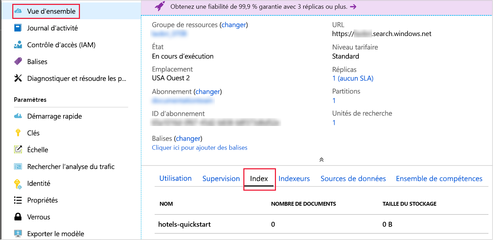

# <a name="quickstart-create-an-azure-cognitive-search-index-in-nodejs-using-rest-apis"></a>Démarrage rapide : Créer un index Recherche cognitive Azure dans Node.js à l’aide des API REST
> [!div class="op_single_selector"]
> * [JavaScript](search-get-started-nodejs.md)
> * [C#](search-get-started-dotnet.md)
> * [Portal](search-get-started-portal.md)
> * [PowerShell](search-create-index-rest-api.md)
> * [Python](search-get-started-python.md)
> * [Postman](search-get-started-postman.md)

Créez une application Node.js qui crée, charge et interroge un index Recherche cognitive Azure. Cet article explique comment créer l’application pas à pas. Vous pouvez également [télécharger le code source et les données](https://github.com/Azure-Samples/azure-search-javascript-samples/tree/master/quickstart/), puis exécuter l’application à partir de la ligne de commande.

Si vous n’avez pas d’abonnement Azure, créez un [compte gratuit](https://azure.microsoft.com/free/?WT.mc_id=A261C142F) avant de commencer.

## <a name="prerequisites"></a>Prérequis

Voici les services, outils et données utilisés dans ce guide de démarrage rapide.

+ [Node.js](https://nodejs.org).
+ [NPM](https://www.npmjs.com) doit être installé par Node.js.
+ Des exemples de structure d’index et de documents correspondants sont fournis dans cet article, ou à partir du répertoire [**Démarrage rapide** du référentiel](https://github.com/Azure-Samples/azure-search-javascript-samples/).
+ [Créez un service Recherche cognitive Azure](search-create-service-portal.md) ou [recherchez un service existant](https://ms.portal.azure.com/#blade/HubsExtension/BrowseResourceBlade/resourceType/Microsoft.Search%2FsearchServices) dans votre abonnement actuel. Vous pouvez utiliser un service gratuit pour ce guide de démarrage rapide.

Recommandé :

* [Visual Studio Code](https://code.visualstudio.com).
* Extensions [Prettier](https://marketplace.visualstudio.com/items?itemName=esbenp.prettier-vscode) et [ESLint](https://marketplace.visualstudio.com/items?itemName=dbaeumer.vscode-eslint) pour VSCode.

<a name="get-service-info"></a>
## <a name="get-keys-and-urls"></a>Obtenir des clés et des URL

Les appels au service nécessitent un point de terminaison d’URL et une clé d’accès pour chaque requête. Un service de recherche est créé avec les deux. Ainsi, si vous avez ajouté la Recherche cognitive Azure à votre abonnement, effectuez ce qui suit pour obtenir les informations nécessaires :

1. [Connectez-vous au Portail Azure](https://portal.azure.com/), puis dans la page **Vue d’ensemble** du service de recherche, récupérez le nom de votre service de recherche. Vous pouvez confirmer le nom de votre service en passant en revue l’URL du point de terminaison. Si votre URL de point de terminaison est `https://mydemo.search.windows.net`, le nom du service doit être `mydemo`.

2. Dans **Paramètres** > **Clés**, obtenez une clé d’administration pour avoir des droits d’accès complets sur le service. Il existe deux clés d’administration interchangeables, fournies pour assurer la continuité de l’activité au cas où vous deviez en remplacer une. Vous pouvez utiliser la clé primaire ou secondaire sur les demandes d’ajout, de modification et de suppression d’objets.

    Obtenez aussi la clé de requête. Il est recommandé d’émettre des demandes de requête avec un accès en lecture seule.


Une clé API est nécessaire dans l’en-tête de chaque requête envoyée à votre service. Une clé valide permet d’établir, en fonction de chaque demande, une relation de confiance entre l’application qui envoie la demande et le service qui en assure le traitement.

## <a name="set-up-your-environment"></a>Configurer votre environnement

Commencez par ouvrir une console PowerShell ou un autre environnement dans lequel vous avez installé Node.js.

1. Créez un répertoire de développement, que vous appellerez `quickstart` :

    ```powershell
    mkdir quickstart
    cd quickstart
    ```

2. Initialisez un projet vide avec NPM en exécutant `npm init`. Acceptez les valeurs par défaut, sauf pour la licence, que vous devez définir sur « MIT ». 

1. Ajoutez des packages qui seront dépendants du code et faciliteront le développement :

    ```powershell
    npm install nconf node-fetch
    npm install --save-dev eslint eslint-config-prettier eslint-config-airbnb-base eslint-plugin-import prettier
    ```

4. Confirmez que vous avez configuré les projets et leurs dépendances en vérifiant que votre fichier **package.json** ressemble à ce qui suit :

    ```json
    {
      "name": "quickstart",
      "version": "1.0.0",
      "description": "Azure Cognitive Search Quickstart",
      "main": "index.js",
      "scripts": {
        "test": "echo \"Error: no test specified\" && exit 1"
      },
      "keywords": [
        "Azure",
        "Azure_Search"
      ],
      "author": "Your Name",
      "license": "MIT",
      "dependencies": {
        "nconf": "^0.10.0",
        "node-fetch": "^2.6.0"
      },
      "devDependencies": {
        "eslint": "^6.1.0",
        "eslint-config-airbnb-base": "^13.2.0",
        "eslint-config-prettier": "^6.0.0",
        "eslint-plugin-import": "^2.18.2",
        "prettier": "^1.18.2"
      }
    }
    ```
Créez un fichier **azure_search_config.json** pour stocker les données de votre service de recherche :

```json
{
    "serviceName" : "[SERVICE_NAME]",
    "adminKey" : "[ADMIN_KEY]",
    "queryKey" : "[QUERY_KEY]",
    "indexName" : "hotels-quickstart"
}
```

Remplacez la valeur `[SERVICE_NAME]` par le nom de votre service de recherche. Remplacez `[ADMIN_KEY]` et `[QUERY_KEY]` par les valeurs de clé que vous avez enregistrées précédemment. 

## <a name="1---create-index"></a>1 - Créer un index 

Créez un fichier **hotels_quickstart_index.json**.  Ce fichier définit le fonctionnement de la Recherche cognitive Azure avec les documents que vous allez charger à l’étape suivante. Chaque champ est identifié par un `name` et a un `type` spécifié. Chaque champ contient également une série d’attributs d’index qui spécifient si la Recherche cognitive Azure peut effectuer des opérations de recherche, de tri, de filtrage et de définition de facettes sur le champ. La plupart des champs sont des types de données simples, mais certains, comme `AddressType`, sont des types complexes qui vous permettent de créer des structures de données riches dans votre index.  Vous pouvez en savoir plus sur les [types de données pris en charge](https://docs.microsoft.com/rest/api/searchservice/supported-data-types) et les [attributs d’index](https://docs.microsoft.com/azure/search/search-what-is-an-index#index-attributes). 

Ajoutez l’élément suivant à **hotels_quickstart_index.json** ou [téléchargez le fichier](https://github.com/Azure-Samples/azure-search-javascript-samples/blob/master/quickstart/hotels_quickstart_index.json). 

```json
{
    "name": "hotels-quickstart",
    "fields": [
        {
            "name": "HotelId",
            "type": "Edm.String",
            "key": true,
            "filterable": true
        },
        {
            "name": "HotelName",
            "type": "Edm.String",
            "searchable": true,
            "filterable": false,
            "sortable": true,
            "facetable": false
        },
        {
            "name": "Description",
            "type": "Edm.String",
            "searchable": true,
            "filterable": false,
            "sortable": false,
            "facetable": false,
            "analyzer": "en.lucene"
        },
        {
            "name": "Description_fr",
            "type": "Edm.String",
            "searchable": true,
            "filterable": false,
            "sortable": false,
            "facetable": false,
            "analyzer": "fr.lucene"
        },
        {
            "name": "Category",
            "type": "Edm.String",
            "searchable": true,
            "filterable": true,
            "sortable": true,
            "facetable": true
        },
        {
            "name": "Tags",
            "type": "Collection(Edm.String)",
            "searchable": true,
            "filterable": true,
            "sortable": false,
            "facetable": true
        },
        {
            "name": "ParkingIncluded",
            "type": "Edm.Boolean",
            "filterable": true,
            "sortable": true,
            "facetable": true
        },
        {
            "name": "LastRenovationDate",
            "type": "Edm.DateTimeOffset",
            "filterable": true,
            "sortable": true,
            "facetable": true
        },
        {
            "name": "Rating",
            "type": "Edm.Double",
            "filterable": true,
            "sortable": true,
            "facetable": true
        },
        {
            "name": "Address",
            "type": "Edm.ComplexType",
            "fields": [
                {
                    "name": "StreetAddress",
                    "type": "Edm.String",
                    "filterable": false,
                    "sortable": false,
                    "facetable": false,
                    "searchable": true
                },
                {
                    "name": "City",
                    "type": "Edm.String",
                    "searchable": true,
                    "filterable": true,
                    "sortable": true,
                    "facetable": true
                },
                {
                    "name": "StateProvince",
                    "type": "Edm.String",
                    "searchable": true,
                    "filterable": true,
                    "sortable": true,
                    "facetable": true
                },
                {
                    "name": "PostalCode",
                    "type": "Edm.String",
                    "searchable": true,
                    "filterable": true,
                    "sortable": true,
                    "facetable": true
                },
                {
                    "name": "Country",
                    "type": "Edm.String",
                    "searchable": true,
                    "filterable": true,
                    "sortable": true,
                    "facetable": true
                }
            ]
        }
    ],
    "suggesters": [
        {
            "name": "sg",
            "searchMode": "analyzingInfixMatching",
            "sourceFields": [
                "HotelName"
            ]
        }
    ]
}
```
    

Il est recommandé de distinguer les spécificités d’un scénario particulier du code qui seront largement applicables. La classe `AzureSearchClient` définie dans le fichier **AzureSearchClient.js** saura comment construire des URL de requête, effectuer une requête à l’aide de l’API Fetch et réagir au code d’état de la réponse.

Commencez à travailler sur le fichier **AzureSearchClient.js** en important le package **node-fetch** et en créant une classe simple. Isolez les parties modifiables de la classe `AzureSearchClient` en transmettant les différentes valeurs de configuration à son constructeur :

```javascript
const fetch = require('node-fetch');

class AzureSearchClient {
    constructor(searchServiceName, adminKey, queryKey, indexName) {
        this.searchServiceName = searchServiceName;
        this.adminKey = adminKey;
        // The query key is used for read-only requests and so can be distributed with less risk of abuse.
        this.queryKey = queryKey;
        this.indexName = indexName;
        this.apiVersion = '2019-05-06';
    }

    // All methods go inside class body here!
}

module.exports = AzureSearchClient;
```

La première responsabilité de la classe est de savoir comment construire des URL auxquelles envoyer les diverses requêtes. Générez ces URL avec des méthodes d’instance qui utilisent les données de configuration transmises au constructeur de classe. Notez que l’URL qu’elles construisent est spécifique à une version de l’API et doit disposer d’un argument spécifiant cette version (`2019-05-06` dans cette application). 

La première de ces méthodes retourne l’URL de l’index lui-même. Ajoutez la méthode suivante à l’intérieur du corps de votre classe :

```javascript
getIndexUrl() { return `https://${this.searchServiceName}.search.windows.net/indexes/${this.indexName}?api-version=${this.apiVersion}`; }

```

La responsabilité suivante de `AzureSearchClient` consiste à effectuer une requête asynchrone avec l’API Fetch. La méthode statique asynchrone `request` utilise une URL, une chaîne spécifiant la méthode HTTP (« GET », « PUT », « POST », « DELETE »), la clé à utiliser dans la requête et un objet JSON facultatif. La variable `headers` mappe la `queryKey` (la clé d’administration ou la clé de requête en lecture seule) à l’en-tête de requête HTTP « api-key ». Les options de requête contiennent toujours le `method` à utiliser et le `headers`. Si `bodyJson` n’est pas `null`, le corps de la requête HTTP est défini sur la représentation de chaîne de `bodyJson`. La méthode `request` retourne la promesse de l’API Fetch d’exécuter la requête HTTP.

```javascript
static async request(url, method, apiKey, bodyJson = null) {
    // Uncomment the following for request details:
    /*
    console.log(`\n${method} ${url}`);
    console.log(`\nKey ${apiKey}`);
    if (bodyJson !== null) {
        console.log(`\ncontent: ${JSON.stringify(bodyJson, null, 4)}`);
    }
    */

    const headers = {
        'content-type' : 'application/json',
        'api-key' : apiKey
    };
    const init = bodyJson === null ?
        { 
            method, 
            headers
        }
        : 
        {
            method, 
            headers,
            body : JSON.stringify(bodyJson)
        };
    return fetch(url, init);
}
```

À des fins de démonstration, levez une exception si la requête HTTP n’est pas un succès. Dans une application réelle, vous effectuerez probablement une journalisation et un diagnostic du code d’état HTTP dans le `response` à partir de la requête du service de recherche. 
    
```javascript
static throwOnHttpError(response) {
    const statusCode = response.status;
    if (statusCode >= 300){
        console.log(`Request failed: ${JSON.stringify(response, null, 4)}`);
        throw new Error(`Failure in request. HTTP Status was ${statusCode}`);
    }
}
```

Enfin, ajoutez les méthodes permettant de détecter, supprimer et créer l’index Recherche cognitive Azure. Ces méthodes ont toutes la même structure :

* Obtenir le point de terminaison auquel la requête sera envoyée.
* Générez la requête avec le point de terminaison, le verbe HTTP, la clé d’API appropriés, et, le cas échéant, un corps JSON. `indexExistsAsync()` et `deleteIndexAsync()` n’ont pas de corps JSON, contrairement à `createIndexAsync(definition)`.
* `await` la réponse à la requête.  
* Action sur le code d’état de la réponse.
* Retourne la promesse d’une valeur appropriée (une valeur booléenne, `this`, ou les résultats de la requête). 

```javascript
async indexExistsAsync() { 
    console.log("\n Checking if index exists...");
    const endpoint = this.getIndexUrl();
    const response = await AzureSearchClient.request(endpoint, "GET", this.adminKey);
    // Success has a few likely status codes: 200 or 204 (No Content), but accept all in 200 range...
    const exists = response.status >= 200 && response.status < 300;
    return exists;
}

async deleteIndexAsync() {
    console.log("\n Deleting existing index...");
    const endpoint = this.getIndexUrl();
    const response = await AzureSearchClient.request(endpoint, "DELETE", this.adminKey);
    AzureSearchClient.throwOnHttpError(response);
    return this;
}

async createIndexAsync(definition) {
    console.log("\n Creating index...");
    const endpoint = this.getIndexUrl();
    const response = await AzureSearchClient.request(endpoint, "PUT", this.adminKey, definition);
    AzureSearchClient.throwOnHttpError(response);
    return this;
}
```

Confirmez que vos méthodes sont contenues dans la classe et que vous exportez la classe. L’étendue la plus à l’extérieur de **AzureSearchClient.js** doit être :

```javascript
const fetch = require('node-fetch');

class AzureSearchClient {
    // ... code here ...
}

module.exports = AzureSearchClient;
```

Une classe orientée objet représente un bon choix pour le module **AzureSearchClient.js** potentiellement réutilisable, mais n’est pas nécessaire pour le programme principal, que vous devez placer dans un fichier nommé **index.js**. 

Créez **index.js** et commencez en introduisant :

* Le package **nconf**, qui vous offre la possibilité de spécifier la configuration avec JSON, les variables d’environnement ou les arguments de ligne de commande.
* Les données du fichier **hotels_quickstart_index.json**.
* Le module `AzureSearchClient`.

```javascript
const nconf = require('nconf');

const indexDefinition = require('./hotels_quickstart_index.json');
const AzureSearchClient = require('./AzureSearchClient.js');
```

Le [package **nconf**](https://github.com/indexzero/nconf) permet de spécifier des données de configuration dans différents formats, tels que des variables d’environnement ou la ligne de commande. Cet exemple utilise **nconf** de manière simple pour lire le fichier **azure_search_config.json** et retourner le contenu de ce fichier sous la forme d’un dictionnaire. À l’aide de la fonction `get(key)` de **nconf**, vous pouvez vérifier rapidement que les informations de configuration ont été correctement personnalisées. Enfin, la fonction retourne la configuration :

```javascript
function getAzureConfiguration() {
    const config = nconf.file({ file: 'azure_search_config.json' });
    if (config.get('serviceName') === '[SEARCH_SERVICE_NAME' ) {
        throw new Error("You have not set the values in your azure_search_config.json file. Change them to match your search service's values.");
    }
    return config;
}
```

La fonction `sleep` crée un `Promise` qui se résout après un laps de temps spécifié. L’utilisation de cette fonction permet à l’application de s’interrompre en attendant que les opérations d’index asynchrones se terminent et deviennent disponibles. L’ajout d’un délai n’est nécessaire que dans les démonstrations, les tests et les exemples d’applications.

```javascript
function sleep(ms) {
    return(
        new Promise(function(resolve, reject) {
            setTimeout(function() { resolve(); }, ms);
        })
    );
}
```

Enfin, spécifiez et appelez la fonction `run` asynchrone principale. Cette fonction appelle les autres fonctions dans l’ordre, en attendant de résoudre `Promise`.

* Récupérer la configuration avec le `getAzureConfiguration()` que vous avez écrit précédemment
* Créer une nouvelle instance `AzureSearchClient`, en transmettant des valeurs à partir de votre configuration
* Vérifier si l’index existe et, le cas échéant, le supprimer
* Créer un index à l’aide du `indexDefinition` chargé à partir de **hotels_quickstart_index.json**

```javascript
const run = async () => {
    try {
        const cfg = getAzureConfiguration();
        const client = new AzureSearchClient(cfg.get("serviceName"), cfg.get("adminKey"), cfg.get("queryKey"), cfg.get["serviceName"]);
        
        const exists = await client.indexExistsAsync();
        await exists ? client.deleteIndexAsync() : Promise.resolve();
        // Deleting index can take a few seconds
        await sleep(2000);
        await client.createIndexAsync(indexDefinition);
    } catch (x) {
        console.log(x);
    }
}

run();
```

N’oubliez pas l’appel final à `run()` ! C’est le point d’entrée de votre programme lorsque vous exécuterez `node index.js` à l’étape suivante.

Notez que `AzureSearchClient.indexExistsAsync()` et `AzureSearchClient.deleteIndexAsync()` ne prennent pas de paramètres. Ces fonctions appellent `AzureSearchClient.request()` sans argument `bodyJson`. Dans `AzureSearchClient.request()`, étant donné que `bodyJson === null` est `true`, la structure `init` est configurée pour comprendre uniquement le verbe HTTP (« GET » pour `indexExistsAsync()` et « DELETE » pour `deleteIndexAsync()`) et les en-têtes, qui spécifient la clé de requête.  

En revanche, la méthode `AzureSearchClient.createIndexAsync(indexDefinition)` _prend_ un paramètre. La fonction `run` dans `index.js` transmet le contenu du fichier **hotels_quickstart_index.json** à la méthode `AzureSearchClient.createIndexAsync(indexDefinition)`. La méthode `createIndexAsync()` transmet cette définition à `AzureSearchClient.request()`. Dans `AzureSearchClient.request()`, étant donné que `bodyJson === null` est désormais `false`, la structure `init` comprend non seulement le verbe HTTP (« PUT ») et les en-têtes, mais configure la valeur `body` sur les données de définition d’index.

### <a name="prepare-and-run-the-sample"></a>Préparer et exécuter l’exemple

Utilisez une fenêtre de terminal pour exécuter les commandes suivantes.

1. Accédez au dossier qui contient le fichier **package.json** et le reste du code.
1. Installez les packages de l’exemple avec `npm install`.  Cette commande permet de télécharger les packages dont dépend le code.
1. Exécutez votre programme avec `node index.js`.

Vous devez voir une série de messages décrivant les actions effectuées par le programme. Si vous souhaitez afficher plus de détails concernant les requêtes, vous pouvez supprimer les marques de commentaire des [lignes au début de la méthode `AzureSearchClient.request()`]https://github.com/Azure-Samples/azure-search-javascript-samples/blob/master/quickstart/AzureSearchClient.js#L21-L27) dans **AzureSearchClient.js**. 

Ouvrez la **Vue d’ensemble** de votre service de recherche dans le Portail Azure. Sélectionnez l’onglet **Index**. Un résultat tel que celui-ci doit s’afficher :



À l’étape suivante, vous ajouterez des données à l’index. 

## <a name="2---load-documents"></a>2 - Charger des documents 

Dans la Recherche cognitive Azure, les documents sont des structures de données qui sont à la fois des entrées pour l’indexation et des sorties de requêtes. Vous devez poster (« POST ») ces données dans l’index. Cette opération nécessite un autre point de terminaison que celui des opérations effectuées à l’étape précédente. Ouvrez **AzureSearchClient.js** et ajoutez la méthode suivante après `getIndexUrl()` :

```javascript
 getPostDataUrl() { return `https://${this.searchServiceName}.search.windows.net/indexes/${this.indexName}/docs/index?api-version=${this.apiVersion}`;  }
```

Comme `AzureSearchClient.createIndexAsync(definition)`, vous avez besoin d’une fonction qui appelle `AzureSearchClient.request()` et transmet les données d’hôtel pour en faire le corps. Dans **AzureSearchClient.js**, ajoutez `postDataAsync(hotelsData)` après `createIndexAsync(definition)` :

```javascript
async postDataAsync(hotelsData) {
    console.log("\n Adding hotel data...");
    const endpoint = this.getPostDataUrl();
    const response = await AzureSearchClient.request(endpoint,"POST", this.adminKey, hotelsData);
    AzureSearchClient.throwOnHttpError(response);
    return this;
}
```

 Les entrées de documents peuvent être des lignes dans une base de données, des objets blob dans le Stockage Blob ou, comme dans cet exemple, des documents JSON sur le disque. Vous pouvez télécharger [hotels.json](https://github.com/Azure-Samples/azure-search-javascript-samples/blob/master/quickstart/hotels.json) ou créer votre propre fichier **hotels.json** avec le contenu suivant :

```json
{
    "value": [
        {
            "HotelId": "1",
            "HotelName": "Secret Point Motel",
            "Description": "The hotel is ideally located on the main commercial artery of the city in the heart of New York. A few minutes away is Time's Square and the historic centre of the city, as well as other places of interest that make New York one of America's most attractive and cosmopolitan cities.",
            "Description_fr": "L'hôtel est idéalement situé sur la principale artère commerciale de la ville en plein cœur de New York. A quelques minutes se trouve la place du temps et le centre historique de la ville, ainsi que d'autres lieux d'intérêt qui font de New York l'une des villes les plus attractives et cosmopolites de l'Amérique.",
            "Category": "Boutique",
            "Tags": ["pool", "air conditioning", "concierge"],
            "ParkingIncluded": false,
            "LastRenovationDate": "1970-01-18T00:00:00Z",
            "Rating": 3.6,
            "Address": {
                "StreetAddress": "677 5th Ave",
                "City": "New York",
                "StateProvince": "NY",
                "PostalCode": "10022"
            }
        },
        {
            "HotelId": "2",
            "HotelName": "Twin Dome Motel",
            "Description": "The hotel is situated in a  nineteenth century plaza, which has been expanded and renovated to the highest architectural standards to create a modern, functional and first-class hotel in which art and unique historical elements coexist with the most modern comforts.",
            "Description_fr": "L'hôtel est situé dans une place du XIXe siècle, qui a été agrandie et rénovée aux plus hautes normes architecturales pour créer un hôtel moderne, fonctionnel et de première classe dans lequel l'art et les éléments historiques uniques coexistent avec le confort le plus moderne.",
            "Category": "Boutique",
            "Tags": ["pool", "free wifi", "concierge"],
            "ParkingIncluded": "false",
            "LastRenovationDate": "1979-02-18T00:00:00Z",
            "Rating": 3.6,
            "Address": {
                "StreetAddress": "140 University Town Center Dr",
                "City": "Sarasota",
                "StateProvince": "FL",
                "PostalCode": "34243"
            }
        },
        {
            "HotelId": "3",
            "HotelName": "Triple Landscape Hotel",
            "Description": "The Hotel stands out for its gastronomic excellence under the management of William Dough, who advises on and oversees all of the Hotel’s restaurant services.",
            "Description_fr": "L'hôtel est situé dans une place du XIXe siècle, qui a été agrandie et rénovée aux plus hautes normes architecturales pour créer un hôtel moderne, fonctionnel et de première classe dans lequel l'art et les éléments historiques uniques coexistent avec le confort le plus moderne.",
            "Category": "Resort and Spa",
            "Tags": ["air conditioning", "bar", "continental breakfast"],
            "ParkingIncluded": "true",
            "LastRenovationDate": "2015-09-20T00:00:00Z",
            "Rating": 4.8,
            "Address": {
                "StreetAddress": "3393 Peachtree Rd",
                "City": "Atlanta",
                "StateProvince": "GA",
                "PostalCode": "30326"
            }
        },
        {
            "HotelId": "4",
            "HotelName": "Sublime Cliff Hotel",
            "Description": "Sublime Cliff Hotel is located in the heart of the historic center of Sublime in an extremely vibrant and lively area within short walking distance to the sites and landmarks of the city and is surrounded by the extraordinary beauty of churches, buildings, shops and monuments. Sublime Cliff is part of a lovingly restored 1800 palace.",
            "Description_fr": "Le sublime Cliff Hotel est situé au coeur du centre historique de sublime dans un quartier extrêmement animé et vivant, à courte distance de marche des sites et monuments de la ville et est entouré par l'extraordinaire beauté des églises, des bâtiments, des commerces et Monuments. Sublime Cliff fait partie d'un Palace 1800 restauré avec amour.",
            "Category": "Boutique",
            "Tags": ["concierge", "view", "24-hour front desk service"],
            "ParkingIncluded": true,
            "LastRenovationDate": "1960-02-06T00:00:00Z",
            "Rating": 4.6,
            "Address": {
                "StreetAddress": "7400 San Pedro Ave",
                "City": "San Antonio",
                "StateProvince": "TX",
                "PostalCode": "78216"
            }
        }
    ]
}

```

Pour charger ces données dans votre programme, modifiez le fichier **index.js** en ajoutant la ligne faisant référence à `hotelData` dans la partie supérieure :

```javascript
const nconf = require('nconf');

const hotelData = require('./hotels.json');
const indexDefinition = require('./hotels_quickstart_index.json');
```

À présent, modifiez la fonction `run()` dans le fichier **index.js**. Il faut parfois attendre plusieurs secondes avant que l’index ne soit disponible. Ajoutez donc une pause de 2 secondes avant d’appeler `AzureSearchClient.postDataAsync(hotelData)` :

```javascript
const run = async () => {
    try {
        const cfg = getAzureConfiguration();
        const client = new AzureSearchClient(cfg.get("serviceName"), cfg.get("adminKey"), cfg.get("queryKey"), cfg.get("indexName"));
        
        const exists = await client.indexExistsAsync();
        await exists ? client.deleteIndexAsync() : Promise.resolve();
        // Deleting index can take a few seconds
        await sleep(2000);
        await client.createIndexAsync(indexDefinition);
        // Index availability can take a few seconds
        await sleep(2000);
        await client.postDataAsync(hotelData);
    } catch (x) {
        console.log(x);
    }
}
```

Exécutez à nouveau le programme avec `node index.js`. Vous devriez voir un ensemble de messages légèrement différents de ceux que vous avez vus à l’étape 1. Cette fois-ci, l’index _existe_ et un message doit s’afficher pour vous permettre de le supprimer avant que l’application ne crée le nouvel index et n’y envoie des données. 

## <a name="3---search-an-index"></a>3 – Rechercher dans un index

Revenez à l’onglet **Index** dans la **Vue d’ensemble** de votre service de recherche dans le Portail Azure. Votre index contient désormais quatre documents et consomme une certaine quantité de stockage (l’interface utilisateur peut prendre quelques minutes pour refléter correctement l’état sous-jacent de l’index). Cliquez sur le nom de l’index à utiliser dans l’**Explorateur de recherche**. Cette page vous permet d’effectuer des tests avec les requêtes de données. Essayez d’effectuer une recherche sur une chaîne de requête de `*&$count=true`. Vous devriez récupérer tous vos documents et le nombre de résultats. Essayez avec la chaîne de requête `historic&highlight=Description&$filter=Rating gt 4`. Vous devriez récupérer un document unique, avec le mot « historic » encapsulé dans des balises `<em></em>`. En savoir plus sur la [composition d’une requête dans la Recherche cognitive Azure](https://docs.microsoft.com/azure/search/search-query-overview). 

Reproduisez ces requêtes dans le code en ouvrant le fichier **index.js** et en ajoutant ce code dans la partie supérieure :

```javascript
const queries = [
    "*&$count=true",
    "historic&highlight=Description&$filter=Rating gt 4&"
];
```

Dans le même fichier **index.js**, écrivez la fonction `doQueriesAsync()` indiquée ci-dessous. Cette fonction prend un objet `AzureSearchClient` et applique la méthode `AzureSearchClient.queryAsync` à chacune des valeurs du tableau `queries`. Elle utilise la fonction `Promise.all()` pour retourner un `Promise` unique, qui est résolu uniquement lorsque toutes les requêtes ont été résolues. L’appel à `JSON.stringify(body, null, 4)` met en forme le résultat de la requête pour qu’il soit plus lisible.

```javascript
async function doQueriesAsync(client) {
    return Promise.all(
        queries.map( async query => {
            const result = await client.queryAsync(query);
            const body = await result.json();
            const str = JSON.stringify( body, null, 4);
            console.log(`Query: ${query} \n ${str}`);
        })
    );
}
```

Modifiez la fonction `run()` afin qu’elle s’interrompe suffisamment longtemps pour que l’indexeur fonctionne, puis appelez la fonction `doQueriesAsync(client)` :

```javascript
const run = async () => {
    try {
        const cfg = getAzureConfiguration();
        const client = new AzureSearchClient(cfg.get("serviceName"), cfg.get("adminKey"), cfg.get("queryKey"), cfg.get("indexName"));
        
        const exists = await client.indexExistsAsync();
        await exists ? client.deleteIndexAsync() : Promise.resolve();
        // Deleting index can take a few seconds
        await sleep(2000);
        await client.createIndexAsync(indexDefinition);
        // Index availability can take a few seconds
        await sleep(2000);
        await client.postDataAsync(hotelData);
        // Data availability can take a few seconds
        await sleep(5000);
        await doQueriesAsync(client);
    } catch (x) {
        console.log(x);
    }
}
```

Pour implémenter `AzureSearchClient.queryAsync(query)`, modifiez le fichier **AzureSearchClient.js**. La recherche requiert un point de terminaison différent, et les termes de recherche deviennent des arguments d’URL. Ajoutez donc la fonction `getSearchUrl(searchTerm)` avec les méthodes `getIndexUrl()` et `getPostDataUrl()` que vous avez déjà écrites.

```javascript
getSearchUrl(searchTerm) { return `https://${this.searchServiceName}.search.windows.net/indexes/${this.indexName}/docs?api-version=${this.apiVersion}&search=${searchTerm}&searchMode=all`; }
 ```

La fonction `queryAsync(searchTerm)` est également transmise à **AzureSearchClient.js** et suit la même structure que `postDataAsync(data)` et les autres fonctions de requête : 

```javascript
async queryAsync(searchTerm) {
    console.log("\n Querying...")
    const endpoint = this.getSearchUrl(searchTerm);
    const response = await AzureSearchClient.request(endpoint, "GET", this.queryKey);
    AzureSearchClient.throwOnHttpError(response);
    return response;
}
```

La recherche s’effectue avec le verbe « GET », et sans corps, car le terme de recherche fait partie de l’URL. Notez que `queryAsync(searchTerm)` utilise `this.queryKey`, contrairement aux autres fonctions qui utilisaient la clé d’administration. Comme leur nom l’indique, les clés de requête ne peuvent être utilisées que pour interroger l’index, et pas pour modifier l’index de quelque façon que ce soit. Les clés de requête sont donc plus sûres à distribuer aux applications clientes.

Exécutez le programme avec `node index.js`. À présent, en plus des étapes précédentes, les requêtes sont envoyées et les résultats sont écrits dans la console.

### <a name="about-the-sample"></a>À propos de l’exemple

L’exemple utilise une petite quantité de données relatives à un hôtel. Elle est suffisante pour illustrer les bases de la création et de l’interrogation d’un index Recherche cognitive Azure.

La classe **AzureSearchClient** encapsule la configuration, les URL et les requêtes HTTP de base pour le service de recherche. Le fichier **index.js** charge les données de configuration du service Recherche cognitive Azure ainsi que les données relatives aux hôtels, qui vont être chargées pour l’indexation ; en outre, dans sa fonction `run`, il ordonne et exécute les différentes opérations.

Le comportement global de la fonction `run` consiste à supprimer l’index Recherche cognitive Azure s’il existe, à créer l’index, à ajouter des données et à effectuer des requêtes.  

## <a name="clean-up-resources"></a>Supprimer des ressources

Lorsque vous travaillez dans votre propre abonnement, il est recommandé, à la fin de chaque projet, de déterminer si vous avez toujours besoin des ressources que vous avez créées. Les ressources laissées en cours d’exécution peuvent vous coûter de l’argent. Vous pouvez supprimer les ressources une par une, ou choisir de supprimer le groupe de ressources afin de supprimer l’ensemble des ressources.

Vous pouvez rechercher et gérer les ressources dans le portail à l’aide des liens **Toutes les ressources** ou **Groupes de ressources** situés dans le volet de navigation de gauche.

Si vous utilisez un service gratuit, n’oubliez pas que vous êtes limité à trois index, indexeurs et sources de données. Vous pouvez supprimer des éléments un par un dans le portail pour ne pas dépasser la limite. 

## <a name="next-steps"></a>Étapes suivantes

Dans ce guide de démarrage rapide Node.js, vous avez effectué une série de tâches pour créer un index, le charger avec des documents et exécuter des requêtes. Nous avons effectué certaines étapes, telles que la lecture de la configuration et la définition des requêtes, de la manière la plus simple possible. Dans une application réelle, vous résoudrez ces problèmes dans des modules distincts qui offrent flexibilité et encapsulation. 
 
Si vous connaissez déjà la Recherche cognitive Azure, vous pouvez utiliser cet exemple comme tremplin pour tester des suggesteurs (requêtes prédictives ou d’autocomplétion), des filtres et la navigation par facettes. Si vous débutez avec la Recherche cognitive Azure, nous vous recommandons de suivre d’autres tutoriels pour mieux comprendre ce que vous pouvez créer. Consultez les autres ressources disponibles dans notre [page de documentation](https://azure.microsoft.com/documentation/services/search/) . 

> [!div class="nextstepaction"]
> [Appeler la Recherche cognitive Azure à partir d’une page web en JavaScript](https://github.com/liamca/azure-search-javascript-samples)
