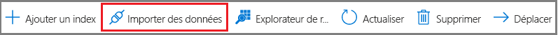
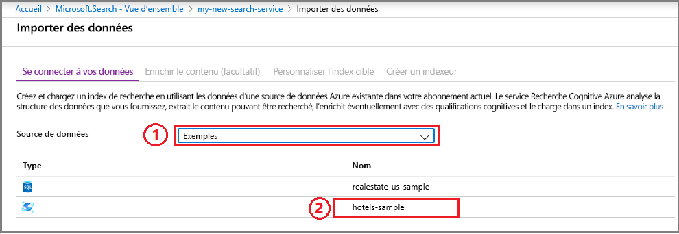
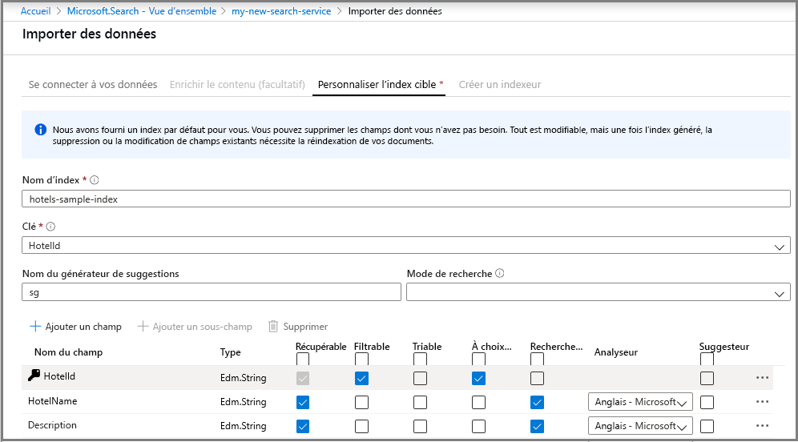
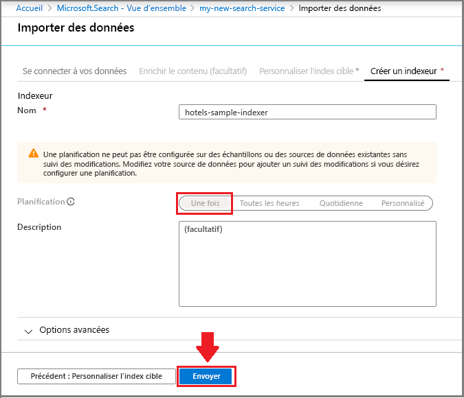
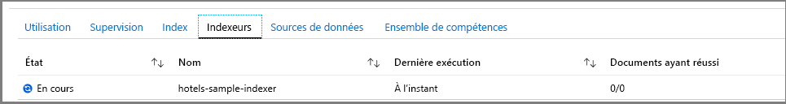
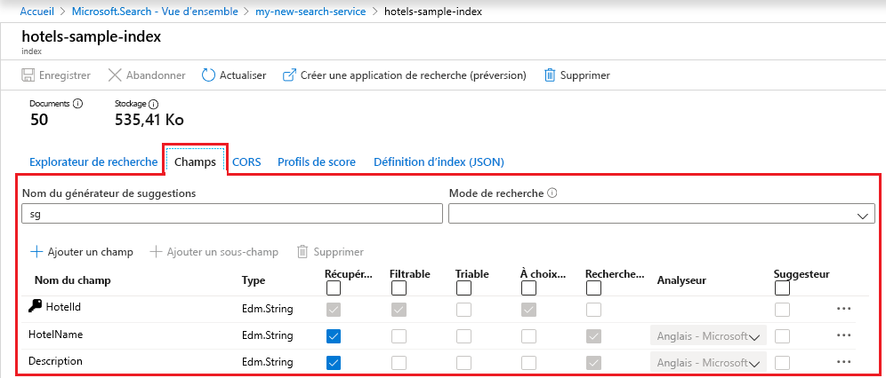
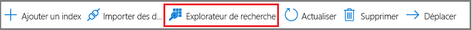
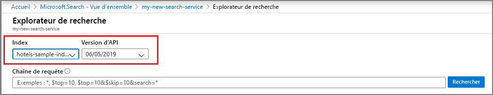
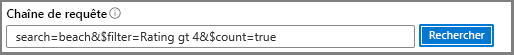

# Démarrage rapide : Créer un index Recherche cognitive Azure dans le portail Azure
> [!div class="op_single_selector"]
> * [Portail](search-get-started-portal.md)
> * [C#](search-get-started-dotnet.md)
> * [Java](search-get-started-java.md)
> * [Node.JS](search-get-started-nodejs.md)
> * [PowerShell](search-get-started-powershell.md)
> * [Postman](search-get-started-postman.md)
> * [Python](search-get-started-python.md)

**L’Assistant Importer des données** est un outil du portail Azure qui vous guide lors de la création d’un index de recherche afin que vous puissiez écrire des requêtes intéressantes en quelques minutes. 

L’Assistant comporte également des pages pour l’enrichissement basé sur l’IA afin que vous puissiez extraire le texte et la structure des fichiers image et du texte non structuré. Le traitement du contenu avec l’IA inclut la reconnaissance optique de caractères (OCR), l’extraction d’expressions clé et d’entités, ainsi que l’analyse des images.

## Prérequis

Avant de commencer la lecture cet article, vous devez disposer des éléments suivants :

+ Compte Azure avec un abonnement actif. [Créez un compte gratuitement](https://azure.microsoft.com/free/).

+ Service Recherche cognitive Azure. [Créez un service](search-create-service-portal.md) ou [recherchez un service existant](https://ms.portal.azure.com/#blade/HubsExtension/BrowseResourceBlade/resourceType/Microsoft.Search%2FsearchServices) dans votre abonnement actuel. Vous pouvez utiliser un service gratuit pour ce guide de démarrage rapide. 

### Vérifier l’espace disponible

De nombreux clients commencent avec le service gratuit. Cette version est limitée à trois index, trois sources de données et trois indexeurs. Avant de commencer, assurez-vous de disposer d’assez d’espace pour stocker des éléments supplémentaires. Ce didacticiel crée une occurrence de chaque objet.

Les sections figurant sur le tableau de bord des services indiquent le nombre d’index, d’indexeurs et de sources de données dont vous disposez déjà. 

##  Créer un index et charger des données

Les requêtes de recherche se répètent sur un [*index*](search-what-is-an-index.md) contenant les données de recherche, les métadonnées et les constructions supplémentaires utilisées pour l’optimisation de certains comportements de recherche.

Pour les besoins de ce tutoriel, nous utilisons un exemple de jeu de données intégré qu’il est possible d’analyser à l’aide d’un [*indexeur*](search-indexer-overview.md) par le biais de l’[Assistant **Importer des données**](search-import-data-portal.md). Un indexeur est un robot d’indexation spécifique à la source qui peut lire les métadonnées et le contenu des sources de données prises en charge Azure. Normalement, les indexeurs sont utilisés par programmation, mais dans le portail, vous pouvez y accéder via l’Assistant **Importation de données**. 

### Étape 1 : démarrer l’Assistant Importation de données et créer une source de données

1. Connectez-vous au [portail Azure](https://portal.azure.com/) avec votre compte Azure.

1. [Recherchez votre service de recherche](https://ms.portal.azure.com/#blade/HubsExtension/BrowseResourceBlade/resourceType/Microsoft.Storage%2storageAccounts/). Ensuite, dans la page Vue d’ensemble, cliquez sur **Importer des données** dans la barre de commandes pour créer et remplir un index de recherche.

   

1. Dans l’Assistant, cliquez sur **Se connecter aux données** > **Exemples** > **hotels-sample**. Cette source de données est intégrée. Si vous avez créé votre propre source de données, vous devez spécifier un nom, un type et des informations de connexion. Une fois créée, elle devient une « source de données existante » qui peut être réutilisée dans d’autres opérations d’importation.

   

1. Passez à la page suivante.

### Étape 2 : Ignorer la page « Contenu enrichi »

L’Assistant prend en charge la création d’un [pipeline d’enrichissement par intelligence artificielle](cognitive-search-concept-intro.md), qui permet d’incorporer les algorithmes d’IA Cognitive Services dans l’indexation. 

Nous allons pour le moment ignorer cette étape et passer directement à l’étape de **personnalisation de l’index cible**.

   

> [!TIP]
> Vous pouvez consulter un exemple d'indexation IA dans un [guide de démarrage rapide](cognitive-search-quickstart-blob.md) ou [didacticiel](cognitive-search-tutorial-blob.md).

### Étape 3 : configurer l’index

En règle générale, la création d’index exige d’utiliser du code avant le chargement des données. Comme indiqué dans ce didacticiel, l’Assistant peut cependant générer un index de base pour n’importe quelle source de données à analyser. Un index requiert au minimum un nom et une collection de champs. L’un de ces champs servira de clé du document pour identifier chaque document de façon unique. En outre, vous pouvez spécifier des analyseurs de langage ou des suggesteurs si vous souhaitez bénéficier d’une autocomplétion ou de suggestions de requêtes.

Les champs comportent des types de données et des attributs. Les cases à cocher figurant dans la partie supérieure sont des *attributs d’index* qui contrôlent le mode d’utilisation du champ.

* **Récupérable** signifie que le champ s’affiche dans la liste des résultats de recherche. En décochant cette case, vous pouvez marquer des champs comme étant hors limites pour les résultats de recherche, par exemple lorsqu’un champ est utilisé uniquement dans les expressions de filtre.
* **Clé** désigne l’identificateur unique du document. Il est toujours présenté sous forme d’une chaîne et est obligatoire.
* Les options **Filtrable**, **Triable** et **À choix multiples** déterminent si les champs sont utilisés dans une structure de filtre, de tri ou de navigation à facettes.
* **Possibilité de recherche** signifie que le champ est inclus dans la recherche en texte intégral. Les chaînes sont utilisables dans une recherche. Les champs numériques et booléens sont souvent marqués comme ne pouvant pas faire l’objet d’une recherche.

Votre sélection n’a aucune influence sur les besoins en stockage. Par exemple, si vous définissez l’attribut **Récupérable** sur plusieurs champs, les besoins en stockage n’augmentent pas.

Par défaut, l’Assistant analyse la source de données pour y rechercher des identificateurs uniques comme base pour le champ de clé. Les *chaînes* sont dotées des attributs **Récupérable** et **Possibilité de recherche**. Les *entiers* sont dotés des attributs **Récupérable**, **Filtrable**, **Triable** et **À choix multiples**.

1. Acceptez les valeurs par défaut. 

   Si vous réexécutez l’Assistant à l’aide d’une source de données « hotels » existante, l’index ne sera pas configuré avec les attributs par défaut. Vous devrez sélectionner manuellement les attributs lors des prochaines importations. 

   

2. Passez à la page suivante.

### Étape 4 : configurer l’indexeur

Toujours dans l’Assistant **Importer des données**, cliquez sur **Indexeur** > **Nom**, puis tapez un nom pour l’indexeur.

Cet objet définit un processus exécutable. Vous pouvez le configurer en planification récurrente, mais pour l’instant, utilisez l’option par défaut qui exécute immédiatement l’indexeur une seule fois.

Cliquez sur **Envoyer** pour créer et exécuter simultanément l’indexeur.

  

## Surveiller la progression

L’Assistant doit vous rediriger vers la liste des indexeurs où vous pourrez en surveiller la progression. Pour une navigation automatique, accédez à la page Vue d’ensemble et cliquez sur **Indexeurs**.

Il faut parfois plusieurs minutes au portail pour actualiser la page, mais l’indexeur que vous venez de créer devrait apparaître dans la liste, avec un état indiquant que l’opération est en cours ou qu’elle a réussi, ainsi que le nombre de documents indexés.

   

## Afficher l’index

La page principale du service fournit des liens vers les ressources créées dans votre service Recherche cognitive Azure.  Pour voir l’index que vous venez de créer, cliquez sur **Index** dans la liste des liens. 

Attendez que la page du portail s’actualise. Après quelques minutes, vous devriez voir l’index avec un nombre de documents et une taille de stockage.

   

Dans cette liste, vous pouvez cliquer sur l’index *hotels-sample* que vous venez de créer pour voir le schéma de l’index. Ajoutez éventuellement de nouveaux champs. 

L’onglet **Champs** montre le schéma d’index. Faites défiler la liste vers le bas pour entrer un nouveau champ. Dans la plupart des cas, vous ne pouvez pas modifier les champs existants. Les champs existants ont une représentation physique dans la Recherche cognitive Azure et ne sont donc pas modifiables, pas même dans du code. Pour modifier considérablement un champ existant, créez un nouvel index en supprimant l’original.

   

D’autres constructions, telles que des profils de score et des options CORS, peuvent être ajoutées à tout moment.

Pour comprendre clairement ce que vous pouvez et ne pouvez pas modifier lors de la conception d’index, prenez une minute pour consulter les options de définition d’index. Les options grisées indiquent qu’une valeur ne peut pas être modifiée ou supprimée. 

##  Lancer des requêtes à l’aide de l’Explorateur de recherche

Vous devriez maintenant avoir un index de recherche prêt à lancer des requêtes à l’aide de la page de requête [**Explorateur de recherche**](search-explorer.md) intégrée. Il fournit une zone de recherche afin que vous puissiez tester les chaînes de requête arbitraires.

L’**Explorateur de recherche** est uniquement équipé pour gérer des [demandes d’API REST](/rest/api/searchservice/search-documents), mais il accepte à la fois une syntaxe de [requête simple](/rest/api/searchservice/simple-query-syntax-in-azure-search) et celle de l’[analyseur complet de requêtes Lucene](/rest/api/searchservice/lucene-query-syntax-in-azure-search), ainsi que tous les paramètres de recherche disponibles dans des opérations d’[API REST de recherche dans des documents](/rest/api/searchservice/search-documents#bkmk_examples).

> [!TIP]
> Les étapes suivantes font l’objet d’une démonstration à 6:08 dans la [vidéo de présentation de la Recherche cognitive Azure](https://channel9.msdn.com/Events/Connect/2016/138).
>

1. Cliquez sur **Explorateur de recherche** dans la barre de commandes.

   

2. Dans la liste déroulante **Index**, choisissez *hotels-sample-index*. Cliquez sur la liste déroulante **Version d’API** pour voir les API REST disponibles. Pour les requêtes ci-après, utilisez la version mise à la disposition générale (2020-06-30).

   

3. Dans la barre de recherche, collez les chaînes de requête ci-dessous, puis cliquez sur **Rechercher**.

   

## Exemples de requêtes

Vous pouvez entrer soit des termes et expressions, de la même manière que dans une recherche Bing ou Google, soit des expressions de requête entièrement spécifiées. Les résultats sont retournés sous forme de documents JSON détaillés.

### Requête simple avec les N premiers résultats

#### Exemple (requête sous forme de chaîne) : `search=spa`

* Le paramètre **search** permet d’entrer une recherche par mot clé pour une recherche en texte intégral. Dans ce cas précis, il retourne les hôtels dont l’un des champs contient le mot *spa*.

* **L’Explorateur de recherche** renvoie les résultats au format JSON, qui est particulièrement détaillé et difficile à lire si les documents présentent une structure dense. Cela est intentionnel ; la visibilité du document entier est importante en matière de développement, en particulier lors des tests. Pour une meilleure expérience utilisateur, vous devrez écrire le code qui [gère les résultats de recherche](search-pagination-page-layout.md) pour mettre en évidence les éléments importants.

* Les documents sont composés de tous les champs marqués comme « récupérables » dans l’index. Pour visualiser les attributs d’index dans le portail, cliquez sur *hotels-sample* dans la liste **Index**.

#### Exemple (requête paramétrable) : `search=spa&$count=true&$top=10`

* Le symbole **&** permet d’ajouter des paramètres de recherche, qui peuvent être spécifiés dans n’importe quel ordre.

* Le paramètre **$count=true** récupère une valeur indiquant le nombre total de documents retournés. Cette valeur s’affiche en haut des résultats de recherche. Vous pouvez vérifier les requêtes de filtre en surveillant les modifications signalées par **$count=true**. Des petits nombres indiquent que votre filtre fonctionne.

* La chaîne **$top=10** retourne les 10 documents les mieux classés parmi tous les documents. Par défaut, la Recherche cognitive Azure retourne les 50 meilleures correspondances. Vous pouvez augmenter ou diminuer ce nombre par le biais du paramètre **$top**.

### Filtrer la requête

Les filtres sont inclus dans les demandes de recherche lorsque vous ajoutez le paramètre **$filter**. 

#### Exemple (filtré) : `search=beach&$filter=Rating gt 4`

* Le paramètre **$filter** renvoie les résultats correspondant aux critères que vous avez spécifiés. Dans ce cas précis, ce sont les évaluations supérieures à 4.

* La syntaxe de filtre est une construction OData. Pour plus d’informations, consultez l’article [Filter OData syntax](/rest/api/searchservice/odata-expression-syntax-for-azure-search) (Syntaxe d’expression de filtre OData).

###  « Facetter » la requête

Les filtres de facettes sont inclus dans les demandes de recherche. Vous pouvez utiliser le paramètre de facette pour retourner un nombre agrégé des documents qui correspondent à la valeur de facette que vous fournissez.

#### Exemple (par facettes avec une étendue réduite) : `search=*&facet=Category&$top=2`

* **search=** * est une recherche vide. Les recherches vides portent sur tous les éléments. L’un des motifs possibles de l’exécution d’une requête vide est l’application de filtres ou de facettes au jeu complet de documents. Par exemple, vous souhaitez obtenir une structure de navigation par facettes constituée de tous les hôtels de l’index.
* **facet** renvoie une structure de navigation que vous pouvez transmettre à un contrôle d’interface utilisateur. Il renvoie des catégories ainsi qu’un nombre. Dans ce cas, les catégories sont basées sur un champ nommé *Catégorie*. Il n’existe pas d’agrégation dans la Recherche cognitive Azure, mais vous pouvez bénéficier d’une fonctionnalité quasiment comparable via `facet`, qui retourne un nombre de documents dans chaque catégorie.

* **$top=2** renvoie deux documents, illustrant ainsi la possibilité d’utiliser `top` pour réduire ou augmenter les résultats.

#### Exemple (par facettes sur des valeurs numériques) : `search=spa&facet=Rating`

* Cette requête définit une facette pour l’évaluation dans une recherche de texte portant sur le mot *spa*. Le terme *évaluation* peut être spécifié en tant que facette, car ce champ est désigné comme récupérable, filtrable et « facettable » dans l’index. De plus, les valeurs qu’il contient (valeur numérique de 1 à 5) sont adaptées à un classement des entrées en différents groupes.

* Seuls les champs filtrables peuvent être désignés comme étant à facettes. Les résultats ne peuvent renvoyer que les champs récupérables.

* Le champ *Évaluation* est un champ à virgule flottante et double précision, et le regroupement se fera par valeur précise. Pour plus d’informations sur le regroupement par intervalle (par exemple « 3 étoiles », « 4 étoiles », etc.), consultez [Guide pratique pour implémenter une navigation par facettes dans la Recherche cognitive Azure](./search-faceted-navigation.md#filter-based-on-a-range).

### Mettre en surbrillance les termes de recherche

La mise en surbrillance des correspondances fait référence au formatage du texte qui correspond au mot clé, lorsque des correspondances sont trouvées dans un champ spécifique. Si votre terme de recherche est profondément enfoui dans une description, vous pouvez définir une mise en surbrillance des correspondances pour le localiser plus facilement.

#### Exemple (surligneur) : `search=beach&highlight=Description`

* Dans cet exemple, le mot mis en forme *beach* (plage) est plus facile à repérer dans le champ de description.

#### Exemple (analyse linguistique) : `search=beaches&highlight=Description`

* La recherche en texte intégral reconnaît les variations de base au niveau du format des mots. Dans ce cas, en réponse au mot clé de recherche « beaches », les résultats de recherche contiennent le mot « beach » mis en surbrillance pour les hôtels qui ont ce mot dans leurs champs de recherche. Les résultats peuvent afficher différentes formes du même mot grâce à l’exécution d’une analyse linguistique. 

* La Recherche cognitive Azure prend en charge 56 analyseurs Lucene et Microsoft. Par défaut, la Recherche cognitive Azure utilise l’analyseur Lucene standard.

###  Essayer la recherche partielle

Par défaut, dans une recherche classique, aucune correspondance n’est retournée pour les termes de requête mal orthographiés, par exemple *seatle* pour « Seattle ». L’exemple suivant ne retourne aucun résultat.

#### Exemple (terme mal orthographié, non pris en charge) : `search=seatle`

Pour gérer les fautes d’orthographe, vous pouvez utiliser une recherche partielle. La recherche partielle est activée lorsque vous utilisez la syntaxe de requête complète Lucene, ce qui arrive lorsque vous effectuer deux actions : définir la requête sur **queryType=full** et ajouter le **~** à la chaîne de recherche.

#### Exemple (terme mal orthographié, pris en charge) : `search=seatle~&queryType=full`

Cet exemple retourne désormais les documents qui contiennent des correspondances pour « Seattle ».

Lorsque l’élément **queryType** n’est pas spécifié, l’analyseur de requêtes simples par défaut est utilisé. L’analyseur de requêtes simples fonctionne plus rapidement, mais si vous avez besoin d’utiliser des recherches partielles, des expressions régulières, des recherches de proximité ou d’autres types de requêtes avancées, vous devrez recourir à la syntaxe complète.

La recherche partielle et la recherche par caractères génériques ont des conséquences sur les résultats de la recherche. L’analyse linguistique n’est pas effectuée sur ces formats de requête. Avant d’utiliser la recherche partielle et la recherche par caractères génériques, consultez [Fonctionnement de la recherche en texte intégral dans la Recherche cognitive Azure](search-lucene-query-architecture.md#stage-2-lexical-analysis), puis recherchez la section sur les exceptions relatives à l’analyse lexicale.

Pour plus d’informations sur les scénarios de requête permis par l’analyseur de requêtes complètes, consultez [Syntaxe de requête Lucene dans la Recherche cognitive Azure](/rest/api/searchservice/lucene-query-syntax-in-azure-search).

###  Essayez la recherche géospatiale

La recherche géographique est prise en charge par le biais du [type de données edm.GeographyPoint](/rest/api/searchservice/supported-data-types) sur un champ contenant des coordonnées. La recherche géographique est un type de filtre, spécifié dans l’article [Filter OData syntax](/rest/api/searchservice/odata-expression-syntax-for-azure-search) (Syntaxe d’expression de filtre OData).

#### Exemple (filtres géo-coordonnés) : `search=*&$count=true&$filter=geo.distance(Location,geography'POINT(-122.12 47.67)') le 5`

L’exemple de requête ci-dessus filtre tous les résultats sur la base de données positionnelles et renvoie les résultats situés à moins de 5 kilomètres d’un point donné (spécifié sous la forme de coordonnées de latitude et de longitude). L’ajout du paramètre **$count** vous permet de connaître le nombre de résultats renvoyés lorsque vous modifiez la distance ou les coordonnées.

La recherche géographique est utile si votre application de recherche dispose d’une fonctionnalité « rechercher à proximité » ou qu’elle utilise la navigation dans les cartes. Toutefois, cette fonction de recherche n’est pas disponible en texte intégral. Si vos utilisateurs doivent rechercher une ville ou un pays par son nom, ajoutez des champs contenant des noms de ville ou de pays, en plus des coordonnées.

## Éléments importants à retenir

Ce tutoriel a fourni une brève présentation de la Recherche cognitive Azure à l’aide du portail Azure.

Vous avez appris à créer un index de recherche à l’aide de l’Assistant **Importer des données**. Vous avez découvert les [indexeurs](search-indexer-overview.md), ainsi que le flux de travail de base pour la conception d’index, y compris les [modifications prises en charge pour un index publié](/rest/api/searchservice/update-index).

À l’aide de **l’Explorateur de recherche** dans le portail Azure, vous avez découvert la syntaxe de requête par le biais d’exemples pratiques qui illustraient des fonctionnalités clés comme les filtres, la mise en surbrillance des correspondances, la recherche partielle et la recherche basée sur la géolocalisation.

Vous avez également appris à rechercher des index, des indexeurs et des sources de données dans le portail. À l’avenir, pour toute nouvelle source de données et afin de limiter vos efforts, vous pourrez utiliser le portail pour vérifier rapidement ses définitions ou les collections de champs.

## Nettoyer les ressources

Lorsque vous travaillez dans votre propre abonnement, il est recommandé, à la fin de chaque projet, de déterminer si vous avez toujours besoin des ressources que vous avez créées. Les ressources laissées en cours d’exécution peuvent vous coûter de l’argent. Vous pouvez supprimer les ressources une par une, ou choisir de supprimer le groupe de ressources afin de supprimer l’ensemble des ressources.

Vous pouvez rechercher et gérer les ressources dans le portail à l’aide des liens **Toutes les ressources** ou **Groupes de ressources** situés dans le volet de navigation de gauche.

Si vous utilisez un service gratuit, n’oubliez pas que vous êtes limité à trois index, indexeurs et sources de données. Vous pouvez supprimer des éléments un par un dans le portail pour ne pas dépasser la limite. 

## Étapes suivantes

Utilisez un Assistant du portail pour générer une application web prête à l’emploi qui s’exécute dans un navigateur. Vous pouvez essayer cet Assistant sur le petit index que vous venez de créer ou utiliser l’un des exemples de jeux de données intégrés pour une expérience de recherche plus riche.

> [!div class="nextstepaction"]
> [Créer une application de démonstration dans le portail](search-create-app-portal.md)

Vous souhaitez optimiser et réduire vos coûts de cloud ?

> [!div class="nextstepaction"]
> [Démarrer l’analyse des coûts avec Cost Management](../cost-management-billing/costs/quick-acm-cost-analysis.md?WT.mc_id=costmanagementcontent_docsacmhorizontal_-inproduct-learn)