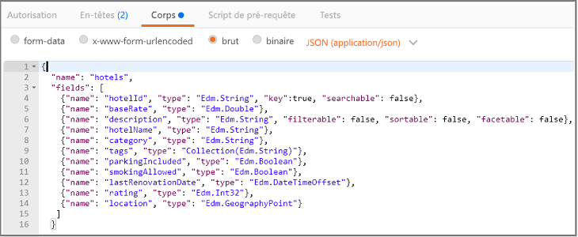
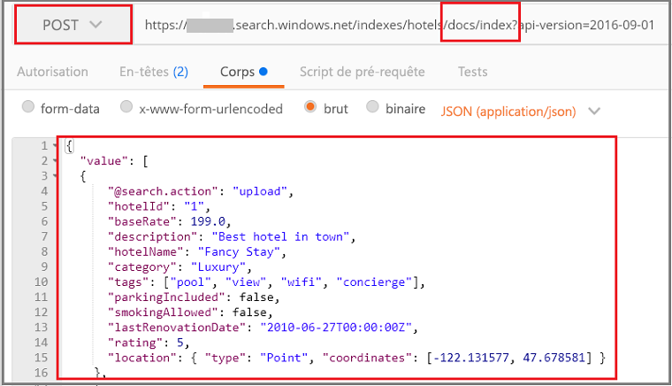
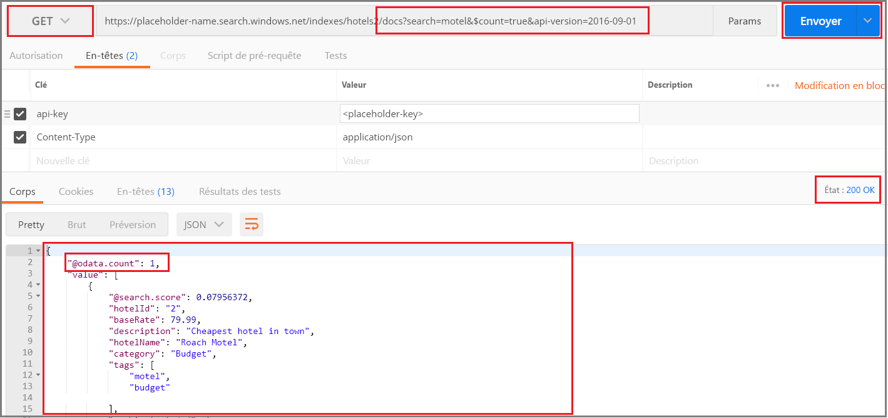
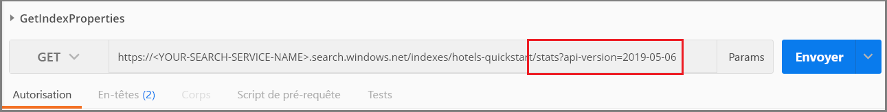

# <a name="quickstart-create-an-azure-cognitive-search-index-in-postman-using-rest-apis"></a>Démarrage rapide : Créer un index Recherche cognitive Azure dans Postman à l’aide des API REST
> [!div class="op_single_selector"]
> * [Postman](search-get-started-postman.md)
> * [C#](./search-get-started-dotnet.md)
> * [Python](search-get-started-python.md)
> * [Portail](search-get-started-portal.md)
> * [PowerShell](search-howto-dotnet-sdk.md)
>*

Cet article explique comment formuler des requêtes API REST de façon interactive à l’aide des [API REST de la Recherche cognitive Azure](/rest/api/searchservice) et d’un API client pour envoyer et recevoir les requêtes. Avec un API client et ces instructions, vous pouvez envoyer des requêtes et afficher les réponses avant d’écrire un code.

L’article utilise l’application Postman. Vous pouvez [télécharger et importer une collection Postman](https://github.com/Azure-Samples/azure-search-postman-samples/tree/master/Quickstart) si vous préférez utiliser des requêtes prédéfinies. 

Si vous n’avez pas d’abonnement Azure, créez un [compte gratuit](https://azure.microsoft.com/free/?WT.mc_id=A261C142F) avant de commencer.

## <a name="prerequisites"></a>Prérequis

Les services et outils suivants sont indispensables dans ce guide de démarrage rapide. 

+ L’[application de bureau Postman](https://www.getpostman.com/) permet d’envoyer des requêtes à la Recherche cognitive Azure.

+ [Créez un service Recherche cognitive Azure](search-create-service-portal.md) ou [recherchez un service existant](https://ms.portal.azure.com/#blade/HubsExtension/BrowseResourceBlade/resourceType/Microsoft.Search%2FsearchServices) dans votre abonnement actuel. Vous pouvez utiliser un service gratuit pour ce guide de démarrage rapide. 

## <a name="get-a-key-and-url"></a>Obtenir une clé et une URL

Les appels REST requièrent l’URL du service et une clé d’accès et ce, sur chaque demande. Un service de recherche est créé avec les deux. Ainsi, si vous avez ajouté la Recherche cognitive Azure à votre abonnement, effectuez ce qui suit pour obtenir les informations nécessaires :

1. [Connectez-vous au portail Azure](https://portal.azure.com/), puis dans la page **Vue d’ensemble** du service de recherche, récupérez l’URL. Voici un exemple de point de terminaison : `https://mydemo.search.windows.net`.

1. Dans **Paramètres** > **Clés**, obtenez une clé d’administration pour avoir des droits d’accès complets sur le service. Il existe deux clés d’administration interchangeables, fournies pour assurer la continuité de l’activité au cas où vous deviez en remplacer une. Vous pouvez utiliser la clé primaire ou secondaire sur les demandes d’ajout, de modification et de suppression d’objets.


Toutes les demandes nécessitent une clé API sur chaque demande envoyée à votre service. L’utilisation d’une clé valide permet d’établir, en fonction de chaque demande, une relation de confiance entre l’application qui envoie la demande et le service qui en assure le traitement.

## <a name="connect-to-azure-cognitive-search"></a>Se connecter à la Recherche cognitive Azure

Dans cette section, utilisez l’outil web de votre choix pour configurer les connexions à la Recherche cognitive Azure. Chaque outil conserve les informations d’en-tête de requête de la session, ce qui signifie que vous n’avez à indiquer la clé d’API et le type de contenu qu’une seule fois.

Quel que soit l’outil, vous devez choisir une commande (GET, POST, PUT, etc.), fournir un point de terminaison d’URL et, pour certaines tâches, fournir du code JSON dans le corps de la requête. Remplacez le nom du service de recherche (YOUR-SEARCH-SERVICE-NAME) par une valeur valide. Ajoutez `$select=name` pour retourner uniquement le nom de chaque index. 

> `https://<YOUR-SEARCH-SERVICE-NAME>.search.windows.net/indexes?api-version=2020-06-30&$select=name`

Remarquez le préfixe HTTPS, le nom du service, le nom de l’objet (dans ce cas, la collection d’index) et la [version de l’API](search-api-versions.md). La version de l'API est une chaîne en minuscules obligatoire, spécifiée au format `?api-version=2020-06-30` pour la version actuelle. Les versions d’API sont régulièrement mises à jour. Le fait d’inclure la version d’API sur chaque demande vous permet de bénéficier du contrôle absolu sur la version utilisée.  

Un en-tête de requête se compose de deux éléments : `Content-Type` et la `api-key` utilisée pour s’authentifier auprès de la Recherche cognitive Azure. Remplacez la clé API administrateur (YOUR-AZURE-SEARCH-ADMIN-API-KEY) par une valeur valide. 

```http
api-key: <YOUR-AZURE-SEARCH-ADMIN-API-KEY>
Content-Type: application/json
```

Dans Postman, formulez une requête similaire à celle de la capture d’écran suivante. Choisissez **GET** comme commande, indiquez l’URL, puis cliquez sur **Envoyer**. Cette commande se connecte à la Recherche cognitive Azure, lit la collection d’index et retourne le code d’état HTTP 200 en cas de réussite de la connexion. Si votre service a déjà des index, la réponse inclut également les définitions de ces index.


## <a name="1---create-an-index"></a>1 – Créer un index

Dans la Recherche cognitive Azure, vous créez généralement l’index avant de le charger avec des données. L’[API REST Create Index](/rest/api/searchservice/create-index) est utilisée pour cette tâche. 

L’URL est étendue pour inclure le nom d’index `hotels`.

Pour faire cela dans Postman :

1. Définissez la commande sur **PUT**.

2. Copiez dans cette URL `https://<YOUR-SEARCH-SERVICE-NAME>.search.windows.net/indexes/hotels-quickstart?api-version=2020-06-30`.

3. Fournissez la définition d’index (un code prêt à copier est fourni ci-dessous) dans le corps de la demande.

4. Cliquez sur **Envoyer**.



### <a name="index-definition"></a>Définition de l’index

La collection de champs définit la structure du document. Chaque document doit comporter ces champs, et chaque champ doit avoir un type de données. Les champs de chaîne sont utilisés dans la recherche en texte intégral. Si vous avez besoin de données numériques pouvant faire l’objet d’une recherche, vous devez caster les données numériques comme chaînes.

Les attributs du champ déterminent l’action autorisée. Les API REST autorisent de nombreuses actions par défaut. Par exemple, toutes les chaînes peuvent être soumises à des recherches, récupérables et filtrables et sont à choix multiples par défaut. Bien souvent, il suffit de définir des attributs pour désactiver un comportement.

```json
{
    "name": "hotels-quickstart",  
    "fields": [
        {"name": "HotelId", "type": "Edm.String", "key": true, "filterable": true},
        {"name": "HotelName", "type": "Edm.String", "searchable": true, "filterable": false, "sortable": true, "facetable": false},
        {"name": "Description", "type": "Edm.String", "searchable": true, "filterable": false, "sortable": false, "facetable": false, "analyzer": "en.lucene"},
        {"name": "Category", "type": "Edm.String", "searchable": true, "filterable": true, "sortable": true, "facetable": true},
        {"name": "Tags", "type": "Collection(Edm.String)", "searchable": true, "filterable": true, "sortable": false, "facetable": true},
        {"name": "ParkingIncluded", "type": "Edm.Boolean", "filterable": true, "sortable": true, "facetable": true},
        {"name": "LastRenovationDate", "type": "Edm.DateTimeOffset", "filterable": true, "sortable": true, "facetable": true},
        {"name": "Rating", "type": "Edm.Double", "filterable": true, "sortable": true, "facetable": true},
        {"name": "Address", "type": "Edm.ComplexType", 
        "fields": [
        {"name": "StreetAddress", "type": "Edm.String", "filterable": false, "sortable": false, "facetable": false, "searchable": true},
        {"name": "City", "type": "Edm.String", "searchable": true, "filterable": true, "sortable": true, "facetable": true},
        {"name": "StateProvince", "type": "Edm.String", "searchable": true, "filterable": true, "sortable": true, "facetable": true},
        {"name": "PostalCode", "type": "Edm.String", "searchable": true, "filterable": true, "sortable": true, "facetable": true},
        {"name": "Country", "type": "Edm.String", "searchable": true, "filterable": true, "sortable": true, "facetable": true}
        ]
     }
  ]
}
```

Lorsque vous envoyez cette demande, vous devez obtenir une réponse HTTP 201, indiquant que l’index a bien été créé. Vous pouvez vérifier cette action dans le portail, mais n’oubliez pas que la page du portail est actualisée à intervalles réguliers. Il se peut donc que le résultat de l’action s’affiche au bout d’une minute ou deux.

> [!TIP]
> Si vous obtenez HTTP 504, vérifiez que l'URL spécifie HTTPS. Si vous voyez HTTP 400 ou 404, contrôlez le corps de la demande pour vérifier l'absence d'erreurs de copier-coller. HTTP 403 indique normalement qu'il y a un problème avec la clé API (soit la clé n'est pas valide, soit il y a un problème de syntaxe avec la façon dont elle est spécifiée).

## <a name="2---load-documents"></a>2 – Charger des documents

Les étapes de création et de remplissage d’index sont des opérations distinctes. Dans la Recherche cognitive Azure, l’index contient toutes les données pouvant faire l’objet de recherches. Dans ce scénario, les données sont fournies sous forme de documents JSON. L’[API REST Add, Update ou Delete Documents](/rest/api/searchservice/addupdate-or-delete-documents) est utilisée pour cette tâche. 

L’URL est étendue pour inclure les collections `docs` et l’opération `index`.

Pour faire cela dans Postman :

1. Définissez la commande sur **POST**.

2. Copiez dans cette URL `https://<YOUR-SEARCH-SERVICE-NAME>.search.windows.net/indexes/hotels-quickstart/docs/index?api-version=2020-06-30`.

3. Fournissez les documents JSON (un code prêt à copier est fourni ci-dessous) dans le corps de la demande.

4. Cliquez sur **Envoyer**.



### <a name="json-documents-to-load-into-the-index"></a>Documents JSON à charger dans l’index

Le corps de la demande contient quatre documents à ajouter à l'index des hôtels.

```json
{
    "value": [
    {
    "@search.action": "upload",
    "HotelId": "1",
    "HotelName": "Secret Point Motel",
    "Description": "The hotel is ideally located on the main commercial artery of the city in the heart of New York. A few minutes away is Time's Square and the historic centre of the city, as well as other places of interest that make New York one of America's most attractive and cosmopolitan cities.",
    "Category": "Boutique",
    "Tags": [ "pool", "air conditioning", "concierge" ],
    "ParkingIncluded": false,
    "LastRenovationDate": "1970-01-18T00:00:00Z",
    "Rating": 3.60,
    "Address": 
        {
        "StreetAddress": "677 5th Ave",
        "City": "New York",
        "StateProvince": "NY",
        "PostalCode": "10022",
        "Country": "USA"
        } 
    },
    {
    "@search.action": "upload",
    "HotelId": "2",
    "HotelName": "Twin Dome Motel",
    "Description": "The hotel is situated in a  nineteenth century plaza, which has been expanded and renovated to the highest architectural standards to create a modern, functional and first-class hotel in which art and unique historical elements coexist with the most modern comforts.",
    "Category": "Boutique",
    "Tags": [ "pool", "free wifi", "concierge" ],
    "ParkingIncluded": false,
    "LastRenovationDate": "1979-02-18T00:00:00Z",
    "Rating": 3.60,
    "Address": 
        {
        "StreetAddress": "140 University Town Center Dr",
        "City": "Sarasota",
        "StateProvince": "FL",
        "PostalCode": "34243",
        "Country": "USA"
        } 
    },
    {
    "@search.action": "upload",
    "HotelId": "3",
    "HotelName": "Triple Landscape Hotel",
    "Description": "The Hotel stands out for its gastronomic excellence under the management of William Dough, who advises on and oversees all of the Hotel’s restaurant services.",
    "Category": "Resort and Spa",
    "Tags": [ "air conditioning", "bar", "continental breakfast" ],
    "ParkingIncluded": true,
    "LastRenovationDate": "2015-09-20T00:00:00Z",
    "Rating": 4.80,
    "Address": 
        {
        "StreetAddress": "3393 Peachtree Rd",
        "City": "Atlanta",
        "StateProvince": "GA",
        "PostalCode": "30326",
        "Country": "USA"
        } 
    },
    {
    "@search.action": "upload",
    "HotelId": "4",
    "HotelName": "Sublime Cliff Hotel",
    "Description": "Sublime Cliff Hotel is located in the heart of the historic center of Sublime in an extremely vibrant and lively area within short walking distance to the sites and landmarks of the city and is surrounded by the extraordinary beauty of churches, buildings, shops and monuments. Sublime Cliff is part of a lovingly restored 1800 palace.",
    "Category": "Boutique",
    "Tags": [ "concierge", "view", "24-hour front desk service" ],
    "ParkingIncluded": true,
    "LastRenovationDate": "1960-02-06T00:00:00Z",
    "Rating": 4.60,
    "Address": 
        {
        "StreetAddress": "7400 San Pedro Ave",
        "City": "San Antonio",
        "StateProvince": "TX",
        "PostalCode": "78216",
        "Country": "USA"
        }
    }
  ]
}
```

Après quelques secondes, la réponse HTTP 201 apparaît dans la liste de sessions. Cela indique que les documents ont été correctement créés. 

Si vous obtenez HTTP 207, cela signifie qu'au moins un document n'a pas pu être chargé. Si l’erreur HTTP 404 s’affiche, cela signifie que vous avez fait une erreur de syntaxe dans l’en-tête ou le corps de la demande. Vérifiez que le point de terminaison a bien été modifié de manière à inclure `/docs/index`.

> [!Tip]
> Pour les sources de données sélectionnées, vous pouvez choisir l’approche *d’indexeur*, qui simplifie et réduit la quantité de code nécessaire pour l’indexation. Pour en savoir plus, consultez la section relative aux [opérations de l’indexeur](/rest/api/searchservice/indexer-operations).


## <a name="3---search-an-index"></a>3 – Rechercher dans un index

Maintenant qu’un index et qu’un ensemble de documents sont chargés, vous pouvez émettre des requêtes les concernant à l’aide de l’[API REST Search Documents](/rest/api/searchservice/search-documents).

L’URL est étendue pour inclure une expression de requête spécifiée à l’aide de l’opérateur de recherche.

Pour faire cela dans Postman :

1. Définissez la commande sur **GET**.

2. Copiez dans cette URL `https://<YOUR-SEARCH-SERVICE-NAME>.search.windows.net/indexes/hotels-quickstart/docs?search=*&$count=true&api-version=2020-06-30`.

3. Cliquez sur **Envoyer**.

Cette requête est vide et renvoie le nombre des documents dans les résultats de recherche. La requête et la réponse doivent ressembler à la capture d’écran suivante pour Postman, une fois que vous avez cliqué sur **Envoyer**. Le code d’état doit être 200.

 

Essayez quelques autres exemples de requête pour avoir un aperçu de la syntaxe. Vous pouvez effectuer une recherche de chaîne, textualiser les requêtes $filter, limiter le jeu de résultats, restreindre la recherche à des champs spécifiques, etc.

Remplacez l’URL actuelle par celles ci-dessous, en cliquant sur **Envoyer** à chaque fois pour afficher les résultats.

```
# Query example 1 - Search on restaurant and wifi
# Return only the HotelName, Description, and Tags fields
https://<YOUR-SEARCH-SERVICE>.search.windows.net/indexes/hotels-quickstart/docs?search=restaurant wifi&$count=true&$select=HotelName,Description,Tags&api-version=2020-06-30

# Query example 2 - Apply a filter to the index to find hotels rated 4 or highter
# Returns the HotelName and Rating. Two documents match
https://<YOUR-SEARCH-SERVICE>.search.windows.net/indexes/hotels-quickstart/docs?search=*&$filter=Rating gt 4&$select=HotelName,Rating&api-version=2020-06-30

# Query example 3 - Take the top two results, and show only HotelName and Category in the results
https://<YOUR-SEARCH-SERVICE>.search.windows.net/indexes/hotels-quickstart/docs?search=boutique&$top=2&$select=HotelName,Category&api-version=2020-06-30

# Query example 4 - Sort by a specific field (Address/City) in ascending order
https://<YOUR-SEARCH-SERVICE>.search.windows.net/indexes/hotels-quickstart/docs?search=pool&$orderby=Address/City asc&$select=HotelName, Address/City, Tags, Rating&api-version=2020-06-30
```

## <a name="get-index-properties"></a>Obtenez les propriétés de l’index
Vous pouvez également utiliser la commande [Obtenir des statistiques](/rest/api/searchservice/get-index-statistics) pour interroger les nombres de documents et la taille de l’index : 

```
https://<YOUR-SEARCH-SERVICE-NAME>.search.windows.net/indexes/hotels-quickstart/stats?api-version=2020-06-30
```

L’ajout de `/stats` à votre URL retourne des informations d’index. Dans Postman, votre requête doit ressembler à ce qui suit ; la réponse inclut un nombre de documents et la quantité d’espace utilisé, en octets.

 

Notez que la syntaxe de la version d’API diffère. Pour cette requête, utilisez `?` pour ajouter la version d’API. `?` sépare le chemin de l’URL de la chaîne de requête, alors que le signe & sépare chaque paire « nom=valeur » dans la chaîne de requête. Pour cette requête, la version d’API est le premier et seul élément de la chaîne de requête.

## <a name="clean-up-resources"></a>Nettoyer les ressources

Lorsque vous travaillez dans votre propre abonnement, il est recommandé, à la fin de chaque projet, de déterminer si vous avez toujours besoin des ressources que vous avez créées. Les ressources laissées en cours d’exécution peuvent vous coûter de l’argent. Vous pouvez supprimer les ressources une par une, ou choisir de supprimer le groupe de ressources afin de supprimer l’ensemble des ressources.

Vous pouvez rechercher et gérer les ressources dans le portail à l’aide des liens **Toutes les ressources** ou **Groupes de ressources** situés dans le volet de navigation de gauche.

Si vous utilisez un service gratuit, n’oubliez pas que vous êtes limité à trois index, indexeurs et sources de données. Vous pouvez supprimer des éléments un par un dans le portail pour ne pas dépasser la limite. 

## <a name="next-steps"></a>Étapes suivantes

Maintenant que vous savez effectuer les tâches de base, vous pouvez aller plus loin avec les appels d’API REST supplémentaires pour des fonctionnalités plus avancées, telles que les indexeurs ou la [configuration d’un pipeline de recherche cognitive](cognitive-search-tutorial-blob.md). Pour les étapes suivantes, nous vous recommandons le lien suivant :

> [!div class="nextstepaction"]
> [Tutoriel REST : Indexer et rechercher des données semi-structurées (objets blob JSON) dans la Recherche cognitive Azure](search-semi-structured-data.md)