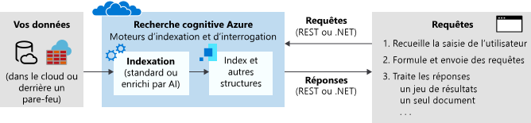

# Qu’est-ce que la Recherche cognitive Azure ?

La Recherche cognitive Azure ([anciennement « Recherche Azure »](whats-new.md#new-service-name)) est une solution cloud de recherche en tant que service, qui offre aux développeurs des API et des outils permettant d’ajouter une expérience de recherche riche concernant du contenu privé et hétérogène dans les applications web, mobiles et d’entreprise. 

Dans une solution personnalisée, un service de recherche se situe entre deux charges de travail principales : ingestion de contenu et requêtes. Votre code ou un outil définit un schéma et appelle l’ingestion de données (indexation) pour charger un index dans Recherche cognitive Azure. Si vous le souhaitez, vous pouvez ajouter des compétences cognitives pour appliquer des processus IA pendant l’indexation. Cela permet de créer des informations et structures utiles pour les scénarios de recherche et d’exploration des connaissances.

Une fois qu’un index existe, votre code d’application émet des demandes de requête à un service de recherche, puis gère les réponses. L’expérience de recherche est définie dans votre client via la fonctionnalité de la Recherche cognitive Azure, avec l’exécution de requête sur un index persistant que vous créez, possédez et stockez dans votre service.

Cette fonctionnalité est exposée par le biais d’une [API REST](/rest/api/searchservice/) ou d’un [SDK.NET](search-howto-dotnet-sdk.md) simple, qui masque la complexité inhérente de la récupération d’informations. En plus des API, le portail Azure offre la prise en charge de l’administration et de la gestion de contenu, avec des outils de prototypage et d’interrogation de vos index. Étant donné que le service s’exécute dans le cloud, infrastructure et la disponibilité sont gérées par Microsoft.

## Quand utiliser la Recherche cognitive Azure

La Recherche cognitive Azure est adaptée aux scénarios d’application suivants :

+ Consolidation de types de contenu hétérogènes dans un index privé, unique et pouvant faire l’objet d’une recherche. Les requêtes sont toujours sur un index que vous créez et chargez avec des documents, et l’index réside toujours dans le cloud de votre service de Recherche cognitive Azure. Vous pouvez remplir un index avec des flux de documents JSON à partir de n’importe quelle source ou plateforme. Autrement pour du contenu provenant d’Azure, vous pouvez utiliser un *indexeur* pour extraire des données dans un index. La définition et la gestion/propriété d’index est un motif clé de l’utilisation de la Recherche cognitive Azure.

+ Le contenu brut est constitué d’un long texte indifférencié, de fichiers image ou de fichiers d’application, tels que des types de contenu Office sur une source de données Azure, comme le stockage Blob Azure ou Cosmos DB. Vous pouvez appliquer des compétences cognitives pendant l’indexation pour ajouter une structure ou extraire du texte pouvant faire l’objet de recherches à partir de fichiers image et d’application.

+ Implémentation facile des fonctionnalités de recherche. Les API de Recherche cognitive Azure simplifient la construction des requêtes, la navigation par facettes, les filtres (dont la recherche spatiale), la mise en correspondance des synonymes, les requêtes TypeAhead et le paramétrage de la pertinence. À l’aide des fonctionnalités intégrées, vous pouvez répondre aux attentes des utilisateurs finaux en matière de recherche, de la même façon que les moteurs de recherche Web commerciaux.

+ Indexation de texte non structuré ou extraction de texte et d’informations à partir de fichiers image. La fonctionnalité d’[enrichissement de l’IA](cognitive-search-concept-intro.md) de la Recherche cognitive Azure ajoute un traitement de l’IA à un pipeline d’indexation. Certains cas d’utilisation courants incluent la reconnaissance optique des documents numérisés, la reconnaissance d’entités et l’extraction d’expressions clés sur les documents volumineux, la détection de la langue et la traduction de texte, et l’analyse des sentiments.

+ Les exigences linguistiques sont respectées à l’aide des analyseurs personnalisés et linguistiques de la Recherche cognitive Azure. Si vous disposez d’un contenu autre que l’anglais, la Recherche cognitive Azure prend en charge les analyseurs Lucene et les processeurs de langage naturel de Microsoft. Vous pouvez également configurer des analyseurs pour obtenir un traitement spécialisé de contenu brut, tel que le filtrage des signes diacritiques.

## Description des fonctionnalités

| Recherche &nbsp;de base&nbsp;&nbsp;&nbsp;&nbsp;&nbsp;&nbsp;&nbsp;&nbsp;&nbsp;&nbsp;&nbsp;&nbsp;&nbsp;&nbsp;&nbsp;&nbsp;&nbsp;&nbsp;&nbsp;&nbsp;&nbsp;&nbsp;&nbsp;&nbsp;  | Fonctionnalités |
|-------------------|----------|
|Recherche de texte de forme libre | La [**recherche en texte intégral**](search-lucene-query-architecture.md) est le principal cas d'utilisation de la plupart des applications basées sur la recherche. Vous pouvez formuler des requêtes à l’aide d’une syntaxe prise en charge.   La [**syntaxe de requête simple**](query-simple-syntax.md) offre des opérateurs logiques, de recherche d’expression, de suffixe et de précédence.  La [**syntaxe de requête Lucene**](query-lucene-syntax.md) inclut toutes les opérations de la syntaxe simple, avec en plus des extensions pour la recherche partielle, la recherche de proximité, la promotion de termes et les expressions régulières.|
| Pertinence | [**Notation simple**](index-add-scoring-profiles.md) est l’un des principaux avantages de la Recherche cognitive Azure. Les profils de score permettent de modéliser la pertinence en fonction des valeurs dans les documents eux-mêmes. Par exemple, vous souhaiterez peut-être que les nouveaux produits ou les produits en promotion apparaissent en priorité dans les résultats de la recherche. Vous pouvez également créer des profils de score à l'aide de balises pour obtenir un score personnalisé en fonction de préférences de recherche de client que vous avez suivies et stockées séparément. |
| Recherche basée sur la localisation | La Recherche cognitive Azure traite, filtre et affiche les lieux géographiques. Les utilisateurs peuvent ainsi explorer les données selon la proximité d’un résultat de recherche par rapport à un emplacement physique. [Regardez cette vidéo](https://channel9.msdn.com/Shows/Data-Exposed/Azure-Search-and-Geospatial-Data) ou [étudiez cet exemple](https://github.com/Azure-Samples/search-dotnet-asp-net-mvc-jobs) pour en savoir plus. |
| Filtres et facettes | La [**navigation par facettes**](search-faceted-navigation.md) est activée par le biais d’un seul paramètre de requête. La Recherche cognitive Azure retourne une structure de navigation par facettes que vous pouvez utiliser en tant que code de liste de catégories pour le filtrage autonome (par exemple, pour filtrer les éléments de catalogue par fourchette de prix ou par marque).    L’option [**Filtres**](query-odata-filter-orderby-syntax.md) permet d’intégrer la navigation par facettes dans l’interface utilisateur de votre application, d’améliorer la formulation des requêtes et d’appliquer un filtre en fonction de critères spécifiés par les utilisateurs ou les développeurs. Créez des filtres à l’aide de la syntaxe OData. |
| Fonctionnalités de l’expérience utilisateur | L'[**Autocomplétion**](search-autocomplete-tutorial.md) peut être activée sur une barre de recherche pour les requêtes prédictives.   [**Suggestions de recherche**](/rest/api/searchservice/suggesters) fonctionne sur les entrées de texte partielle dans une barre de recherche, mais les résultats est également les documents dans vos conditions d’index plutôt que de requête.   [**Synonymes**](search-synonyms.md) Dans les moteurs de recherche, les synonymes associent des termes équivalents qui élargissent implicitement l’étendue d’une requête, sans que l’utilisateur ait à fournir le terme.   Le [**surligneur d’éléments**](/rest/api/searchservice/Search-Documents) applique la mise en forme de texte à un mot clé correspondant dans les résultats de la recherche. Vous pouvez choisir quels champs renvoient les extraits de texte en surbrillance.  [**Tri**](/rest/api/searchservice/Search-Documents) est proposée pour plusieurs champs par le biais du schéma d’index, et elle est activée ou désactivée au moment de la requête avec un paramètre de recherche unique.   La [**pagination**](search-pagination-page-layout.md) et la limitation des résultats de la recherche sont d’un fonctionnement très simple avec le contrôle finement ajusté qu’offre la Recherche cognitive Azure sur vos résultats de recherche.    |

| Enrichissement&nbsp;IA&nbsp;&nbsp;&nbsp;&nbsp;&nbsp;&nbsp;&nbsp;&nbsp;&nbsp;&nbsp;&nbsp;       | Fonctionnalités |
|-------------------|----------|
|Traitement de l’IA pendant l’indexation | Un [**enrichissement de l’IA**](cognitive-search-concept-intro.md) à des fins d’analyse de texte et d’images peut être appliqué à un pipeline d’indexation afin d’extraire des informations textuelles à partir de contenus bruts. Parmi les [compétences intégrées](cognitive-search-predefined-skills.md), on peut citer la reconnaissance de caractères optiques (ce qui rend possible la recherche de JPEG), la reconnaissance d’entité (identifiant une organisation, un nom ou un emplacement), et la reconnaissance de phrase clé. Vous pouvez aussi [coder des compétences personnalisées](cognitive-search-create-custom-skill-example.md) à attacher au pipeline. Vous pouvez également [intégrer des compétences créées Azure Machine Learning](./cognitive-search-tutorial-aml-custom-skill.md). |
| Stockage de contenu enrichi pour l’analyse et la consommation dans des scénarios de non-recherche | La [**base de connaissances**](knowledge-store-concept-intro.md) est une extension de l’indexation basée sur l’IA. Avec Stockage Azure en tant que back-end, vous pouvez enregistrer les enrichissements créés lors de l’indexation. Ces artefacts peuvent vous aider à concevoir des ensembles de compétences plus performants ou à créer une forme et une structure à partir de données amorphes ou ambiguës. Vous pouvez créer des projections de ces structures afin de cibler des charges de travail ou des utilisateurs spécifiques. Vous pouvez également analyser directement les données extraites ou les charger dans d'autres applications.   |
| Contenu mis en cache | L’option [**Enrichissement incrémentiel (préversion)** ](cognitive-search-incremental-indexing-conceptual.md) limite le traitement uniquement aux documents modifiés par la modification spécifique du pipeline, à l’aide du contenu mis en cache pour les parties du pipeline qui ne changent pas. |

| Importation/indexation&nbsp;de données | Fonctionnalités |
|----------------------------------|----------|
| Sources de données | Les index Recherche cognitive Azure acceptent les données de n’importe quelle source, sous réserve qu’elles soient soumises en tant que structure de données JSON.    Les [**indexeurs**](search-indexer-overview.md) automatisent l'ingestion des données pour les sources de données Azure prises en charge et gèrent la sérialisation JSON. Connectez-vous à [Azure SQL Database](search-howto-connecting-azure-sql-database-to-azure-search-using-indexers.md), [Azure Cosmos DB](search-howto-index-cosmosdb.md) ou [Stockage Blob Azure](search-howto-indexing-azure-blob-storage.md) pour extraire le contenu pouvant faire l'objet d'une recherche dans les magasins de données primaires. Les indexeurs d’objets blob Azure peuvent effectuer une *recherche de document* pour [extraire le texte présentant la plupart des formats de fichier](search-howto-indexing-azure-blob-storage.md), y compris Microsoft Office, ainsi que les documents PDF et HTML. |
| Structures de données hiérarchiques et imbriquées | Les [**types complexes**](search-howto-complex-data-types.md) et les collections vous permettent de modéliser pratiquement tout type de structure JSON en tant qu’index Recherche cognitive Azure. La cardinalité « un à plusieurs » et « plusieurs à plusieurs » peut être exprimée de manière native à travers des collections, des types complexes et des collections de types complexes.|
| Analyse linguistique | Les analyseurs sont des composants utilisés pour le traitement au cours des opérations d’indexation et de recherche de texte. Il existe deux types de clé API.   Les [**analyseurs lexicaux personnalisés**](index-add-custom-analyzers.md) servent pour des requêtes de recherche complexes en utilisant la mise en correspondance phonétique et des expressions régulières.   Les [**analyseurs de langage**](index-add-language-analyzers.md) de Lucene ou de Microsoft sont utilisés pour gérer intelligemment les caractéristiques linguistiques propres à la langue, notamment les temps des verbes, le masculin et le féminin, les noms au pluriel irrégulier (par exemple, « cheval » et « chevaux »), la décomposition des mots, la césure des mots (pour les langues sans espaces), etc.   |

| Niveau&nbsp;de la plate-forme&nbsp;&nbsp;&nbsp;&nbsp;&nbsp;&nbsp;&nbsp;&nbsp;&nbsp;&nbsp;&nbsp;&nbsp;&nbsp;| Fonctionnalités |
|-------------------|----------|
| Outils de prototypage et d’inspection | Dans le portail, vous pouvez utiliser l’[**Assistant Importation de données**](search-import-data-portal.md) pour configurer des indexeurs, le concepteur d’index pour créer un index, et l’[**Explorateur de recherche**](search-explorer.md) pour tester les requêtes et affiner les profils de score. Vous pouvez également ouvrir un index pour consulter son schéma. |
| Surveillance et diagnostics | [**Activez les fonctionnalités de surveillance**](search-monitor-usage.md) pour aller au-delà des métriques visibles en un coup d'œil sur le portail. Des mesures sur les requêtes par seconde, la latence et la limitation sont capturées et affichées sur les pages du portail sans aucune configuration supplémentaire.|
| Chiffrement côté serveur | Le [**chiffrement au repos géré par Microsoft**](search-security-overview.md#encrypted-transmissions-and-storage) est intégré dans la couche de stockage interne et est irrévocable. Vous pouvez également compléter le chiffrement par défaut avec des [**clés de chiffrement gérées par le client**](search-security-manage-encryption-keys.md). Les clés que vous créez et gérez dans Azure Key Vault permettent de chiffrer les index et les mappages de synonymes dans Recherche cognitive Azure. |
| Infrastructure | La **plateforme haute disponibilité** garantit une expérience de service de recherche extrêmement fiable. Lorsqu’il est correctement mis à l’échelle, [Recherche cognitive Azure offre un SLA de 99,9 %](https://azure.microsoft.com/support/legal/sla/search/v1_0/).   En tant que solution complète **entièrement gérée et extensible**, Recherche cognitive Azure n’exige absolument aucune gestion d’infrastructure. Votre service peut être adapté à vos besoins avec la mise à l’échelle en deux dimensions pour gérer plus de stockage de documents, plus de charge de requêtes, ou les deux.  |

## Utilisation de la Recherche cognitive Azure
### Étape 1 : Configuration du service
Vous pouvez provisionner un service Recherche cognitive Azure dans le [portail Azure](https://portal.azure.com/) ou via l’[API Gestion des ressources Azure](/rest/api/searchmanagement/). Vous pouvez opter pour le service gratuit partagé avec d’autres abonnés ou pour un [niveau payant](https://azure.microsoft.com/pricing/details/search/) qui dédie les ressources que seul votre service utilise. Pour les niveaux payants, vous pouvez mettre à l’échelle un service dans deux dimensions : 

- Ajoutez des réplicas pour accroître votre capacité à traiter de lourdes charges de requêtes.   
- Ajoutez des partitions pour accroître votre capacité à stocker plus de documents. 

En gérant le stockage de documents et le débit de requêtes séparément, vous pouvez étalonner l’allocation de ressources en fonction des besoins de production.

### Étape 2 : Créer un index
Avant de pouvoir charger du contenu pouvant être recherché, vous devez d’abord définir un index Recherche cognitive Azure. Un index est comparable à une table de base de données qui conserve vos données et peut accepter des requêtes de recherche. Vous devez définir le schéma d’index à mapper pour refléter la structure des documents dans lesquels vous voulez effectuer des recherches, de la même façon que les champs d’une base de données.

Il est possible de créer un schéma dans le portail Azure ou par programmation à l’aide du [Kit de développement logiciel (SDK) .NET](search-howto-dotnet-sdk.md) ou de [l’API REST](/rest/api/searchservice/).

### Étape 3 : Charger les données
Une fois que vous avez défini un index, vous êtes prêt à charger du contenu. Vous pouvez utiliser un modèle push ou pull.

Le modèle push extrait des données auprès de sources de données externes. Ce modèle est pris en charge grâce aux *indexeurs* qui simplifient et automatisent certains aspects de l’ingestion de données, comme la connexion aux données, leur lecture et leur sérialisation. Des [indexeurs](/rest/api/searchservice/Indexer-operations) sont disponibles pour Azure Cosmos DB, Azure SQL Database, Stockage Blob Azure et SQL Server hébergé dans une machine virtuelle Azure. Vous pouvez configurer un indexeur pour une actualisation de données à la demande ou planifiée.

Le modèle d’émission est fourni via le Kit de développement logiciel (SDK) ou les API REST permettant d’envoyer les documents mis à jour à un index. Vous pouvez émettre des données à partir de n'importe quel groupe de données à l’aide du format JSON. Pour obtenir des conseils sur le chargement des données, consultez [Ajout, mise à jour ou suppression de documents](/rest/api/searchservice/addupdate-or-delete-documents) ou [Utilisation du Kit de développement logiciel (SDK) .NET](search-howto-dotnet-sdk.md).

### Étape 4 : Recherche
Après avoir rempli une index, vous pouvez [émettre des requêtes de recherche](search-query-overview.md) à destination du point de terminaison du service en utilisant des requêtes HTTP simples avec l’[API REST](/rest/api/searchservice/Search-Documents) ou le [SDK .NET](/dotnet/api/microsoft.azure.search.idocumentsoperations).

Parcourez la page [Créer votre première application de recherche](tutorial-csharp-create-first-app.md) pour générer et étendre une page web qui collecte les entrées d’utilisateur et gère les résultats. Vous pouvez également utiliser [Postman pour les appels REST interactifs](search-get-started-postman.md) ou l’[Explorateur de recherche](search-explorer.md) intégré dans le portail Azure pour interroger un index existant.

## Comparaison

Les clients souhaitent souvent comparer les performances de la Recherche cognitive Azure par rapport à d’autres solutions de recherche. Le tableau suivant récapitule ces différences clés.

| Par rapport à | Différences clés |
|-------------|-----------------|
|Bing | [API Recherche Web Bing](../cognitive-services/bing-web-search/index.yml) recherche dans les index de Bing.com les termes correspondant à votre requête. Les index sont créés à partir de contenus HTML, XML et tout autre contenu web disponible sur les sites publics. Conçu autour des mêmes principes, la [Recherche personnalisée Bing](/azure/cognitive-services/bing-custom-search/) offre la même technologie robot pour les types de contenu web, élargie aux sites web individuels.  La Recherche cognitive Azure recherche dans un index que vous définissez, alimenté par les données et documents que vous possédez, provenant souvent de sources diverses. La Recherche cognitive Azure dispose de capacités robot pour certaines sources de données à travers des [indexeurs](search-indexer-overview.md), mais vous pouvez envoyer tout document JSON conforme à votre schéma d’index vers une ressource unique consolidée avec possibilité de recherche. |
|Recherche de base de données | De nombreuses plateformes de base de données incluent une expérience de recherche intégrée. SQL Server dispose d’une [recherche de texte intégral](/sql/relational-databases/search/full-text-search). Cosmos DB et autres technologies similaires disposent d’index requêtables. Lorsque vous évaluez des produits qui combinent recherche et stockage, il peut être difficile de déterminer quelle fonction utiliser. De nombreuses solutions utilisent les deux : SGBD pour le stockage et la recherche cognitive Azure pour des fonctionnalités de recherche spécialisées.  Par rapport à la recherche SGBD, la Recherche cognitive Azure stocke du contenu de sources variées et offre des fonctionnalités de traitement de texte spécialisées telles que du traitement de texte orienté linguistique (recherche de radical, lemmatisation, formes de mots) dans [56 langues](/rest/api/searchservice/language-support). Elle prend également en charge la correction automatique de mots, [synonymes](/rest/api/searchservice/synonym-map-operations), [suggestions](/rest/api/searchservice/suggestions), [contrôles de scoring](/rest/api/searchservice/add-scoring-profiles-to-a-search-index), [facettes](./search-filters-facets.md) et [segmentation du texte en unités lexicales personnalisée](/rest/api/searchservice/custom-analyzers-in-azure-search). Le [moteur de recherche en texte intégral](search-lucene-query-architecture.md) dans la Recherche cognitive Azure est basé sur Apache Lucene, une norme du secteur en matière de récupération d’informations. Bien que la Recherche cognitive Azure conserve des données sous la forme d’index inversé, il s’agit rarement d’un remplacement de véritable stockage de données. Pour en savoir plus, consultez ce [sujet du forum](https://stackoverflow.com/questions/40101159/can-azure-search-be-used-as-a-primary-database-for-some-data).   L’utilisation des ressources est un autre point d’inflexion dans cette catégorie. L’indexation et quelques opérations de requête sont souvent intenses en termes de calcul. La recherche de déchargement de DBMS vers une solution dédiée dans le cloud conserve les ressources système pour le traitement transactionnel. De plus, en externalisant la recherche, vous pouvez facilement ajuster l’échelle afin de correspondre au volume de la requête.|
|Solution de recherche dédiée | En partant du postulat que vous avez choisi la recherche dédiée avec une fonctionnalité complète, une dernière comparaison catégorielle se fera entre des solutions locales et un service cloud. De nombreuses technologies de recherche offrent un contrôle sur l’indexation et les pipelines de requêtes, l’accès à une syntaxe de filtrage et de requête plus riche, un contrôle sur le classement et la pertinence, et des fonctionnalités de recherche intelligente et autonome.   Choisissez un service cloud si vous cherchez une solution clé en main ajustable avec une surcharge et une maintenance minimes.   Dans le paradigme du cloud, plusieurs fournisseurs proposent des fonctionnalités de base comparables, notamment une recherche en texte intégral, une recherche en fonction de la localisation et une capacité à gérer un certain niveau d’ambiguïté dans les entrées de recherche. En général, c’est une [fonctionnalité spécialisée](#feature-drilldown) ou l’ergonomie et la simplicité globales des API, des outils et de la gestion qui déterminent la meilleure option. |

Parmi les fournisseurs de services cloud, la Recherche cognitive Azure s’avère plus efficace pour ce qui est des charges de travail de recherche en texte intégral sur les bases de données et les magasins de contenu sur Azure, dans le cas des applications qui s’appuient principalement sur la recherche pour récupérer les informations et parcourir le contenu. 

Voici les principaux atouts :

+ Intégration de données Azure (robots) au niveau de la couche d’indexation
+ Portail Azure de gestion centralisée
+ Mise à l’échelle Azure, fiabilité et disponibilité de premier ordre
+ Traitement IA de données brutes pour faciliter la recherche, y compris le texte dans des images ou la recherche de séquences dans un contenu non structuré.
+ Analyse linguistique et personnalisée, incluant des analyseurs de recherche en texte intégral solide en 56 langues
+ [Principales fonctionnalités communes aux applications centrées sur les recherches](#feature-drilldown) : notation, recherche par facettes, suggestions, synonymes, recherche basée sur la localisation, etc.

> [!Note]
> Les sources de données non Azure sont entièrement prises en charge, mais elles s’appuient non pas sur des indexeurs mais sur une méthodologie Push qui fait largement appel au code. En utilisant les API, vous pouvez diriger n’importe quelle collection de documents JSON vers un index Recherche cognitive Azure.

Parmi nos clients, ceux capables d’exploiter le plus large éventail de fonctionnalités de la Recherche cognitive Azure sont les catalogues en ligne, les programmes métier et les applications de découverte de documents.

## API REST | SDK .NET

Bien qu’il soit possible d’effectuer de nombreuses tâches dans le portail, la Recherche cognitive Azure s’adresse avant tout aux développeurs désireux d’intégrer la fonctionnalité de recherche dans des applications existantes. Les interfaces de programmation suivantes sont disponibles.

|Plateforme |Description |
|-----|------------|
|[REST](/rest/api/searchservice/) | Commandes HTTP prises en charge par tous les langages et toutes les plateformes de programmation, y compris Java, Python et JavaScript|
|[Kit de développement logiciel (SDK) .NET](search-howto-dotnet-sdk.md) | Le wrapper .NET pour l’API REST offre un codage efficace en C# et d’autres langages de code géré ciblant .NET Framework |

## Essai gratuit
Les abonnés Azure peuvent [configurer un service dans le niveau Gratuit](search-create-service-portal.md).

Si vous n’êtes pas abonné, vous pouvez [ouvrir gratuitement un compte Azure](https://azure.microsoft.com/pricing/free-trial/?WT.mc_id=A261C142F). Vous obtenez alors des crédits pour tester les services Azure payants. Une fois ceux-ci épuisés, vous pouvez conserver le compte et utiliser les [services Azure gratuits](https://azure.microsoft.com/free/). Votre carte de crédit n’est pas débitée tant que vous n’avez pas explicitement modifié vos paramètres pour demander à l’être.

Vous pouvez également [activer les avantages d’abonnement MSDN](https://azure.microsoft.com/pricing/member-offers/msdn-benefits-details/?WT.mc_id=A261C142F) : Votre abonnement MSDN vous donne droit chaque mois à des crédits dont vous pouvez vous servir pour les services Azure payants. 

## Bien démarrer

1. Créez un [service gratuit](search-create-service-portal.md). Tous les démarrages rapides et les didacticiels peuvent être effectués sur le service gratuit.

2. Passez au travers du [didacticiel sur l’utilisation d’outils intégrés pour l’indexation et les requêtes](search-get-started-portal.md). Découvrez les concepts importants et familiarisez-vous avec les informations fournies par le portail.

3. Allez plus loin avec le code en utilisant l’API REST ou .NET :

   + [Utilisation du kit de développement logiciel (SDK) .NET](search-howto-dotnet-sdk.md) illustre le flux de travail lié au code managé.  
   + [Getting started with Azure Search using the REST API ](https://github.com/Azure-Samples/search-rest-api-getting-started) (Prise en main de Recherche Azure à l’aide de l’API REST) présente les mêmes étapes avec l’API REST. Vous pouvez également utiliser ce démarrage rapide pour appeler des API REST à partir de Postman ou Fiddler : [Explorer les API REST de la Recherche cognitive Azure](search-get-started-postman.md).

## Regardez cette vidéo

Les moteurs de recherche servent généralement à récupérer les informations sur les applications mobiles, sur le web et dans les magasins de données d’entreprise. Avec la Recherche cognitive Azure, vous disposez d’outils permettant de créer une expérience de recherche semblable à celle des grands sites web commerciaux.

Dans cette vidéo de 15 minutes, le Chef de programme Luis Cabrera présente Recherche cognitive Azure. 

>[!VIDEO https://www.youtube.com/embed/kOJU0YZodVk?version=3]