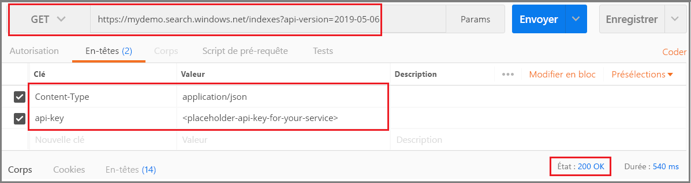

# <a name="tutorial-create-a-custom-analyzer-for-phone-numbers"></a>Tutoriel : Créer un analyseur personnalisé pour les numéros de téléphone

Les [analyseurs](search-analyzers.md) sont un composant clé de toute solution de recherche. Pour améliorer la qualité des résultats de la recherche, il est important de comprendre le fonctionnement des analyseurs et leur impact sur ces résultats.

Dans certains cas, comme dans celui d’un champ de texte libre, il suffit de sélectionner l’[analyseur de langage](index-add-language-analyzers.md) approprié pour améliorer les résultats de la recherche. Toutefois, dans d’autres scénarios comme la recherche de numéros de téléphone, d’URL ou d’e-mails, il peut être nécessaire de faire appel à des analyseurs personnalisés.

Ce tutoriel utilise Postman et les [API REST](https://docs.microsoft.com/rest/api/searchservice/) de Recherche cognitive Azure pour :

> [!div class="checklist"]
> * Expliquer le fonctionnement des analyseurs
> * Définir un analyseur personnalisé pour rechercher des numéros de téléphone
> * Tester la manière dont l’analyseur personnalisé génère des jetons à partir du texte
> * Créer des analyseurs distincts pour l’indexation et la recherche afin d’améliorer les résultats

## <a name="prerequisites"></a>Prérequis

Les services et outils suivants sont indispensables dans ce tutoriel.

+ [Application de bureau Postman](https://www.getpostman.com/)
+ [Créer](search-create-service-portal.md) ou [rechercher un service de recherche existant](https://ms.portal.azure.com/#blade/HubsExtension/BrowseResourceBlade/resourceType/Microsoft.Search%2FsearchServices)

## <a name="download-files"></a>Télécharger les fichiers

Le code source pour ce tutoriel se trouve dans le dossier [custom-analyzers](https://github.com/Azure-Samples/azure-search-postman-samples/tree/master/custom-analyzers) du dépôt GitHub [Azure-Samples/azure-search-postman-samples](https://github.com/Azure-Samples/azure-search-postman-samples).

## <a name="1---create-azure-cognitive-search-service"></a>1 - Créer un service Recherche cognitive Azure

Pour suivre ce didacticiel, vous avez besoin d’un service Recherche cognitive Azure, que vous pouvez [créer dans le portail](search-create-service-portal.md). Vous pouvez utiliser le niveau gratuit pour effectuer cette procédure pas à pas.

Pour l’étape suivante, vous devez connaître le nom de votre service de recherche et sa clé API. Si vous ne savez pas où trouver ces éléments, consultez ce [guide de démarrage rapide](search-create-service-portal.md#get-a-key-and-url-endpoint).


## <a name="2---set-up-postman"></a>2 - Configurer Postman

Ensuite, démarrez Postman et importez la collection que vous venez de télécharger à partir du dépôt [Azure-Samples/azure-search-postman-samples](https://github.com/Azure-Samples/azure-search-postman-samples).

Pour importer la collection, accédez à **Fichiers** > **Importer**, puis sélectionnez le fichier de collection à importer.

Pour chaque demande, vous devez effectuer les étapes suivantes :

1. Remplacez `<YOUR-SEARCH-SERVICE>` par le nom de votre service de recherche.

1. Remplacez `<YOUR-ADMIN-API-KEY>` par la clé primaire ou secondaire de votre service de recherche.

  

Si vous ne connaissez pas bien Postman, consultez [Explorer les API REST de Recherche cognitive Azure avec Postman](search-get-started-postman.md).

## <a name="3---create-an-initial-index"></a>3 - Créer un index initial

Dans cette étape, nous allons créer un index initial, charger des documents dans l’index, puis interroger les documents pour voir comment nos recherches initiales fonctionnent.

### <a name="create-index"></a>Créer un index

Nous allons commencer par créer un index simple appelé `tutorial-basic-index` avec deux champs : `id` et `phone_number`. Comme nous n’avons pas encore défini d’analyseur, l’analyseur `standard.lucene` est utilisé par défaut.

Pour créer l’index, nous envoyons la demande suivante :

```http
PUT https://<YOUR-SEARCH-SERVICE-NAME>.search.windows.net/indexes/tutorial-basic-index?api-version=2019-05-06
  Content-Type: application/json
  api-key: <YOUR-ADMIN-API-KEY>

  {
    "fields": [
      {
        "name": "id",
        "type": "Edm.String",
        "key": true,
        "searchable": true,
        "filterable": false,
        "facetable": false,
        "sortable": true
      },
      {
        "name": "phone_number",
        "type": "Edm.String",
        "sortable": false,
        "searchable": true,
        "filterable": false,
        "facetable": false
      }
    ]
  }
```

### <a name="load-data"></a>Charger les données

Ensuite, nous chargeons des données dans l’index. Dans certains cas, vous ne pouvez pas contrôler le format des numéros de téléphone ingérés. Nous allons donc tester plusieurs types de formats. Dans l’idéal, une solution de recherche retourne tous les numéros de téléphone correspondants, quel que soit leur format.

Les données sont chargées dans l’index à l’aide de la demande suivante : 

```http
POST https://<YOUR-SEARCH-SERVICE-NAME>.search.windows.net/indexes/tutorial-basic-index/docs/index?api-version=2019-05-06
  Content-Type: application/json
  api-key: <YOUR-ADMIN-API-KEY>

  {
    "value": [
      {
        "@search.action": "upload",  
        "id": "1",
        "phone_number": "425-555-0100"
      },
      {
        "@search.action": "upload",  
        "id": "2",
        "phone_number": "(321) 555-0199"
      },
      {  
        "@search.action": "upload",  
        "id": "3",
        "phone_number": "+1 425-555-0100"
      },
      {  
        "@search.action": "upload",  
        "id": "4",  
        "phone_number": "+1 (321) 555-0199"
      },
      {
        "@search.action": "upload",  
        "id": "5",
        "phone_number": "4255550100"
      },
      {
        "@search.action": "upload",  
        "id": "6",
        "phone_number": "13215550199"
      },
      {
        "@search.action": "upload",  
        "id": "7",
        "phone_number": "425 555 0100"
      },
      {
        "@search.action": "upload",  
        "id": "8",
        "phone_number": "321.555.0199"
      }
    ]  
  }
```

Une fois les données dans l’index, nous pouvons lancer la recherche.

### <a name="search"></a>Recherche

Pour rendre la recherche intuitive, il est préférable de partir du principe que les utilisateurs ne mettront pas en forme leurs requêtes d’une manière spécifique. Un utilisateur recherchant `(425) 555-0100` doit pouvoir entrer ce numéro dans n’importe lequel des formats ci-dessus et obtenir les résultats escomptés. Dans cette étape, nous allons tester quelques exemples de requêtes pour voir ce qu’elles donnent.

Commençons par rechercher `(425) 555-0100` :

```http
GET https://<YOUR-SEARCH-SERVICE-NAME>.search.windows.net/indexes/tutorial-basic-index/docs?api-version=2019-05-06&search=(425) 555-0100
  Content-Type: application/json
  api-key: <YOUR-ADMIN-API-KEY>  
```

Cette requête retourne **trois des quatre résultats attendus**, mais également **deux résultats inattendus** :

```json
{
    "value": [
        {
            "@search.score": 0.05634898,
            "phone_number": "+1 425-555-0100"
        },
        {
            "@search.score": 0.05634898,
            "phone_number": "425 555 0100"
        },
        {
            "@search.score": 0.05634898,
            "phone_number": "425-555-0100"
        },
        {
            "@search.score": 0.020766128,
            "phone_number": "(321) 555-0199"
        },
        {
            "@search.score": 0.020766128,
            "phone_number": "+1 (321) 555-0199"
        }
    ]
}
```

Recherchons ensuite un numéro sans mise en forme (`4255550100`).

```http
GET https://<YOUR-SEARCH-SERVICE-NAME>.search.windows.net/indexes/tutorial-basic-index/docs?api-version=2019-05-06&search=4255550100
  api-key: <YOUR-ADMIN-API-KEY>
```

Cette requête est encore pire puisqu’elle ne retourne qu’**un des quatre numéros correspondants**.

```json
{
    "value": [
        {
            "@search.score": 0.6015292,
            "phone_number": "4255550100"
        }
    ]
}
```

Si vous trouvez que ces résultats prêtent à confusion, vous n’êtes pas le seul. Dans la section suivante, nous allons examiner en détail pourquoi nous obtenons ces résultats.

## <a name="4---debug-search-results"></a>4 - Déboguer les résultats de la recherche

Pour comprendre les résultats de la recherche, nous devons d’abord comprendre le fonctionnement des analyseurs. Nous pourrons ensuite tester l’analyseur par défaut à l’aide de l’[API d’analyse de texte](https://docs.microsoft.com/rest/api/searchservice/test-analyzer), puis créer un analyseur qui répond à nos besoins.

### <a name="how-analyzers-work"></a>Fonctionnement des analyseurs

Un [analyseur](search-analyzers.md) est un composant du [moteur de recherche en texte intégral](search-lucene-query-architecture.md) chargé de traiter le texte dans les chaînes de requête et les documents indexés. La façon dont les différents analyseurs manipulent le texte varie en fonction du scénario. Pour ce scénario, nous devons créer un analyseur adapté aux numéros de téléphone.

Un analyseur comprend trois composants :

+ Des [**filtres de caractères**](#CharFilters) qui suppriment ou remplacent des caractères individuels du texte d’entrée.
+ Un [**générateur de jetons**](#Tokenizers) qui divise le texte d’entrée en jetons, lesquels deviennent des clés dans l’index de recherche.
+ Des [**filtres de jetons**](#TokenFilters) qui manipulent les jetons produits par le générateur de jetons.

Le diagramme ci-dessous vous montre comment ces trois composants fonctionnent ensemble pour générer des jetons à partir d’une phrase :

  

Ces jetons sont ensuite stockés dans un index inversé qui autorise des recherches rapides en texte intégral.  Pour cela, un index inversé mappe tous les termes uniques extraits durant l’analyse lexicale aux documents dans lesquels ils apparaissent. Le diagramme ci-dessous vous montre un exemple :

  

Toute la recherche se résume à rechercher les termes stockés dans l’index inversé. Quand un utilisateur émet une requête :

1. La requête est analysée et les termes de la requête sont analysés.
1. L’index inversé est ensuite analysé à la recherche de documents contenant des termes correspondants.
1. Enfin, les documents récupérés sont classés par l’[algorithme de similarité](index-ranking-similarity.md).

  

Si les termes de la requête ne correspondent pas aux termes de votre index inversé, aucun résultat n’est retourné. Pour en savoir plus sur le fonctionnement des requêtes, consultez cet article sur la [recherche en texte intégral](search-lucene-query-architecture.md).

> [!Note]
> Les [requêtes sur des termes partiels](search-query-partial-matching.md) constituent une exception importante à cette règle. Contrairement aux requêtes sur des termes réguliers, ces requêtes (requêtes avec des préfixes, des caractères génériques ou des expressions régulières) contournent le processus d’analyse lexicale. Les termes partiels sont uniquement mis en minuscules avant d’être mis en correspondance avec les termes de l’index. Si un analyseur n’est pas configuré pour prendre en charge ces types de requêtes, vous obtenez souvent des résultats inattendus dans la mesure où les termes correspondants n’existent pas dans l’index.

### <a name="test-analyzer-using-the-analyze-text-api"></a>Analyseur de test utilisant l’API d’analyse de texte

Recherche cognitive Azure fournit une [API d’analyse de texte](https://docs.microsoft.com/rest/api/searchservice/test-analyzer) qui vous permet de tester les analyseurs pour comprendre comment ils traitent le texte.

Pour appeler l’API d’analyse de texte, utilisez la requête suivante :

```http
POST https://<YOUR-SEARCH-SERVICE-NAME>.search.windows.net/indexes/tutorial-basic-index/analyze?api-version=2019-05-06
  Content-Type: application/json
  api-key: <YOUR-ADMIN-API-KEY>

  {
      "text": "(425) 555-0100",
      "analyzer": "standard.lucene"
  }
```

L’API retourne ensuite une liste des jetons extraits du texte. Vous pouvez voir que l’analyseur Lucene standard divise le numéro de téléphone en trois jetons distincts :

```json
{
    "tokens": [
        {
            "token": "425",
            "startOffset": 1,
            "endOffset": 4,
            "position": 0
        },
        {
            "token": "555",
            "startOffset": 6,
            "endOffset": 9,
            "position": 1
        },
        {
            "token": "0100",
            "startOffset": 10,
            "endOffset": 14,
            "position": 2
        }
    ]
}
```

À l’inverse, le numéro de téléphone `4255550100` mis en forme sans ponctuation produit un seul jeton.

```json
{
  "text": "4255550100",
  "analyzer": "standard.lucene"
}
```

```json
{
    "tokens": [
        {
            "token": "4255550100",
            "startOffset": 0,
            "endOffset": 10,
            "position": 0
        }
    ]
}
```

Gardez à l’esprit que les termes de la requête et les documents indexés sont analysés. Si vous repensez aux résultats de la recherche obtenus à l’étape précédente, vous pouvez commencer à comprendre pourquoi ces résultats ont été retournés.

Dans la première requête, des numéros de téléphone incorrects ont été retournés, car ils contenaient le terme `555` qui faisait partie des termes recherchés. Dans la deuxième requête, un seul numéro a été retourné parce qu’un seul enregistrement contenait un terme correspondant à `4255550100`.

## <a name="5---build-a-custom-analyzer"></a>5 - Créer un analyseur personnalisé

Maintenant que nous comprenons les résultats que nous avons obtenus, nous allons créer un analyseur personnalisé pour améliorer la logique de génération de jetons.

L’objectif est de pouvoir rechercher de manière intuitive des numéros de téléphone, quel que soit le format de la requête ou de la chaîne indexée. Pour y parvenir, nous allons spécifier un [filtre de caractères](#CharFilters), un [générateur de jetons](#Tokenizers) et un [filtre de jetons](#TokenFilters).

<a name="CharFilters"></a>

### <a name="character-filters"></a>Filtres de caractères

Les filtres de caractères permettent de traiter le texte avant de l’envoyer au générateur de jetons. Les filtres de caractères sont couramment utilisés pour rejeter des éléments HTML ou remplacer des caractères spéciaux.

Pour les numéros de téléphone, nous voulons supprimer les espaces blancs et les caractères spéciaux, car tous les formats de numéro de téléphone ne contiennent pas les mêmes caractères spéciaux et espaces.

```json
"charFilters": [
    {
      "@odata.type": "#Microsoft.Azure.Search.MappingCharFilter",
      "name": "phone_char_mapping",
      "mappings": [
        "-=>",
        "(=>",
        ")=>",
        "+=>",
        ".=>",
        "\\u0020=>"
      ]
    }
  ]
```

Le filtre ci-dessus supprime `-` `(` `)` `+` `.` et les espaces de l’entrée.

|Entrée|Output|  
|-|-|  
|`(321) 555-0199`|`3215550199`|  
|`321.555.0199`|`3215550199`|

<a name="Tokenizers"></a>

### <a name="tokenizers"></a>Générateurs de jetons

Les générateurs de jetons divisent le texte en jetons et rejettent certains caractères, comme les signes de ponctuation, au cours du processus. Dans de nombreux cas, l’objectif de la génération de jetons est de diviser une phrase en mots individuels.

Pour ce scénario, nous allons utiliser le générateur de jetons `keyword_v2` pour capturer le numéro de téléphone comme un terme unique. Notez qu’il existe d’autres moyens de résoudre ce problème. Pour les voir, consultez la section [Autres approches](#Alternate) ci-dessous.

Les générateurs de jetons (mots clés) génèrent toujours le même texte que celui qu’ils ont reçu sous la forme d’un terme unique.

|Entrée|Output|  
|-|-|  
|`The dog swims.`|`[The dog swims.]`|  
|`3215550199`|`[3215550199]`|

<a name="TokenFilters"></a>

### <a name="token-filters"></a>Filtres de jeton

Les filtres de jetons rejettent ou modifient les jetons générés par le générateur de jetons. Un filtre de jetons est couramment utilisé pour mettre en minuscules pour tous les caractères à l’aide d’un filtre de jeton. Une autre utilisation courante consiste à rejeter les mots vides comme `the`, `and` ou `is`.

Bien que nous n’ayons pas besoin d’utiliser l’un de ces filtres dans ce scénario, nous allons utiliser un filtre de jetons n-gramme pour pouvoir effectuer des recherches partielles de numéros de téléphone.

```json
"tokenFilters": [
  {
    "@odata.type": "#Microsoft.Azure.Search.NGramTokenFilterV2",
    "name": "custom_ngram_filter",
    "minGram": 3,
    "maxGram": 20
  }
]
```

#### <a name="ngramtokenfilterv2"></a>NGramTokenFilterV2

Le [filtre de jetons nGram_v2](https://lucene.apache.org/core/6_6_1/analyzers-common/org/apache/lucene/analysis/ngram/NGramTokenFilter.html) divise les jetons en n-grammes d’une taille donnée en fonction des paramètres `minGram` et `maxGram`.

Pour l’analyseur de numéros de téléphone, nous définissons `minGram` avec la valeur `3`, car nous ne nous attendons pas à ce que les utilisateurs recherchent des sous-chaînes plus courtes. Nous définissons `maxGram` avec la valeur `20` pour nous assurer que tous les numéros de téléphone, même ceux avec des extensions, tiennent dans un seul n-gramme.

 Malheureusement, la génération de faux positifs est un effet secondaire des n-grammes. Nous corrigerons ce problème à l’étape 7 en créant un analyseur distinct pour les recherches qui n’inclut pas le filtre de jeton n-gramme.

|Entrée|Output|  
|-|-|  
|`[12345]`|`[123, 1234, 12345, 234, 2345, 345]`|  
|`[3215550199]`|`[321, 3215, 32155, 321555, 3215550, 32155501, 321555019, 3215550199, 215, 2155, 21555, 215550, ... ]`|

### <a name="analyzer"></a>Analyseur

Une fois les filtres de caractères, le générateur de jetons et les filtres de jetons en place, nous sommes prêts à définir notre analyseur.

```json
"analyzers": [
  {
    "@odata.type": "#Microsoft.Azure.Search.CustomAnalyzer",
    "name": "phone_analyzer",
    "tokenizer": "custom_tokenizer_phone",
    "tokenFilters": [
      "custom_ngram_filter"
    ],
    "charFilters": [
      "phone_char_mapping"
    ]
  }
]
```

|Entrée|Output|  
|-|-|  
|`12345`|`[123, 1234, 12345, 234, 2345, 345]`|  
|`(321) 555-0199`|`[321, 3215, 32155, 321555, 3215550, 32155501, 321555019, 3215550199, 215, 2155, 21555, 215550, ... ]`|

Notez qu’il est possible de lancer une recherche sur n’importe lequel des jetons dans la sortie. Si notre requête contient l’un de ces jetons, le numéro de téléphone est retourné.

Une fois l’analyseur personnalisé défini, recréez l’index pour que l’analyseur personnalisé puisse être testé à l’étape suivante. Par souci de simplicité, la collection Postman crée un index nommé `tutorial-first-analyzer` avec l’analyseur que nous avons défini.

## <a name="6---test-the-custom-analyzer"></a>6 - Tester l’analyseur personnalisé

Une fois l’index créé, vous pouvez tester l’analyseur que nous avons créé à l’aide de la requête suivante :

```http
POST https://<YOUR-SEARCH-SERVICE-NAME>.search.windows.net/indexes/tutorial-first-analyzer/analyze?api-version=2019-05-06
  Content-Type: application/json
  api-key: <YOUR-ADMIN-API-KEY>  

  {
    "text": "+1 (321) 555-0199",
    "analyzer": "phone_analyzer"
  }
```

Vous pouvez alors voir la collection de jetons résultant du numéro de téléphone :

```json
{
    "tokens": [
        {
            "token": "132",
            "startOffset": 1,
            "endOffset": 17,
            "position": 0
        },
        {
            "token": "1321",
            "startOffset": 1,
            "endOffset": 17,
            "position": 0
        },
        {
            "token": "13215",
            "startOffset": 1,
            "endOffset": 17,
            "position": 0
        },
        ...
        ...
        ...
    ]
}
```

## <a name="7---build-a-custom-analyzer-for-queries"></a>7 - Créer un analyseur personnalisé pour les requêtes

Après avoir exécuté quelques exemples de requêtes sur l’index à l’aide de l’analyseur personnalisé, vous constatez que le rappel a été amélioré et que tous les numéros de téléphone correspondants sont désormais retournés. Toutefois, le filtre de jetons n-gramme retourne également quelques faux positifs. Il s’agit d’un effet secondaire courant avec les fitres de jetons n-gramme.

Pour éviter les faux positifs, nous allons créer un analyseur distinct pour l’interrogation. Cet analyseur est identique à celui que nous avons déjà créé, mais **sans** le filtre `custom_ngram_filter`.

```json
    {
      "@odata.type": "#Microsoft.Azure.Search.CustomAnalyzer",
      "name": "phone_analyzer_search",
      "tokenizer": "custom_tokenizer_phone",
      "tokenFilters": [],
      "charFilters": [
        "phone_char_mapping"
      ]
    }
```

Dans la définition de l’index, nous spécifions un `indexAnalyzer` et un `searchAnalyzer`.

```json
    {
      "name": "phone_number",
      "type": "Edm.String",
      "sortable": false,
      "searchable": true,
      "filterable": false,
      "facetable": false,
      "indexAnalyzer": "phone_analyzer",
      "searchAnalyzer": "phone_analyzer_search"
    }
```

Une fois ce changement effectué, tout est prêt. Recréez l’index, indexez les données et retestez les requêtes pour vérifier que la recherche fonctionne comme prévu. Si vous utilisez la collection Postman, un troisième index nommé `tutorial-second-analyzer` est créé.

<a name="Alternate"></a>

## <a name="alternate-approaches"></a>Autres approches

L’analyseur ci-dessus a été conçu pour optimiser la flexibilité de la recherche. Toutefois, il en résulte le stockage de nombreux termes potentiellement sans importance dans l’index.

L’exemple ci-dessous montre un autre analyseur qui peut également être utilisé pour cette tâche. 

L’analyseur fonctionne bien, sauf pour les données d’entrée de type `14255550100` qui rendent difficile la segmentation logique du numéro de téléphone. Par exemple, l’analyseur ne peut pas séparer l’indicatif du pays, `1`, de l’indicatif régional `425`. En raison de ce problème, le numéro ci-dessus n’est pas retourné si un utilisateur n’inclut pas l’indicatif du pays dans sa recherche.

```json
"analyzers": [
  {
    "@odata.type": "#Microsoft.Azure.Search.CustomAnalyzer",
    "name": "phone_analyzer_shingles",
    "tokenizer": "custom_tokenizer_phone",
    "tokenFilters": [
      "custom_shingle_filter"
    ]
  }
],
"tokenizers": [
  {
    "@odata.type": "#Microsoft.Azure.Search.StandardTokenizerV2",
    "name": "custom_tokenizer_phone",
    "maxTokenLength": 4
  }
],
"tokenFilters": [
  {
    "@odata.type": "#Microsoft.Azure.Search.ShingleTokenFilter",
    "name": "custom_shingle_filter",
    "minShingleSize": 2,
    "maxShingleSize": 6,
    "tokenSeparator": ""
  }
]
```

Vous pouvez voir dans l’exemple ci-dessous que le numéro de téléphone est divisé en blocs que recherchent normalement les utilisateurs.

|Entrée|Output|  
|-|-|  
|`(321) 555-0199`|`[321, 555, 0199, 321555, 5550199, 3215550199]`|

Selon vos besoins, cette approche peut être plus efficace pour résoudre le problème.

## <a name="reset-and-rerun"></a>Réinitialiser et réexécuter

Pour rester simple, ce tutoriel vous a demandé de créer trois index. Toutefois, il est courant de supprimer et de recréer les index au cours des premières phases du développement. Vous pouvez supprimer un index dans le portail Azure ou à l’aide de l’appel d’API suivant :

```http
DELETE https://<YOUR-SEARCH-SERVICE-NAME>.search.windows.net/indexes/tutorial-basic-index?api-version=2019-05-06
  api-key: <YOUR-ADMIN-API-KEY>
```

## <a name="takeaways"></a>Éléments importants à retenir

Dans ce tutoriel, vous avez vu le processus de création et de test d’un analyseur personnalisé. Vous avez créé un index, indexé les données, puis interrogé l’index pour voir les résultats de la recherche retournés. Ensuite, vous avez utilisé l’API d’analyse de texte pour voir le processus d’analyse lexicale en action.

Bien que l’analyseur défini dans ce tutoriel offre une solution simple de recherche de numéros de téléphone, vous pouvez suivre ce même processus afin de créer un analyseur personnalisé pour n’importe quel scénario.

## <a name="clean-up-resources"></a>Nettoyer les ressources

Quand vous travaillez dans votre propre abonnement, il est judicieux à la fin d’un projet de supprimer les ressources dont vous n’avez plus besoin. Les ressources laissées en cours d’exécution peuvent vous coûter de l’argent. Vous pouvez supprimer les ressources une par une, ou choisir de supprimer le groupe de ressources afin de supprimer l’ensemble des ressources.

Vous pouvez rechercher et gérer les ressources dans le portail à l’aide des liens Toutes les ressources ou Groupes de ressources situés dans le volet de navigation de gauche.

## <a name="next-steps"></a>Étapes suivantes

Maintenant que vous savez comment créer un analyseur personnalisé, examinons les différents filtres, générateurs de jetons et analyseurs disponibles pour créer une expérience de recherche enrichie.

> [!div class="nextstepaction"]
> [Analyseurs personnalisés dans Recherche cognitive Azure](index-add-custom-analyzers.md)
