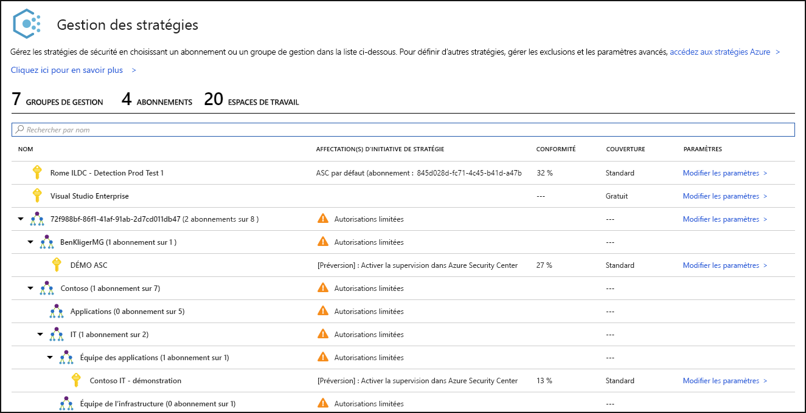
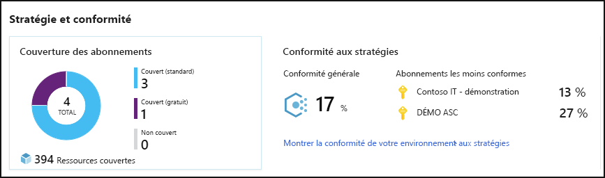
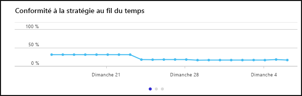
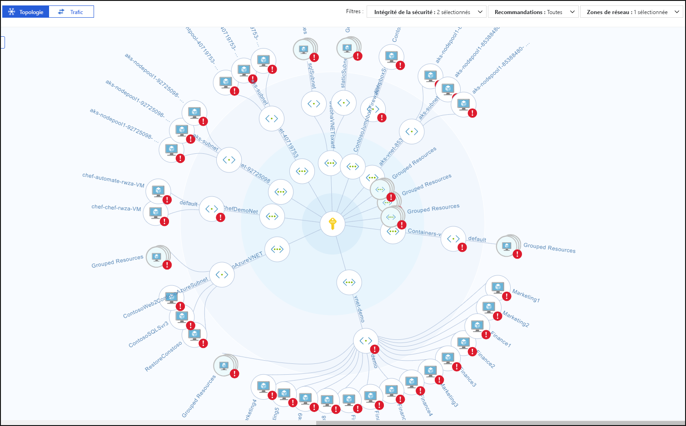
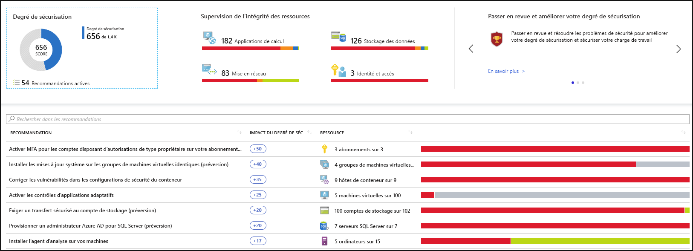
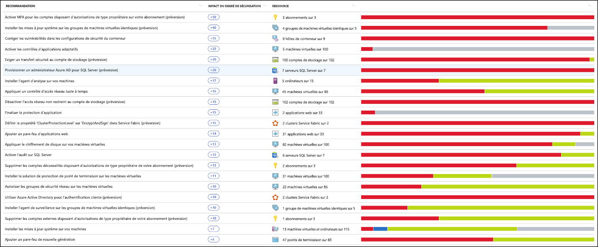
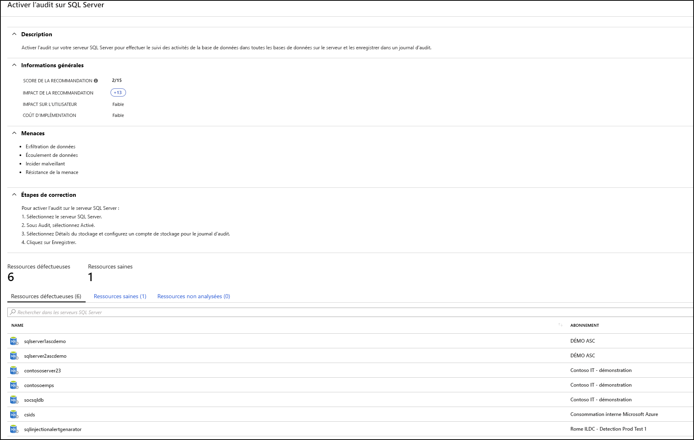
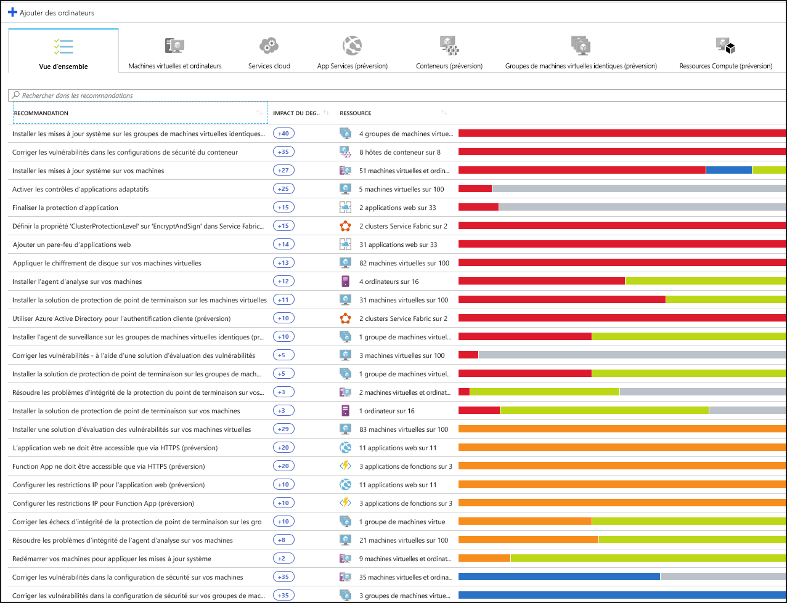
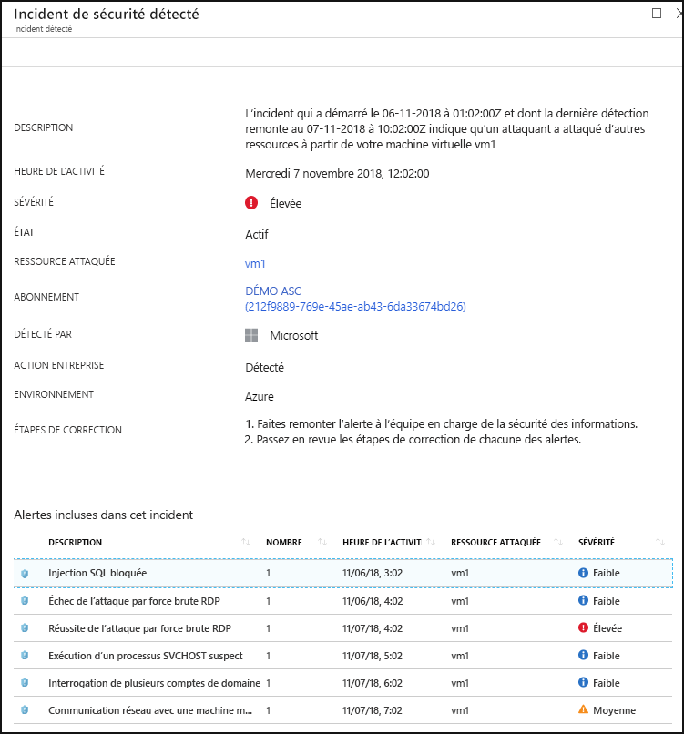

# Qu’est-ce que le Centre de sécurité Azure ?

Azure Security Center est un système de gestion de la sécurité de l’infrastructure unifié qui renforce la posture de sécurité de vos centres de données et fournit une protection avancée contre les menaces pour vos charges de travail hybrides dans le cloud (dans Azure ou non), ainsi qu’en local.

La protection de vos ressources dépend d’un effort conjoint entre votre fournisseur de cloud, Azure et vous, le client. Vous devez vous assurer que vos charges de travail sont sécurisées à mesure que vous effectuez votre transition vers le cloud, et dans le même temps, lorsque vous passez à IaaS (infrastructure as a service), la responsabilité qui incombe au client devient plus importante que celle des approches PaaS (platform as a service) et SaaS (software as a service). Azure Security Center vous propose les outils nécessaires pour renforcer votre réseau, sécuriser vos services et garantir que votre posture de sécurité est optimale.

Azure Security Center traite les trois problèmes de sécurité les plus urgents :

-   **Charges de travail évoluant rapidement** : c’est à la fois une force et un défi du cloud. D’une part, les utilisateurs finals sont responsabilisés pour en faire davantage. D’autre part, comment pouvez-vous garantir que les services qui changent en permanence, utilisés et créés par les utilisateurs répondent à vos normes de sécurité et suivent les meilleures pratiques en la matière ?

-   **Attaques de plus en plus sophistiquées** : quel que soit l’emplacement d’exécution de vos charges de travail, les attaques gagnent en sophistication. Vous devez sécuriser vos charges de travail de cloud public, qui sont des charges de travail sur Internet ouvrant la porte à davantage de vulnérabilités si vous ne suivez pas les meilleures pratiques de sécurité.

-   **Rareté des compétences de sécurité** : le nombre d’alertes de sécurité et de systèmes d’alertes dépasse de loin celui des administrateurs dotés de l’expérience et de la formation nécessaires pour garantir la protection de vos environnements. Se tenir au courant des dernières attaques est un défi constant et requiert un certain dynamisme pour suivre le rythme de l’évolution du monde de la sécurité.

Pour vous aider à vous protéger contre ces problèmes, Security Center vous offre les outils nécessaires pour :

-   **Renforcer la posture de sécurité** : Security Center évalue votre environnement. Il vous permet de comprendre l’état de vos ressources et de savoir si elles sont sécurisées.

-   **Vous protéger contre les menaces** : Security Center évalue vos charges de travail et émet des recommandations de prévention contre les menaces et des alertes de sécurité.

-   **Être plus rapidement en sécurité** : Dans Security Center, toutes les opérations sont réalisées à la vitesse du cloud. Étant donné qu’il est intégré en mode natif, le déploiement de Security Center est facile, vous offrant un provisionnement automatique et une protection avec les services Azure.

[!INCLUDE [azure-lighthouse-supported-service](../../includes/azure-lighthouse-supported-service.md)]

## Architecture

Security Center faisant nativement partie d’Azure, les services PaaS dans Azure (notamment Service Fabric, les bases de données SQL et les comptes de stockage) sont surveillés et protégés par Security Center sans qu’un déploiement ne soit nécessaire.

En outre, Security Center protège les serveurs et machines virtuelles autres qu’Azure dans le cloud ou localement, pour les serveurs Windows et Linux, en installant l’agent Log Analytics sur ces derniers. Les machines virtuelles Azure sont approvisionnées automatiquement dans Security Center.

Les événements collectés à partir des agents et d’Azure sont corrélés dans le moteur d’analytique de sécurité pour vous fournir des recommandations personnalisées (tâches de renforcement) à suivre pour garantir que vos charges de travail sont sécurisées. Des alertes de sécurité sont également mises en place. Vous devez examiner ces alertes dès que possible pour vous assurer qu’il n’y a pas d’attaques malveillantes en cours sur vos charges de travail.

Quand vous activez Security Center, la stratégie de sécurité intégrée à Security Center est reflétée dans Azure Policy en tant qu’initiative intégrée sous la catégorie Security Center. L’initiative intégrée est automatiquement affectée à tous les abonnements Security Center inscrits (niveaux Gratuit ou Standard). L’initiative intégrée contient uniquement les stratégies d’audit. Pour plus d’informations sur les stratégies Security Center dans Azure Policy, consultez [Utilisation des stratégies de sécurité](tutorial-security-policy.md).

## Renforcer la posture de sécurité

Azure Security Center vous permet de renforcer votre posture de sécurité. Cela signifie qu’il vous aide à identifier et à effectuer les tâches de renforcement recommandées en tant que meilleures pratiques de sécurité et à les implémenter sur vos machines, services de données et applications. Cela inclut de gérer et d’appliquer vos stratégies de sécurité, et de garantir que vos machines virtuelles Azure, serveurs autres qu’Azure et services PaaS Azure sont conformes. Security Center vous offre les outils dont vous avez besoin pour bénéficier d’une vue d’ensemble sur vos charges de travail et d’une visibilité accrue sur votre espace de sécurité réseau. 

### Gérer la conformité et la stratégie de sécurité de l’organisation

Garantir la sécurité de vos charges de travail est une règle de base en matière de sécurité, et cela commence par la mise en place de stratégies de sécurité personnalisées. Étant donné que toutes les stratégies dans Security Center reposent sur des contrôles de stratégie Azure, vous obtenez la palette complète et la flexibilité d’une **solution de stratégie de niveau international**. Dans Security Center, vous pouvez définir vos stratégies de façon qu’elles s’exécutent sur des groupes d’administration, dans l’ensemble des abonnements et même pour un locataire.

Security Center vous aide à **identifier les abonnements Shadow IT**. En examinant les abonnements étiquetés **non couverts** de votre tableau de bord, vous pouvez savoir immédiatement quels sont les abonnements nouvellement créés et vous assurer qu’ils sont couverts par vos stratégies, en plus d’être protégés par Azure Security Center.

Les capacités de surveillance avancées dans Security Center vous permettent également de **suivre et gérer la conformité et la gouvernance au fil du temps**. La **conformité globale** vous offre une mesure exprimant la quantité d’abonnements conformes aux stratégies associées à votre charge de travail. 

### Évaluations continues

Security Center détecte en continu les nouvelles ressources déployées dans vos charges de travail en permanence et évalue si elles sont configurées conformément aux meilleures pratiques de sécurité. Si ce n’est pas le cas, elles sont marquées d’un drapeau et vous obtenez une liste de recommandations classées par ordre de priorité sur les éléments à corriger pour protéger vos machines.

L’un des outils les plus puissants fournis par Security Center pour surveiller en continu l’état de votre réseau est le **mappage réseau**. Le mappage vous permet de visualiser la topologie de vos charges de travail, afin que vous puissiez vérifier que chaque nœud est bien configuré. Vous pouvez voir de quelle façon vos nœuds sont connectés, ce qui vous permet de bloquer les connexions indésirables qui pourraient simplifier l’accès d’un attaquant à votre réseau.

Security Center fait un pas de plus dans la simplification de l’atténuation de vos alertes de sécurité en ajoutant un **score de sécurité**. Les scores de sécurité sont désormais associés à chaque recommandation que vous recevez pour vous aider à comprendre l’importance de chacune d’elles vis-à-vis de votre situation de sécurité globale. Cela est essentiel pour vous permettre de **prioriser votre travail de sécurité**.

### Optimiser et améliorer la sécurité en configurant les contrôles recommandés

La valeur même d’Azure Security Center repose dans ses recommandations. Elles sont adaptées aux problèmes de sécurité particuliers trouvés sur vos charges de travail, et Security Center effectue les tâches d’un administrateur de sécurité pour vous en recherchant vos vulnérabilités et en vous spécifiant des instructions pour les supprimer.

De cette façon, Security Center vous permet non seulement de définir des stratégies de sécurité, mais aussi d’appliquer des normes de configuration sécurisées sur vos ressources.

Les recommandations vous aident à réduire la surface d’attaque de chacune de vos ressources. Cela inclut les machines virtuelles Azure, les serveurs autres qu’Azure et les services PaaS Azure comme les comptes Stockage et SQL, entre autres, où chaque type de ressource est évalué différemment et a ses propres normes.

## Vous protéger contre les menaces

La protection contre les menaces de Security Center vous permet de détecter et de prévenir les menaces au niveau de la couche Infrastructure as a Service (IaaS), des serveurs autres qu’Azure et pour les solutions Platform as Service (PaaS) dans Azure.

La protection contre les menaces Security Center inclut l’analyse de la chaîne de frappe de fusion, qui corrèle automatiquement les alertes dans votre environnement en fonction de l’analyse de la chaîne cybercriminelle, pour vous aider à mieux comprendre l’intégralité de l’histoire d’une campagne d’attaque, là où elle a commencé et le type d’impact sur vos ressources.

### Intégration à Microsoft Defender Advanced Threat Protection

Security Center comprend une intégration automatique et native à Microsoft Defender Advanced Threat Protection. Cela signifie que, sans aucune configuration, vos machines Windows et Linux sont entièrement intégrés aux recommandations et évaluations de Security Center.

En outre, Security Center vous permet d’automatiser les stratégies de contrôle d’application sur des environnements de serveur. Les contrôles d’application adaptatifs dans Security Center activent une liste verte d’applications de bout en bout entre vos serveurs Windows. Vous n’avez pas besoin de créer de règles et de vérifier les violations, tout est fait automatiquement pour vous.

### Protéger PaaS

Security Center vous permet de détecter les menaces sur les services PaaS Azure. Vous pouvez détecter les menaces ciblant les services Azure, notamment Azure App Service, Azure SQL, Stockage Microsoft Azure et d’autres services de données. Vous pouvez également tirer parti de l’intégration native avec le processus User and Entity Behavioral Analytics (UEBA) de Microsoft Cloud App Security pour effectuer la détection d’anomalie sur vos journaux d’activité Azure.

### Bloquer les attaques par force brute

Security Center vous permet de limiter l’exposition aux attaques par force brute. En réduisant l’accès aux ports de la machine virtuelle, à l’aide de l’accès à la machine virtuelle juste-à-temps, vous pouvez renforcer votre réseau en empêchant les accès inutiles. Vous pouvez définir des stratégies d’accès sécurisées sur les ports sélectionnés, juste pour les utilisateurs autorisés, les adresses IP ou les plages d’adresses IP sources autorisées et pour une durée limitée.

### Protéger les services de données

Security Center inclut des fonctionnalités qui vous aident à effectuer la classification automatique de vos données dans Azure SQL. Vous pouvez également obtenir des évaluations pour les vulnérabilités potentielles sur les services Stockage et Azure SQL, ainsi que des recommandations pour les atténuer.

### Protéger les charges de travail de cloud hybride et IoT

Azure Security Center pour IoT (Internet des objets) simplifie la protection des charges de travail hybrides en offrant une visibilité et un contrôle unifiés, une prévention adaptative des menaces, ainsi qu’une protection intelligente contre les menaces et une réponse intelligente à ces dernières sur l’ensemble des charges de travail exécutées à la périphérie, localement, dans Azure et dans d’autres clouds. Pour plus d’informations, consultez [Azure Security Center pour IoT](https://docs.microsoft.com/azure/asc-for-iot/).

## Être plus rapidement en sécurité

L’intégration Azure native (y compris Azure Policy et Azure Monitor) associée à une intégration transparente à d’autres solutions de sécurité, telles que Microsoft Cloud App Security et Windows Defender Advanced Threat Protection, garantit l’exhaustivité de votre solution de sécurité, ainsi que sa simplicité d’installation et de déploiement.

En outre, vous pouvez étendre la solution complète au-delà d’Azure, par exemple à des charges de travail exécutées sur d’autres clouds et dans des centres de données en local.

### Détecter et intégrer automatiquement des ressources Azure

Security Center fournit une intégration transparente et native à Azure et aux ressources Azure. Cela signifie que vous pouvez mettre en place une approche de sécurité complète impliquant Azure Policy et les stratégies Security Center intégrées sur toutes vos ressources Azure, et vous assurer qu’elle est automatiquement appliquée aux ressources détectées à mesure que vous les créez dans Azure.

Collecte de journaux d’activité complète : les journaux d’activité de Windows et Linux sont exploités dans le moteur d’analyse de sécurité et utilisés pour créer des recommandations et des alertes.

## Étapes suivantes

- Pour utiliser le Centre de sécurité, vous devez disposer d’un abonnement à Microsoft Azure. Si vous n’avez pas d’abonnement, vous pouvez vous inscrire à un [essai gratuit](https://azure.microsoft.com/free/).

- Le niveau tarifaire gratuit de Security Center est activé sur tous vos abonnements Azure en cours après votre première consultation du tableau de bord Azure Security Center dans le portail Azure. Il peut aussi être activé par programmation par le biais d’une API. Pour tirer parti des fonctionnalités avancées de gestion de la sécurité et de détection des menaces, vous devez effectuer une mise à niveau vers le niveau tarifaire Standard. Le niveau standard peut être essayé gratuitement pendant 30 jours. Pour plus d’informations, consultez la [page de tarification de Security Center](https://azure.microsoft.com/pricing/details/security-center/).

- Si vous êtes prêt à activer Security Center Standard, l’article [Démarrage rapide : Intégrer un abonnement Azure à Security Center Standard](security-center-get-started.md) vous accompagne tout au long du processus.