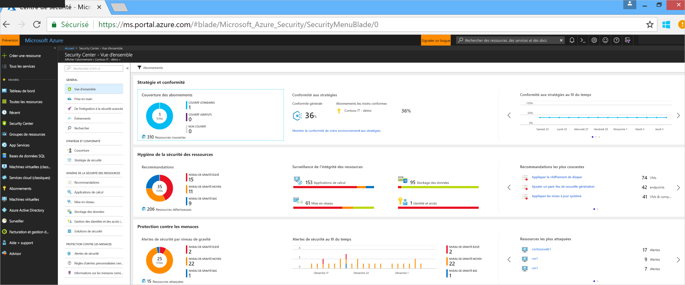
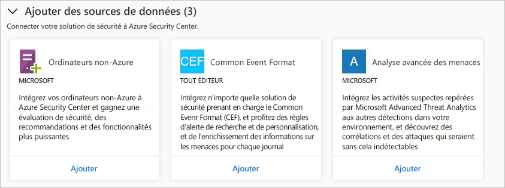
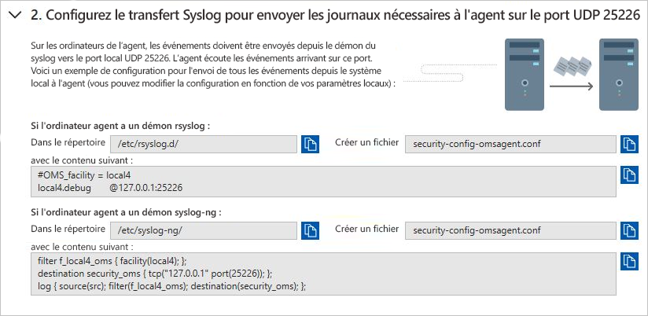
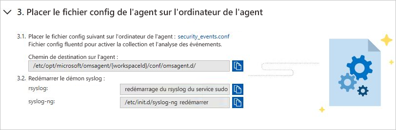
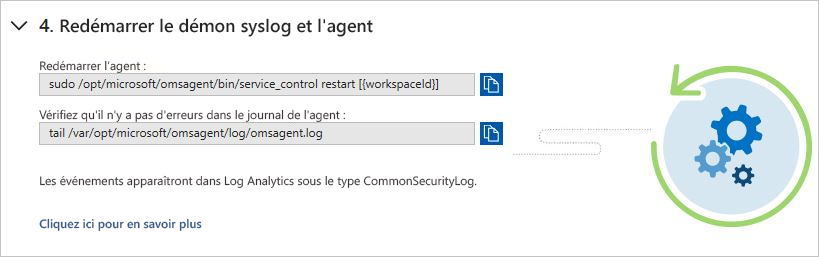
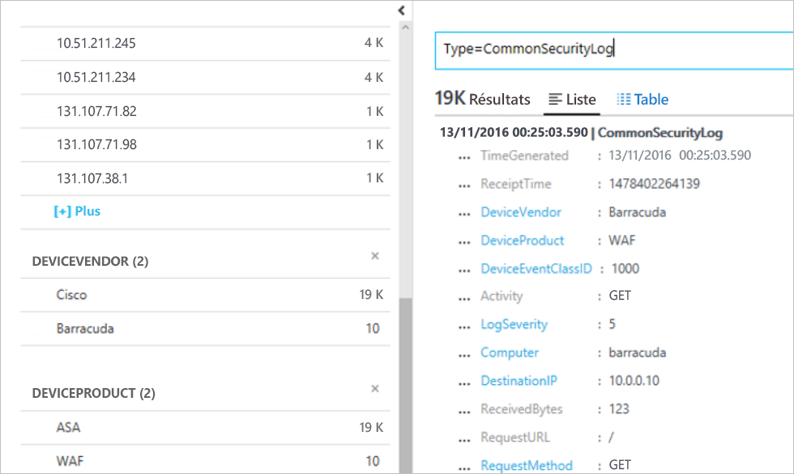

# Intégrer des solutions de sécurité dans Azure Security Center
Ce document vous aide à gérer les solutions de sécurité déjà connectées à Azure Security Center et à en ajouter de nouvelles.

## Solutions de sécurité Azure intégrées
Security Center simplifie l’activation des solutions de sécurité intégrées dans Azure. Voici les avantages :

- **Déploiement simplifié** : Security Center permet un provisionnement simplifié des solutions de partenaire intégrées. Pour des solutions comme les logiciels anti-programme malveillant et l’évaluation des vulnérabilités, Security Center peut approvisionner l’agent nécessaire sur vos machines virtuelles. En outre, pour les appliances de pare-feu, Security Center peut se charger d’une grande partie de la configuration réseau nécessaire.
- **Détections intégrées** : les événements de sécurité des solutions de partenaire sont automatiquement collectés, agrégés et affichés dans le cadre des alertes et des incidents de Security Center. Ces événements sont également fusionnés avec les détections d’autres sources pour fournir des fonctions de détection de menaces avancées.
- **Gestion et surveillance unifiées de l’intégrité** : Les clients peuvent utiliser des événements d’intégrité intégrés pour surveiller facilement les solutions des partenaires. La gestion de base offre un accès facile à la configuration avancée avec la solution de partenaire.

Actuellement, les solutions de sécurité intégrées comprennent :

- Pare-feu d’applications web ([Barracuda](https://www.barracuda.com/products/webapplicationfirewall), [F5](https://support.f5.com/kb/en-us/products/big-ip_asm/manuals/product/bigip-ve-web-application-firewall-microsoft-azure-12-0-0.html), [Imperva](https://www.imperva.com/Products/WebApplicationFirewall-WAF), [Fortinet](https://www.fortinet.com/products.html), [Azure Application Gateway](https://azure.microsoft.com/blog/azure-web-application-firewall-waf-generally-available/))
- Pare-feu de nouvelle génération ([Check Point](https://www.checkpoint.com/products/vsec-microsoft-azure/), [Barracuda](https://campus.barracuda.com/product/nextgenfirewallf/article/NGF/AzureDeployment/), [Fortinet](http://docs.fortinet.com/d/fortigate-fortios-handbook-the-complete-guide-to-fortios-5.2), [Cisco](http://www.cisco.com/c/en/us/td/docs/security/firepower/quick_start/azure/ftdv-azure-qsg.html) et [Palo Alto Networks](https://www.paloaltonetworks.com/products))
- Évaluation des vulnérabilités ([Qualys](https://www.qualys.com/public-clouds/microsoft-azure/) et [Rapid7](https://www.rapid7.com/products/insightvm/))

> [!NOTE]
> Security Center n’installe pas Microsoft Monitoring Agent sur les appliances virtuelles de partenaire, car la plupart des fournisseurs de sécurité n’autorisent pas l’exécution d’agents externes sur leur appliance.
>
>

## Comment sont intégrées les solutions de sécurité
Les solutions de sécurité Azure déployées à partir de Security Center sont automatiquement connectées. Vous pouvez également connecter d’autres sources de données de sécurité, notamment :

- Azure AD Identity Protection
- Ordinateurs exécutés en local ou dans d’autres clouds
- Solution de sécurité qui prend en charge le format CEF
- Microsoft Advanced Threat Analytics

## Gérer des solutions de sécurité Azure intégrées et d’autres sources de données

1. Connectez-vous au [Portail Azure](https://azure.microsoft.com/features/azure-portal/).

2. Dans le **menu Microsoft Azure**, sélectionnez **Security Center**. La fenêtre **Security Center - Vue d’ensemble** s’ouvre.

3. Dans le menu de Security Center, sélectionnez **Solutions de sécurité**.

  

Sous **Solutions de sécurité**, vous pouvez consulter des informations sur le fonctionnement des solutions de sécurité Azure intégrées et effectuer des tâches de gestion de base. Vous pouvez également connecter d’autres types de sources de données de sécurité, telles que des journaux de pare-feu et des alertes Azure AD Identity Protection au format CEF.

### Solutions connectées

La section **Solutions connectées** inclut des solutions de sécurité qui sont actuellement connectées à Security Center et des informations sur l’état de fonctionnement de chaque solution.  

L’état d’une solution de partenaire peut être :

* Sain (vert) : aucun problème d’intégrité.
* Défectueux (rouge) : problème d’intégrité nécessitant une action immédiate.
* Problèmes d’intégrité (orange) : état d’intégrité non signalé par la solution.
* Non signalé (gris) : état non encore signalé par la solution (ce qui peut être le cas si celle-ci a été récemment connectée et est en cours de déploiement), ou aucune donnée d’intégrité n’est disponible.

> [!NOTE]
> Si les données sur l’état d’intégrité ne sont pas disponibles, Security Center affiche la date et l’heure du dernier événement reçu pour indiquer si la solution signale ou non des données. Si aucune donnée d’intégrité n’est disponible et qu’aucune alerte n’a été reçue au cours des 14 derniers jours, Security Center indique que la solution est défectueuse ou qu’elle ne signale pas de données.
>
>

2. Sélectionnez **AFFICHAGE** pour obtenir des informations et des options supplémentaires, notamment :

  - **Console de solution**. Ouvre l’expérience de gestion pour cette solution.
  - **Associer la machine virtuelle**. Ouvre le panneau Associer les applications. Il vous permet de connecter des ressources à la solution de partenaire.
  - **Supprimer la solution**.
  - **Configurer**.

   

### Solutions découvertes

Security Center découvre automatiquement les solutions exécutées dans Azure mais qui ne sont pas connectées à Security Center. Elles sont ensuite affichées dans la section **Solutions découvertes**. Cela inclut les solutions Azure, telles que [Azure AD Identity Protection](https://docs.microsoft.com/azure/active-directory/active-directory-identityprotection), ainsi que les solutions partenaires.

> [!NOTE]
> Le niveau Standard de Security Center est requis au niveau de l’abonnement pour la fonctionnalité de découverte des solutions. Consultez [Tarification](security-center-pricing.md) pour en savoir plus sur les niveaux tarifaires de Security.
>
>

Sélectionne **CONNECTER** sous une solution pour l’intégrer à Security Center et être notifié sur les alertes de sécurité.

Security Center découvre aussi les solutions déployées dans l’abonnement, capables d’envoyer des journaux CEF (Common Event Format). Découvrez comment [Connecter une solution de sécurité](quick-security-solutions.md) qui utilise des journaux CEF dans Security Center.

### Ajouter des sources de données

La section **Ajouter des sources de données** comprend d’autres sources de données disponibles qui peuvent être connectées. Pour obtenir des instructions sur l’ajout de données à partir d’une de ces sources, cliquez sur **AJOUTER**.

### Connecter des solutions externes

En plus de la collecte de données de sécurité depuis vos ordinateurs, vous pouvez intégrer des données de sécurité à partir d’un éventail de solutions de sécurité, y compris celles prenant en charge le format d’événement commun (CEF). Le format CEF est un format standard du secteur en plus des messages Syslog. Il est utilisé par de nombreux fournisseurs de sécurité pour permettre l’intégration des événements entre différentes plateformes.

Ce démarrage rapide vous montre comment :
- Connecter une solution de sécurité à Security Center à l’aide des journaux CEF
- Valider la connexion avec la solution de sécurité

#### Prérequis
Pour utiliser le Centre de sécurité, vous devez disposer d’un abonnement à Microsoft Azure. Si vous n’avez pas d’abonnement, vous pouvez vous inscrire pour avoir un [compte gratuit](https://azure.microsoft.com/free/).

Pour effectuer ce démarrage rapide, vous devez utiliser le niveau tarifaire Standard de Security Center. Vous pouvez essayer Security Center Standard gratuitement. Le démarrage rapide [Intégrer votre abonnement Azure à Security Center Standard](security-center-get-started.md) vous guide dans la mise à niveau vers le plan Standard. Pour en savoir plus, consultez la [page de tarification](https://azure.microsoft.com/pricing/details/security-center/).

Vous avez également besoin d’une [machine Linux](https://docs.microsoft.com/azure/log-analytics/log-analytics-agent-linux), avec le service Syslog déjà connecté au Security Center.

#### Connecter une solution à l’aide du format CEF

1. Connectez-vous au [portail Azure](https://azure.microsoft.com/features/azure-portal/).
2. Dans le menu **Microsoft Azure**, sélectionnez **Security Center**. La fenêtre **Security Center - Vue d’ensemble** s’ouvre.

      

3. Dans le menu principal de Security Center, sélectionnez **Solutions de sécurité**.
4. Dans la page Solutions de sécurité, sous **Ajouter des sources de données (3)**, cliquez sur **Ajouter** sous **CEF (Common Event Format)**.

    

5. Dans la page Journaux CFE, développez la deuxième étape, **Configurer le transfert Syslog pour envoyer les journaux nécessaires à l’agent sur le port UDP 25226**, suivez les instructions ci-dessous sur votre ordinateur Linux :

    

6. Développez la troisième étape, **Placer le fichier de configuration de l’agent sur l’ordinateur de l’agent** et suivez les instructions ci-dessous sur votre ordinateur Linux :

    

7. Développez la quatrième étape, **Redémarrer le démon syslog et l’agent**et suivez les instructions ci-dessous dans votre ordinateur Linux :

    

#### Valider la connexion

Avant de suivre les étapes suivantes, vous devrez attendre que Syslog démarre la création de rapports à Security Center. Cela peut prendre un certain temps, variable en fonction de la taille de l’environnement.

1.  Dans le volet gauche du tableau de bord de Security Center, cliquez sur **Rechercher**.
2.  Sélectionnez l’espace de travail connecté à Syslog (machine Linux).
3.  Saisissez *CommonSecurityLog* et cliquez sur le bouton **Rechercher**.

L’exemple suivant montre le résultat de ces étapes : 

#### Supprimer des ressources
D’autres guides de démarrage rapide et didacticiels de cette collection reposent sur ce guide. Si vous envisagez de suivre les didacticiels et guides de démarrage rapide suivants, conservez le niveau Standard et gardez l’approvisionnement automatique activé. Dans le cas contraire, ou si vous voulez revenir au niveau Gratuit :

1. Revenez au menu principal de Security Center et sélectionnez **Stratégie de sécurité**.
2. Sélectionnez la stratégie ou l’abonnement pour lequel vous voulez revenir au niveau Gratuit. La fenêtre **Stratégie de sécurité** s’ouvre.
3. Dans **COMPOSANTS DE LA STRATÉGIE**, sélectionnez **Niveau tarifaire**.
4. Sélectionnez **Gratuit** pour modifier l’abonnement et passer du niveau Standard au niveau Gratuit.
5. Sélectionnez **Enregistrer**.

Si vous voulez désactiver l’approvisionnement automatique :

1. Revenez au menu principal de Security Center et sélectionnez **Stratégie de sécurité**.
2. Sélectionnez l’abonnement pour lequel vous souhaitez désactiver l’approvisionnement automatique.
3. Dans **Stratégie de sécurité : collecte de données**, sélectionnez **Désactivé** sous **Intégration** pour désactiver l’approvisionnement automatique.
4. Sélectionnez **Enregistrer**.

>[!NOTE]
> La désactivation de l’approvisionnement automatique ne supprime pas Microsoft Monitoring Agent des machines virtuelles Azure sur lesquelles l’agent a été approvisionné. La désactivation de l’approvisionnement automatique limite la surveillance de la sécurité pour vos ressources.
>

## Exportation de données vers un serveur SIEM

Les événements traités produits par Azure Security Center sont publiés dans le [journal d’activité](../monitoring-and-diagnostics/monitoring-overview-activity-logs.md) Azure, l’un des types de journaux disponibles avec Azure Monitor. Azure Monitor offre un pipeline centralisé pour router les données de monitoring dans un outil SIEM. Ces données sont acheminées vers un hub d’événements, d’où elles peuvent ensuite être extraites dans un outil partenaire.

Pour ce faire, est utilisé le [seul pipeline de monitoring Azure](../azure-monitor/platform/stream-monitoring-data-event-hubs.md) permettant d’accéder aux données de monitoring à partir de votre environnement Azure. Cela vous permet de configurer facilement des systèmes SIEM et des outils de monitoring pour consommer les données.

Les sections suivantes expliquent comment configurer les données à diffuser vers un hub d’événements. Les étapes partent du principe qu’Azure Security Center est déjà configuré dans votre abonnement Azure.

Vue d’ensemble globale

### Quelles sont les données de sécurité Azure exposées à SIEM ?

Dans cette version, nous exposons les [alertes de sécurité](../security-center/security-center-managing-and-responding-alerts.md). Dans les versions à venir, nous enrichirons le jeu de données avec des recommandations de sécurité.

### Comment configurer le pipeline

#### Création d’un concentrateur d’événements

Avant de commencer, vous devez [créer un espace de noms Event Hubs](../event-hubs/event-hubs-create.md). Cet espace de noms et cet hub d’événements sont la destination de toutes vos données de monitoring.

#### Diffuser en continu le journal des activités Azure sur les Event Hubs

Consultez l’article [Acheminer le journal des activités Azure vers Event Hubs](../azure-monitor/platform/activity-logs-stream-event-hubs.md).

#### Installer un connecteur SIEM partenaire 

Le routage de vos données de monitoring vers un hub d’événement avec Azure Monitor vous permet d’intégrer facilement des systèmes SIEM et des outils de monitoring partenaires.

Consultez le lien suivant pour afficher la liste des [systèmes SIEM pris en charge](../azure-monitor/platform/stream-monitoring-data-event-hubs.md#what-can-i-do-with-the-monitoring-data-being-sent-to-my-event-hub).

### Exemple d’interrogation de données 

Voici quelques exemples de requêtes Splunk que vous pouvez utiliser pour extraire des données d’alerte :

| **Description de la requête** | **Requête** |
|----|----|
| Toutes les alertes| index=main Microsoft.Security/locations/alerts|
| Résumer le nombre d’opérations par leur nom| index=main sourcetype="amal:security" \| table operationName \| stats count by operationName|
| Obtenir les informations des alertes : heure, nom, état, ID et abonnement | index=main Microsoft.Security/locations/alerts \| table \_time, properties.eventName, State, properties.operationId, am_subscriptionId |

## Étapes suivantes

Dans cet article, vous avez appris à intégrer des solutions de partenaires dans Security Center. Pour plus d’informations sur Security Center, consultez les articles suivants :

* [Connexion de Microsoft Advanced Threat Analytics à Azure Security Center](security-center-ata-integration.md)
* [Connecting Azure Active Directory Identity Protection to Azure Security Center](security-center-aadip-integration.md) (Connexion d’Azure Active Directory Identity Protection à Azure Security Center)
* [Surveillance de l’intégrité de la sécurité dans Security Center](security-center-monitoring.md). découvrez comment surveiller l’intégrité de vos ressources Azure.
* [Surveiller les solutions de partenaire avec Security Center](security-center-partner-solutions.md). découvrez comment surveiller l’état d’intégrité de vos solutions de partenaire.
* [Questions fréquentes : Azure Security Center](security-center-faq.md). Obtenez des réponses aux questions fréquentes concernant l’utilisation de Security Center.
* [Blog Azure Security](https://blogs.msdn.com/b/azuresecurity/). accédez à des billets de blog sur la sécurité et la conformité Azure.
