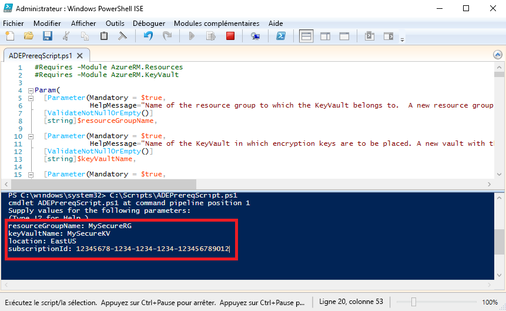

# <a name="quickstart-encrypt-a-windows-iaas-vm-with-azure-powershell"></a>Démarrage rapide : Chiffrer une machine virtuelle IaaS Windows avec Azure PowerShell

Azure Disk Encryption vous permet de chiffrer vos disques de machine virtuelle IaaS Windows et Linux. La solution est intégrée à Azure Key Vault pour faciliter le contrôle et la gestion des clés et des secrets de chiffrement des disques. En utilisant Azure Disk Encryption, vous pouvez vous assurer que vos machines virtuelles sont sécurisées au repos à l’aide de la technologie de chiffrement standard. Dans ce démarrage rapide, vous allez créer une machine virtuelle Windows Server 2016 et chiffrer le disque du système d’exploitation.

Si vous n’avez pas d’abonnement Azure, créez un [compte gratuit](https://azure.microsoft.com/free/?WT.mc_id=A261C142F) avant de commencer.

## <a name="prerequisites"></a>Prérequis

- Windows PowerShell ISE
- Installer ou mettre à jour la [dernière version du module AzureRM PowerShell](/powershell/azure/azurerm/install-azurerm-ps?view=azurermps-6.13.0)
    - La version du module AzureRM doit être 6.0.0 ou une version ultérieure. `Get-Module AzureRM -ListAvailable | Select-Object -Property Name,Version,Path`
- Une copie du [script de configuration d’Azure Disk Encryption](https://raw.githubusercontent.com/Azure/azure-powershell/master/src/Compute/Compute/Extension/AzureDiskEncryption/Scripts/AzureDiskEncryptionPreRequisiteSetup.ps1).
    - Si vous avez déjà ce script, téléchargez une nouvelle copie car il a été modifié récemment. 
    - Utilisez **CTRL-A** pour sélectionner tout le texte, puis utilisez **CTRL-C** pour le copier dans le bloc-notes.
    - Enregistrez le fichier sous le nom **ADEPrereqScript.ps1**


## <a name="sign-in-to-azure"></a>Connexion à Azure

1. Cliquez avec le bouton droit sur **Windows PowerShell ISE**, puis cliquez sur **Exécuter en tant qu’administrateur**.
1. Dans la fenêtre **Administrateur : Windows PowerShell ISE**, cliquez sur **Afficher** puis sur **Afficher le volet de script**.
1. Dans le volet script, tapez l’applet de commande suivante : 

     ```azurepowershell
      Connect-AzureRMAccount
     ```

1. Cliquez sur la flèche verte pour **exécuter le Script**, ou utilisez F5. 
2. Utiliser la connexion interactive pour terminer la connexion à votre compte Azure.
3. Copie votre **ID d’abonnement** retourné pour une utilisation dans l’exécution du script PowerShell suivant. 

## <a name="bkmk_PrereqScript"></a> Exécuter le script de configuration d’Azure Disk Encryption
 **ADEPrereqScript.ps1** va créer un groupe de ressources, un coffre de clés et définir la stratégie d’accès de coffre de clés. Le script crée également un verrou de ressource sur le coffre de clés pour aider à protéger contre une suppression accidentelle.  

1. Dans la fenêtre **Administrateur : Windows PowerShell ISE**, cliquez sur **Fichier** puis sur **Ouvrir**. Accédez au fichier **ADEPrereqScript.ps1**, puis double-cliquez dessus. Le script s’ouvre dans le volet de script.
2. Cliquez sur la flèche verte pour **exécuter le Script**, ou utilisez F5. 
3. Entrer des noms pour un nouveau **groupe de ressources** et un nouveau **coffre de clés**. N’utilisez pas un groupe de ressources ou un coffre de clés existants pour ce démarrage rapide dans la mesure où nous allons supprimer le groupe de ressources plus tard. 
4. Tapez l’emplacement où vous souhaitez créer les ressources, **Est des États-Unis** par exemple. Obtenez une liste d’emplacements avec `Get-AzureRMLocation`.
5. Copiez votre **ID d’abonnement**. Vous pouvez obtenir votre ID d’abonnement avec `Get-AzureRMSubscription`.  
6. Cliquez sur la flèche verte pour **exécuter le Script**. 
7. Copiez les textes **DiskEncryptionKeyVaultUrl** et **DiskEncryptionKeyVaultId** retournés pour une utilisation ultérieure.




## <a name="create-a-virtual-machine"></a>Création d'une machine virtuelle 
Vous devez maintenant créer une machine virtuelle afin de pouvoir chiffrer son disque. Le script que vous utiliserez crée une machine virtuelle Windows Server 2016 avec 8 Go de RAM et un disque dur principal de 30 Go. 

1. Copiez le script dans le volet de script **Administrateur : Windows PowerShell ISE** et modifiez les trois premières variables. Le groupe de ressources et l’emplacement doivent être identiques à ceux utilisés pour le [script de conditions préalables](#bkmk_PrereqScript).  

   ```azurepowershell
    # Variables for common values
    $resourceGroup = "MySecureRG"
    $location = "EastUS"
    $vmName = "MySecureVM"
    
    # Create user object
    $cred = Get-Credential -Message "Enter a username and password for the virtual machine."
    
    # Create a resource group
    #New-AzureRmResourceGroup -Name $resourceGroup -Location $location
    
    # Create a subnet configuration
    $subnetConfig = New-AzureRmVirtualNetworkSubnetConfig -Name mySubnet -AddressPrefix 192.168.1.0/24
    
    # Create a virtual network
    $vnet = New-AzureRmVirtualNetwork -ResourceGroupName $resourceGroup -Location $location `
      -Name MYvNET -AddressPrefix 192.168.0.0/16 -Subnet $subnetConfig
    
    # Create a public IP address and specify a DNS name
    $pip = New-AzureRmPublicIpAddress -ResourceGroupName $resourceGroup -Location $location `
      -Name "mypublicdns$(Get-Random)" -AllocationMethod Static -IdleTimeoutInMinutes 4
    
    # Create an inbound network security group rule for port 3389
    $nsgRuleRDP = New-AzureRmNetworkSecurityRuleConfig -Name myNetworkSecurityGroupRuleRDP  -Protocol Tcp `
      -Direction Inbound -Priority 1000 -SourceAddressPrefix * -SourcePortRange * -DestinationAddressPrefix * `
      -DestinationPortRange 3389 -Access Allow
    
    # Create a network security group
    $nsg = New-AzureRmNetworkSecurityGroup -ResourceGroupName $resourceGroup -Location $location `
      -Name myNetworkSecurityGroup -SecurityRules $nsgRuleRDP
    
    # Create a virtual network card and associate with public IP address and NSG
    $nic = New-AzureRmNetworkInterface -Name myNic -ResourceGroupName $resourceGroup -Location $location `
      -SubnetId $vnet.Subnets[0].Id -PublicIpAddressId $pip.Id -NetworkSecurityGroupId $nsg.Id
    
    # Create a virtual machine configuration
    $vmConfig = New-AzureRmVMConfig -VMName $vmName -VMSize Standard_D2_v3 | `
    Set-AzureRmVMOperatingSystem -Windows -ComputerName $vmName -Credential $cred | `
    Set-AzureRmVMSourceImage -PublisherName MicrosoftWindowsServer -Offer WindowsServer -Skus 2016-Datacenter-smalldisk -Version latest | `
    Add-AzureRmVMNetworkInterface -Id $nic.Id
    
    # Create a virtual machine
    New-AzureRmVM -ResourceGroupName $resourceGroup -Location $location -VM $vmConfig
   ```

2. Cliquez sur la flèche verte pour **exécuter le script** et créer la machine virtuelle.  


## <a name="encrypt-the-disk-of-the-vm"></a>Chiffrer le disque de la machine virtuelle
Maintenant que vous avez créé et configuré un coffre de clés et une machine virtuelle, vous pouvez chiffrer le disque avec l’applet de commande **Set-AzureRmVmDiskEncryptionExtension**. 
 
1. Exécutez l’applet de commande suivant pour chiffrer le disque de la machine virtuelle :

    ```azurepowershell
     Set-AzureRmVmDiskEncryptionExtension -ResourceGroupName "MySecureRG" -VMName "MySecureVM" `
     -DiskEncryptionKeyVaultId "<Returned by the prerequisites script>" -DiskEncryptionKeyVaultUrl "<Returned by the prerequisites script>"
     ```


1. Une fois le chiffrement terminé, vous pouvez vérifier le chiffrement du disque avec l’applet de commande suivant : 

     ```azurepowershell
     Get-AzureRmVmDiskEncryptionStatus -ResourceGroupName "MySecureRG" -VMName "MySecureVM"
     ```
    
    
## <a name="clean-up-resources"></a>Supprimer des ressources
 **ADEPrereqScript.ps1** crée un verrou de ressource sur le coffre de clés. Pour nettoyer les ressources à partir de ce démarrage rapide, vous devez d’abord supprimer le verrou de ressource, puis supprimer le groupe de ressources. 

1. Supprimez le verrou de ressource du coffre de clés

     ```azurepowershell
     $LockId =(Get-AzureRMResourceLock -ResourceGroupName "MySecureRG" -ResourceName "MySecureVault" -ResourceType "Microsoft.KeyVault/vaults").LockID 
     Remove-AzureRmResourceLock -LockID $LockId
      ```
    
2. Supprimez le groupe de ressources. Cette opération supprimera également toutes les ressources dans le groupe. 
     ```azurepowershell
      Remove-AzureRmResourceGroup -Name "MySecureRG"
      ```

## <a name="next-steps"></a>Étapes suivantes
Passez à l’article suivant pour en savoir plus sur la configuration requise d’Azure Disk Encryption pour les machines virtuelles IaaS.

> [!div class="nextstepaction"]
> [Prérequis pour Azure Disk Encryption](azure-security-disk-encryption-prerequisites.md)