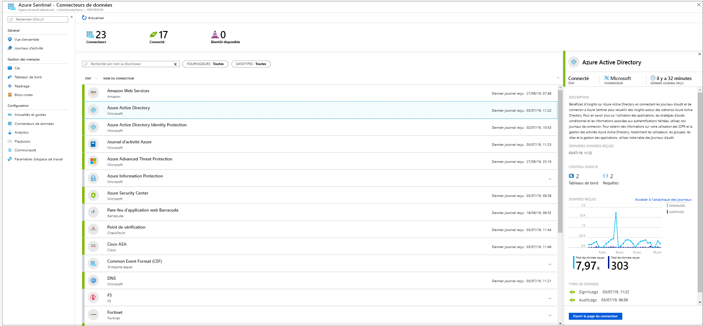
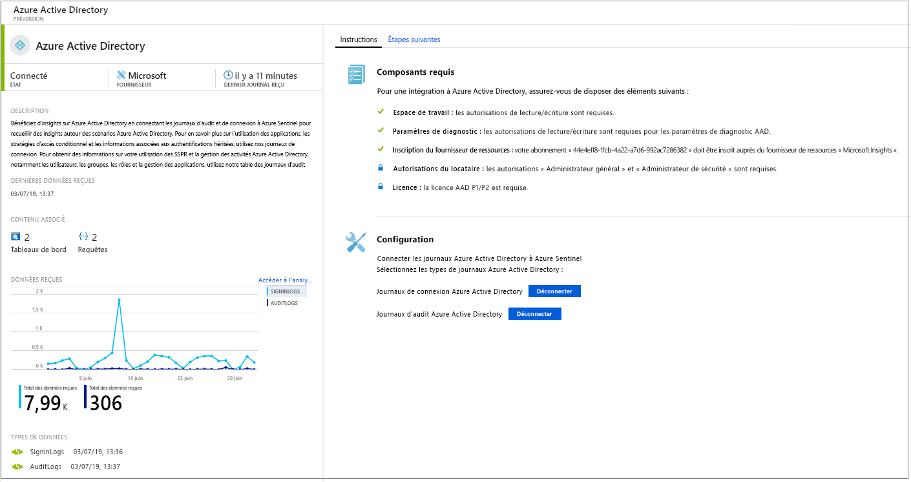
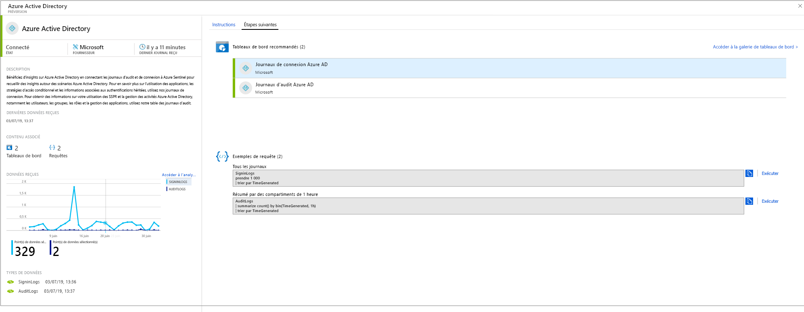
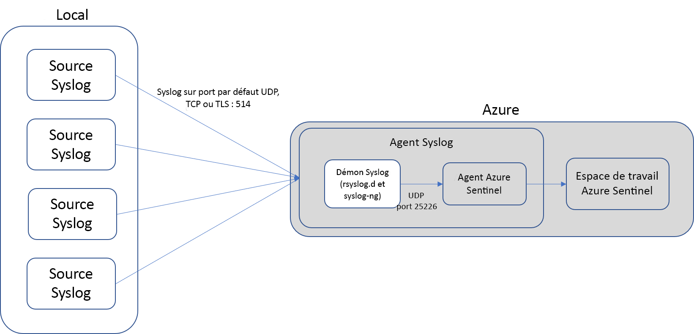
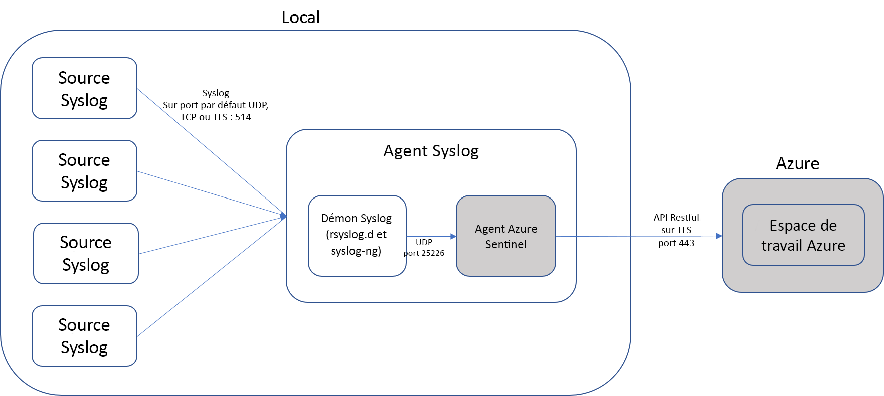

# Connecter des sources de données

Une fois que vous avez activé Azure Sentinel, la première chose à faire est de connecter vos sources de données. Azure Sentinel est fourni avec plusieurs connecteurs pour les solutions Microsoft, disponibles par défaut et offrant une intégration en temps réel, y compris les solutions Protection Microsoft contre les menaces, les sources Microsoft 365 (dont Office 365), Azure AD, Azure ATP, Microsoft Cloud App Security, etc. En outre, il existe des connecteurs intégrés pour la connexion aux écosystèmes de sécurité élargis pour les solutions non Microsoft. Vous pouvez également utiliser le format CEF (Common Event Format), Syslog ou l’API REST pour connecter vos sources de données à Azure Sentinel.

1. Dans le menu, sélectionnez **Connecteurs de données**. Cette page vous permet de voir la liste complète des connecteurs Azure Sentinel et fournit leur état. Sélectionnez le connecteur que vous souhaitez connecter, puis sélectionnez **Open connector page** (Ouvrir la page du connecteur). 

   

1. Dans la page du connecteur, vérifiez que tous les prérequis ont été respectés, puis suivez les instructions pour connecter les données à Azure Sentinel. La synchronisation des journaux avec Azure Sentinel peut prendre un certain temps à démarrer. Une fois connecté, vous voyez un récapitulatif des données dans le graphe **Données reçues**, ainsi que l’état de connectivité des types de données.

   
  
1. Cliquez sur l’onglet **Étapes suivantes** pour voir le contenu prêt à l’emploi qui est fourni par Azure Sentinel pour le type de données en question.

   
 

## Méthodes de connexion de données

Les méthodes de connexion de données suivantes sont prises en charge par Azure Sentinel :

- **Intégration de service à service** :  Certains services sont connectés en mode natif, tels que les services Microsoft et AWS. Ces services tirent parti de la base Azure pour une intégration prête à l’emploi ; les solutions suivantes peuvent être connectées en quelques clics :
    - [Amazon Web Services - CloudTrail](connect-aws.md)
    - [Activité Azure](connect-azure-activity.md)
    - [Azure Active Directory](connect-azure-active-directory.md) - journaux d’audit et journaux de connexion
    - [Azure AD Identity Protection](connect-azure-ad-Identity-protection.md)
    - [Azure Advanced Threat Protection](connect-azure-atp.md)
    - [Azure Information Protection](connect-azure-information-protection.md)
    - [Centre de sécurité Azure](connect-azure-security-center.md)
    - [Cloud App Security](connect-cloud-app-security.md)
    - [Serveur de noms de domaine](connect-dns.md)
    - [Office 365](connect-office-365.md)
    - [Microsoft Defender ATP](connect-microsoft-defender-advanced-threat-protection.md)
    - [Pare-feu d’application web Microsoft](connect-microsoft-waf.md)
    - [Pare-feu Windows](connect-windows-firewall.md)
    - [Événements de sécurité Windows](connect-windows-security-events.md)

- **Solutions externes via API** : Certaines sources de données sont connectées à l’aide d’API fournies par la source de données connectée. En général, la plupart des technologies de sécurité fournissent un ensemble d’API par le biais duquel les journaux des événements peuvent être récupérés. Les API se connectent à Azure Sentinel, collectent des types de données spécifiques et les envoient à Azure Log Analytics. Les appliances connectées via une API sont les suivantes :
    
    - [Alcide kAudit](connect-alcide-kaudit.md)
    - [Pare-feu d’applications web Barracuda](connect-barracuda.md)
    - [Pare-feu Barracuda CloudGen](connect-barracuda-cloudgen-firewall.md)
    - [Citrix Analytics (Sécurité)](connect-citrix-analytics.md)
    - [F5 BIG-IP](connect-f5-big-ip.md)
    - [Forcepoint DLP](connect-forcepoint-dlp.md)
    - [Journaux Perimeter 81](connect-perimeter-81-logs.md)
    - [Squadra Technologies secRMM](connect-squadra-secrmm.md)
    - [Symantec ICDX](connect-symantec.md)
    - [Zimperium](connect-zimperium-mtd.md)

- **Solutions externes via un agent** : Sentinel Azure peut être connecté par un agent à toute autre source de données capable d’effectuer une diffusion en continu de journal en temps réel à l’aide du protocole Syslog.

    La plupart des appliances utilisent le protocole Syslog pour envoyer des messages d’événement incluant le journal proprement dit et des données sur le journal. Le format des journaux varie, mais la plupart des appliances prennent en charge la mise en forme basée sur la norme CEF pour les données de journaux. 

    L’agent Azure Sentinel, qui est en réalité l’agent Log Analytics, convertit les journaux au format CEF dans un format que Log Analytics peut ingérer. Selon le type d’appliance, l’agent est installé directement sur l’appliance ou sur un redirecteur de journaux Linux dédié. L’agent pour Linux reçoit des événements du démon Syslog en utilisant le protocole UDP mais, si une machine Linux est supposée collecter un volume important d’événements Syslog, ceux-ci sont envoyés, en utilisant le protocole TCP, du démon Syslog à l’agent, puis de celui-ci à Log Analytics.

    - **Pare-feu, proxys et points de terminaison :**
        - [AI Vectra Detect](connect-ai-vectra-detect.md)
        - [Check Point](connect-checkpoint.md)
        - [Cisco ASA](connect-cisco.md)
        - [ExtraHop Reveal(x)](connect-extrahop.md)
        - [F5 ASM](connect-f5.md)
        - [Produits Forcepoint](connect-forcepoint-casb-ngfw.md)
        - [Fortinet](connect-fortinet.md)
        - [Palo Alto Networks](connect-paloalto.md)
        - [One Identity Safeguard](connect-one-identity.md)
        - [Autres appliances CEF](connect-common-event-format.md)
        - [Autres appliances Syslog](connect-syslog.md)
        - [Trend Micro Deep Security](connect-trend-micro.md)
        - [Zscaler](connect-zscaler.md)
    - Solutions DLP
    - [Fournisseurs de renseignement sur les menaces](connect-threat-intelligence.md)
    - [Machines DNS](connect-dns.md) : agent installé directement sur la machine DNS
    - Serveurs Linux
    - Autres clouds
    
## Options de connexion de l’agent

Pour connecter votre appliance externe à Azure Sentinel, l’agent doit être déployé sur une machine dédiée (machine virtuelle ou ordinateur local) pour prendre en charge la communication entre l’appliance et Azure Sentinel. Vous pouvez déployer l’agent manuellement ou automatiquement. Le déploiement automatique n’est disponible que si votre machine dédiée est une nouvelle machine virtuelle que vous créez dans Azure. 

Vous pouvez également déployer l’agent manuellement sur une machine virtuelle Azure existante, sur une machine virtuelle dans un autre cloud, ou sur un ordinateur local.

## Mapper des types de données avec les options de connexion Azure Sentinel

| **Type de données** | **Comment se connecter** | **Connecteur de données ?** | **Commentaires** |
|------|---------|-------------|------|
| AWSCloudTrail | [Connecter AWS](connect-aws.md) | &#10003; | |
| AzureActivity | [Connecter les journaux d’activité Azure](connect-azure-activity.md) et [Vue d’ensemble des journaux d’activité](../azure-monitor/platform/platform-logs-overview.md)| &#10003; | |
| AuditLogs | [Connecter Azure AD](connect-azure-active-directory.md)  | &#10003; | |
| SigninLogs | [Connecter Azure AD](connect-azure-active-directory.md)  | &#10003; | |
| AzureFirewall |[Diagnostics Azure](../firewall/tutorial-diagnostics.md) | &#10003; | |
| InformationProtectionLogs_CL  | [Rapports Azure Information Protection](https://docs.microsoft.com/azure/information-protection/reports-aip) [Connecter Azure Information Protection](connect-azure-information-protection.md)  | &#10003; | Cette opération utilise généralement la fonction**InformationProtectionEvents** en plus du type de données. Pour plus d’informations, consultez [Guide pratique pour modifier les rapports et créer des requêtes personnalisées](https://docs.microsoft.com/azure/information-protection/reports-aip#how-to-modify-the-reports-and-create-custom-queries).|
| AzureNetworkAnalytics_CL  | [Schéma Traffic Analytics](../network-watcher/traffic-analytics.md) [Traffic Analytics](../network-watcher/traffic-analytics.md)  | | |
| CommonSecurityLog  | [Connecter CEF](connect-common-event-format.md)  | &#10003; | |
| OfficeActivity | [Connecter Office 365](connect-office-365.md) | &#10003; | |
| SecurityEvents | [Connecter les événements de sécurité Windows](connect-windows-security-events.md)  | &#10003; | Pour les classeurs des protocoles non sécurisés, consultez le blog relatif à la [configuration des classeurs des protocoles non sécurisés](/azure/sentinel/quickstart-get-visibility#use-built-in-workbooks)  |
| syslog | [Connecter Syslog](connect-syslog.md) | &#10003; | |
| Pare-feu d’applications web (WAF) Microsoft (AzureDiagnostics) |[Connecter un pare-feu d’applications web Microsoft](connect-microsoft-waf.md) | &#10003; | |
| SymantecICDx_CL | [Connecter Symantec](connect-symantec.md) | &#10003; | |
| ThreatIntelligenceIndicator  | [Connecter Threat Intelligence](connect-threat-intelligence.md)  | &#10003; | |
| VMConnection   ServiceMapComputer_CL  ServiceMapProcess_CL|  [Azure Monitor Service Map](../azure-monitor/insights/service-map.md) [Intégration d’insights de machine virtuelle Azure Monitor](../azure-monitor/insights/vminsights-onboard.md)   [Activer les insights de machine virtuelle Azure Monitor](../azure-monitor/insights/vminsights-enable-overview.md)   [Utilisation de l’intégration d’une machine virtuelle unique](../azure-monitor/insights/vminsights-enable-single-vm.md)   [Utilisation de l’intégration par le biais d’une stratégie](../azure-monitor/insights/vminsights-enable-at-scale-policy.md)| &#10007; | Classeur d’insights de machine virtuelle  |
| DnsEvents | [Connecter DNS](connect-dns.md) | &#10003; | |
| W3CIISLog | [Connecter les journaux IIS](../azure-monitor/platform/data-sources-iis-logs.md)  | &#10007; | |
| WireData | [Connecter Wire Data](../azure-monitor/insights/wire-data.md) | &#10007; | |
| WindowsFirewall | [Connecter le Pare-feu Windows](connect-windows-firewall.md) | &#10003; | |
| SecurityAlert AADIP  | [Connecter Azure AD Identity Protection](connect-azure-ad-identity-protection.md)  | &#10003; | |
| SecurityAlert AATP  | [Connecter Azure ATP](connect-azure-atp.md) | &#10003; | |
| SecurityAlert ASC  | [Connecter Azure Security Center](connect-azure-security-center.md)  | &#10003; | |
| SecurityAlert MCAS  | [Connecter Microsoft Cloud App Security](connect-cloud-app-security.md)  | &#10003; | |
| SecurityAlert | | | |
| Sysmon (événement) | [Connecter Sysmon](https://azure.microsoft.com/blog/detecting-in-memory-attacks-with-sysmon-and-azure-security-center)  [Connecter les événements Windows](../azure-monitor/platform/data-sources-windows-events.md)   [Obtenir l’analyseur Sysmon](https://github.com/Azure/Azure-Sentinel/blob/master/Parsers/Sysmon/Sysmon-v10.42-Parser.txt)| &#10007; | La collection Sysmon n’est pas installée par défaut sur les machines virtuelles. Pour plus d’informations sur l’installation de l’agent Sysmon, consultez [Sysmon](https://docs.microsoft.com/sysinternals/downloads/sysmon). |
| ConfigurationData  | [Automatiser l’inventaire des machines virtuelles](../automation/automation-vm-inventory.md)| &#10007; | |
| ConfigurationChange  | [Automatiser le suivi des machines virtuelles](../automation/change-tracking.md) | &#10007; | |
| F5 BIG-IP | [Connecter F5 BIG-IP](https://devcentral.f5.com/s/articles/Integrating-the-F5-BIGIP-with-Azure-Sentinel)  | &#10007; | |
| McasShadowItReporting  |  | &#10007; | |
| Barracuda_CL | [Connecter Barracuda](connect-barracuda.md) | &#10003; | |

## Étapes suivantes

- Pour utiliser Azure Sentinel, vous devez disposer d’un abonnement à Microsoft Azure. Si vous n’avez pas d’abonnement, vous pouvez vous inscrire à un [essai gratuit](https://azure.microsoft.com/free/).
- Découvrez comment [intégrer vos données à Azure Sentinel](quickstart-onboard.md) et [obtenir une visibilité de vos données et des menaces potentielles](quickstart-get-visibility.md).
