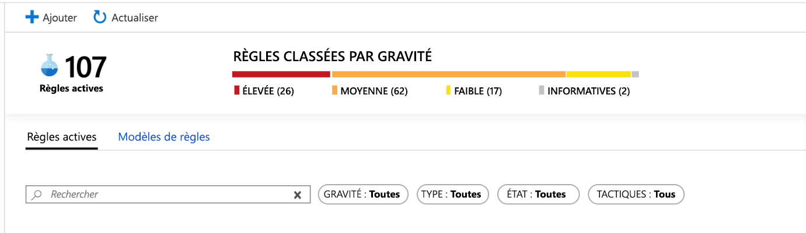
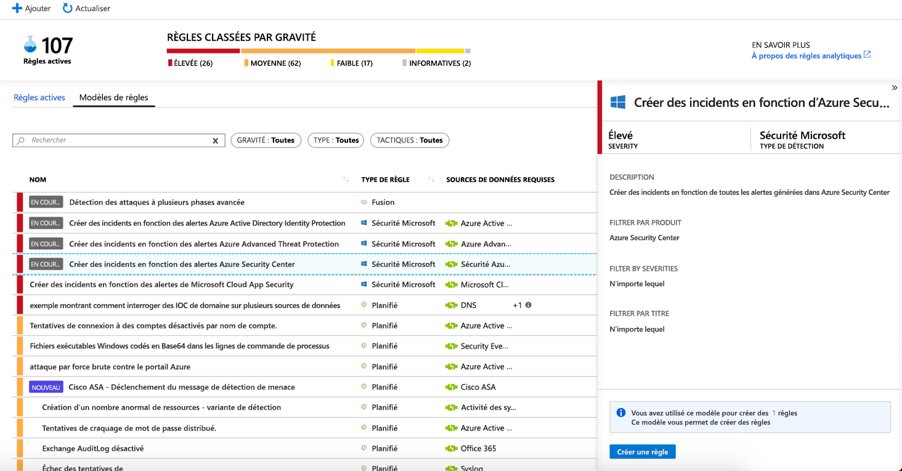
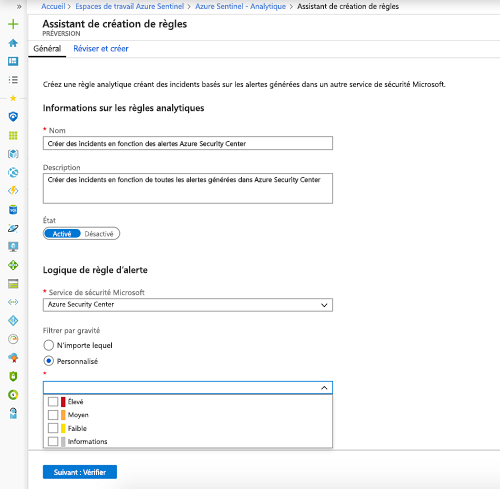
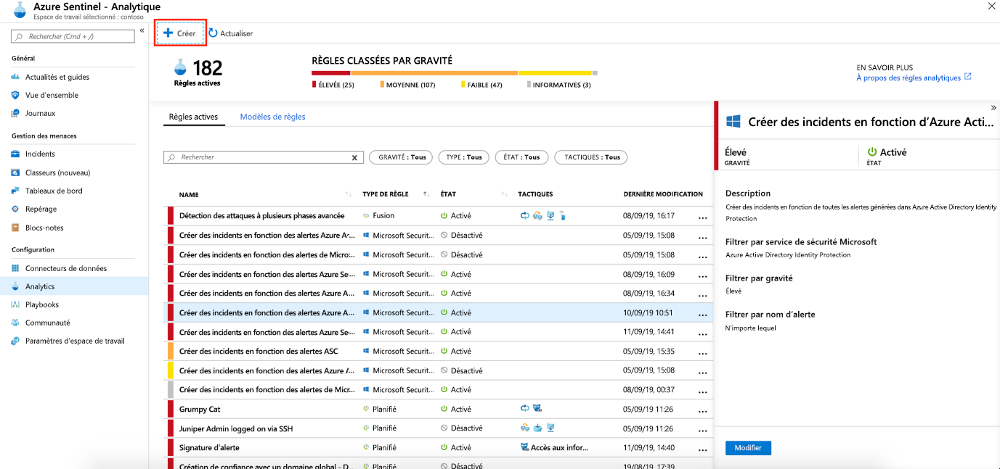
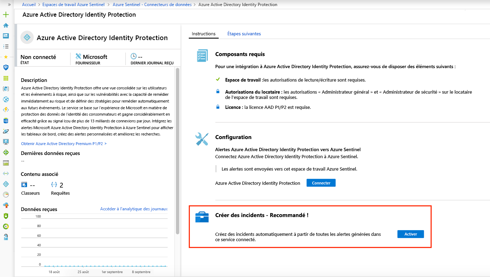

# Créer automatiquement des incidents à partir d’alertes de sécurité Microsoft

Les alertes déclenchées dans des solutions de sécurité Microsoft qui sont connectées à Azure Sentinel, comme Microsoft Cloud App Security et Microsoft Defender pour Identity (anciennement Azure ATP), ne créent pas automatiquement des incidents dans Azure Sentinel. Par défaut, quand vous connectez une solution Microsoft à Azure Sentinel, toute alerte générée dans ce service est stockée sous la forme de données brutes dans Azure Sentinel, dans la table des alertes de sécurité de votre espace de travail Azure Sentinel. Vous pouvez ensuite utiliser ces données comme n’importe quelle autre donnée brute que vous connectez à Azure Sentinel.

Vous pouvez facilement configurer Azure Sentinel pour créer automatiquement des incidents chaque fois qu’une alerte est déclenchée dans une solution de sécurité Microsoft connectée, en suivant les instructions mentionnées dans cet article.

## Prérequis
Vous devez [connecter des solutions de sécurité Microsoft](connect-data-sources.md#data-connection-methods) pour activer la création d’incident à partir d’alertes de service de sécurité.

## Utilisation de règles d’analytique de création d’incidents de sécurité Microsoft

Utilisez les règles intégrées disponibles dans Azure Sentinel pour choisir les solutions de sécurité Microsoft connectées qui doivent créer automatiquement des incidents Azure Sentinel en temps réel. Vous pouvez également modifier les règles afin de définir des options plus spécifiques pour le filtrage des alertes générées par la solution de sécurité Microsoft en vue de créer des incidents dans Azure Sentinel. Par exemple, vous pouvez choisir de créer automatiquement des incidents Azure Sentinel uniquement à partir d’alertes Azure Defender (anciennement Azure Security Center) de niveau de gravité élevé.

1. Dans le portail Azure, sous Azure Sentinel, sélectionnez **Analytique**.

1. Sélectionnez l’onglet **Modèles de règle** pour afficher toutes les règles d’analytique intégrées.

    

1. Choisissez le modèle de règle d’analytique **Sécurité Microsoft** que vous voulez utiliser, puis cliquez sur **Créer une règle**.

    

1. Vous pouvez modifier les détails de la règle et choisir de filtrer les alertes qui vont créer des incidents par niveau de gravité d’alerte ou sur le texte contenu dans le nom de l’alerte.  
      
    Par exemple, si vous choisissez **Azure Defender** (qui peut encore être appelé *Azure Security Center*) dans le champ **Service de sécurité Microsoft** et que vous choisissez **Elevée** dans le champ **Filtrer par gravité**, seules les alertes Azure Security Center de niveau de gravité élevé créeront automatiquement des incidents dans Azure Sentinel.  

    

1. Vous pouvez également créer une règle de **sécurité Microsoft** qui filtre les alertes de différents services de sécurité Microsoft en cliquant sur **+Créer**, puis en sélectionnant **Règle de création d’incident Microsoft**.

    

  Vous pouvez créer plusieurs règles d’analytique **Microsoft Sécurité** par type de **service de sécurité Microsoft**. Cela ne crée pas d’incidents en double, car chaque règle est utilisée comme filtre. Même si une alerte correspond à plusieurs règles d’analytique **Microsoft Sécurité**, elle crée un seul incident Azure Sentinel.

## Activer la génération automatique d’incidents pendant la connexion
 Quand vous connectez une solution de sécurité Microsoft, vous pouvez choisir si vous voulez que les alertes de la solution de sécurité génèrent automatiquement des incidents dans Azure Sentinel.

1. Connectez une source de données de solution de sécurité Microsoft. 

   

1. Sous **Créer des incidents**, sélectionnez **Activer** pour activer la règle analytique par défaut qui crée automatiquement des incidents à partir des alertes générées dans le service de sécurité connecté. Vous pouvez ensuite modifier cette règle sous **Analytique**, puis **Règles actives**.

## Étapes suivantes

- Pour utiliser Azure Sentinel, vous devez disposer d’un abonnement à Microsoft Azure. Si vous n’avez pas d’abonnement, vous pouvez vous inscrire à un [essai gratuit](https://azure.microsoft.com/free/).
- Découvrez comment [intégrer vos données à Azure Sentinel](quickstart-onboard.md) et [obtenir une visibilité de vos données et des menaces potentielles](quickstart-get-visibility.md).
