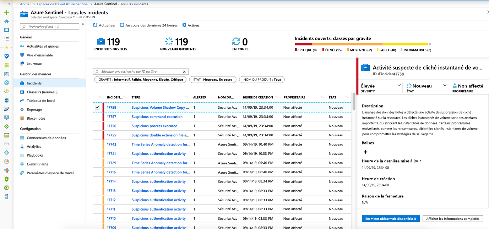
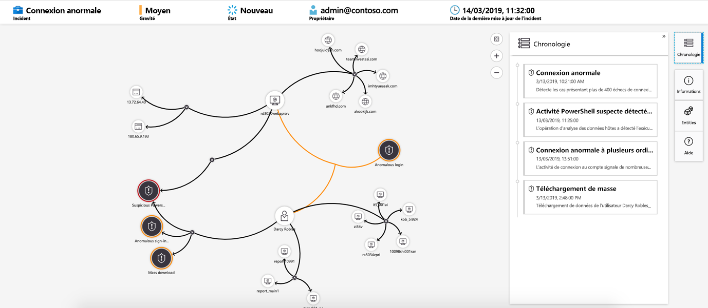

# Examiner les incidents avec Azure Sentinel

[!INCLUDE [Banner for top of topics](./includes/banner.md)]

> [!IMPORTANT]
> Les fonctionnalités indiquées sont disponibles en préversion. Les [Conditions d’utilisation supplémentaires des préversions Microsoft Azure](https://azure.microsoft.com/support/legal/preview-supplemental-terms/) incluent des conditions légales supplémentaires qui s’appliquent aux fonctionnalités Azure en version bêta, en préversion ou pas encore disponibles dans la version en disponibilité générale.
>

Cet article vous aide à enquêter sur les incidents avec Azure Sentinel. Après avoir connecté vos sources de données à Azure Sentinel, vous souhaitez être averti en cas d’activité suspecte. Pour vous permettre de l’être, Azure Sentinel vous permet de créer des règles d’alerte avancées, qui génèrent des incidents que vous pouvez attribuer et examiner.

Cet article couvre les points suivants :
> [!div class="checklist"]
> * Investiguer les incidents
> * Utiliser le graphique d’examen
> * Répondre aux menaces

Un incident peut inclure plusieurs alertes. C’est une agrégation de toutes les preuves pertinentes pour une investigation spécifique. Un incident est créé en fonction des règles d’analytique que vous avez créées sur la page **Analytics**. Les propriétés relatives aux alertes, telles que l’état et la gravité, sont définies au niveau de l’incident. Après avoir informé Azure Sentinel des types de menaces que vous recherchez et de comment les trouver, vous pouvez surveiller les menaces détectées en étudiant des incidents.

## Prérequis

- Vous ne pourrez examiner l’incident que si vous avez utilisé les champs de mappage d’entité lorsque vous avez configuré votre règle d’analytique. Le graphique d’examen requiert que votre incident d’origine comprenne des entités.

- Si vous avez un utilisateur invité qui doit attribuer des incidents, l’utilisateur doit se voir attribuer le rôle [Lecteur de répertoire](../active-directory/roles/permissions-reference.md#directory-readers) dans votre locataire Azure AD. Les utilisateurs ordinaires (non invités) se voient attribuer ce rôle par défaut.

## Comment examiner les incidents

1. Sélectionnez **Incidents**. La page **Incidents** vous permet de connaître le nombre d’incidents, le nombre d’incidents ouverts, le nombre d’incidents définis sur **En cours** et le nombre d’incidents clos. Pour chaque incident, vous pouvez voir l’heure à laquelle il s’est produit et son état. Examinez la gravité de décider quels incidents gérer en premier.

    

1. Vous pouvez filtrer les incidents selon les besoins, par état ou par gravité par exemple. Pour plus d’informations, consultez [Rechercher des incidents](#search-for-incidents).

1. Pour commencer un examen, sélectionnez un incident spécifique. Sur la droite, vous pouvez voir des informations détaillées sur l’incident, notamment sa gravité, le résumé du nombre d’entités impliquées, les événements bruts qui ont déclenché cet incident et l’ID unique de l’incident.

1. Pour afficher plus de détails sur les alertes et les entités de l’incident, sélectionnez **Afficher tous les détails** dans la page incident et passez en revue les onglets pertinents qui résument les informations sur l’incident. 

    

    Par exemple :

    - Sous l’onglet **Chronologie**, passez en revue la chronologie des alertes et des signets dans l’incident, qui peut vous aider à reconstruire la chronologie de l’activité d’un attaquant.
    - Dans l’onglet **Alertes**, examinez l’alerte elle-même. Vous pouvez voir toutes les informations pertinentes sur l’alerte : la requête ayant déclenché l’alerte, le nombre de résultats retournés par la requête et la capacité d’exécuter des playbooks sur les alertes. Pour aller encore plus en détail dans l’incident, sélectionnez le nombre d’**Événements**. Cela ouvre la requête ayant généré les résultats et les événements ayant déclenché l’alerte dans Log Analytics. 
    - Dans l’onglet **Entités**, vous pouvez voir toutes les entités mappées comme faisant partie de la définition d’une règle d’alerte.

1. Si vous étudiez activement un incident, il est judicieux de définir l’état de l’incident sur **En cours** jusqu’à ce que vous le fermiez.

1. Les incidents peuvent être assignés à un utilisateur spécifique. Pour chaque incident, vous pouvez affecter un propriétaire, en définissant le champ **Propriétaire** du cas. Tous les incidents ne sont pas assignés lorsqu’ils sont créés. Vous pouvez également ajouter des commentaires afin que d’autres analystes soient en mesure de comprendre ce que vous avez étudié et ce que sont les préoccupations liées à l’incident.

    

1. Sélectionnez **Examiner** pour afficher la carte d’examen.

## Utiliser le graphique d’examen pour approfondir les recherches

Le graphique d’examen permet aux analystes de poser les bonnes questions pour chaque examen. Le graphique d’examen vous aide à comprendre l’étendue et à identifier la cause racine d’une menace de sécurité potentielle en mettant en corrélation les données pertinentes avec toute entité impliquée. Vous pouvez explorer plus en détail toutes les entités présentées dans le graphique en les sélectionnant et en choisissant entre les différentes options de développement.  
  
Le graphique d’examen vous fournit les éléments suivants :

- **Contexte visuel des données brutes** : Le graphique visuel en direct affiche les relations entre les entités extraites automatiquement des données brutes. Cela vous permet de visualiser aisément les connexions entre les différentes sources de données.

- **Découverte de l’étendue d’examen complète** : Étendez la portée de votre examen à l’aide de requêtes d’exploration intégrées pour découvrir toute la portée d’une violation de la sécurité.

- **Étapes d’examen intégrées** : Utilisez les options d’exploration prédéfinies pour vous assurer que vous posez les bonnes questions en face à une menace.

Pour utiliser le graphique d’examen :

1. Sélectionnez un incident, puis **Examiner**. Vous accédez au graphique d’examen. Le graphique fournit une carte illustrant les entités directement connectées à l’alerte et à chaque ressource connectée.

    

   > [!IMPORTANT] 
   > - Vous ne pourrez examiner l’incident que si vous avez utilisé les champs de mappage d’entité lorsque vous avez configuré votre règle d’analytique. Le graphique d’examen requiert que votre incident d’origine comprenne des entités.
   >
   > - Azure Sentinel prend actuellement en charge l’examen des **incidents survenus au cours des 30 derniers jours**.

1. Sélectionnez une entité pour ouvrir le volet **Entités** et consulter les informations y afférentes.

    
  
1. Élargissez votre examen en survolant chaque entité pour afficher une liste de questions conçues par nos experts et analystes en sécurité par type d’entité afin d’approfondir votre examen. Nous appelons ces options des **requêtes d’exploration**.

    

   Par exemple, sur un ordinateur, vous pouvez demander des alertes associées. Si vous sélectionnez une requête d’exploration, les droits résultants sont rajoutés au graphique. Dans cet exemple, la sélection d’**Alertes associées** a renvoyé les alertes suivantes dans le graphique :

    

1. Pour chaque requête d’exploration, vous pouvez sélectionner l’option permettant d’ouvrir les résultats bruts de l’événement et la requête utilisée dans Log Analytics, en sélectionnant **Événements\>** .

1. Pour comprendre l’incident, le graphique vous donne une chronologie parallèle.

    

1. Pointez sur la chronologie pour voir quels éléments du graphique se sont produits à un moment donné.

    

## Clôture d’un incident

Une fois que vous avez résolu un incident particulier (par exemple, lorsque votre investigation a atteint sa conclusion), vous devez définir son état sur **Clôturé**. Dans ce cas, vous êtes invité à classer l’incident en spécifiant la raison pour laquelle vous le clôturez. Cette étape est obligatoire. Cliquez sur **Sélectionner la classification**, puis choisissez l’une des options suivantes dans la liste déroulante :

- Vrai positif – activité suspecte
- Positif bénin – suspect, mais attendu
- Faux positif – logique d’alerte incorrecte
- Faux positif – données incorrectes
- Indéterminé

:::image type="content" source="media/tutorial-investigate-cases/closing-reasons-dropdown.png" alt-text="Capture d’écran qui met en évidence les classifications disponibles dans la liste Sélectionner le classification.":::

Pour plus d’informations sur les faux positifs et les positifs bénins, consultez [Gérer les faux positifs dans Azure Sentinel](false-positives.md).

Après avoir choisi la classification appropriée, ajoutez un texte descriptif dans le champ **Commentaire**. Cela vous sera utile dans l’éventualité où vous devriez revenir à cet incident. Lorsque vous avez terminé, cliquez sur **Appliquer** pour clôturer l’incident.

:::image type="content" source="media/tutorial-investigate-cases/closing-reasons-comment-apply.png" alt-text="{alt-text}":::

## Rechercher des incidents

Pour trouver rapidement un incident spécifique, entrez une chaîne de recherche dans la zone de recherche au-dessus de la grille des incidents et appuyez sur **Entrée** pour modifier la liste des incidents affichée en conséquence. Si votre incident n’est pas dans les résultats, affinez votre recherche avec les options de **recherche avancée**.

Pour modifier les paramètres de recherche, sélectionnez le bouton **Rechercher**, puis sélectionnez les paramètres où vous souhaitez exécuter votre recherche.

Par exemple :

:::image type="content" source="media/tutorial-investigate-cases/advanced-search.png" alt-text="Capture d’écran de la zone de recherche d’incidents et du bouton permettant de sélectionner des options de recherche de base et/ou avancées.":::

Par défaut, les recherches d’incidents se font uniquement avec les valeurs **ID d’incident**, **Titre**, **Étiquettes**, **Propriétaires** et **Nom du produit**. Dans le volet de recherche, faites défiler la liste pour sélectionner un ou plusieurs autres paramètres à rechercher, puis sélectionnez **Appliquer** pour mettre à jour les paramètres de recherche. Sélectionner **Revenir au paramètre par défaut** réinitialise les paramètres sélectionnés vers l’option par défaut.

> [!NOTE]
> Les recherches dans le champ **Propriétaire** prennent en charge les noms et les adresses e-mail.
>

L’utilisation des options de recherche avancées modifie le comportement de recherche comme suit :

|Comportement de la recherche  |Description  |
|---------|---------|
|**Couleur du bouton de recherche**     |La couleur du bouton de recherche change en fonction des types de paramètres utilisés dans la recherche.   - Tant que seuls les paramètres par défaut sont sélectionnés, le bouton est grisé.  - Dès que des paramètres différents sont sélectionnés, tels que des paramètres de recherche avancée, le bouton devient bleu.         |
|**Actualisation automatique**     | L’utilisation de paramètres de recherche avancée vous empêche de sélectionner l’actualisation automatique de vos résultats.        |
|**Paramètres d’entité**     |Tous les paramètres d’entité sont pris en charge pour les recherches avancées. Lors de la recherche dans n’importe quel paramètre d’entité, la recherche s’exécute dans tous les paramètres d’entité.         |
|**Rechercher des chaînes**     |    La recherche d’une chaîne de mots comprend tous les mots de la requête de recherche. Les chaînes de recherche respectent la casse.     |
|**Prise en charge de l’espace de travail croisé**     |    Les recherches avancées ne sont pas prises en charge pour les vues entre espaces de travail.     |
| **Nombre de résultats de recherche affichés** | Lorsque vous utilisez des paramètres de recherche avancée, seuls 50 résultats sont affichés à la fois. |
|     |         |

> [!NOTE]
> La recherche avancée est actuellement disponible en préversion publique.
>

> [!TIP]
>  Si vous ne parvenez pas à trouver l’incident que vous recherchez, supprimez les paramètres de recherche pour étendre votre recherche. Si votre recherche aboutit à un trop grand nombre d’éléments, ajoutez des filtres pour affiner vos résultats.
>

## Étapes suivantes
Dans cet article, vous avez appris à commencer à examiner les incidents à l’aide d’Azure Sentinel. Pour plus d'informations, consultez les pages suivantes :

- [Didacticiel : utiliser des règles d’automatisation dans Azure Sentinel](tutorial-respond-threats-playbook.md)
- [Enquêter sur les incidents à l'aide des données UEBA](investigate-with-ueba.md)
