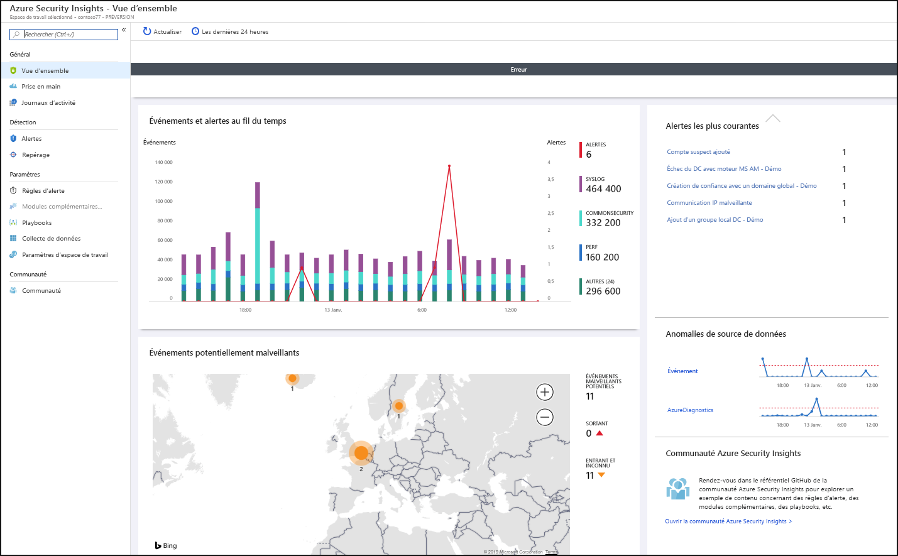
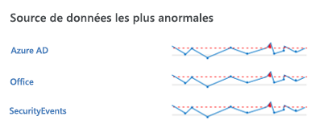
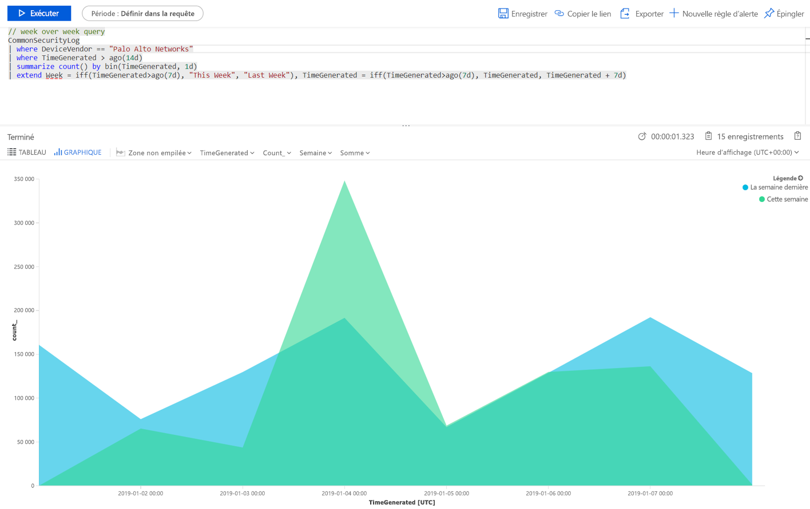
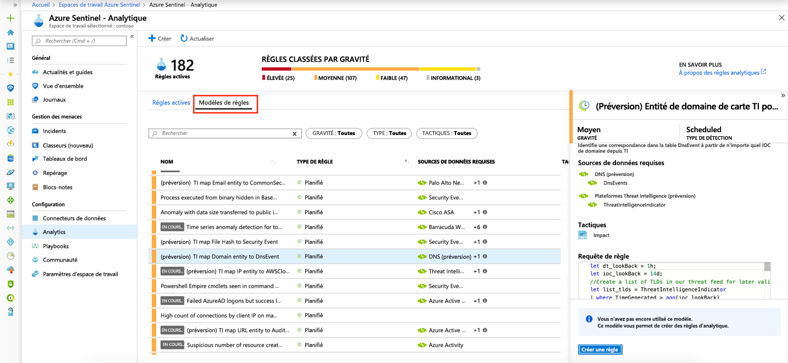

# Démarrage rapide : Bien démarrer avec Azure Sentinel

Dans ce guide de démarrage rapide, vous allez apprendre à être rapidement capable d’afficher et de superviser ce qui se passe dans votre environnement à l’aide d’Azure Sentinel. Une fois que vous avez connecté vos sources de données à Azure Sentinel, vous obtenez une visualisation et une analyse instantanées de ces données pour savoir ce qui se passe sur toutes vos sources de données connectées. Sentinel Azure vous propose des classeurs qui vous donnent accès à toute la puissance des outils déjà disponibles dans Azure, ainsi que des tables et des graphiques intégrés pour vous fournir l’analytique pour vos journaux et requêtes. Vous pouvez utiliser les classeurs intégrés ou en créer de nouveaux facilement, soit de toutes pièces ou soit en les basant sur un classeur existant. 

## Visualisation

Pour visualiser et bénéficier d’une analyse de ce qui se passe dans votre environnement, examinons tout d’abord le tableau de bord général pour avoir une idée de la sécurité de votre organisation. Vous pouvez cliquer sur chaque élément de ces vignettes pour explorer les données brutes à partir desquelles elles ont été créées. Pour vous aider à réduire le niveau de bruit et à réduire le nombre d’alertes que vous devez examiner, Azure Sentinel utilise une technique de fusion pour mettre en corrélation les alertes et les incidents. Les **incidents** sont des groupes d’alertes liées qui, prises ensemble, constituent un incident que vous pouvez examiner et résoudre.

- Dans le portail Azure, sélectionnez Azure Sentinel, puis sélectionnez l’espace de travail que vous souhaitez surveiller.

  

- La barre d’outils en haut vous indique combien d’événements vous avez reçus pendant la période sélectionnée et compare cette information au 24 heures précédentes. La barre d’outils vous informe sur ces événements, sur les alertes qui ont été déclenchées (le petit nombre représente le changement au cours des dernières 24 heures) et elle vous indique ensuite pour ces événements combien sont ouverts, en cours et fermés. Vérifiez s’il n’y a pas d’augmentation ou de réduction importante dans le nombre d’événements. En cas de réduction importante, cela peut être dû au fait qu’une connexion a arrêté d’envoyer des informations à Azure Sentinel. En cas d’augmentation, un événement suspect peut s’être produit. Vérifiez si vous voyez de nouvelles alertes.

   

Le corps de la page de vue d’ensemble donne un aperçu de l’état de la sécurité de votre espace de travail :

- **Événements et alertes au fil du temps** : présente le nombre d’événements et le nombre d’alertes créés à partir de ces événements. Si vous voyez un pic inhabituel, vous devriez voir des alertes. Si vous voyez quelque chose d’inhabituel avec un pic d’événements mais que vous ne voyez pas d’alertes, cela peut indiquer un problème.

- **Événements potentiellement malveillants** : lorsque du trafic est détecté venant de sources considérées comme malveillantes, Azure Sentinel vous alerte sur la carte. Si vous voyez de l’orange, il s’agit de trafic entrant : quelqu’un tente d’accéder à votre organisation depuis une adresse IP malveillante connue. Si vous voyez une activité sortante (en rouge), cela signifie que des données de votre réseau sont diffusées hors de votre organisation vers une adresse IP malveillante connue.

   

- **Incidents récents** : pour voir les incidents récents, leur niveau de gravité et le nombre d’alertes associées aux incidents. Si vous voyez des pics soudains dans un type spécifique d’alerte, cela peut signifier qu’une attaque est en cours. Par exemple, si vous constatez un pic soudain de 20 événements Pass-the-hash depuis Azure ATP, il est possible que quelqu’un tente actuellement une attaque.

- **Anomalies de source de données** : les analystes de données de Microsoft ont créé des modèles qui recherchent constamment les anomalies dans les données de vos sources de données. S’il n’y a pas d’anomalie, rien ne s’affiche. Si des anomalies sont détectées, vous devez allez voir ce qui s’est produit. Par exemple, cliquez sur le pic d’activité Azure. Vous pouvez cliquer sur le **graphique** pour voir quand le pic s’est produit, puis filtrer les activités qui se sont produites pendant cette période pour voir ce qui a provoqué le pic.

   

## Utiliser des classeurs intégrés

Les classeurs intégrés fournissent des données intégrées provenant de vos sources de données connectées pour vous permettre d’obtenir une présentation approfondie des événements générés dans ces services. Les classeurs intégrés comprennent Azure AD, les événements d’activité Azure et en local, qui peuvent être des données provenant d’événements Windows sur des serveurs, d’alertes internes, de tiers comme les journaux de trafic des pare-feu, Office 365 et les protocoles non sécurisés basés sur les événements Windows. Les classeurs sont basés sur les classeurs Azure Monitor pour vous offrir des possibilités de personnalisation et une flexibilité améliorées dans la conception de votre propre classeur. Pour plus d’informations, consultez [Classeurs](../azure-monitor/platform/workbooks-overview.md).

1. Sous **Paramètres**, sélectionnez **Classeurs**. Sous **Installés**, vous pouvez voir tous vos classeurs installés. Sous **Tous**, vous pouvez voir la galerie complète de classeurs intégrés qu’il est possible d’installer. 
2. Recherchez un classeur spécifique pour afficher l’intégralité de la liste et la description de ce que chacun de ces classeurs propose. 
3. En supposant que vous utilisiez Azure AD, pour être opérationnel avec Azure Sentinel, nous vous recommandons d’installer au moins les classeurs suivants :
   - **Azure AD** : Utilisez une ou plusieurs des actions suivantes :
       - **connexions Azure AD** analyse les connexions pour détecter les anomalies. Ce classeur fournit les connexions ayant échoué à partir d’applications, d’appareils et d’emplacements afin que vous puissiez vérifier, en un clin d’œil, si quelque chose d’inhabituel se produit. Faites attention lorsque plusieurs connexions échouent. 
       - **Journaux d’audit Azure AD** analyse les activités d’administration, comme la modification des utilisateurs (ajout, suppression, etc.), la création de groupe et les modifications.  

   - Ajoutez un classeur pour votre pare-feu. Par exemple, ajoutez le classeur Palo Alto. Le classeur analyse le trafic de votre pare-feu et vous indique des corrélations entre les données du pare-feu et les événements de menaces. De plus, il met en évidence les événements suspects dans les entités. Les classeurs vous fournissent des informations sur les tendances de votre trafic, et vous permettent d’examiner les détails des résultats et de les filtrer. 

      

Vous pouvez personnaliser les classeurs en modifiant la requête principale . Vous pouvez cliquer sur le bouton  pour accéder à [Log Analytics et y modifier la requête](../azure-monitor/log-query/get-started-portal.md). Vous pouvez sélectionner les points de suspension (...), puis **Personnaliser les données de la vignette** pour modifier le filtre de temps principal ou supprimer les vignettes spécifiques du classeur.

Pour plus d’informations sur l’utilisation des requêtes, consultez [Tutoriel : Données visuelles dans Log Analytics](../azure-monitor/learn/tutorial-logs-dashboards.md)

### Ajouter une nouvelle vignette

Si vous souhaitez ajouter une nouvelle vignette, vous pouvez l’ajouter à un classeur existant, qu’il s’agisse d’un classeur que vous créez ou d’un classeur intégré d’Azure Sentinel. 
1. Dans Log Analytics, créez une vignette selon les instructions figurant dans [Tutoriel : Données visuelles dans Log Analytics](../azure-monitor/learn/tutorial-logs-dashboards.md). 
2. Une fois la vignette créée, sous **Épingler**, sélectionnez le classeur dans lequel vous voulez que la vignette apparaisse.

## Créer des classeurs
Vous pouvez créer un classeur de toutes pièces ou utiliser un classeur intégré comme point de départ de votre nouveau classeur.

1. Pour créer un classeur de toutes pièces, sélectionnez **Classeurs**, puis **+Nouveau classeur**.
2. Sélectionnez l’abonnement dans lequel le classeur est créé, puis donnez-lui un nom descriptif. Chaque classeur est une ressource Azure comme n’importe quelle autre, et vous pouvez lui affecter des rôles (RBAC) pour en définir et en limiter l’accès. 
3. Pour lui permettre de s’afficher dans vos classeurs dans lesquels épingler des visualisations, vous devez le partager. Cliquez sur **Partager**, puis sur **Gérer les utilisateurs**. 
 
1. Utilisez les options **Vérifier l’accès** et **Attributions de rôles** comme vous le feriez pour toute autre ressource Azure. Pour plus d’informations, consultez [Partager des classeurs Azure avec le contrôle d’accès en fonction du rôle (RBAC)](../azure-portal/azure-portal-dashboard-share-access.md).

## Nouveaux exemples de classeurs

L’exemple de requête suivant vous permet de comparer les tendances dans le trafic entre les semaines. Vous pouvez facilement changer le fournisseur et la source de données où vous exécutez votre requête. Cet exemple utilise SecurityEvent dans Windows. Vous pouvez faire qu’il s’exécute sur AzureActivity ou CommonSecurityLog sur n’importe quel autre pare-feu.

     |where DeviceVendor == "Palo Alto Networks":
      // week over week query
      SecurityEvent
      | where TimeGenerated > ago(14d)
      | summarize count() by bin(TimeGenerated, 1d)
      | extend Week = iff(TimeGenerated>ago(7d), "This Week", "Last Week"), TimeGenerated = iff(TimeGenerated>ago(7d), TimeGenerated, TimeGenerated + 7d)

Vous souhaitez peut-être créer une requête qui incorpore des données provenant de plusieurs sources. Vous pouvez créer une requête qui examine les journaux d’audit Azure Active Directory pour contrôler les utilisateurs qui viennent d’y être créés, puis vérifie vos journaux Azure pour voir si ces utilisateurs ont commencé à apporter des modifications dans l’attribution des rôles dans les 24 heures qui suivent leur création. Ce type d’activité suspecte s’affiche sur ce tableau de bord :

    AuditLogs
    | where OperationName == "Add user"
    | project AddedTime = TimeGenerated, user = tostring(TargetResources[0].userPrincipalName)
    | join (AzureActivity
    | where OperationName == "Create role assignment"
    | project OperationName, RoleAssignmentTime = TimeGenerated, user = Caller) on user
    | project-away user1

Vous pouvez créer différents classeurs en fonction du rôle de la personne qui examine les données et de ce que cette personne recherche. Par exemple, vous pouvez créer pour votre administrateur réseau un classeur qui inclut les données du pare-feu. Vous pouvez également créer des classeurs en fonction de la fréquence à laquelle vous souhaitez les examiner, par exemple si certains éléments doivent être consultés tous les jours et d’autres toutes les heures. Vous pouvez aussi, par exemple, examiner les connexions Azure AD toutes les heures pour y rechercher d’éventuelles anomalies. 

## Créer de nouvelles détections

Générez des détections sur les [sources de données que vous avez connectées à Azure Sentinel](connect-data-sources.md) afin d’investiguer les menaces qui pèsent sur votre organisation.

Quand vous créez une détection, tirez parti des détections intégrées élaborées par les chercheurs en sécurité de Microsoft qui sont adaptées aux sources de données que vous avez connectées.

Pour voir toutes les détections prêtes à l’emploi, accédez à **Analytique**, puis à **Modèles de règle**. Cet onglet contient toutes les règles intégrées Azure Sentinel.

   

Pour plus d’informations sur l’obtention de détections prêtes à l’emploi, consultez [Tutoriel : Bénéficier de l’analytique intégrée](tutorial-detect-threats-built-in.md).
 
## Étapes suivantes
Dans ce démarrage rapide, vous avez appris à prendre en main Azure Sentinel. Passez au tutoriel pour savoir [comment détecter les menaces](tutorial-detect-threats-built-in.md).
> [!div class="nextstepaction"]
> [Créez des règles de détection des menaces personnalisées](tutorial-detect-threats-custom.md) pour automatiser vos réponses aux menaces.

