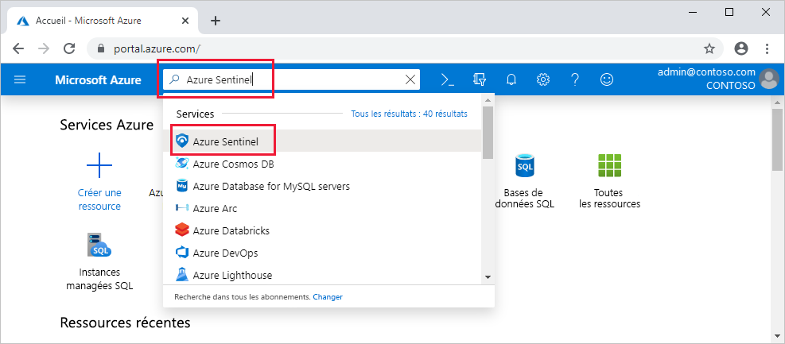

# Démarrage rapide : Intégrer Azure Sentinel

Dans ce guide de démarrage rapide, apprenez à intégrer Azure Sentinel. 

Pour intégrer Azure Sentinel, vous devez d’abord activer Azure Sentinel, puis vous connecter à vos sources de données. Azure Sentinel est fourni avec plusieurs connecteurs pour les solutions Microsoft, disponibles, prêts à l’emploi et offrant une intégration en temps réel, notamment les solutions Microsoft 365 Defender (anciennement Protection Microsoft contre les menaces), les sources Microsoft 365 (dont Office 365), Azure AD, Microsoft Defender for Identity (anciennement Azure ATP), Microsoft Cloud App Security, alertes Azure Defender depuis Azure Security Center, entre autres. En outre, il existe des connecteurs intégrés pour la connexion aux écosystèmes de sécurité élargis pour les solutions non Microsoft. Vous pouvez également utiliser le format CEF (Common Event Format), Syslog ou l’API REST pour connecter vos sources de données à Azure Sentinel. 

Après avoir connecté vos sources de données, opérez votre choix dans une galerie de classeurs créés par des experts, qui mettent en avant des insights sur la base de vos données. Vous pouvez aisément adapter ces classeurs à vos besoins.

>[!IMPORTANT] 
> Pour plus d’informations sur les frais liés à l’utilisation d’Azure Sentinel, consultez les [Tarifs Azure Sentinel](https://azure.microsoft.com/pricing/details/azure-sentinel/) et [Coûts et facturation Azure Sentinel](azure-sentinel-billing.md).

## Conditions préalables globales

- Activez l’abonnement Azure, et si vous n’en avez pas, créez un [compte gratuit](https://azure.microsoft.com/free/?WT.mc_id=A261C142F) avant de commencer.

- Espace de travail Log Analytics. Découvrez comment [créer un espace de travail Log Analytics](../azure-monitor/logs/quick-create-workspace.md). Pour plus d’informations sur les espaces de travail Log Analytics, consultez [Conception de votre déploiement de journaux Azure Monitor](../azure-monitor/logs/design-logs-deployment.md).

- Pour activer Azure Sentinel, vous avez besoin des autorisations des contributeurs concernant l’abonnement dans lequel réside l’espace de travail Azure Sentinel. 
- Pour utiliser Azure Sentinel, vous avez besoin des autorisations des contributeurs ou des lecteurs sur le groupe de ressources auquel appartient l’espace de travail.
- Des autorisations supplémentaires peuvent être nécessaires pour la connexion à des sources de données spécifiques.
- Azure Sentinel est un service payant. Pour obtenir des informations de tarification, voir [À propos d’Azure Sentinel](https://go.microsoft.com/fwlink/?linkid=2104058).

### Disponibilité géographique et résidence des données

- Azure Sentinel peut s’exécuter sur des espaces de travail dans la plupart des [régions couvertes par la mise à disposition générale de Log Analytics](https://azure.microsoft.com/global-infrastructure/services/?products=monitor), à l’exception des régions Chine et Allemagne (souveraines). Parfois, l’intégration du service Azure Sentinel par les nouvelles régions Log Analytics peut prendre un certain temps. 

- Les données générées par Azure Sentinel, telles que les incidents, les signets et les règles d’analyse, peuvent contenir des données client provenant des espaces de travail Log Analytics du client. Les données générées par Azure Sentinel sont enregistrées dans la zone géographique ou la région indiquée dans le tableau suivant, en fonction de celle dans laquelle se trouve l’espace de travail :

    | Zone géographique/région de l’espace de travail | Zone géographique/région des données générées par Azure Sentinel |
    | --- | --- |
    | États-Unis Inde Afrique | États-Unis |
    | Europe France | Europe |
    | Australie | Australie |
    | Royaume-Uni | Royaume-Uni |
    | Canada | Canada |
    | Japon | Japon |
    | Asie Sud-Est (Singapour) | Asie Sud-Est (Singapour)* |
    | Brésil | Brésil |
    | Norvège | Norvège |
    | Afrique du Sud | Afrique du Sud |
    | Corée du Sud | Corée du Sud |
    | Allemagne | Allemagne |
    | Émirats arabes unis | Émirats arabes unis |
    | Suisse | Suisse |
    |
    
    \* Il n’existe aucune région associée pour l’Asie Sud-Est.

    > [!IMPORTANT]
    > - En activant certaines règles qui utilisent le moteur Machine Learning (ML), **vous autorisez Microsoft à copier les données ingérées pertinentes en dehors de la zone géographique de votre espace de travail Azure Sentinel** en fonction de ce dont le moteur Machine Learning a besoin pour traiter ces règles.

## Activer Azure Sentinel 

1. Connectez-vous au portail Azure. Assurez-vous que l’abonnement dans lequel est créé Azure Sentinel est bien sélectionné.

1. Recherchez et sélectionnez **Azure Sentinel**.

   

1. Sélectionnez **Ajouter**.

1. Sélectionnez l’espace de travail que vous souhaitez utiliser ou créez-en un. Vous pouvez exécuter Azure Sentinel sur plusieurs espaces de travail, mais les données sont isolées sur un seul espace de travail.

   

   >[!NOTE] 
   > - Les espaces de travail par défaut créés par Azure Security Center n’apparaissent pas dans la liste. Vous ne pouvez pas installer Azure Sentinel sur ces derniers.
   >

   >[!IMPORTANT]
   >
   > - Une fois déployé dans un espace de travail, Azure Sentinel **ne prend actuellement pas en charge** le déplacement de cet espace de travail vers d’autres groupes de ressources ou abonnements. 
   >
   >   Si vous avez déjà déplacé l’espace de travail, désactivez toutes les règles actives dans **Analytics**, puis réactivez-les après cinq minutes. Cela doit fonctionner la plupart du temps, mais ce n’est, pour rappel, pas pris en charge et est sous votre entière responsabilité.

1. Sélectionnez **Ajouter Azure Sentinel**.

## Connecter des sources de données

Azure Sentinel ingère les données des services et des applications en se connectant à ceux-ci et en se transférant les événements et les journaux. Pour les machines physiques et virtuelles, vous pouvez installer l’agent Log Analytics qui collecte les journaux et les transfère à Azure Sentinel. Pour les pare-feu et les proxys, Azure Sentinel installe l’agent Log Analytics sur un serveur Syslog Linux, à partir duquel l’agent collecte les fichiers journaux et les transfère à Azure Sentinel. 
 
1. Dans le menu principal, sélectionnez **Connecteurs de données**. La galerie des connecteurs de données s’ouvre.

1. La galerie est une liste de toutes les sources de données que vous pouvez connecter. Sélectionnez une source de données, puis le bouton **Ouvrir la page du connecteur**.

1. La page du connecteur affiche des instructions sur la configuration du connecteur, ainsi que des instructions supplémentaires qui peuvent être nécessaires. 
Par exemple, si vous sélectionnez la source de données **Azure Active Directory**, qui vous permet de diffuser en streaming des journaux depuis Azure AD vers Azure Sentinel, vous pouvez sélectionner le type de journaux que vous souhaitez obtenir : journaux de connexion et/ou journaux d’audit.   Suivez les instructions d’installation ou [consultez le guide de connexion concerné](connect-data-sources.md) pour plus d’informations. Pour plus d’informations sur les connecteurs de données, consultez [Connecter des services Microsoft](connect-data-sources.md).

1. L’onglet **Étapes suivantes** de la page du connecteur affiche les modèles de règle d’analytique, exemples de requêtes et classeurs intégrés appropriés qui accompagnent le connecteur de données. Vous pouvez les utiliser tels quels ou les modifier ; dans les deux cas, vous pouvez obtenir immédiatement des insights intéressants sur vos données.  

Une fois que vos données sources sont connectées, elles commencent à être diffusées en continu dans Azure Sentinel et peuvent être utilisées. Vous pouvez afficher les journaux dans les [classeurs intégrés](quickstart-get-visibility.md) et commencer à créer des requêtes dans Log Analytics pour [examiner les données](tutorial-investigate-cases.md).

## Étapes suivantes

Pour plus d'informations, consultez les pages suivantes :

- **Options de déploiement de substitution** :

    - [Déployer Azure Sentinel via une API](/rest/api/securityinsights/)
    - [Déployer Azure Sentinel via PowerShell](https://www.powershellgallery.com/packages/Az.SecurityInsights/0.1.0)
    - [Déployer Azure Sentinel via un modèle ARM](https://techcommunity.microsoft.com/t5/azure-sentinel/azure-sentinel-all-in-one-accelerator/ba-p/1807933)

- **Démarrage** :
    - [Bien démarrer avec Azure Sentinel](quickstart-get-visibility.md)
    - [Créer des règles d’analytique personnalisées pour détecter des menaces](tutorial-detect-threats-custom.md)
    - [Connectez votre solution externe en utilisant le format CEF](connect-common-event-format.md)

