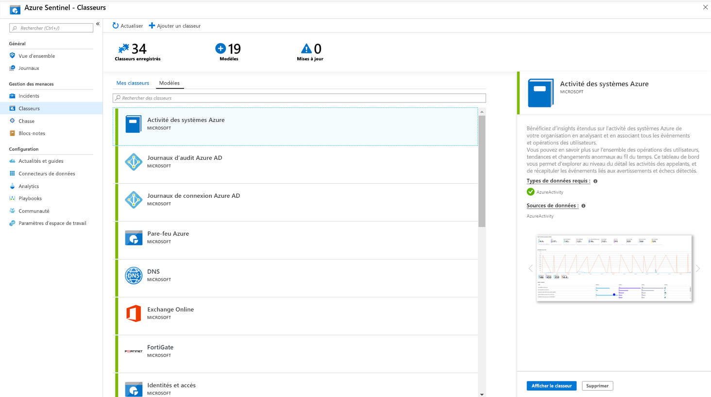

# Tutoriel : Visualiser et superviser vos données

Après avoir [connecté vos sources de données](quickstart-onboard.md) à Azure Sentinel, vous pouvez visualiser et superviser les données grâce à l’adoption par Azure Sentinel de classeurs Azure Monitor, ce qui vous offre une grande souplesse pour créer des tableaux de bord personnalisés. Même si les classeurs s’affichent différemment dans Azure Sentinel, il peut être utile de savoir [créer des rapports interactifs avec les classeurs Azure Monitor](../azure-monitor/visualize/workbooks-overview.md). Azure Sentinel vous permet de créer des classeurs personnalisés sur l’ensemble de vos données. Il est également fourni avec des modèles de classeurs intégrés avec lesquels vous obtenez rapidement des insights sur vos données dès que vous connectez une source de données.

Ce tutoriel vous aide à visualiser vos données dans Azure Sentinel.
> [!div class="checklist"]
> * Utiliser des classeurs intégrés
> * Créer des classeurs

## Prérequis

- Vous devez avoir au minimum les autorisations de lecteur ou de contributeur de classeurs sur le groupe de ressources de l’espace de travail Azure Sentinel.

> [!NOTE]
> Les classeurs que vous voyez dans Azure Sentinel sont enregistrés dans le groupe de ressources de l’espace de travail Azure Sentinel et sont étiquetés par l’espace de travail dans lequel ils ont été créés.

## Utiliser des classeurs intégrés

1. Accédez à **Classeurs**, puis sélectionnez **Modèles** pour afficher la liste complète des classeurs intégrés à Azure Sentinel. Pour savoir quels classeurs correspondent aux types de vos données connectées, le champ **Types de données requis** dans chaque classeur indique le type de données à côté d’une coche verte si vous envoyez déjà des données de ce type vers Azure Sentinel.
  
1. Cliquez sur **Afficher le modèle** pour voir le modèle rempli avec vos données.
  
1. Pour modifier le classeur, sélectionnez **Enregistrer**, puis sélectionnez l’emplacement où vous souhaitez enregistrer le fichier JSON du modèle. 

   > [!NOTE]
   > Cette opération crée une ressource Azure basée sur le modèle associé et enregistre le fichier JSON du modèle sans les données.

1. Sélectionnez **Afficher le classeur enregistré**. Ensuite, cliquez sur le bouton **Modifier** en haut. Vous pouvez maintenant modifier le classeur et le personnaliser en fonction de vos besoins. Pour plus d’informations sur la personnalisation du classeur, consultez [Créer des rapports interactifs avec les classeurs Azure Monitor](../azure-monitor/visualize/workbooks-overview.md).

1. Quand vous avez terminé vos modifications, enregistrez le classeur. 

1. Vous pouvez aussi cloner le classeur : sélectionnez **Modifier**, puis sélectionnez **Enregistrer**, en veillant à enregistrer le classeur sous un autre nom, dans le même abonnement et le même groupe de ressources. Ces classeurs clonés sont affichés sous l’onglet **Mes classeurs**.

## Créer un classeur

1. Accédez à **Classeurs**, puis sélectionnez **Ajouter un classeur** pour créer un classeur entièrement nouveau.
  

1. Pour modifier le classeur, sélectionnez **Modifier**, puis ajoutez du texte, des requêtes et des paramètres selon vos besoins. Pour plus d’informations sur la personnalisation du classeur, consultez [Créer des rapports interactifs avec les classeurs Azure Monitor](../azure-monitor/visualize/workbooks-overview.md). 

1. Quand vous créez une requête, assurez-vous que l’option **Source de données** est définie sur **Journaux** et **Type de ressource** sur **Log Analytics**, puis choisissez le ou les espaces de travail appropriés. 

1. Une fois que vous avez créé votre classeur, enregistrez-le dans l’abonnement et le groupe de ressources de votre espace de travail Azure Sentinel.

1. Si vous voulez autoriser d’autres personnes de votre organisation à utiliser le classeur, sous **Enregistrer dans**, sélectionnez **Rapports partagés**. Si vous souhaitez restreindre l’usage de ce classeur à vous-seul, sélectionnez **Mes rapports**.

1. Pour passer d’un classeur à un autre dans votre espace de travail, vous pouvez sélectionner **Ouvrir**  dans le volet supérieur d’un classeur. Dans la fenêtre qui s’ouvre sur la droite, accédez au classeur souhaité.

   

## Comment supprimer des classeurs

Pour supprimer un classeur enregistré (soit un modèle enregistré ou un classeur personnalisé), dans la page Classeurs, sélectionnez le classeur enregistré à supprimer, puis sélectionnez **Supprimer**. Cette opération supprime le classeur enregistré.

> [!NOTE]
> Elle supprime le classeur, mais aussi toutes les modifications que vous avez apportées au modèle. Le modèle d’origine reste disponible.

## Étapes suivantes

Dans ce tutoriel, vous avez appris à visualiser vos données dans Azure Sentinel à l’aide de Workbooks Azure.

Pour découvrir comment automatiser vos réponses aux menaces, consultez [Configurer des réponses automatisées aux menaces dans Azure Sentinel](tutorial-respond-threats-playbook.md).
