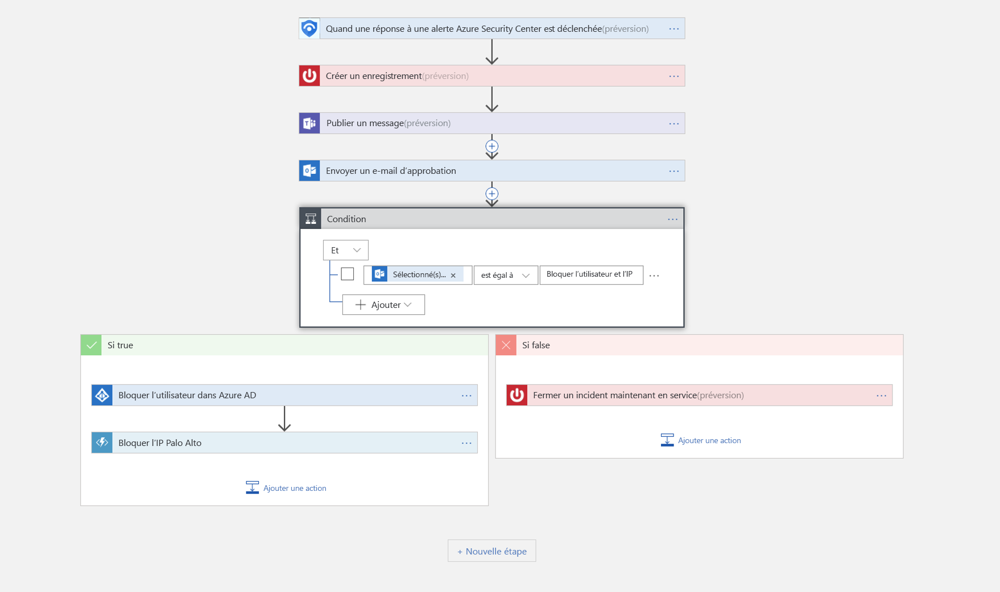

# Tutoriel : Configurer des réponses automatisées aux menaces dans Azure Sentinel

Ce didacticiel vous aide à utiliser des playbooks de sécurité dans Azure Sentinel afin de définir des réponses automatisées aux menaces pour les problèmes de sécurité détectés par Azure Sentinel.

> [!div class="checklist"]
> * Comprendre les playbooks
> * Créer un playbook
> * Exécuter un playbook
> * Automatiser les réponses aux menaces

## Qu’est-ce qu’un playbook de sécurité dans Azure Security ?

Un playbook de sécurité est une collection de procédures qui peut être exécutée à partir d’Azure Sentinel en réponse à une alerte. Un playbook de sécurité peut vous aider à automatiser et à orchestrer votre réponse. Vous pouvez l’exécuter manuellement ou le configurer pour qu’il s’exécute automatiquement lors du déclenchement d’alertes spécifiques. Les playbooks de sécurité dans Azure Sentinel reposent sur [Azure Logic Apps](https://docs.microsoft.com/azure/logic-apps/logic-apps-what-are-logic-apps). Cela signifie que vous bénéficiez de la puissance, des possibilités de personnalisation et des modèles intégrés de Logic Apps. Chaque playbook est créé pour l’abonnement de votre choix. Cependant, la page Playbooks affiche tous les playbooks de tous les abonnements sélectionnés.

> [!NOTE]
> Les playbooks tirant parti d’Azure Logic Apps, des frais sont applicables. Consultez la page sur la tarification [d’Azure Logic Apps](https://azure.microsoft.com/pricing/details/logic-apps/) pour en savoir plus.

Par exemple, si vous craignez que des attaquants malveillants accèdent à vos ressources réseau, vous pouvez définir une alerte qui recherche des adresses IP malveillantes accédant à votre réseau. Ensuite, vous pouvez créer un playbook qui effectue les opérations suivantes :
1. Quand l’alerte est déclenchée, ouvrez un ticket dans ServiceNow ou tout autre système informatique de création de tickets.
2. Envoyez un message à votre canal d’opérations de sécurité dans Microsoft Teams ou Slack pour vous assurer que vos analystes de sécurité sont conscients de l’incident.
3. Envoyez toutes les informations de l’alerte à vos administrateur réseau et administrateur de sécurité supérieurs. L’e-mail inclut également deux cases d’option, **Bloquer** et **Ignorer**.
4. L’exécution du playbook continue après la réception d’une réponse des administrateurs.
5. Si les administrateurs choisissent **Bloquer**, l’adresse IP est bloquée dans le pare-feu et l’utilisateur est désactivé dans Azure AD.
6. Si les administrateurs choisissent **Ignorer**, l’alerte est fermée dans Azure Sentinel et l’incident est clos dans ServiceNow.

Les playbooks de sécurité peuvent être exécutés manuellement ou automatiquement. L’exécution manuelle signifie que, lorsque vous recevez une alerte, vous pouvez choisir d’exécuter un playbook à la demande en réponse à celle-ci. L’exécution automatique signifie que, lors de la création de la règle de corrélation, vous définissez celle-ci de façon à ce qu’elle exécute automatiquement un ou plusieurs playbooks lors du déclenchement de l’alerte.

## Créer un playbook de sécurité

Pour créer un playbook de sécurité dans Azure Security, procédez comme suit :

1. Ouvrez le tableau de bord **Azure Sentinel**.
2. Sous **Administration**, sélectionnez **Playbooks**.

   

3. Dans la page **Azure Sentinel - Playbooks**, cliquez sur le bouton **Ajouter**.

    

4. Dans la page **Créer une application logique**, saisissez les informations requises pour créer votre application logique et cliquez sur **Créer**. 

5. Dans le [**Concepteur d’application logique**](../logic-apps/logic-apps-overview.md), sélectionnez le modèle à utiliser. Si vous sélectionnez un modèle nécessitant des informations d’identification, vous devez les lui fournir. Vous pouvez également créer un playbook vide à partir de rien. Sélectionnez **Application logique vide**. 

   

6. Vous accédez au Concepteur d’application logique où vous pouvez créer ou modifier le modèle. Pour plus d’informations sur la création d’un playbook avec [Logic Apps](../logic-apps/logic-apps-create-logic-apps-from-templates.md).

7. Si vous créez un playbook vide, dans le champ **Rechercher dans l’ensemble des connecteurs et déclencheurs**, tapez *Azure Sentinel*, puis sélectionnez **Quand une réponse à une alerte Azure Sentinel est déclenchée**.  Une fois créé, le nouveau playbook s’affiche dans la liste **Playbooks**. S’il n’y figure pas, cliquez sur **Actualiser**.

1. Utilisez les fonctions **Obtenir des entités**, afin d’obtenir les entités pertinentes de la liste **Entités**, telles que les comptes, les adresses IP et les hôtes. Vous pourrez ainsi exécuter des actions sur les entités de votre choix.

7. Maintenant, vous pouvez définir l’action effectuée lorsque vous déclenchez le playbook. Vous pouvez ajouter une action, une condition logique, des boucles ou des conditions de casse de commutateur.

   

## Pour exécuter un playbook de sécurité

Vous pouvez exécuter un playbook à la demande.

Pour exécuter un playbook à la demande :

1. Dans la page **Incidents**, sélectionnez un incident, puis cliquez sur **Afficher les informations complètes**.

2. Sous l’onglet **Alertes**, cliquez sur l’alerte qui doit déclencher l’exécution du playbook, faites défiler vers la droite, cliquez sur **Afficher les playbooks**, puis sélectionnez un playbook à **exécuter** dans la liste des playbooks disponibles pour l’abonnement. 

## Automatiser les réponses aux menaces

Les équipes SIEM/SOC peuvent être régulièrement submergées d’alertes de sécurité. Le volume d’alertes générées est tellement important que les administrateurs de sécurité disponibles sont débordés. Il en résulte trop souvent des situations où de nombreuses alertes ne peuvent pas être examinées. L’organisation reste donc vulnérable aux attaques qui passent inaperçues. 

Beaucoup, voire la plupart, de ces alertes sont conformes à des modèles récurrents qui peuvent être traités par des actions de correction spécifiques et définies. Azure Sentinel vous permet déjà de définir votre correction en vous basant sur des playbooks. Il est également possible de définir l’automatisation en temps réel dans le cadre de la définition de votre playbook afin de pouvoir automatiser entièrement une réponse définie à des alertes de sécurité particulières. Grâce à l’automatisation complète des réponses de routine aux types d’alertes récurrents, les équipes de réponse peuvent réduire considérablement leur charge de travail, ce qui leur permet de se concentrer sur des alertes uniques, d’analyser des modèles et de repérer les menaces, entre autres.

Pour automatiser les réponses :

1. Sélectionnez l’alerte pour laquelle vous souhaitez automatiser la réponse.
1. Dans la page **Modifier la règle d’alerte**, sous **Automatisation en temps réel**, choisissez le **playbook déclenché** que vous souhaitez exécuter en cas d’alerte correspondante.
1. Sélectionnez **Enregistrer**.

   

## Étapes suivantes

Dans ce didacticiel, vous avez appris à exécuter un playbook dans Azure Sentinel. Consultez l’article expliquant [comment rechercher des menaces de façon proactive à l’aide d’Azure Sentinel](hunting.md).

