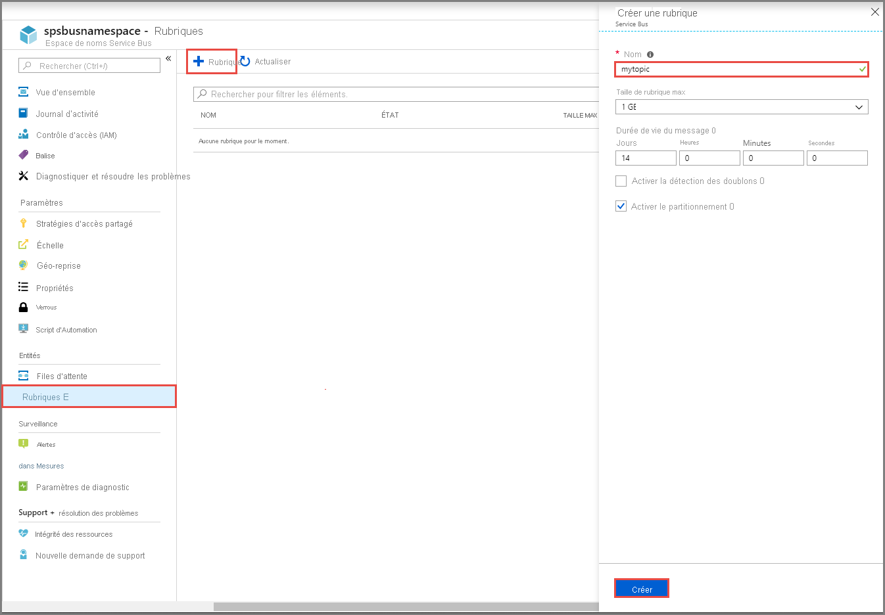
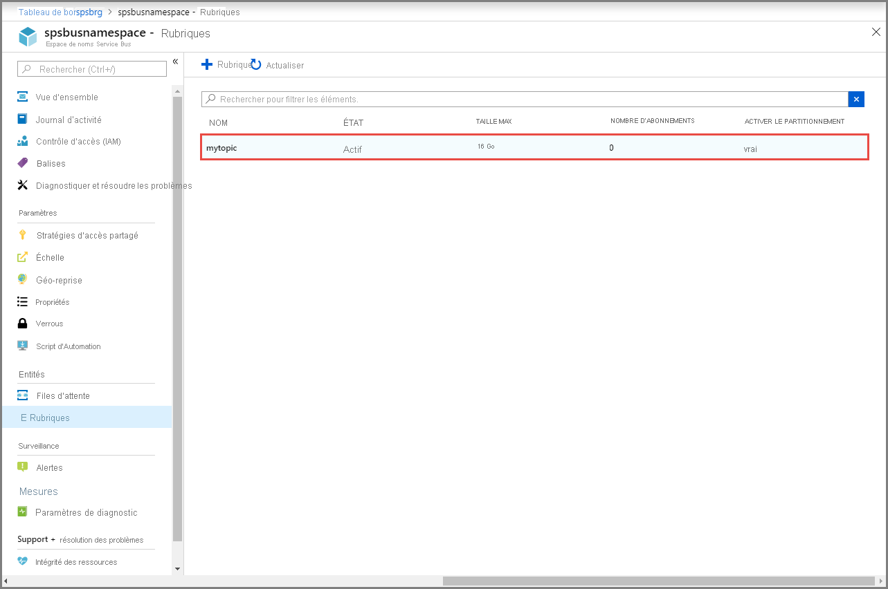
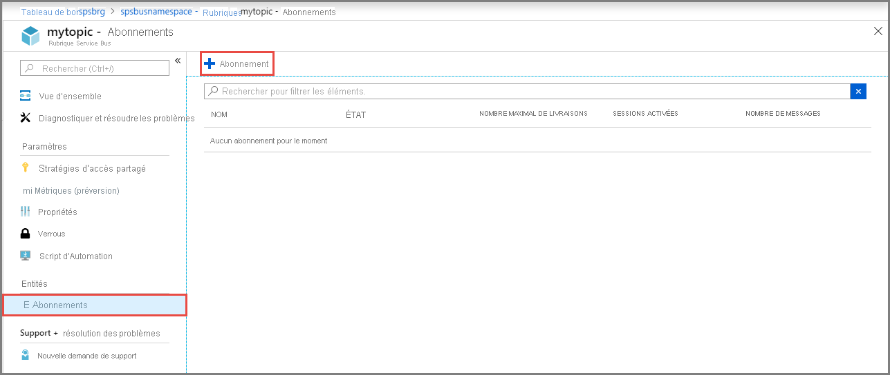

## Créer une rubrique à l’aide du Portail Azure
1. Dans la page **Espace de noms Service Bus**, sélectionnez **Rubriques** dans le menu de gauche.
2. Sélectionnez **+ Rubrique** dans la barre d’outils. 
4. Entrez un **nom** pour la rubrique. Conservez les valeurs par défaut des autres options.
5. Sélectionnez **Create** (Créer).

    

## Créer des abonnements à la rubrique
1. Sélectionnez la **rubrique** que vous avez créée dans la section précédente. 
    
    
2. Dans la page **Rubrique Service Bus**, sélectionnez **Abonnements** dans le menu de gauche, puis **+ Abonnement** dans la barre d’outils. 
    
    
3. Dans la page **Créer un abonnement**, procédez comme suit :
    1. Entrez **S1** pour le **nom** de l’abonnement.
    1. Entrez **3** pour **Nombre maximal de remises**.
    1. Ensuite, sélectionnez **Créer** pour créer l’abonnement. 

        
4. Répétez la dernière étape deux autre fois pour créer des abonnements nommés **S2** et **S3**.