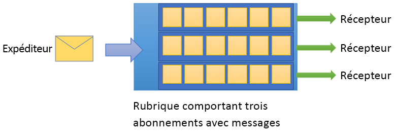

# Qu’est-ce qu’Azure Service Bus ?

Microsoft Azure Service Bus est un courtier de messages d’intégration d’entreprise entièrement géré. Service Bus peut découpler les applications et les services. Service Bus offre également une plateforme fiable et sécurisée pour le transfert asynchrone des données et de l’état.

Les données sont transférées entre différents services et applications à l’aide de *messages*. Chaque message est au format binaire. Il peut contenir du format JSON, XML ou du texte brut. Si vous souhaitez en savoir plus, veuillez consulter la page [Services d’intégration](https://azure.com/integration).

Les scénarios de messagerie courants sont :

* *Messagerie*. transfert de données d’entreprise, telles que les ventes ou les bons de commande, les journaux ou les mouvements de stock.
* *Découplage d’applications* : amélioration de la fiabilité et de l’extensibilité de vos applications et services. La mise en ligne simultanée du client et du service n’est pas nécessaire.
* *Rubriques et abonnements* : autorisation des relations 1:*n* entre les éditeurs et les abonnés.
* *Sessions de messagerie* : implémentation des flux de travail qui nécessitent le classement des messages ou le report de message.

## Espaces de noms

Un espace de noms est un conteneur pour tous les composants de messagerie. Plusieurs files d’attente et rubriques peuvent résider dans un seul espace de noms, et les espaces de noms servent souvent de conteneurs d’applications.

## Files d’attente

Les messages sont envoyés vers et reçus depuis les *files d’attente*. Les files d’attente stockent les messages jusqu’à ce que l’application réceptrice soit disponible pour recevoir et traiter ces messages.

Les messages dans les files d’attente sont classés et horodatés à l’arrivée. Une fois accepté, le message est conservé en toute sécurité dans un stockage redondant. Les messages sont remis en mode *tirage (pull)* , qui remet uniquement les messages lorsqu’ils sont demandés.

## Rubriques

Vous pouvez également utiliser des *rubriques* pour envoyer et recevoir des messages. Si une file d’attente est souvent utilisée pour la communication point à point, les rubriques sont utiles dans les scénarios de publication/abonnement.

Les rubriques peuvent avoir plusieurs abonnements indépendants. Un abonné à une rubrique peut recevoir une copie de chaque message envoyé à cette rubrique. Les abonnements sont des entités nommées. Ils sont conservés, mais peuvent expirer ou être supprimés.

Dans certaines situations, la réception des messages envoyés à une rubrique ne doit pas être concentrée entre quelques abonnements individuels. Pour éviter cela, vous pouvez utiliser des *règles* et des *filtres* pour définir les conditions déclenchant des *actions* facultatives. Vous pouvez ainsi filtrer certains messages, mais aussi définir ou modifier les propriétés des messages. Si vous souhaitez en savoir plus, veuillez consulter l’article [Actions et filtres de rubrique](topic-filters.md).

## Fonctionnalités avancées

Certaines fonctionnalités avancées de Service Bus sont utiles pour résoudre des problèmes de messagerie plus complexes. Les sections suivantes détaillent plusieurs de ces fonctionnalités.

### Sessions de message

Pour créer une garantie FIFO (pour « First In First Out », ou « Premier entré, premier sorti ») dans Service Bus, utilisez des sessions. Les sessions de messagerie permettent un traitement conjoint et chronologique de séquences illimitées de messages associés. Si vous souhaitez en savoir plus, veuillez consulter l’article [Sessions de messagerie : premier entré, premier sorti (FIFO)](message-sessions.md).

### Transfert automatique

La fonctionnalité de transfert automatique crée une chaîne reliant une file d’attente ou un abonnement à une autre file d’attente ou rubrique. Les éléments reliés doivent faire partie du même espace de noms. Grâce au transfert automatique, Service Bus peut retirer automatiquement les messages d’une file d’attente ou d’un abonnement, pour les placer dans une autre file d’attente ou rubrique. Si vous souhaitez en savoir plus, veuillez consulter l’article [Chaînage des entités Service Bus avec transfert automatique](service-bus-auto-forwarding.md).

### File d’attente de lettres mortes

Service Bus vous permet d’utiliser une file d’attente de lettres mortes (ou DLQ, pour « Dead-Letter Queue »). Une file d’attente de lettres mortes contient les messages qui ne peuvent être remis à aucun destinataire. Ces messages ne peuvent pas être traités. Service Bus vous permet de retirer des messages de cette file d’attente pour les inspecter. Pour en savoir plus, consultez [Vue d’ensemble des files d’attente de lettres mortes Service Bus](service-bus-dead-letter-queues.md).

### Remise planifiée

Cette fonctionnalité vous permet d’envoyer des messages à une file d’attente ou à une rubrique pour différer leur traitement. Vous pouvez planifier la disponibilité d’un travail pour qu’il soit traité par un système à un moment précis. Si vous souhaitez en savoir plus, veuillez consulter la rubrique [Messages planifiés](message-sequencing.md#scheduled-messages).

### Report de message

Un client de file d’attente ou d’abonnement peut reporter l’extraction d’un message jusqu’à une date définie. Ce report peut être dû à des circonstances particulières affectant l’application. Le message est conservé dans la file d’attente ou l’abonnement, mais il est mis de côté. Si vous souhaitez en savoir plus, veuillez consulter l’article [Report de message](message-deferral.md).

### Traitement par lot

Le traitement par lot côté client permet à un client de file d’attente ou de rubrique de différer l’envoi d’un message pendant une période donnée. Si le client envoie des messages supplémentaires pendant cette période, il transmet les messages dans un seul lot. Si vous souhaitez en savoir plus, veuillez consulter la rubrique [Traitement par lots côté client](service-bus-performance-improvements.md#client-side-batching).

### Transactions

Une transaction regroupe deux ou plusieurs opérations dans une *étendue d’exécution*. Service Bus prend en charge les opérations de regroupement par rapport à une entité de messagerie unique dans l’étendue d’une seule transaction. Une entité de message peut être une file d’attente, une rubrique ou un abonnement. Si vous souhaitez en savoir plus, veuillez consulter l’article [Vue d’ensemble du traitement des transactions Service Bus](service-bus-transactions.md).

### Filtrage et actions

Les abonnés peuvent définir les messages qu’ils veulent recevoir d’une rubrique. Ces messages sont spécifiés sous la forme d’une ou de plusieurs règles d’abonnement nommées. Pour chaque condition de règle de correspondance, l’abonnement crée une copie du message, qui peut être annotée différemment selon la règle de correspondance utilisée. Si vous souhaitez en savoir plus, veuillez consulter l’article [Actions et filtres de rubrique](topic-filters.md).

### Suppression automatique en cas d’inactivité

La fonctionnalité de suppression automatique en cas d’inactivité vous permet de spécifier un intervalle d’inactivité après lequel la file d’attente est automatiquement supprimée. La durée minimale est de 5 minutes. Si vous souhaitez en savoir plus, veuillez consulter l’article [Propriété QueueDescription.AutoDeleteOnIdle](/dotnet/api/microsoft.servicebus.messaging.queuedescription.autodeleteonidle).

### Détection des doublons

Une erreur peut amener le client à douter du résultat d’une opération d’envoi. La détection des doublons permet à l’expéditeur de renvoyer le même message. Une autre option consiste à faire en sorte que la file d’attente ou la rubrique ignore les copies en double. Pour en savoir plus, consultez [Détection des doublons](duplicate-detection.md).

### Protocoles de sécurité

Service Bus prend en charge les protocoles de sécurité tel que les [Signatures d’accès partagé](service-bus-sas.md) (SAP), le [Contrôle d’accès en fonction du rôle](authenticate-application.md) (RBAC) et les [Identités managées pour les ressources Azure](service-bus-managed-service-identity.md).

### Géorécupération d’urgence

Lorsque les régions ou centres de données Azure subissent un temps d’arrêt, la géo-récupération d’urgence permet au traitement des données de continuer à fonctionner dans un autre centre de données ou région. Pour plus d’informations, consultez [Géorécupération d’urgence Azure Service Bus](service-bus-geo-dr.md).

### Sécurité

Service Bus prend en charge les protocoles [AMQP 1.0](service-bus-amqp-overview.md) et [HTTP/REST](/rest/api/servicebus/).

## Bibliothèques clientes

Service Bus prend en charge les bibliothèques clientes pour [.NET](https://github.com/Azure/azure-service-bus-dotnet/tree/master), [Java](https://github.com/Azure/azure-service-bus-java/tree/master) et [JMS](https://github.com/Azure/azure-service-bus/tree/master/samples/Java/qpid-jms-client).

## Intégration

Service Bus intègre complétement les services Azure suivants :

* [Event Grid](https://azure.microsoft.com/services/event-grid/)
* [Logic Apps](https://azure.microsoft.com/services/logic-apps/)
* [Azure Functions](https://azure.microsoft.com/services/functions/)
* [Dynamics 365](https://dynamics.microsoft.com)
* [Azure Stream Analytics](https://azure.microsoft.com/services/stream-analytics/)

## Étapes suivantes

Pour commencer à utiliser la messagerie Service Bus, consultez les articles suivants :

* Si vous souhaitez comparer les services de messagerie Azure, veuillez consulter l’article [Choisissez entre les trois services de messagerie Azure - Event Grid, Event Hubs et Service Bus](../event-grid/compare-messaging-services.md?toc=%2fazure%2fservice-bus-messaging%2ftoc.json&bc=%2fazure%2fservice-bus-messaging%2fbreadcrumb%2ftoc.json).
* Essayez les Guides de démarrage rapide pour [.NET](service-bus-dotnet-get-started-with-queues.md), [Java](service-bus-java-how-to-use-queues.md) ou [JMS](service-bus-java-how-to-use-jms-api-amqp.md).
* Si vous devez gérer des ressources Service Bus, veuillez consulter le référentiel GitHub [Explorateur Service Bus](https://github.com/paolosalvatori/ServiceBusExplorer/releases) (contenu en anglais).
* Si vous souhaitez en savoir plus sur les niveaux Standard et Premium et leur tarification, veuillez consulter la page [Tarification Service Bus](https://azure.microsoft.com/pricing/details/service-bus/).
* Si vous souhaitez en savoir plus sur les performances et la latence du niveau Premium, veuillez consulter le billet de blog [Messagerie Premium](https://techcommunity.microsoft.com/t5/Service-Bus-blog/Premium-Messaging-How-fast-is-it/ba-p/370722) (contenu en anglais).
