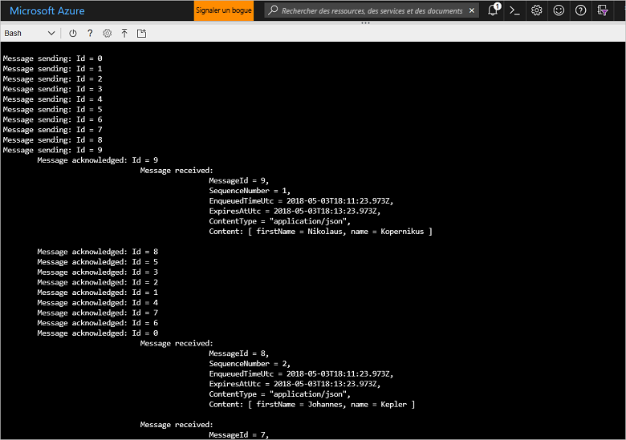

# <a name="quickstart-send-and-receive-messages-using-azure-cli-and-java"></a>Démarrage rapide : Envoyer et recevoir des messages à l’aide d’Azure CLI et de Java

Microsoft Azure Service Bus est un courtier de messages d’intégration d’entreprise qui offre des services de messagerie et une fiabilité sécurisés. Un scénario Service Bus classique comprend généralement le découplage de deux (voire plus) applications, services ou processus (les applications n’ont pas besoin d’être en ligne en même temps), le transfert de changements d’état ou de données et l’envoi de messages entre les applications. 

Par exemple, une entreprise de distribution pourrait envoyer leurs données de points de ventes vers un back office ou un centre de distribution régional pour réapprovisionnement et mises à jour de l’inventaire. Dans ce cas, l’application cliente envoie et reçoit des messages depuis une file d’attente Service Bus.


Ce guide de démarrage rapide décrit comment envoyer et recevoir des messages avec Service Bus, à l’aide d’Azure CLI et de la bibliothèque Java Service Bus. Enfin, si vous êtes intéressé par plus de détails techniques, vous pouvez [lire une explication](#understand-the-sample-code) des éléments clé de l’exemple de code.

Si vous n’avez pas d’abonnement Azure, vous pouvez créer un [compte gratuit][] avant de commencer.

[!INCLUDE [cloud-shell-try-it.md](../../includes/cloud-shell-try-it.md)]

## <a name="log-in-to-azure"></a>Connexion à Azure

Cliquez sur le bouton Cloud Shell dans le menu du coin supérieur droit du portail Azure, et à partir de la liste déroulante **Sélectionner un environnement**, sélectionnez **Bash**. 

## <a name="use-cli-to-create-resources"></a>Utiliser CLI pour créer des ressources

Dans Cloud Shell, depuis l’invite de commande Bash, exécutez les commandes suivantes pour provisionner les ressources Service Bus. Veillez à remplacer tous les espaces réservés par les valeurs appropriées :

```azurecli-interactive
# Create a resource group
az group create --name myResourceGroup --location eastus

# Create a Service Bus messaging namespace with a unique name
namespaceName=myNameSpace$RANDOM
az servicebus namespace create \
   --resource-group myResourceGroup \
   --name $namespaceName \
   --location eastus

# Create a Service Bus queue
az servicebus queue create --resource-group myResourceGroup \
   --namespace-name $namespaceName \
   --name myQueue

# Get the connection string for the namespace
connectionString=$(az servicebus namespace authorization-rule keys list \
   --resource-group myResourceGroup \
   --namespace-name $namespaceName \
   --name RootManageSharedAccessKey \
   --query primaryConnectionString --output tsv)
```

Après l’exécution de la dernière commande, copiez et collez la chaîne de connexion et le nom de la file d’attente que vous avez sélectionnée dans un emplacement temporaire tel que le Bloc-notes. Vous en aurez besoin à l’étape suivante.

## <a name="send-and-receive-messages"></a>Envoyer et recevoir des messages

Après avoir créé l’espace de noms et la file d’attente, et après avoir obtenu les informations d’identification nécessaires, vous êtes prêt à envoyer et recevoir des messages. Vous pouvez consulter le code dans [ce dossier d’exemples GitHub](https://github.com/Azure/azure-service-bus/tree/master/samples/Java/azure-servicebus/TopicFilters).

1. Veillez à ce que Cloud Shell soit ouvert et affiche l’invite de commandes Bash.

2. Clonez le [référentiel GitHub Service Bus](https://github.com/Azure/azure-service-bus/) en émettant la commande suivante :

   ```bash
   git clone https://github.com/Azure/azure-service-bus.git
   ```

2. Remplacez votre répertoire actuel par un dossier d’exemples, en utilisant des barres obliques comme séparateurs de chemin :

   ```bash
   cd azure-service-bus/samples/Java/quickstarts-and-tutorials/quickstart-java 
   ```

3. Exécutez la commande suivante pour créer l’application :
   
   ```bash
   mvn clean package -DskipTests
   ```

4. Pour exécuter le programme, exécutez la commande suivante. Tant que vous ne redémarrez pas l’invite de commandes bash, la variable qui contient la valeur de la chaîne de connexion est automatiquement remplacée :

   ```bash
   java -jar ./target/samples.quickstart-1.0.0-jar-with-dependencies.jar -c $connectionString -q myQueue
   ```

6. Observez l’envoi de 10 messages à la file d’attente. Remarque : l’ordre des messages n’est pas garanti, mais vous pouvez voir les messages envoyés, confirmés et reçus, ainsi que les données de charge utile :

   

## <a name="clean-up-resources"></a>Supprimer des ressources

Exécutez la commande suivante pour supprimer le groupe de ressources, l’espace de noms et toutes les ressources associées :

```azurecli-interactive
az group delete --resource-group myResourceGroup
```

## <a name="understand-the-sample-code"></a>Comprendre l’exemple de code

Cette section contient plus de détails sur les sections clé de l’exemple de code. Vous pouvez parcourir le code, situé dans le référentiel GitHub [ici](https://github.com/Azure/azure-service-bus/tree/master/samples/Java/azure-servicebus/TopicFilters).

### <a name="get-connection-string-and-queue"></a>Obtention de la chaîne de connexion et de la file d’attente

Tout d’abord, le code déclare deux variables de chaîne qui sont envoyées au programme comme arguments sur la ligne de commande :

```java
String ConnectionString = null;
String QueueName = null;
```

Ces valeurs sont ajoutées via les paramètres définis et allouées dans la méthode `runApp()` :

```java
public static void main(String[] args) {
    SendAndReceiveMessages app = new SendAndReceiveMessages();
    try {
        app.runApp(args);
        app.run();
    } catch (Exception e) {
        System.out.printf("%s", e.toString());
    }
    System.exit(0);
}

public void runApp(String[] args) {
    try {
        // parse connection string from command line             
        Options options = new Options();
        options.addOption(new Option("c", true, "Connection string"));
        options.addOption(new Option("q", true, "Queue Name"));
        CommandLineParser clp = new DefaultParser();
        CommandLine cl = clp.parse(options, args);
        if (cl.getOptionValue("c") != null && cl.getOptionValue("q") != null) {
            ConnectionString = cl.getOptionValue("c");
            QueueName =  cl.getOptionValue("q");
        }
        else
        {
            HelpFormatter formatter = new HelpFormatter();
            formatter.printHelp("run jar with", "", options, "", true);
        }

    } catch (Exception e) {
        System.out.printf("%s", e.toString());
    }
}
```

### <a name="create-queue-clients-to-send-and-receive"></a>Créer des clients de file d’attente pour envoyer et recevoir des messages

Pour envoyer et recevoir des messages, la méthode `run()` crée des instances de client de file d’attente, formées à partir des noms de la chaîne de connexion et de la file d’attente. Ce code crée deux clients de file d’attente, un pour envoyer, l’autre pour recevoir :

```java
public void run() throws Exception {
// Create a QueueClient instance for receiving using the connection string builder
// We set the receive mode to "PeekLock", meaning the message is delivered
// under a lock and must be acknowledged ("completed") to be removed from the queue
QueueClient receiveClient = new QueueClient(new ConnectionStringBuilder(ConnectionString, QueueName), ReceiveMode.PEEKLOCK);
this.registerReceiver(receiveClient);

// Create a QueueClient instance for sending and then asynchronously send messages.
QueueClient sendClient = new QueueClient(new ConnectionStringBuilder(ConnectionString, QueueName), ReceiveMode.PEEKLOCK);
```

La méthode `run()` démarre aussi l’opération d’envoi de message asynchrone et ferme l’expéditeur une fois l’opération terminée :

```java
this.sendMessagesAsync(sendClient).thenRunAsync(() -> sendClient.closeAsync());
``` 

### <a name="construct-and-send-messages"></a>Créer et envoyer des messages

La méthode `sendMessagesAsync()` crée un ensemble de 10 messages et les envoie de façon asynchrone à l’aide du client de file d’attente :

```java
CompletableFuture<Void> sendMessagesAsync(QueueClient sendClient) {
List<HashMap<String, String>> data =
        GSON.fromJson(
                "[" +
                        "{'name' = 'Einstein', 'firstName' = 'Albert'}," +
                        "{'name' = 'Heisenberg', 'firstName' = 'Werner'}," +
                        "{'name' = 'Curie', 'firstName' = 'Marie'}," +
                        "{'name' = 'Hawking', 'firstName' = 'Steven'}," +
                        "{'name' = 'Newton', 'firstName' = 'Isaac'}," +
                        "{'name' = 'Bohr', 'firstName' = 'Niels'}," +
                        "{'name' = 'Faraday', 'firstName' = 'Michael'}," +
                        "{'name' = 'Galilei', 'firstName' = 'Galileo'}," +
                        "{'name' = 'Kepler', 'firstName' = 'Johannes'}," +
                        "{'name' = 'Kopernikus', 'firstName' = 'Nikolaus'}" +
                        "]",
                new TypeToken<List<HashMap<String, String>>>() {}.getType());

List<CompletableFuture> tasks = new ArrayList<>();
for (int i = 0; i < data.size(); i++) {
    final String messageId = Integer.toString(i);
    Message message = new Message(GSON.toJson(data.get(i), Map.class).getBytes(UTF_8));
    message.setContentType("application/json");
    message.setLabel("Scientist");
    message.setMessageId(messageId);
    message.setTimeToLive(Duration.ofMinutes(2));
    System.out.printf("\nMessage sending: Id = %s", message.getMessageId());
    tasks.add(
            sendClient.sendAsync(message).thenRunAsync(() -> {
                System.out.printf("\n\tMessage acknowledged: Id = %s", message.getMessageId());
            }));
}
return CompletableFuture.allOf(tasks.toArray(new CompletableFuture<?>[tasks.size()]));
```

### <a name="receive-messages"></a>Recevoir des messages

La méthode `registerReceiver()` inscrit le rappel `RegisterMessageHandler` et définit quelques options pour le gestionnaire de messages :

```java
void registerReceiver(QueueClient queueClient) throws Exception {
    // register the RegisterMessageHandler callback
    queueClient.registerMessageHandler(new IMessageHandler() {
                           // callback invoked when the message handler loop has obtained a message
                           public CompletableFuture<Void> onMessageAsync(IMessage message) {
                               // receives message is passed to callback
                               if (message.getLabel() != null &&
                                       message.getContentType() != null &&
                                       message.getLabel().contentEquals("Scientist") &&
                                       message.getContentType().contentEquals("application/json")) {
                                    byte[] body = message.getBody();
                                   Map scientist = GSON.fromJson(new String(body, UTF_8), Map.class);

                                   System.out.printf(
                                           "\n\t\t\t\tMessage received: \n\t\t\t\t\t\tMessageId = %s, \n\t\t\t\t\t\tSequenceNumber = %s, \n\t\t\t\t\t\tEnqueuedTimeUtc = %s," +
                                                   "\n\t\t\t\t\t\tExpiresAtUtc = %s, \n\t\t\t\t\t\tContentType = \"%s\",  \n\t\t\t\t\t\tContent: [ firstName = %s, name = %s ]\n",
                                           message.getMessageId(),
                                           message.getSequenceNumber(),
                                           message.getEnqueuedTimeUtc(),
                                           message.getExpiresAtUtc(),
                                           message.getContentType(),
                                           scientist != null ? scientist.get("firstName") : "",
                                           scientist != null ? scientist.get("name") : "");
                               }
                               return CompletableFuture.completedFuture(null);
                           }

                           // callback invoked when the message handler has an exception to report
                           public void notifyException(Throwable throwable, ExceptionPhase exceptionPhase) {
                               System.out.printf(exceptionPhase + "-" + throwable.getMessage());
                           }
                       },
    // 1 concurrent call, messages are auto-completed, auto-renew duration
    new MessageHandlerOptions(1, true, Duration.ofMinutes(1)));

}
```

## <a name="next-steps"></a>Étapes suivantes

Dans cet article, vous avez créé un espace de noms Service Bus et d’autres ressources nécessaires pour envoyer et recevoir des messages depuis une file d’attente. Pour en savoir plus sur l’écriture de code pour envoyer et recevoir des messages, continuez le tutoriel suivant pour Service Bus :

> [!div class="nextstepaction"]
> [Mettre à jour l’inventaire à l’aide de CLI et Java](./service-bus-tutorial-topics-subscriptions-cli.md)

[compte gratuit]: https://azure.microsoft.com/free/?ref=microsoft.com&utm_source=microsoft.com&utm_medium=docs&utm_campaign=visualstudio
[fully qualified domain name]: https://wikipedia.org/wiki/Fully_qualified_domain_name
[Install the Azure CLI]: /cli/azure/install-azure-cli
[az group create]: /cli/azure/group#az_group_create
