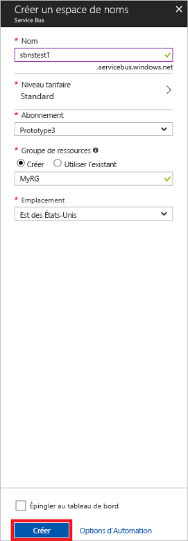

# <a name="quickstart-use-azure-portal-to-create-a-service-bus-queue"></a>Démarrage rapide : Utiliser le Portail Azure pour créer une file d’attente Service Bus
Microsoft Azure Service Bus est un courtier de messages d’intégration d’entreprise qui offre des services de messagerie sécurisée et une fiabilité absolue. Un scénario classique Service Bus implique généralement le découplage de deux ou plusieurs applications, services ou processus, et le transfert des modifications de données ou d’état. Ces scénarios peuvent impliquer la planification de plusieurs traitements par lots dans d’autres applications ou services, ou le déclenchement du traitement des commandes. Par exemple, une société de vente au détail peut envoyer ses données de point de vente à un back-office ou un centre de distribution régional pour des mises à jour de l’inventaire et un réapprovisionnement. Dans ce scénario, l’application cliente envoie et reçoit des messages depuis une file d’attente Service Bus.  


Ce démarrage rapide montre comment envoyer et recevoir des messages vers et depuis une file d’attente Service Bus, en utilisant le [portail Azure][Azure portal] pour créer un espace de noms de messagerie et une file d’attente au sein de cet espace de noms, et pour obtenir les informations d’identification sur cet espace de noms. La procédure montre ensuite comment envoyer et recevoir des messages depuis cette file d’attente à l’aide de la [bibliothèque .NET Standard](https://www.nuget.org/packages/Microsoft.Azure.ServiceBus).

Si vous n’avez pas d’abonnement Azure, vous pouvez créer un [compte gratuit][] avant de commencer.

## <a name="prerequisites"></a>Prérequis

Pour suivre ce didacticiel, vérifiez que les éléments suivants sont installés :

- [Visual Studio 2017 Update 3 (version 15.3, 26730.01)](https://www.visualstudio.com/vs) ou ultérieur.
- [Kit de développement logiciel (SDK) NET Core](https://www.microsoft.com/net/download/windows), version 2.0 ou ultérieure.

## <a name="log-on-to-the-azure-portal"></a>Se connecter au portail Azure

Tout d’abord, accédez au [portail Azure][Azure portal] et connectez-vous à l’aide de votre abonnement Azure. La première étape consiste à créer un espace de noms Service Bus de type **Messagerie**.

## <a name="create-a-service-bus-namespace"></a>Création d’un espace de noms Service Bus

Un espace de noms de messagerie Service Bus fournit un conteneur d’étendue unique, référencé par son [nom de domaine complet][], dans lequel vous créez une ou plusieurs files d’attente, rubriques et abonnements. L’exemple suivant crée un espace de noms de messagerie Service Bus dans un [groupe de ressources](/azure/azure-resource-manager/resource-group-portal) nouveau ou existant :

1. Dans le volet de navigation gauche du portail, cliquez sur  **+ Créer une ressource**, puis sur **Intégration Entreprise** et sur **Service Bus**.
2. Dans la boîte de dialogue **Créer un espace de noms**, entrez un nom d’espace de noms. Le système vérifie immédiatement si le nom est disponible.
3. Après avoir vérifié la disponibilité de l’espace de noms, sélectionnez le niveau tarifaire (Standard ou Premium).
4. Dans le champ **Abonnement**, sélectionnez un abonnement Azure dans lequel créer l’espace de noms.
5. Dans le champ **Groupe de ressources** , choisissez un groupe de ressources existant dans lequel l’espace de noms sera utilisé, ou créez-en un nouveau.      
6. Dans **Emplacement**, sélectionnez le pays ou la région où votre espace de noms doit être hébergé.
7. Cliquez sur **Créer**. Le système crée l’espace de noms de service et l’active. Vous devrez peut-être attendre plusieurs minutes afin que le système approvisionne des ressources pour votre compte.



### <a name="obtain-the-management-credentials"></a>Obtenir les informations d’identification de gestion

Créer un espace de noms génère automatiquement une règle de signature d’accès partagé (SAS) initiale comprenant une paire de clés primaire et secondaire qui vous offre un contrôle complet sur tous les aspects de l’espace de noms. Pour copier la règle initiale, effectuez les étapes suivantes : 

1.  Cliquez sur **Toutes les ressources**, puis sur le nom de l’espace de noms que vous venez de créer.
2. Dans la fenêtre Espace de noms, cliquez sur **Stratégies d’accès partagé**.
3. Dans l’écran **Stratégies d’accès partagé**, cliquez sur **RootManageSharedAccessKey**.
4. Dans la fenêtre **Stratégie : RootManageSharedAccessKey**, cliquez sur le bouton **Copier** situé en regard de **Chaîne de connexion principale**, pour copier la chaîne de connexion dans le presse-papiers pour une utilisation ultérieure. Copiez cette valeur dans le Bloc-notes ou un autre emplacement temporaire. 

    ![connection-string][connection-string]
5. Répétez l’étape précédente, en copiant et collant la valeur de **Clé primaire** dans un emplacement temporaire pour l’utiliser ultérieurement.

## <a name="create-a-queue"></a>Créer une file d’attente

Pour créer une file d’attente Service Bus, spécifiez l’espace de noms dans lequel vous souhaitez la créer. L’exemple suivant montre comment créer une file d’attente sur le portail :

1. Dans le volet de navigation gauche du portail, cliquez sur **Service Bus** (si vous ne voyez pas **Service Bus**, cliquez sur **Plus de services**).
2. Cliquez sur l’espace de noms dans lequel vous souhaitez créer la file d’attente.
3. Dans la fenêtre de l’espace de noms, cliquez sur **Files d’attente**, puis dans la fenêtre **Files d’attente**, cliquez sur **File d’attente**.
4. Entrez le **Nom** de la file d’attente et laissez les valeurs par défaut des autres valeurs.
5. En bas de la fenêtre, cliquez sur **Créer**.
6. Notez le nom de la file d’attente.

## <a name="send-and-receive-messages"></a>Envoyer et recevoir des messages

Une fois que l’espace de noms et la file d’attente sont approvisionnés et que vous avez les informations d’identification nécessaires, vous êtes prêt à envoyer et recevoir des messages. Vous pouvez consulter le code dans [ce dossier d’exemples GitHub](https://github.com/Azure/azure-service-bus/tree/master/samples/Java/azure-servicebus/TopicFilters).

Pour exécuter le code, procédez comme suit :

1. Clonez le [référentiel GitHub Service Bus](https://github.com/Azure/azure-service-bus/) en exécutant la commande suivante :

   ```shell
   git clone https://github.com/Azure/azure-service-bus.git
   ```

3. Accédez à l’exemple de dossier `azure-service-bus\samples\DotNet\GettingStarted\BasicSendReceiveQuickStart\BasicSendReceiveQuickStart`.

4. Copiez la chaîne de connexion et le nom de la file d’attente obtenus dans la section [Obtenir les informations d’identification de gestion](#obtain-the-management-credentials).

5.  Saisissez ensuite la commande suivante dans une invite de commandes :

   ```shell
   dotnet build
   ```

6.  Accédez au dossier `bin\Debug\netcoreapp2.0`.

7.  Tapez la commande suivante pour exécuter le programme. Veillez à remplacer `myConnectionString` par la valeur que vous avez obtenu précédemment, et `myQueueName` par le nom de la file d’attente que vous avez créée :

   ```shell
   dotnet BasicSendReceiveQuickStart.dll -ConnectionString "myConnectionString" -QueueName "myQueueName"
   ``` 

8. Observez les 10 messages envoyés à la file d’attente puis reçus par la file d’attente :

   

## <a name="clean-up-resources"></a>Supprimer des ressources

Vous pouvez utiliser le portail pour supprimer le groupe de ressources, l’espace de noms et la file d’attente.

## <a name="understand-the-sample-code"></a>Comprendre l’exemple de code

Cette section contient plus de détails sur ce que fait l’exemple de code. 

### <a name="get-connection-string-and-queue"></a>Obtention de la chaîne de connexion et de la file d’attente

Les noms de chaîne de connexion et de file d’attente sont passés à la méthode `Main()` en tant qu’arguments de ligne de commande. `Main()` déclare deux variables de chaîne pour contenir les valeurs suivantes :

```csharp
static void Main(string[] args)
{
    string ServiceBusConnectionString = "";
    string QueueName = "";

    for (int i = 0; i < args.Length; i++)
    {
        var p = new Program();
        if (args[i] == "-ConnectionString")
        {
            Console.WriteLine($"ConnectionString: {args[i+1]}");
            ServiceBusConnectionString = args[i + 1]; 
        }
        else if(args[i] == "-QueueName")
        {
            Console.WriteLine($"QueueName: {args[i+1]}");
            QueueName = args[i + 1];
        }                
    }

    if (ServiceBusConnectionString != "" && QueueName != "")
        MainAsync(ServiceBusConnectionString, QueueName).GetAwaiter().GetResult();
    else
    {
        Console.WriteLine("Specify -Connectionstring and -QueueName to execute the example.");
        Console.ReadKey();
    }                            
}
```
 
La méthode `Main()` commence ensuite la boucle de messages asynchrones, `MainAsync()`.

### <a name="message-loop"></a>Boucle de messages

La méthode MainAsync() crée un client de file d’attente avec les arguments de ligne de commande, appelle un gestionnaire de réception de messages nommé `RegisterOnMessageHandlerAndReceiveMessages()`, puis envoie l’ensemble des messages :

```csharp
static async Task MainAsync(string ServiceBusConnectionString, string QueueName)
{
    const int numberOfMessages = 10;
    queueClient = new QueueClient(ServiceBusConnectionString, QueueName);

    Console.WriteLine("======================================================");
    Console.WriteLine("Press any key to exit after receiving all the messages.");
    Console.WriteLine("======================================================");

    // Register QueueClient's MessageHandler and receive messages in a loop
    RegisterOnMessageHandlerAndReceiveMessages();

    // Send Messages
    await SendMessagesAsync(numberOfMessages);

    Console.ReadKey();

    await queueClient.CloseAsync();
}
```

La méthode `RegisterOnMessageHandlerAndReceiveMessages()` définit simplement quelques options du gestionnaire de messages, puis appelle la méthode `RegisterMessageHandler()` du client de file d’attente, qui démarre la réception :

```csharp
static void RegisterOnMessageHandlerAndReceiveMessages()
{
    // Configure the MessageHandler Options in terms of exception handling, number of concurrent messages to deliver etc.
    var messageHandlerOptions = new MessageHandlerOptions(ExceptionReceivedHandler)
    {
        // Maximum number of Concurrent calls to the callback `ProcessMessagesAsync`, set to 1 for simplicity.
        // Set it according to how many messages the application wants to process in parallel.
        MaxConcurrentCalls = 1,

        // Indicates whether MessagePump should automatically complete the messages after returning from User Callback.
        // False below indicates the Complete will be handled by the User Callback as in `ProcessMessagesAsync` below.
        AutoComplete = false
    };

    // Register the function that will process messages
    queueClient.RegisterMessageHandler(ProcessMessagesAsync, messageHandlerOptions);
} 
```

### <a name="send-messages"></a>Envoyer des messages

Les opérations de création et d’envoi de messages se produisent dans la méthode `SendMessagesAsync()` :

```csharp
static async Task SendMessagesAsync(int numberOfMessagesToSend)
{
    try
    {
        for (var i = 0; i < numberOfMessagesToSend; i++)
        {
            // Create a new message to send to the queue
            string messageBody = $"Message {i}";
            var message = new Message(Encoding.UTF8.GetBytes(messageBody));

            // Write the body of the message to the console
            Console.WriteLine($"Sending message: {messageBody}");

            // Send the message to the queue
            await queueClient.SendAsync(message);
        }
    }
    catch (Exception exception)
    {
        Console.WriteLine($"{DateTime.Now} :: Exception: {exception.Message}");
    }
}
```

### <a name="process-messages"></a>Traitement des messages

La méthode `ProcessMessagesAsync()` accuse réception, traite et termine l’opération de réception des messages :

```csharp
static async Task ProcessMessagesAsync(Message message, CancellationToken token)
{
    // Process the message
    Console.WriteLine($"Received message: SequenceNumber:{message.SystemProperties.SequenceNumber} Body:{Encoding.UTF8.GetString(message.Body)}");

    // Complete the message so that it is not received again.
    await queueClient.CompleteAsync(message.SystemProperties.LockToken);
}
```

## <a name="next-steps"></a>Étapes suivantes

Dans cet article, vous avez créé un espace de noms Service Bus et d’autres ressources nécessaires pour envoyer et recevoir des messages depuis une file d’attente. Pour en savoir plus sur l’écriture de code pour envoyer et recevoir des messages, continuez le tutoriel suivant pour Service Bus :

> [!div class="nextstepaction"]
> [Mettre à jour l’inventaire à l’aide du portail Azure](./service-bus-tutorial-topics-subscriptions-portal.md)


[compte gratuit]: https://azure.microsoft.com/free/?ref=microsoft.com&utm_source=microsoft.com&utm_medium=docs&utm_campaign=visualstudio
[nom de domaine complet]: https://wikipedia.org/wiki/Fully_qualified_domain_name
[Azure portal]: https://portal.azure.com/

[connection-string]: ./media/service-bus-quickstart-portal/connection-string.png
[service-bus-flow]: ./media/service-bus-quickstart-portal/service-bus-flow.png
