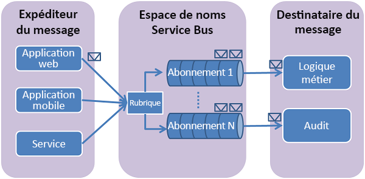

# utiliser le portail Azure pour créer une rubrique Service Bus et des abonnements à cette rubrique
Dans ce guide de démarrage rapide, vous utilisez le portail Azure pour créer une rubrique Service Bus, puis des abonnements à cette rubrique. 

## Présentation des rubriques et des abonnements Service Bus
Les rubriques et les abonnements Service Bus prennent en charge un modèle de communication de messagerie *de publication et d'abonnement* . Lors de l’utilisation de rubriques et d’abonnements, les composants d’une application distribuée ne communiquent pas directement entre eux ; ils échangent plutôt des messages via une rubrique, qui fait office d’intermédiaire.

Contrairement aux files d’attente Service Bus, où chaque message est traité par un seul consommateur, les rubriques et les abonnements fournissent une forme de communication « un-à-plusieurs », à l’aide d’un modèle de publication et d’abonnement. Il est possible d’inscrire plusieurs abonnements à une rubrique. Lorsqu’un message est envoyé à une rubrique, il est alors mis à disposition de chaque abonnement pour être géré ou traité indépendamment. Un abonnement à une rubrique ressemble à une file d’attente virtuelle qui reçoit des copies des messages envoyés à la rubrique. Vous pouvez éventuellement inscrire des règles de filtre pour une rubrique par abonnement, ce qui vous permet de filtrer ou de restreindre les messages d’une rubrique reçus en fonction des abonnements à une rubrique.

Les rubriques et les abonnements Service Bus vous permettent de mettre votre infrastructure à l’échelle pour traiter de nombreux messages parmi un grand nombre d’utilisateurs et d’applications.

[!INCLUDE [service-bus-create-namespace-portal](../../includes/service-bus-create-namespace-portal.md)]

[!INCLUDE [service-bus-create-topics-three-subscriptions-portal](../../includes/service-bus-create-topics-three-subscriptions-portal.md)]

> [!NOTE]
> Vous pouvez gérer les ressources Service Bus à l'aide de [Service Bus Explorer](https://github.com/paolosalvatori/ServiceBusExplorer/). Service Bus Explorer permet aux utilisateurs de se connecter à un espace de noms Service Bus et de gérer les entités de messagerie en toute simplicité. L’outil fournit des fonctionnalités avancées telles que la fonction d’importation/exportation ou la possibilité de tester une rubrique, des files d’attente, des abonnements, des services de relais, des hubs de notification et des hubs d’événements. 

## Étapes suivantes
Dans cet article, vous avez créé un espace de noms Service Bus, une rubrique dans l’espace de noms et trois abonnements à la rubrique. Pour savoir comment publier des messages dans la rubrique et s’abonner aux messages provenant d’un abonnement, consultez un des guides de démarrage rapide suivants dans la section **Publier et s’abonner à des messages**. 

- [.NET](service-bus-dotnet-how-to-use-topics-subscriptions.md)
- [Java](service-bus-java-how-to-use-topics-subscriptions.md)
- [JavaScript](service-bus-nodejs-how-to-use-topics-subscriptions.md)
- [Python](service-bus-python-how-to-use-topics-subscriptions.md)
- [PHP](service-bus-php-how-to-use-topics-subscriptions.md)
- [Ruby](service-bus-ruby-how-to-use-topics-subscriptions.md)