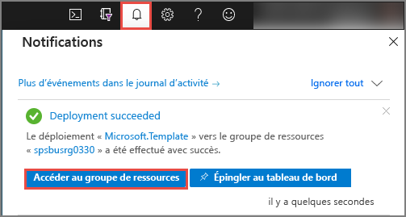
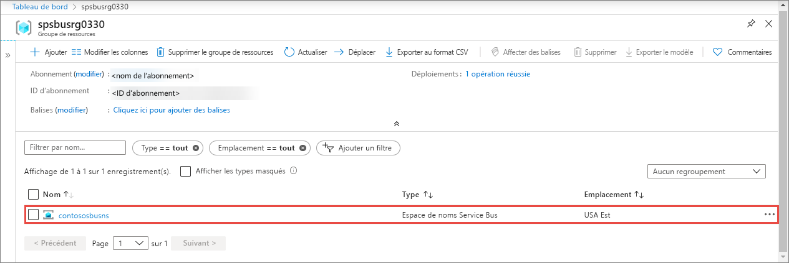
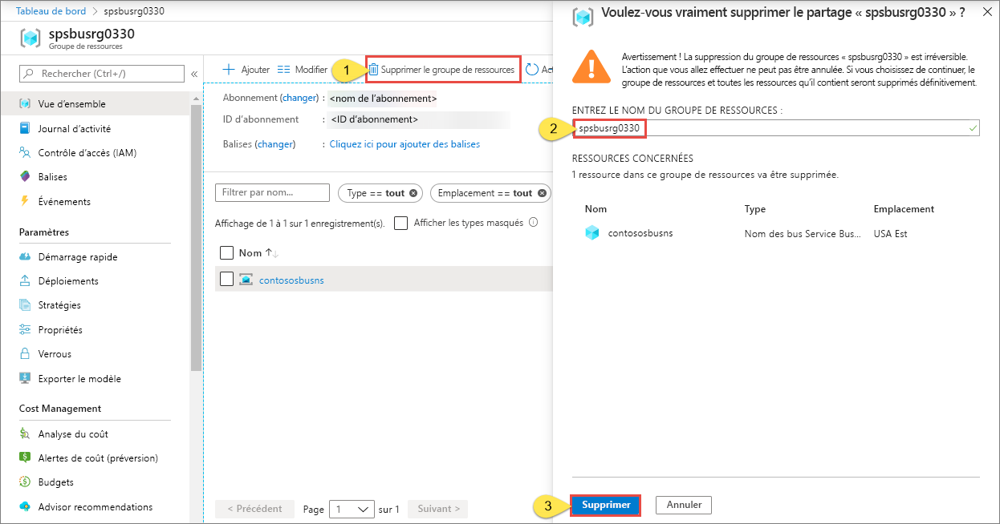

# Démarrage rapide : Créer un espace de noms Service Bus et d’une file d’attente à l’aide d’un modèle ARM

Cet article montre comment utiliser un modèle Azure Resource Manager (modèle ARM) qui crée un espace de noms Service Bus et une file d’attente au sein de cet espace de noms. L’article explique comment spécifier les ressources à déployer et définir les paramètres qui sont spécifiés durant l’exécution du déploiement. Vous pouvez utiliser ce modèle pour vos propres déploiements, ou le personnaliser afin qu’il réponde à vos besoins.

[!INCLUDE [About Azure Resource Manager](../../includes/resource-manager-quickstart-introduction.md)]

Si votre environnement remplit les prérequis et que vous êtes déjà familiarisé avec l’utilisation des modèles ARM, sélectionnez le bouton **Déployer sur Azure**. Le modèle s’ouvre dans le portail Azure.

## Prérequis

Si vous ne disposez pas d’abonnement Azure, créez un [compte gratuit](https://azure.microsoft.com/free/) avant de commencer.

## Vérifier le modèle

Le modèle utilisé dans ce démarrage rapide est tiré des [modèles de démarrage rapide Azure](https://azure.microsoft.com/resources/templates/201-servicebus-create-queue).

:::code language="json" source="~/quickstart-templates/201-servicebus-create-queue/azuredeploy.json":::

Les ressources définies dans le modèle incluent :

- [**Microsoft.ServiceBus/namespaces**](/azure/templates/microsoft.servicebus/namespaces)
- [**Microsoft.ServiceBus/namespaces/queues**](/azure/templates/microsoft.servicebus/namespaces/queues)

> [!NOTE]
> Les modèles ARM suivants sont disponibles pour le téléchargement et le déploiement.
>
> * [Créer un espace de noms Service Bus avec file d'attente et règle d’autorisation](service-bus-resource-manager-namespace-auth-rule.md)
> * [Créer un espace de noms Service Bus par rubrique et abonnement](service-bus-resource-manager-namespace-topic.md)
> * [Création d'un espace de noms Service Bus](service-bus-resource-manager-namespace.md)
> * [Créer un modèle d’espace de noms Service Bus avec rubrique, abonnement et règle](service-bus-resource-manager-namespace-topic-with-rule.md)

Vous trouverez plus de modèles dans [Modèles de démarrage rapide Azure](https://azure.microsoft.com/resources/templates/?resourceType=Microsoft.Servicebus&pageNumber=1&sort=Popular).

## Déployer le modèle

Avec ce modèle, vous déployez un espace de noms Service Bus avec une file d’attente.

Les [files d’attente Service Bus](service-bus-queues-topics-subscriptions.md#queues) permettent de remettre des messages selon le principe du premier entré, premier sorti (FIFO) à un ou plusieurs destinataires concurrents.

Pour exécuter automatiquement le déploiement, cliquez sur le bouton ci-dessous : Créez un groupe de ressources pour le déploiement afin de simplifier le nettoyage ultérieur.

## Valider le déploiement

1. Sélectionnez **Notifications** en haut pour voir l’état du déploiement. Patientez jusqu’à ce que le déploiement aboutisse. Ensuite, sélectionnez **Accéder au groupe de ressources** dans le message de notification pour accéder à la page du groupe de ressources contenant l’espace de noms Service Bus. 

    
2. Vérifiez que votre espace de noms Service Bus apparaît dans la liste des ressources. 

    
3. Sélectionnez l’espace de noms dans la liste pour voir la page **Espace de noms Service Bus**. 

## Nettoyer les ressources

1. Dans le portail Azure, accédez à la page **Groupe de ressources** pour votre groupe de ressources.
2. Sélectionnez **Supprimer le groupe de ressources** dans la barre d’outils. 
3. Saisissez le nom du groupe de ressources, puis sélectionnez **Supprimer**. 

    

## Étapes suivantes

Consultez la rubrique suivante, qui montre comment créer une règle d’autorisation pour l’espace de noms/la file d’attente :

[Créer une règle d’autorisation Service Bus pour l’espace de noms et la file d’attente à l’aide d’un modèle ARM](service-bus-resource-manager-namespace-auth-rule.md)

Découvrez comment gérer ces ressources en consultant les articles suivants :

* [Gestion de Service Bus avec PowerShell](service-bus-manage-with-ps.md)
* [Gérer les ressources Service Bus avec l'explorateur Service Bus](https://github.com/paolosalvatori/ServiceBusExplorer/releases)

[Authoring Azure Resource Manager templates]: ../azure-resource-manager/templates/template-syntax.md
[Service Bus namespace and queue template]: https://github.com/Azure/azure-quickstart-templates/blob/master/201-servicebus-create-queue/
[Azure Quickstart Templates]: https://azure.microsoft.com/documentation/templates/?term=service+bus
[Learn more about Service Bus queues]: service-bus-queues-topics-subscriptions.md
[Using Azure PowerShell with Azure Resource Manager]: ../azure-resource-manager/management/manage-resources-powershell.md
[Using the Azure CLI for Mac, Linux, and Windows with Azure Resource Management]: ../azure-resource-manager/management/manage-resources-cli.md
