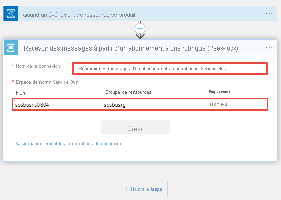
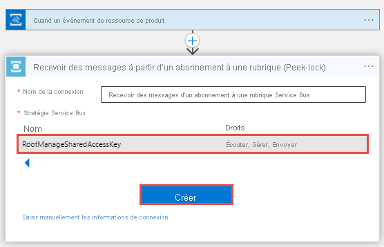
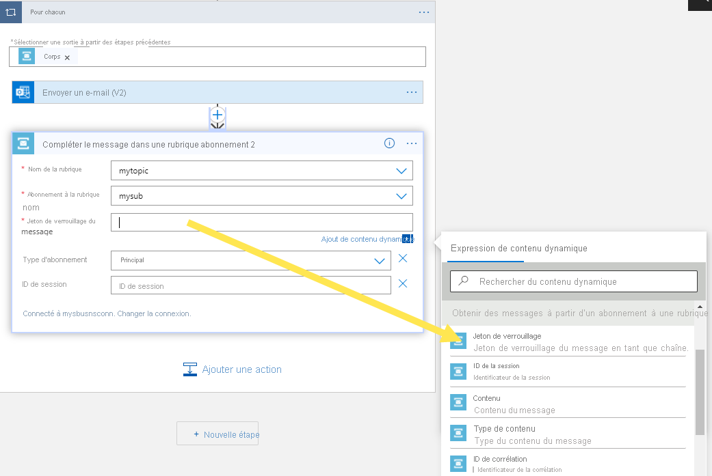

# Tutoriel : Répondre aux événements Azure Service Bus reçus via Azure Event Grid avec Azure Logic Apps
Dans ce tutoriel, vous allez apprendre à répondre aux événements Azure Service Bus qui sont reçus via Azure Event Grid à l’aide d’Azure Logic Apps. 

[!INCLUDE [service-bus-event-grid-prerequisites](../../includes/service-bus-event-grid-prerequisites.md)]

## Recevoir des messages à l’aide de Logic Apps
Au cours de cette étape, vous allez créer une application logique Azure qui reçoit des événements Service Bus via Azure Event Grid. 

1. Créez une application logique dans le portail Azure.
    1. Sélectionnez **+ Créer une ressource**, **Intégration**, puis **Application logique**. 
    2. Dans la page **Application logique - Créer**, entrez un **nom** pour l’application logique.
    3. Sélectionnez votre **abonnement** Azure. 
    4. Sélectionnez **Utiliser l’existant** pour **Groupe de ressources**, puis le groupe de ressources que vous avez utilisé pour d’autres ressources (telles que la fonction Azure ou l’espace de noms Service Bus) créées précédemment. 
    5. Sélectionnez l’**emplacement** de l’application logique. 
    6. Sélectionnez **Vérifier + créer**. 
    1. Dans la page **Vérifier + créer**, sélectionnez **Créer** pour créer l’application logique. 
1. Dans la page **Concepteur Logic Apps**, sélectionnez **Application logique vide** sous **Modèles**. 
1. Dans le concepteur, procédez comme suit :
    1. Recherchez **Event Grid**. 
    2. Sélectionnez **Quand un événement de ressource se produit - Azure Event Grid**. 

        
4. Sélectionnez **Se connecter**, entrez vos informations d’identification Azure, puis sélectionnez **Autoriser l’accès**. 
5. Dans la page **Quand un événement de ressource se produit**, effectuez les étapes suivantes :
    1. Sélectionnez votre abonnement Azure. 
    2. Pour **Type de ressource**, sélectionnez **Microsoft.ServiceBus.Namespaces**. 
    3. Pour **Nom de la ressource**, sélectionnez votre espace de noms Service Bus. 
    4. Sélectionnez **Ajouter un nouveau paramètre**, puis **Filtre de suffixe**. 
    5. Pour **Filtre de suffixe**, entrez le nom de votre deuxième abonnement à la rubrique Service Bus. 
        
6. Sélectionnez **+ Nouvelle étape** dans le concepteur et procédez comme suit :
    1. Recherchez **Service Bus**.
    2. Sélectionnez **Service Bus** dans la liste. 
    3. Recherchez **Obtenir les messages** dans la liste **Actions**. 
    4. Sélectionnez **Obtenir des messages à partir d’un abonnement à une rubrique (Peek-lock)** . 

        
    5. Attribuez un **nom à cette connexion**. Par exemple : **Obtenir des messages à partir de l’abonnement à la rubrique**, puis sélectionnez l’espace de noms Service Bus. 

         
    6. Sélectionnez **RootManageSharedAccessKey**, puis **Créer**.

         
    8. Sélectionnez votre **rubrique** et votre **abonnement**. 
    
        
7. Sélectionnez **+ Nouvelle étape** et procédez comme suit : 
    1. Sélectionnez **Service Bus**.
    2. Sélectionnez **Compléter le message dans un abonnement à une rubrique**. 
    3. Sélectionnez votre **rubrique** Service Bus.
    4. Sélectionnez le deuxième **abonnement** à la rubrique.
    5. Pour **Jeton de verrouillage du message**, sélectionnez **Jeton de verrouillage** à partir du **contenu dynamique**. 

        
8. Sélectionnez **Enregistrer** dans la barre d’outils du concepteur Logic Apps pour enregistrer l’application logique. 

    :::image type="content" source="./media/service-bus-to-event-grid-integration-example/save-logic-app.png" alt-text="Enregistrer l’application logique":::
1. Si vous n’avez pas encore envoyé de messages de test à la rubrique, suivez les instructions de la section [Envoyer des messages à la rubrique Service Bus](#send-messages-to-the-service-bus-topic). 
1. Basculez vers la page **Vue d’ensemble** de votre application logique. Vous voyez que l’application logique s’exécute dans **Historique des exécutions** pour les messages envoyés. L’exécution de l’application logique peut prendre quelques minutes. Sélectionnez **Actualiser** dans la barre d’outils pour actualiser la page. 

    
1. Sélectionnez une exécution de l’application logique pour voir les détails. Notez qu’elle a traité 5 messages dans la boucle for. 
    
    :::image type="content" source="./media/service-bus-to-event-grid-integration-example/logic-app-run-details.png" alt-text="Détails de l’exécution de l’application logique":::    

## Dépanner
Si vous ne voyez aucune invocation après avoir attendu un certain temps et actualisé la page, procédez comme suit : 

1. Vérifiez que les messages ont atteint la rubrique Service Bus. Consultez le compteur des **messages entrants** dans la page **Rubrique Service Bus**. En l’occurrence, comme j’ai exécuté l’application **MessageSender** à deux reprises, je vois 10 messages (5 messages pour chaque exécution).

    :::image type="content" source="./media/service-bus-to-event-grid-integration-example/topic-incoming-messages.png" alt-text="Page Rubrique Service Bus : messages entrants":::    
1. Vérifiez qu’il n’y a **aucun message actif** au niveau de l’abonnement Service Bus. 
    Si vous ne voyez pas d’événements dans cette page, vérifiez que la page **Abonnement Service Bus** n’affiche aucun **Nombre de messages actifs**. Si le nombre de ce compteur est supérieur à zéro, les messages au niveau de l’abonnement ne sont pas transmis à la fonction de gestionnaire (gestionnaire d’abonnement aux événements) pour une raison quelconque. Vérifiez que vous avez correctement configuré l’abonnement aux événements. 

    :::image type="content" source="./media/service-bus-to-event-grid-integration-example/subscription-active-message-count.png" alt-text="Nombre de messages actifs au niveau de l’abonnement Service Bus":::    
1. Vous pouvez également voir les **événements remis** dans la page **Événements** de l’espace de noms Service Bus. 

    :::image type="content" source="./media/service-bus-to-event-grid-integration-example/event-subscription-page.png" alt-text="Page événements : événements remis" lightbox="./media/service-bus-to-event-grid-integration-example/invocation-details.png":::
1. Vous pouvez également voir que les événements sont remis dans la page **Abonnement aux événements**. Vous pouvez accéder à cette page en sélectionnant l’abonnement aux événements dans la page **Événements**. 
    
    :::image type="content" source="./media/service-bus-to-event-grid-integration-example/event-subscription-delivered-events.png" alt-text="Page Abonnement aux événements : événements remis":::
## Étapes suivantes

* Apprenez-en plus sur [Azure Event Grid](../event-grid/index.yml).
* Apprenez-en plus sur [Azure Functions](../azure-functions/index.yml).
* Apprenez-en plus sur [la fonctionnalité Logic Apps d’Azure App Service](../logic-apps/index.yml).
* En savoir plus sur [Azure Service Bus](/azure/service-bus/).

[2]: ./media/service-bus-to-event-grid-integration-example/sbtoeventgrid2.png
[3]: ./media/service-bus-to-event-grid-integration-example/sbtoeventgrid3.png
[7]: ./media/service-bus-to-event-grid-integration-example/sbtoeventgrid7.png
[8]: ./media/service-bus-to-event-grid-integration-example/sbtoeventgrid8.png
[9]: ./media/service-bus-to-event-grid-integration-example/sbtoeventgrid9.png
[10]: ./media/service-bus-to-event-grid-integration-example/sbtoeventgrid10.png
[11]: ./media/service-bus-to-event-grid-integration-example/sbtoeventgrid11.png
[12]: ./media/service-bus-to-event-grid-integration-example/sbtoeventgrid12.png
[12-1]: ./media/service-bus-to-event-grid-integration-example/sbtoeventgrid12-1.png
[12-2]: ./media/service-bus-to-event-grid-integration-example/sbtoeventgrid12-2.png
[13]: ./media/service-bus-to-event-grid-integration-example/sbtoeventgrid13.png
[14]: ./media/service-bus-to-event-grid-integration-example/sbtoeventgrid14.png
[15]: ./media/service-bus-to-event-grid-integration-example/sbtoeventgrid15.png
[16]: ./media/service-bus-to-event-grid-integration-example/sbtoeventgrid16.png
[17]: ./media/service-bus-to-event-grid-integration-example/sbtoeventgrid17.png
[18]: ./media/service-bus-to-event-grid-integration-example/sbtoeventgrid18.png
[20]: ./media/service-bus-to-event-grid-integration-example/sbtoeventgridportal.png
[21]: ./media/service-bus-to-event-grid-integration-example/sbtoeventgridportal2.png