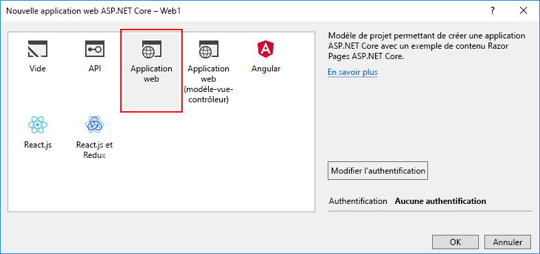
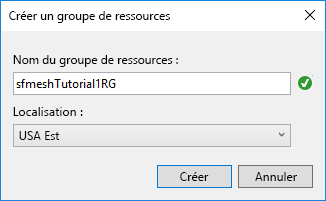

# <a name="quickstart-create-and-deploy-a-web-app-to-azure-service-fabric-mesh"></a>Démarrage rapide : créer et déployer une application web sur Azure Service Fabric mesh

> [!IMPORTANT]
> La préversion d’Azure Service Fabric Mesh a été mise hors service. Les nouveaux déploiements ne seront plus autorisés par le biais de l’API Service Fabric Mesh. La prise en charge des déploiements existants se poursuivra jusqu’au 28 avril 2021.
> 
> Pour plus détails, consultez [Mise hors service de la préversion d’Azure Service Fabric Mesh](https://azure.microsoft.com/updates/azure-service-fabric-mesh-preview-retirement/).

Azure Service Fabric mesh est un service entièrement géré qui permet aux développeurs de déployer des applications de microservices sans gestion de machines virtuelles, de stockage ou de mise en réseau.

Dans ce guide de démarrage rapide, vous allez créer une application Service Fabric mesh consistant en une application web ASP.NET Core, l’exécuter sur le cluster de développement local, puis la publier pour l’exécuter sur Azure.

Vous aurez besoin d’un abonnement Azure. Si vous n’en avez pas, vous pouvez facilement créer un abonnement Azure gratuit, et [créer un compte gratuit](https://azure.microsoft.com/free/) avant de commencer. Vous devrez également [configurer votre environnement de développement](service-fabric-mesh-howto-setup-developer-environment-sdk.md).

[!INCLUDE [preview note](./includes/include-preview-note.md)]

## <a name="create-a-service-fabric-mesh-project"></a>Créer un projet Service Fabric mesh

Ouvrez Visual Studio, puis sélectionnez **Fichier** > **Nouveau** > **Projet**.

Dans le champ **Recherche** situé en haut de la boîte de dialogue **Nouveau projet**, tapez `mesh`. Sélectionnez le modèle **Application Service Fabric mesh**. Si vous ne voyez pas le modèle, assurez-vous que vous avez installé le kit de développement logiciel (SDK) Mesh et la préversion des outils Visual Studio, comme décrit dans la section [Configurer votre environnement de développement](service-fabric-mesh-howto-setup-developer-environment-sdk.md). 

Dans le champ **Nom**, tapez **ServiceFabricMesh1** et, dans le champ **Emplacement**, indiquez le chemin d’accès du dossier dans lequel stocker les fichiers du projet.

Assurez-vous que l’option **Créer un répertoire pour la solution** est activée, puis cliquez sur **OK** pour créer le projet Service Fabric mesh.


### <a name="create-a-service"></a>Créer un service

Lorsque vous cliquez sur **OK**, la boîte de dialogue **Nouveau service Service Fabric** s’affiche. Sélectionnez le type de projet **ASP.NET Core**, vérifiez que le paramètre **Système d’exploitation de conteneur** est défini sur **Windows**, puis cliquez sur **OK** pour créer le projet ASP.NET Core. 


La boîte de dialogue **Nouvelle application web ASP.NET Core** s’affiche. Sélectionnez **Application web**, puis cliquez sur **OK**.



Visual Studio crée le projet d’application Service Fabric mesh et le projet ASP.NET Core.

## <a name="build-and-publish-to-your-local-cluster"></a>Générer et publier sur votre cluster local

Une image Docker est automatiquement générée et publiée sur votre cluster local dès que votre projet est chargé. Ce processus peut prendre du temps. Vous pouvez surveiller la progression des outils Service Fabric dans la fenêtre **Sortie** en sélectionnant l’élément **Service Fabric Tools** dans la liste déroulante de la fenêtre **Sortie**. Vous pouvez continuer à travailler pendant le déploiement de l’image Docker.

Une fois le projet créé, cliquez sur **F5** pour déboguer votre service localement. Une fois que le déploiement local est terminé et que Visual Studio exécute votre projet, une fenêtre du navigateur s’ouvre en affichant un exemple de page web.

Lorsque vous avez fini de parcourir le service, arrêtez le débogage de votre projet en appuyant sur **Maj+F5** dans Visual Studio.

## <a name="publish-to-azure"></a>Publication dans Azure

Pour publier votre projet Service Fabric mesh dans Azure, cliquez avec le bouton droit sur **Projet Service Fabric mesh** dans Visual Studio, puis sélectionnez **Publier...** .


Une boîte de dialogue **Publier une application Service Fabric** s’affiche.


Sélectionnez votre compte et votre abonnement Azure. Choisissez un **Emplacement**. Dans cet article, nous utilisons la région **USA Est**.

Sous **Groupe de ressources**, sélectionnez **\<Create New Resource Group...>** . La boîte de dialogue **Créer un groupe de ressources** s’affiche. Définir le **Nom du groupe de ressources** et l’**Emplacement**.  Ce démarrage rapide utilise l’emplacement **USA Est** et nomme le groupe **sfmeshTutorial1RG** (si plusieurs personnes utilisent le même abonnement dans votre organisation, choisissez un nom de groupe de ressources unique).  Cliquez sur **Créer** pour créer le groupe de ressources et revenir à la boîte de dialogue Publier.



Revenez à la boîte de dialogue **Publier une application Service Fabric** sous **Azure Container Registry**, puis sélectionnez **\<Create New Container Registry...>** . Dans la boîte de dialogue **Créer un registre de conteneurs**, utilisez un nom unique pour le **Nom du registre de conteneurs**. Spécifiez un **emplacement** (ce démarrage rapide utilise la région **USA Est**). Sélectionnez dans la liste déroulante le **groupe de ressources** que vous avez créé à l’étape précédente, par exemple, **sfmeshTutorial1RG**. Définissez la **référence (SKU)** sur **De base**, puis cliquez sur **Créer** pour revenir à la boîte de dialogue de publication.


Dans la boîte de dialogue de publication, cliquez sur le bouton **Publier** pour déployer votre application Service Fabric mesh dans Azure.

Lorsque vous publiez sur Azure pour la première fois, l’image Docker est envoyée (push) à Azure Container Registry (ACR), ce qui prend un certain temps selon la taille de l’image. Les publications ultérieures du même projet seront plus rapides. Vous pouvez surveiller la progression du processus de déploiement en sélectionnant **Service Fabric Tools** dans la liste déroulante de la fenêtre **Sortie** de Visual Studio. Une fois le déploiement terminé, la sortie **Service Fabric Tools** affiche l’adresse IP et le port de votre application sous la forme d’une URL.

```
Packaging Application...
Building Images...
Web1 -> C:\Code\ServiceFabricMesh1\Web1\bin\Any CPU\Release\netcoreapp2.0\Web1.dll
Uploading the images to Azure Container Registry...
Deploying application to remote endpoint...
The application was deployed successfully and it can be accessed at http://...
```

Ouvrez un navigateur web et accédez à l’URL pour voir le site web en cours d’exécution dans Azure :


## <a name="clean-up-resources"></a>Nettoyer les ressources

Lorsque vous n’en avez plus besoin, supprimez toutes les ressources que vous avez créées pour ce démarrage rapide. Étant donné que vous avez créé un groupe de ressources pour héberger les ressources de service d’ACR et de Service Fabric mesh, vous pouvez supprimer ce groupe de ressources en toute sécurité, ce qui est un moyen aisé de supprimer toutes les ressources qui y sont associées.

```azurecli
az group delete --resource-group sfmeshTutorial1RG
```

```powershell
Connect-AzureRmAccount
Remove-AzureRmResourceGroup -Name sfmeshTutorial1RG
```

Vous pouvez également supprimer le groupe de ressources [à partir du portail Azure](https://portal.azure.com).

## <a name="next-steps"></a>Étapes suivantes

Pour en savoir plus sur la création et le déploiement d’applications Service Fabric mesh, passez au didacticiel.
> [!div class="nextstepaction"]
> [Créer, déboguer et déployer une application web multiservice dans Service Fabric mesh](service-fabric-mesh-tutorial-create-dotnetcore.md)
