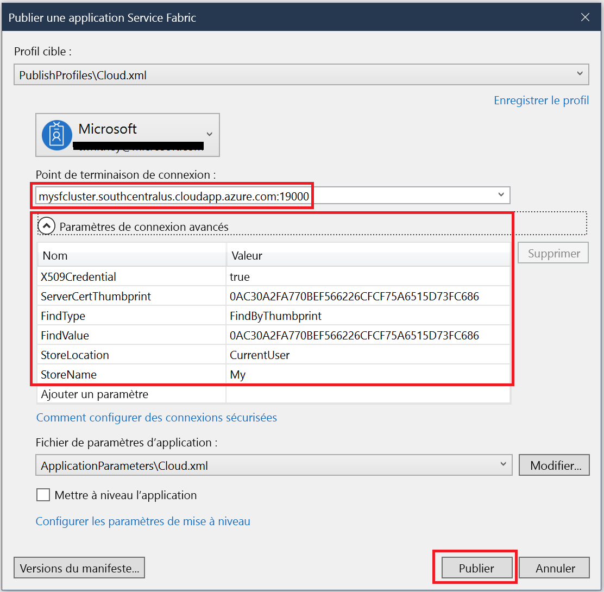

# <a name="quickstart-deploy-windows-containers-to-service-fabric"></a>Démarrage rapide : Déployer des conteneurs Windows sur Service Fabric

Azure Service Fabric est une plateforme de systèmes distribués pour le déploiement et la gestion de microservices et conteneurs extensibles et fiables.

L’exécution d’une application existante dans un conteneur Windows sur un cluster Service Fabric ne nécessite aucune modification de votre application. Ce guide de démarrage rapide montre comment déployer une image de conteneur Docker préconstruite dans une application Service Fabric. Une fois terminé, vous disposerez de Windows Server Core 2016 Server et d’un conteneur IIS en fonction. Ce guide de démarrage rapide décrit la procédure de déploiement d’un conteneur Windows. Lisez [ce guide de démarrage rapide](service-fabric-quickstart-containers-linux.md) pour déployer un conteneur Linux.

![Page web IIS par défaut][iis-default]

Dans ce guide de démarrage rapide, vous apprenez à :

* Placer un conteneur d’images Docker dans un package
* Configurer la communication
* Créer et placer l’application Service Fabric dans un package
* Déployer l’application de conteneur dans Azure


[!INCLUDE [updated-for-az](../../includes/updated-for-az.md)]

## <a name="prerequisites"></a>Prérequis

* Un abonnement Azure (vous pouvez créer un [ compte gratuit](https://azure.microsoft.com/free/?WT.mc_id=A261C142F)).
* Un ordinateur de développement exécutant :
  * Visual Studio 2019 ou Windows 2019.
  * [Outils et SDK Service Fabric](service-fabric-get-started.md).

## <a name="package-a-docker-image-container-with-visual-studio"></a>Placer un conteneur d’images Docker avec Visual Studio dans un package

Le kit de développement logiciel Service Fabric fournit un modèle de service pour vous aider à déployer un conteneur sur un cluster Service Fabric.

Démarrez Visual Studio en tant qu’administrateur.  Sélectionnez **Fichier** > **Nouveau** > **Projet**.

Sélectionnez **Service Fabric application** (Application Service Fabric), nommez-la « MyFirstContainer », puis cliquez sur **Créer**.

Sélectionnez **Conteneur** dans les modèles **Conteneurs et applications hébergés**.

Dans **Nom de l’image**, entrez « mcr.microsoft.com/windows/servercore/iis:windowsservercore-ltsc2016 », l’[image de base de Windows Server Core Server et IIS](https://hub.docker.com/_/microsoft-windows-servercore-iis).

Configurez le mappage de ports de type port à hôte du conteneur afin que les requêtes entrantes envoyées vers le service sur le port 80 soient mappées au port 80 du conteneur.  Définissez **Port du conteneur** sur « 80 » et **Port hôte** sur « 80 ».  

Nommez votre service « MyContainerService », puis cliquez sur **OK**.

![Boîte de dialogue Nouveau service][new-service]

## <a name="specify-the-os-build-for-your-container-image"></a>Spécifier la version du système d’exploitation de votre image conteneur

Les conteneurs générés avec une version spécifique de Windows Server peuvent ne pas fonctionner sur un hôte exécutant une autre version de Windows Server. Par exemple, les conteneurs créés à l’aide de Windows Server version 1709 ne fonctionnent pas sur les hôtes exécutant Windows Server 2016. Pour plus d’informations, consultez [Système d’exploitation Windows Server du conteneur et compatibilité avec le système d’exploitation hôte](service-fabric-get-started-containers.md#windows-server-container-os-and-host-os-compatibility). 

Avec la version 6.1 du runtime Service Fabric et les versions ultérieures, vous pouvez spécifier plusieurs images du système d’exploitation par conteneur et attribuer à chacune une balise indiquant le numéro de version du système d’exploitation sur lequel le déploiement doit être effectué. Cela permet de vous assurer que votre application s’exécutera sur les hôtes exécutant des versions différentes du système d’exploitation Windows. Pour en savoir plus, consultez la section [Spécifier les images conteneur spécifiques au build du système d’exploitation](service-fabric-get-started-containers.md#specify-os-build-specific-container-images). 

Microsoft publie différentes images pour les versions d’IIS basées sur les différentes versions de Windows Server. Pour vous assurer que Service Fabric déploie un conteneur compatible avec la version de Windows Server en cours d’exécution sur les nœuds de cluster dans lequel il déploie votre application, ajoutez les lignes suivantes au fichier *ApplicationManifest.xml*. La version de build pour Windows Server 2016 est 14393, et la version de build pour Windows Server version 1709 est 16299.

```xml
    <ContainerHostPolicies CodePackageRef="Code"> 
      <ImageOverrides> 
        ...
          <Image Name="mcr.microsoft.com/windows/servercore/iis:windowsservercore-1803" /> 
          <Image Name= "mcr.microsoft.com/windows/servercore/iis:windowsservercore-ltsc2016" Os="14393" /> 
          <Image Name="mcr.microsoft.com/windows/servercore/iis:windowsservercore-1709" Os="16299" /> 
      </ImageOverrides> 
    </ContainerHostPolicies> 
```

Le manifeste de service continue de ne spécifier qu’une seule image pour le nanoserveur, `mcr.microsoft.com/windows/servercore/iis:windowsservercore-ltsc2016`.

Toujours dans le fichier *ApplicationManifest.xml*, affectez à **PasswordEncrypted** la valeur **false**. Le compte et le mot de passe sont vides pour l’image conteneur publique qui se trouve sur Docker Hub. Nous devons donc désactiver le chiffrement dans la mesure où le chiffrement d’un mot de passe vide génère une erreur de build.

```xml
<RepositoryCredentials AccountName="" Password="" PasswordEncrypted="false" />
```

## <a name="create-a-cluster"></a>Créer un cluster

L’exemple de script suivant crée un cluster Service Fabric à cinq nœuds sécurisé avec un certificat X.509. La commande crée un certificat auto-signé et le charge vers un nouveau coffre de clés. Le certificat est également copié dans un répertoire local. Pour plus d’informations sur la création d’un cluster à l’aide de ce script, consultez [Créer un cluster Service Fabric](scripts/service-fabric-powershell-create-secure-cluster-cert.md).

Si nécessaire, installez Azure PowerShell à l’aide des instructions figurant dans le [Guide Azure PowerShell](/powershell/azure/).

Avant d’exécuter le script suivant, exécutez `Connect-AzAccount` dans PowerShell pour créer une connexion avec Azure.

Copiez le script suivant dans le Presse-papiers et ouvrez **Windows PowerShell ISE**.  Collez le contenu dans la fenêtre Untitled1.ps1 vide. Ensuite, indiquez des valeurs pour les variables dans le script : `subscriptionId`, `certpwd`, `certfolder`, `adminuser`, `adminpwd`, etc.  Le répertoire que vous spécifiez pour `certfolder` doit exister avant l’exécution du script.

[!code-powershell[main](../../powershell_scripts/service-fabric/create-secure-cluster/create-secure-cluster.ps1 "Create a Service Fabric cluster")]

Quand vous avez terminé d’affecter vos valeurs aux variables, appuyez sur **F5** pour exécuter le script.

Une fois le script exécuté et le cluster créé, recherchez le `ClusterEndpoint` dans la sortie. Par exemple :

```powershell
...
ClusterEndpoint : https://southcentralus.servicefabric.azure.com/runtime/clusters/b76e757d-0b97-4037-a184-9046a7c818c0
```

### <a name="install-the-certificate-for-the-cluster"></a>Installer le certificat pour le cluster

Nous allons à présent installer le fichier PFX dans le magasin de certificats *CurrentUser\My*. Le fichier PFX se trouve dans le répertoire que vous avez spécifié à l’aide de la variable d’environnement `certfolder` dans le script PowerShell ci-dessus.

Accédez à ce répertoire, puis exécutez la commande PowerShell suivante en remplaçant le nom du fichier PFX qui se trouve dans votre répertoire `certfolder` et le mot de passe que vous avez spécifié dans la variable `certpwd`. Dans cet exemple, le répertoire actif est celui spécifié par la variable `certfolder` dans le script PowerShell. La commande `Import-PfxCertificate` est alors exécutée :

```powershell
PS C:\mycertificates> Import-PfxCertificate -FilePath .\mysfclustergroup20190130193456.pfx -CertStoreLocation Cert:\CurrentUser\My -Password (ConvertTo-SecureString Password#1234 -AsPlainText -Force)
```

La commande retourne l’empreinte numérique (Thumbprint) suivante :

```powershell
  ...
  PSParentPath: Microsoft.PowerShell.Security\Certificate::CurrentUser\My

Thumbprint                                Subject
----------                                -------
0AC30A2FA770BEF566226CFCF75A6515D73FC686  CN=mysfcluster.SouthCentralUS.cloudapp.azure.com
```

N’oubliez pas la valeur de l’empreinte numérique pour l’étape suivante.

## <a name="deploy-the-application-to-azure-using-visual-studio"></a>Déployer l’application dans Azure avec Visual Studio

À présent que l’application est prête, vous pouvez la déployer sur un cluster directement à partir de Visual Studio.

Faites un clic droit sur **MyFirstContainer** dans l’Explorateur de solutions et choisissez **Publier**. La boîte de dialogue Publier s’affiche.

Copiez la chaîne située après **CN=** dans la fenêtre PowerShell au terme de l’exécution de la commande `Import-PfxCertificate` ci-dessus, puis ajoutez le port `19000` à celle-ci. Par exemple : `mysfcluster.SouthCentralUS.cloudapp.azure.com:19000`. Copiez cette chaîne dans le champ **Point de terminaison de connexion**. Notez cette valeur, car vous en aurez besoin par la suite.

Cliquez sur **Paramètres de connexion avancés** et vérifiez les informations des paramètres de connexion.  Les valeurs *FindValue* et *ServerCertThumbprint* doivent correspondre à l’empreinte numérique du certificat installé quand vous avez exécuté `Import-PfxCertificate` au cours de l’étape précédente.



Cliquez sur **Publier**.

Chaque application du cluster doit avoir un nom unique. S’il existe un conflit de noms, renommez le projet Visual Studio et recommencez le déploiement.

Ouvrez un navigateur et accédez à l’adresse que vous avez indiquée dans le champ **Point de terminaison de connexion** à l’étape précédente. Vous pouvez éventuellement ajouter l’identificateur de schéma, `http://`, et le port, `:80`, à l’URL. Par exemple, http:\//mysfcluster.SouthCentralUS.cloudapp.azure.com:80.

 La page web IIS par défaut s’affiche : ![Page web IIS par défaut][iis-default]

## <a name="clean-up"></a>Nettoyage

Vous continuez à être facturé tant que le cluster est en cours d’exécution. Songez à [supprimer votre cluster](./service-fabric-tutorial-delete-cluster.md).

## <a name="next-steps"></a>Étapes suivantes

Dans ce démarrage rapide, vous avez appris comment :

* Placer un conteneur d’images Docker dans un package
* Configurer la communication
* Créer et placer l’application Service Fabric dans un package
* Déployer l’application de conteneur dans Azure

Pour en savoir plus sur l’utilisation de conteneurs Windows dans Service Fabric, passez au tutoriel sur les applications de conteneur Windows.

> [!div class="nextstepaction"]
> [Créer une application de conteneur Windows](./service-fabric-host-app-in-a-container.md)

[iis-default]: ./media/service-fabric-quickstart-containers/iis-default.png
[publish-dialog]: ./media/service-fabric-quickstart-containers/publish-dialog.png
[new-service]: ./media/service-fabric-quickstart-containers/NewService.png
