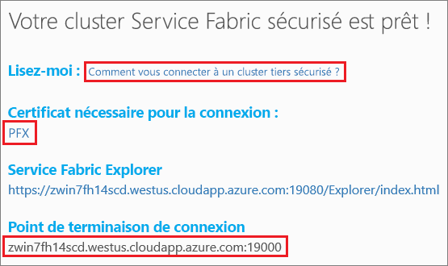

# <a name="quickstart-deploy-a-service-fabric-windows-container-application-on-azure"></a>Démarrage rapide : Déployer une application conteneur Windows Service Fabric sur Azure
Azure Service Fabric est une plateforme de systèmes distribués pour le déploiement et la gestion de microservices et conteneurs extensibles et fiables. 

L’exécution d’une application existante dans un conteneur Windows sur un cluster Service Fabric ne nécessite aucune modification de votre application. Ce guide de démarrage rapide montre comment déployer une image de conteneur Docker préconstruite dans une application Service Fabric. Une fois terminé, vous disposerez de Windows Server 2016 Nano Server et d’un conteneur IIS en fonction. Ce guide de démarrage rapide décrit la procédure de déploiement d’un conteneur Windows. Consultez [ce guide de démarrage rapide](service-fabric-quickstart-containers-linux.md) si vous souhaitez déployer un conteneur Linux.

![Page web IIS par défaut][iis-default]

Dans ce guide de démarrage rapide, vous apprenez à :

* Placer un conteneur d’images Docker dans un package
* Configurer la communication
* Créer et placer l’application Service Fabric dans un package
* Déployer l’application de conteneur dans Azure

## <a name="prerequisites"></a>Prérequis
* Un abonnement Azure (vous pouvez créer un [ compte gratuit](https://azure.microsoft.com/free/?WT.mc_id=A261C142F)).
* Un ordinateur de développement exécutant :
  * Visual Studio 2015 ou Visual Studio 2017.
  * [Outils et SDK Service Fabric](service-fabric-get-started.md).

## <a name="package-a-docker-image-container-with-visual-studio"></a>Placer un conteneur d’images Docker avec Visual Studio dans un package
Le kit de développement logiciel Service Fabric fournit un modèle de service pour vous aider à déployer un conteneur sur un cluster Service Fabric.

Démarrez Visual Studio en tant qu’administrateur.  Sélectionnez **Fichier** > **Nouveau** > **Projet**.

Sélectionnez **Service Fabric application** (Application Service Fabric), nommez-la « MyFirstContainer », puis cliquez sur **OK**.

Sélectionnez **Conteneur** dans les modèles **Conteneurs et applications hébergés**.

Dans **Nom de l’image**, entrez « microsoft/iis:nanoserver », l’[image de base Windows Server Nano Server et IIS](https://hub.docker.com/r/microsoft/iis/). 

Configurez le mappage de ports de type port à hôte du conteneur afin que les requêtes entrantes envoyées vers le service sur le port 80 soient mappées au port 80 du conteneur.  Définissez **Port du conteneur** sur « 80 » et **Port hôte** sur « 80 ».  

Nommez votre service « MyContainerService », puis cliquez sur **OK**.

![Boîte de dialogue Nouveau service][new-service]

## <a name="specify-the-os-build-for-your-container-image"></a>Spécifier la version du système d’exploitation de votre image conteneur
Les conteneurs générés avec une version spécifique de Windows Server peuvent ne pas fonctionner sur un hôte exécutant une autre version de Windows Server. Par exemple, les conteneurs créés à l’aide de Windows Server version 1709 ne fonctionnent pas sur les hôtes exécutant Windows Server 2016. Pour plus d’informations, consultez [Système d’exploitation Windows Server du conteneur et compatibilité avec le système d’exploitation hôte](service-fabric-get-started-containers.md#windows-server-container-os-and-host-os-compatibility). 

Avec la version 6.1 du runtime Service Fabric et les versions ultérieures, vous pouvez spécifier plusieurs images du système d’exploitation par conteneur et attribuer à chacune une balise indiquant le numéro de version du système d’exploitation sur lequel le déploiement doit être effectué. Cela permet de vous assurer que votre application s’exécutera sur les hôtes exécutant des versions différentes du système d’exploitation Windows. Pour en savoir plus, consultez la section [Spécifier les images conteneur spécifiques au build du système d’exploitation](service-fabric-get-started-containers.md#specify-os-build-specific-container-images). 

Microsoft publie différentes images pour les versions d’IIS basées sur les différentes versions de Windows Server. Pour vous assurer que Service Fabric déploie un conteneur compatible avec la version de Windows Server en cours d’exécution sur les nœuds de cluster dans lequel il déploie votre application, ajoutez les lignes suivantes au fichier *ApplicationManifest.xml*. La version de build pour Windows Server 2016 est 14393, et la version de build pour Windows Server version 1709 est 16299. 

```xml
    <ContainerHostPolicies CodePackageRef="Code"> 
      <ImageOverrides> 
        ...
          <Image Name="microsoft/iis:nanoserverDefault" /> 
          <Image Name= "microsoft/iis:nanoserver" Os="14393" /> 
          <Image Name="microsoft/iis:windowsservercore-1709" Os="16299" /> 
      </ImageOverrides> 
    </ContainerHostPolicies> 
```

Le manifeste de service continue de ne spécifier qu’une seule image pour le nanoserveur, `microsoft/iis:nanoserver`. 

## <a name="create-a-cluster"></a>Créer un cluster
Pour déployer l’application sur un cluster dans Azure, vous pouvez rejoindre un cluster Party. Les clusters tiers sont des clusters Service Fabric gratuits et limités dans le temps, hébergés sur Azure et gérés par l’équipe Service Fabric, où chacun peut déployer des applications et découvrir la plateforme.  Le cluster utilise un seul certificat auto-signé pour la sécurité de nœud à nœud et de client à nœud. Les clusters tiers prennent en charge les conteneurs. Si vous décidez de configurer et d’utiliser votre propre cluster, le cluster doit être en cours d’exécution sur une référence (SKU) qui prend en charge des conteneurs (par exemple Windows Server 2016 Datacenter avec Containers).

Connectez-vous et [rejoignez un cluster Windows](http://aka.ms/tryservicefabric). Téléchargez le certificat PFX sur votre ordinateur en cliquant sur le lien **PFX**. Cliquez sur le lien **Comment se connecter à un cluster tiers sécurisé ?** et copiez le mot de passe du certificat. Le certificat, le mot de passe du certificat et la valeur **Point de terminaison de connexion** sont utilisés dans les étapes suivantes.



> [!Note]
> Le nombre de clusters tiers disponibles par heure est limité. Si vous obtenez une erreur lors de votre inscription à un cluster tiers, attendez un peu et réessayez, ou suivez ces étapes dans le didacticiel [Déployer une application .NET](https://docs.microsoft.com/azure/service-fabric/service-fabric-tutorial-deploy-app-to-party-cluster#deploy-the-sample-application) pour créer un cluster Service Fabric dans votre abonnement Azure et déployez-y l’application. Le cluster créé à l’aide de Visual Studio prend en charge les conteneurs. Après avoir déployé et vérifié l’application dans votre cluster, vous pouvez passer à l’étape [Exemples complets de manifestes d’application et de service Service Fabric](#complete-example-service-fabric-application-and-service-manifests) de ce guide de démarrage rapide. 
>

Sur un ordinateur Windows, installez le certificat PFX dans le magasin de certificats *CurrentUser\My*.

```powershell
PS C:\mycertificates> Import-PfxCertificate -FilePath .\party-cluster-873689604-client-cert.pfx -CertStoreLocation Cert:\CurrentUser\My -Password (ConvertTo-SecureString 873689604 -AsPlainText -Force)


  PSParentPath: Microsoft.PowerShell.Security\Certificate::CurrentUser\My

Thumbprint                                Subject
----------                                -------
3B138D84C077C292579BA35E4410634E164075CD  CN=zwin7fh14scd.westus.cloudapp.azure.com
``` 

## <a name="deploy-the-application-to-azure-using-visual-studio"></a>Déployer l’application dans Azure avec Visual Studio
À présent que l’application est prête, vous pouvez la déployer sur un cluster directement à partir de Visual Studio.

Faites un clic droit sur **MyFirstContainer** dans l’Explorateur de solutions et choisissez **Publier**. La boîte de dialogue Publier s’affiche.

Copiez le **Point de terminaison de connexion** depuis la page du cluster tiers dans le champ **Point de terminaison de connexion**. Par exemple : `zwin7fh14scd.westus.cloudapp.azure.com:19000`. 

Cliquez sur **Publier**.

Chaque application du cluster doit avoir un nom unique.  Toutefois, les clusters Party constituent un environnement public partagé et un conflit avec une application existante peut se présenter.  S’il existe un conflit de noms, renommez le projet Visual Studio et recommencez le déploiement.

Ouvrez un navigateur et accédez au **point de terminaison de connexion** spécifié dans la page du cluster Party. Vous pouvez éventuellement ajouter l’identificateur de schéma, `http://`, et le port, `:80`, à l’URL. Par exemple : http://zwin7fh14scd.westus.cloudapp.azure.com:80. La page web IIS par défaut s’affiche : ![Page web IIS par défaut][iis-default]

## <a name="next-steps"></a>Étapes suivantes
Dans ce démarrage rapide, vous avez appris comment :

* Placer un conteneur d’images Docker dans un package
* Configurer la communication
* Créer et placer l’application Service Fabric dans un package
* Déployer l’application de conteneur dans Azure

Pour en savoir plus sur l’utilisation de conteneurs Windows dans Service Fabric, passez au tutoriel sur les applications de conteneur Windows.

> [!div class="nextstepaction"]
> [Créer une application de conteneur Windows](./service-fabric-host-app-in-a-container.md)

[iis-default]: ./media/service-fabric-quickstart-containers/iis-default.png
[publish-dialog]: ./media/service-fabric-quickstart-containers/publish-dialog.png
[new-service]: ./media/service-fabric-quickstart-containers/NewService.png
