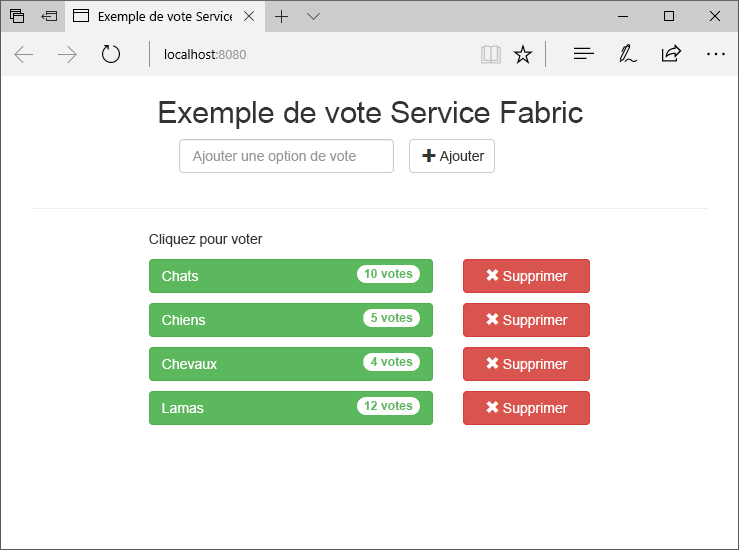
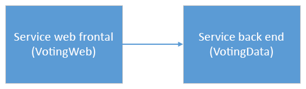
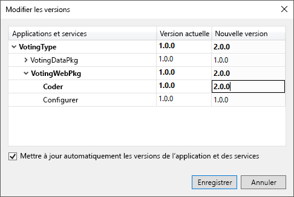
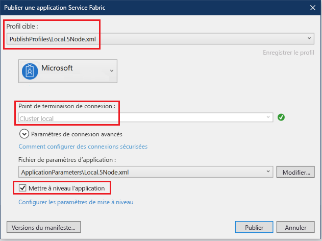
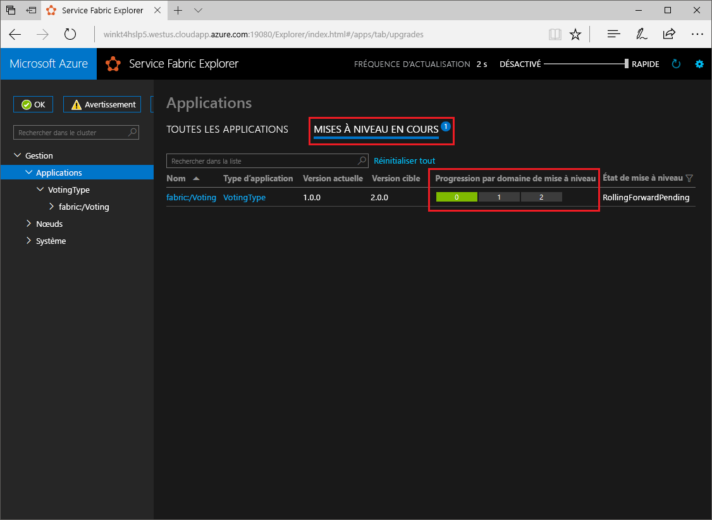

# <a name="quickstart-deploy-a-net-reliable-services-application-to-service-fabric"></a>Démarrage rapide : Déployer une application de services fiables .NET sur Service Fabric

Azure Service Fabric est une plateforme de systèmes distribués pour le déploiement et la gestion de microservices et conteneurs extensibles et fiables.

Ce démarrage rapide montre comment déployer votre première application .NET sur Service Fabric. Lorsque vous avez terminé, vous disposez d’une application de vote avec un composant web frontal ASP.NET Core qui enregistre les résultats de vote dans un service principal avec état dans le cluster.



Cette application vous permet d’apprendre à :

* Créer une application à l’aide de .NET et Service Fabric
* Utiliser ASP.NET Core en tant que service frontal web
* Stocker des données d’application dans un service avec état
* Déboguez votre application localement
* Mettre à l’échelle avec une montée en puissance parallèle sur plusieurs nœuds
* Effectuer une mise à niveau propagée d’application

## <a name="prerequisites"></a>Conditions préalables requises

Pour suivre ce guide de démarrage rapide :

1. [Installez Visual Studio 2019](https://www.visualstudio.com/) avec les charges de travail **Développement Azure** et **Développement web et ASP.NET**.
2. [Installez Git](https://git-scm.com/)
3. [Installez le Kit de développement logiciel (SDK) Microsoft Azure Service Fabric](https://www.microsoft.com/web/handlers/webpi.ashx?command=getinstallerredirect&appid=MicrosoftAzure-ServiceFabric-CoreSDK)
4. Exécutez la commande suivante pour permettre à Visual Studio de déployer sur le cluster Service Fabric local :

   ```powershell
   Set-ExecutionPolicy -ExecutionPolicy Unrestricted -Force -Scope CurrentUser
   ```
    
## <a name="build-a-cluster"></a>Générer un cluster

Après avoir installé le runtime, les SDK, Visual Studio Tools et Docker, et une fois ce dernier démarré, créez un cluster de développement local à cinq nœuds.

> [!Note]
> Le fait d’exécuter Docker pendant que vous créez le cluster permet d’activer les fonctionnalités de conteneur. Si Docker ne s’exécute pas, vous devrez recréer le cluster pour activer les fonctionnalités de conteneur.
> Bien qu’il ne soit pas nécessaire pour ce guide de démarrage rapide de créer le cluster en exécutant Docker, cette instruction est fournie au titre de bonne pratique.
> Vérifiez que Docker est en cours d’exécution en ouvrant une fenêtre de terminal et en exécutant `docker ps` pour voir si une erreur se produit. Si la réponse n’indique aucune erreur, Docker est en cours d’exécution et vous êtes prêt à générer un cluster.
>
> [Configurer Windows 10 ou Windows Server pour des conteneurs](/virtualization/windowscontainers/quick-start/set-up-environment?tabs=Windows-10-Client)

1. Ouvrez une nouvelle fenêtre PowerShell avec élévation de privilèges en tant qu’administrateur.
2. Exécutez la commande PowerShell suivante pour créer un cluster de développement :

   ```powershell
   . "C:\Program Files\Microsoft SDKs\Service Fabric\ClusterSetup\DevClusterSetup.ps1"
   ```
3. Exécutez la commande suivante pour démarrer l’outil de gestion de cluster local :

   ```powershell
   . "C:\Program Files\Microsoft SDKs\Service Fabric\Tools\ServiceFabricLocalClusterManager\ServiceFabricLocalClusterManager.exe"
   ```

>[!NOTE]
> L’exemple d’application de ce démarrage rapide utilise des fonctionnalités qui ne sont pas disponibles sur Windows 7.
>

## <a name="download-the-sample"></a>Télécharger l’exemple

Dans une fenêtre Commande, exécutez la commande suivante pour cloner le référentiel de l’exemple d’application sur votre ordinateur local.

```git
git clone https://github.com/Azure-Samples/service-fabric-dotnet-quickstart
```

## <a name="run-the-application-locally"></a>Exécuter l’application localement

Dans le Menu Démarrer, cliquez avec le bouton droit sur l’icône Visual Studio, puis choisissez **Exécuter en tant qu’administrateur**. Pour attacher le débogueur à vos services, vous devez exécuter Visual Studio en tant qu’administrateur.

Ouvrez la solution Visual Studio **Voting.sln** à partir du référentiel que vous avez cloné.

Par défaut, l’application Voting écoute sur le port 8080.  Le port de l’application est défini dans le fichier */VotingWeb/PackageRoot/ServiceManifest.xml*.  Vous pouvez changer le port de l’application en mettant à jour l’attribut **Port** de l’élément **Endpoint**.  Pour déployer et exécuter l’application localement, le port de l’application doit être ouvert et disponible sur votre ordinateur.  Si vous changez le port de l’application, remplacez « 8080 » par la nouvelle valeur de port d’application tout au long de cet article.

Pour déployer l’application, appuyez sur **F5**.

> [!NOTE]
> Dans la fenêtre de sortie Visual Studio, vous voyez le message « L’URL d’application n’est pas définie ou n’est pas une URL HTTP/HTTPS. L’application ne sera pas ouverte à partir du navigateur. »  Ce message n’indique pas une erreur, mais qu’un navigateur ne peut pas démarrer automatiquement.

Une fois le déploiement terminé, lancez un navigateur et ouvrez `http://localhost:8080` pour afficher le front-end web de l’application.


Vous pouvez à présent ajouter un ensemble d’options de vote et commencer à enregistrer les votes. L’application s’exécute et stocke toutes les données dans votre cluster Service Fabric, sans recourir à une base de données séparée.

## <a name="walk-through-the-voting-sample-application"></a>Guide de l’exemple d’application de vote

L’application de vote se compose de deux services :

* Service frontal web (VotingWeb) : service frontal web ASP.NET Core qui fait office de page web et expose les API web pour communiquer avec le service principal.
* Service principal (VotingData) : service web ASP.NET Core qui expose une API pour stocker les résultats de vote dans un dictionnaire fiable rendu persistant sur disque.



Lorsque vous votez dans l’application, les événements suivants se produisent :

1. Un JavaScript envoie la demande de vote à l’API web dans le service frontal web en tant que demande HTTP PUT.

2. Le service frontal web utilise un proxy pour localiser et transférer une demande HTTP PUT au service principal.

3. Le service principal accepte la demande entrante, puis stocke le résultat mis à jour dans un dictionnaire fiable, qui est répliqué sur plusieurs nœuds au sein du cluster et rendu persistant sur disque. Toutes les données de l’application étant stockées dans le cluster, aucune base de données n’est nécessaire.

## <a name="debug-in-visual-studio"></a>Déboguer dans Visual Studio

L’application doit fonctionner correctement, mais vous pouvez utiliser le débogueur pour voir comment fonctionnent les éléments clés de l’application. Lors du débogage d’application dans Visual Studio, vous utilisez un cluster de développement Service Fabric local. Vous pouvez adapter votre expérience de débogage à votre scénario. Dans cette application, les données sont stockées dans notre service backend à l’aide d’un dictionnaire fiable. Visual Studio supprime l’application par défaut lorsque vous arrêtez le débogueur. La suppression de l’application a pour effet de supprimer également les données dans le service principal. Pour rendre les données persistantes entre les sessions de débogage, vous pouvez modifier le **Mode de débogage de l'application** en tant que propriété sur le projet **Voting** dans Visual Studio.

Pour examiner ce qui se produit dans le code, procédez comme suit :

1. Ouvrez le fichier **/VotingWeb/Controllers/VotesController.cs** et définissez un point d’arrêt dans la méthode **Put** de l’API web (ligne 69). Vous pouvez rechercher le fichier dans l’Explorateur de solutions dans Visual Studio.

2. Ouvrez le fichier **/VotingData/Controllers/VoteDataController.cs** et définissez un point d’arrêt dans la méthode **Put** de l’API web (ligne 54).

3. Revenez en arrière dans le navigateur, puis cliquez sur une option de vote ou ajoutez une nouvelle option de vote. Vous avez atteint le premier point d’arrêt dans le contrôleur d’api du service frontal web.
   * Dans cette étape, l’emplacement où le JavaScript dans le navigateur envoie une demande au contrôleur d’API web dans le service frontal.

     

   * Tout d’abord, créez l’URL du ReverseProxy pour notre service backend **(1)** .
   * Ensuite, envoyez la requête HTTP PUT au ReverseProxy **(2)** .
   * Pour finir, retournez la réponse du service backend au client **(3)** .

4. Appuyez sur **F5** pour continuer.
   - Si le navigateur vous y invite, accordez des autorisations de lecture et d’exécution au groupe ServiceFabricAllowedUsers pour le mode débogage.
   - Vous êtes à présent au point d’arrêt dans le service principal.

     

   - Dans la première ligne de la méthode **(1)** , le `StateManager` obtient ou ajoute un dictionnaire fiable nommé `counts`.
   - Toutes les interactions avec des valeurs d’un dictionnaire fiable requièrent une transaction. Cette instruction using **(2)** crée cette transaction.
   - Dans la transaction, mettez à jour la valeur de la clé appropriée pour l’option de vote et validez l’opération **(3)** . Lorsque la méthode commit retourne des données, celles-ci sont mises à jour dans le dictionnaire et répliquées sur d’autres nœuds du cluster. Les données sont à présent stockées en sécurité dans le cluster, et le service principal peut basculer vers d’autres nœuds, tout en gardant les données disponibles.
5. Appuyez sur **F5** pour continuer.

Pour arrêter la session de débogage, appuyez sur **Maj+F5**.

## <a name="perform-a-rolling-application-upgrade"></a>Effectuer une mise à niveau propagée d’application

Lors du déploiement de nouvelles mises à jour de votre application, Service Fabric procède au déploiement en toute sécurité. Les mises à niveau propagées n’occasionnent aucun temps d'arrêt, et assurent une restauration automatique en cas d’erreur.

Pour mettre à niveau l'application, procédez comme suit :

1. Ouvrez le fichier **/VotingWeb/Views/Home/Index.cshtml** dans Visual Studio.
2. Modifiez le titre sur la page en ajoutant ou en mettant à jour le texte. Par exemple, remplacez l’en-tête par « Exemple de vote Service Fabric v2 ».
3. Enregistrez le fichier .
4. Dans l’Explorateur de solutions, cliquez avec le bouton droit sur **Voting**, puis choisissez **Publier**. La boîte de dialogue Publier s’affiche.
5. Cliquez sur le bouton **Version du manifeste** pour modifier la version du service et de l’application.
6. Modifiez la version de l’élément **Code** sous **VotingWebPkg**, par exemple sur « 2.0.0 », puis cliquez sur **Enregistrer**.

    
7. Dans la boîte de dialogue **Publier une application Service Fabric**, cochez la case **Mettre à niveau l’application**.
8.  Remplacez **Profil cible** par **PublishProfiles\Local.5Node.xml** et vérifiez que le **Point de terminaison de connexion** a la valeur **Cluster Local**. 
9. Sélectionnez **Mettre à niveau l’application**.

    

10. Cliquez sur **Publier**.

    Pendant l’exécution de la mise à niveau, vous pouvez continuer à utiliser l’application. Étant donné que vous avez deux instances du service en cours d’exécution dans le cluster, certaines de vos demandes peuvent obtenir une version mise à niveau de l’application, et d’autres utilisateurs l’ancienne version.

11. Ouvrez votre navigateur et accédez à l’adresse de cluster sur le port 19080. Par exemple : `http://localhost:19080/`.
12. Cliquez sur le nœud **Applications** dans l’arborescence, puis sur **Mises à niveau en cours d’exécution** dans le volet droit. Vous voyez comment la mise à niveau se déroule au travers des domaines de mise à niveau dans votre cluster, en s’assurant que chaque domaine est intègre avant de passer au suivant. Un domaine de mise à niveau dans la barre de progression apparaît en vert quand l’intégrité du domaine a été vérifiée.
    

    Service Fabric sécurise les mises à niveau en attendant deux minutes après la mise à niveau du service sur chaque nœud du cluster. La mise à jour entière prend environ huit minutes.

## <a name="next-steps"></a>Étapes suivantes

Dans ce démarrage rapide, vous avez appris comment :

* Créer une application à l’aide de .NET et Service Fabric
* Utiliser ASP.NET Core en tant que service frontal web
* Stocker des données d’application dans un service avec état
* Déboguez votre application localement
* Mettre à l’échelle avec une montée en puissance parallèle sur plusieurs nœuds
* Effectuer une mise à niveau propagée d’application

Pour plus d’informations sur Service Fabric et .NET, suivez ce didacticiel :
> [!div class="nextstepaction"]
> [Application .NET sur Service Fabric](service-fabric-tutorial-create-dotnet-app.md)
