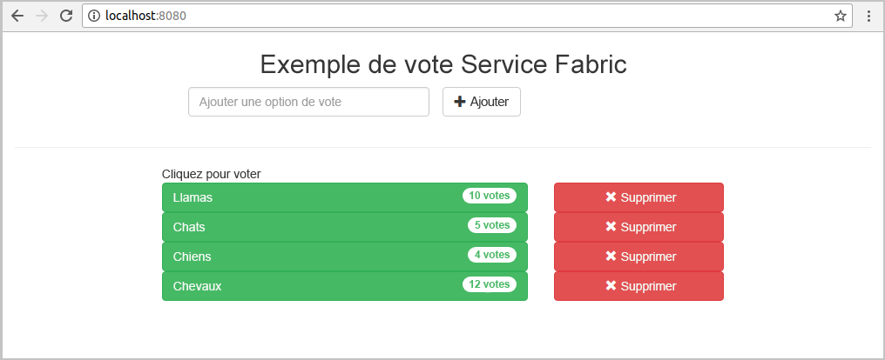
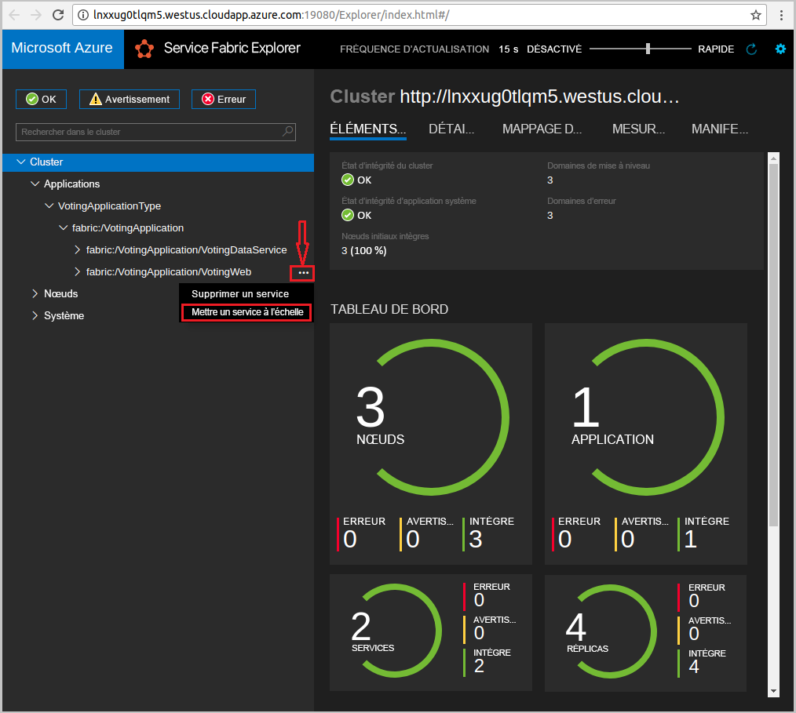
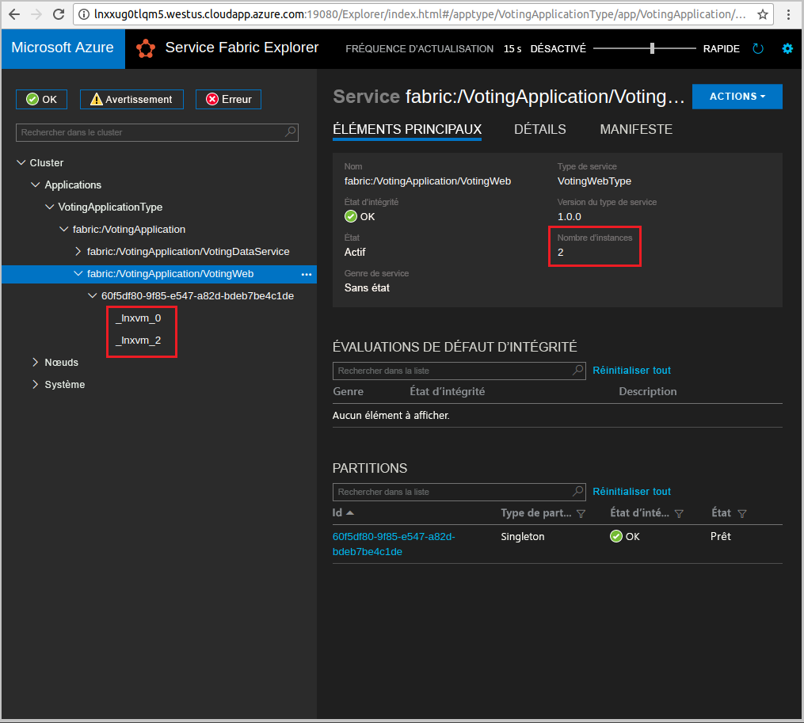

# <a name="quickstart--deploy-a-java-app-to-azure-service-fabric-on-linux"></a>Démarrage rapide :  Déployer une application Java dans Azure Service Fabric sur Linux

Dans ce guide de démarrage rapide, vous déployez une application Java sur Azure Service Fabric à l’aide de l’IDE Eclipse sur un ordinateur de développement Linux. Lorsque vous avez terminé, vous disposez d’une application de vote avec un frontend Java qui enregistre les résultats de vote dans un service backend avec état dans le cluster.

Azure Service Fabric est une plateforme de systèmes distribués pour le déploiement et la gestion de microservices et de conteneurs.

## <a name="prerequisites"></a>Prérequis

- [Environnement Java](https://docs.microsoft.com/azure/service-fabric/service-fabric-get-started-linux#set-up-java-development) et [Yeoman](https://docs.microsoft.com/azure/service-fabric/service-fabric-get-started-linux#set-up-yeoman-generators-for-containers-and-guest-executables)
- [Eclipse Neon (4.6)+](https://www.eclipse.org/downloads/packages/) et [plug-in Eclipse pour Service Fabric](https://docs.microsoft.com/azure/service-fabric/service-fabric-get-started-linux#install-the-eclipse-plug-in-optional)
- [SDK Service Fabric et interface de ligne de commande (CLI)](https://docs.microsoft.com/azure/service-fabric/service-fabric-get-started-linux#installation-methods)
- [Git](https://git-scm.com/downloads)

## <a name="download-the-sample"></a>Télécharger l’exemple

Dans une fenêtre Commande, exécutez la commande suivante pour cloner le référentiel de l’exemple d’application sur votre ordinateur local.

```bash
git clone https://github.com/Azure-Samples/service-fabric-java-quickstart.git
```

## <a name="run-the-application-locally"></a>Exécuter l’application localement

1. Démarrez le cluster local en exécutant la commande suivante :

    ```bash
    sudo /opt/microsoft/sdk/servicefabric/common/clustersetup/devclustersetup.sh
    ```
    Le démarrage du cluster local prend un certain temps. Pour vérifier que le cluster est entièrement opérationnel, accédez à Service Fabric Explorer à l’adresse `http://localhost:19080`. Les cinq nœuds sains indiquent que le cluster local est opérationnel.

    

2. Ouvrez Eclipse.
3. Cliquez sur **Fichier** > **Importer** > **Gradle** > **Projet Gradle existant** et suivez l’assistant.
4. Cliquez sur **Répertoire**, puis sélectionnez le répertoire **Voting** dans le dossier **service-fabric-java-quickstart** que vous avez cloné à partir de GitHub. Sélectionnez **Terminer**.

    

5. Le projet `Voting` se trouve désormais dans l’Explorateur de package pour Eclipse.
6. Cliquez avec le bouton droit sur le projet, puis sélectionnez **Publier l’application** dans la liste déroulante **Service Fabric**. Choisissez **PublishProfiles/Local.json** comme profil cible, puis cliquez sur **Publier**.

    

7. Ouvrez votre navigateur web préféré, puis accédez à l’application à l’adresse `http://localhost:8080`.

    

Vous pouvez à présent ajouter un ensemble d’options de vote et commencer à enregistrer les votes. L’application s’exécute et stocke toutes les données dans votre cluster Service Fabric, sans recourir à une base de données séparée.



## <a name="scale-applications-and-services-in-a-cluster"></a>Mettre à l’échelle les applications et services dans un cluster

Les services peuvent facilement être mis à l’échelle dans un cluster pour prendre en compte une modification de la charge sur les services. Pour mettre à l’échelle un service, vous modifiez le nombre d’instances s’exécutant dans le cluster. Il existe de nombreuses façons de mettre à l’échelle vos services. Par exemple, vous pouvez utiliser des scripts ou des commandes à partir de l’interface de ligne de commande (CLI) Service Fabric (`sfctl`). Dans les étapes suivantes, utilisez Service Fabric Explorer.

Service Fabric Explorer s’exécute dans tous les clusters Service Fabric et est accessible à partir d’un navigateur, en accédant au port de gestion HTTP (19080) du cluster. Par exemple : `http://localhost:19080`.

Pour mettre à l’échelle le service web frontal, procédez comme suit :

1. Ouvrez Service Fabric Explorer dans votre cluster. Par exemple : `https://localhost:19080`.
2. Cliquez sur le bouton de sélection ( **...** ) à côté du nœud **fabric:/Voting/VotingWeb** dans l’arborescence, puis sélectionnez **Scale Service** (Mettre à l’échelle le service).

    

    Vous pouvez maintenant choisir de mettre à l’échelle le nombre d’instances du service frontal web.

3. Définissez le nombre sur **2**, puis sélectionnez **Scale Service**.
4. Sélectionnez le nœud **fabric:/Voting/VotingWeb** dans l’arborescence, puis développez le nœud de la partition (représenté par un GUID).

    

    Vous pouvez maintenant voir que le service a deux instances et, dans l’arborescence, vous voyez les nœuds sur lesquels les instances s’exécutent.

Via cette tâche de gestion simple, vous avez doublé les ressources disponibles pour permettre au service frontal de traiter la charge utilisateur. Il est important de comprendre que vous n’avez pas besoin de plusieurs instances d’un service pour que celui-ci s’exécute de manière fiable. En cas de défaillance d’un service, Service Fabric veille à ce qu’une nouvelle instance du service s’exécute dans le cluster.

## <a name="next-steps"></a>Étapes suivantes

Dans ce démarrage rapide, vous avez appris comment :

* Utiliser Eclipse comme outil pour vos applications Java Service Fabric
* Déployer des applications Java sur votre cluster local
* Mettre à l’échelle avec une montée en puissance parallèle sur plusieurs nœuds

Pour en savoir plus sur l’utilisation des applications Java dans Service Fabric, passez au tutoriel sur les applications Java.

> [!div class="nextstepaction"]
> [Didacticiel : créer et déployer une application avec un service frontal API Web Java et un service principal avec état](./service-fabric-tutorial-create-java-app.md)
