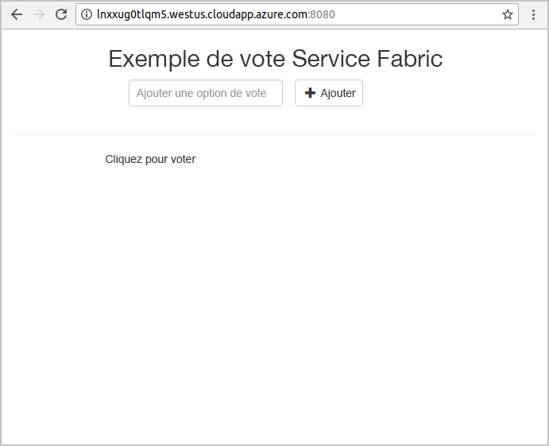

# <a name="quickstart-deploy-a-java-reliable-services-application-to-service-fabric"></a>Démarrage rapide : Déployer une application de services fiables Java sur Service Fabric

Azure Service Fabric est une plateforme de systèmes distribués pour le déploiement et la gestion de microservices et de conteneurs.

Ce démarrage rapide montre comment déployer votre première application Java dans Service Fabric à l’aide de l’IDE Eclipse sur un ordinateur de développement Linux. Lorsque vous avez terminé, vous disposez d’une application de vote avec un frontend Java qui enregistre les résultats de vote dans un service backend avec état dans le cluster.


Dans ce guide de démarrage rapide, vous apprenez à :

* Utiliser Eclipse comme outil pour vos applications Java Service Fabric
* Déployer l’application dans le cluster local
* Déployer l’application sur un cluster dans Azure
* Mettre à l’échelle avec une montée en puissance parallèle sur plusieurs nœuds

## <a name="prerequisites"></a>Prérequis

Pour suivre ce guide de démarrage rapide :

1. [Installez le SDK Service Fabric et l’interface CLI Service Fabric](https://docs.microsoft.com/azure/service-fabric/service-fabric-get-started-linux#installation-methods)
2. [Installez Git](https://git-scm.com/)
3. [Installez Eclipse](https://www.eclipse.org/downloads/)
4. [Configurez l’environnement Java](https://docs.microsoft.com/azure/service-fabric/service-fabric-get-started-linux#set-up-java-development), en suivant les étapes facultatives d’installation du plug-in Eclipse

## <a name="download-the-sample"></a>Télécharger l’exemple

Dans une fenêtre Commande, exécutez la commande suivante pour cloner le référentiel de l’exemple d’application sur votre ordinateur local.

```git
git clone https://github.com/Azure-Samples/service-fabric-java-quickstart.git
```

## <a name="run-the-application-locally"></a>Exécuter l’application localement

1. Démarrez le cluster local en exécutant la commande suivante :

    ```bash
    sudo /opt/microsoft/sdk/servicefabric/common/clustersetup/devclustersetup.sh
    ```
    Le démarrage du cluster local prend un certain temps. Pour vérifier que le cluster est entièrement opérationnel, accédez à Service Fabric Explorer à l’adresse **http://localhost:19080**. Les cinq nœuds sains indiquent que le cluster local est opérationnel.

    

2. Ouvrez Eclipse.
3. Cliquez sur Fichier -> Importer -> Gradle -> projet Gradle existant et suivez l’assistant.
4. Cliquez sur Répertoire, puis sélectionnez le répertoire `Voting` dans le dossier `service-fabric-java-quickstart` que vous avez cloné à partir de Github. Cliquez sur Finish. 

    

5. Le projet `Voting` se trouve désormais dans l’Explorateur de package pour Eclipse.
6. Cliquez avec le bouton droit sur le projet, puis sélectionnez **Publier l’application...** dans la liste déroulante **Service Fabric**. Choisissez **PublishProfiles/Local.json** comme profil cible, puis cliquez sur Publier.

    

7. Ouvrez votre navigateur web préféré, puis accédez à l’application à l’adresse **http://localhost:8080**.

    

Vous pouvez à présent ajouter un ensemble d’options de vote et commencer à enregistrer les votes. L’application s’exécute et stocke toutes les données dans votre cluster Service Fabric, sans recourir à une base de données séparée.

## <a name="deploy-the-application-to-azure"></a>Déploiement de l’application dans Azure

### <a name="set-up-your-azure-service-fabric-cluster"></a>Configurer un cluster Azure Service Fabric

Pour déployer l’application sur un cluster dans Azure, créez votre propre cluster.

Les clusters tiers sont des clusters Service Fabric gratuits, limités dans le temps et hébergés sur Azure. En outre, ils sont exécutés par l’équipe Service Fabric. Vous pouvez utiliser des clusters tiers pour déployer des applications et en apprendre davantage sur la plateforme. Le cluster utilise un seul certificat auto-signé pour la sécurité de nœud à nœud et de client à nœud.

Connectez-vous et rejoignez un [cluster Linux](https://aka.ms/tryservicefabric). Téléchargez le certificat PFX sur votre ordinateur en cliquant sur le lien **PFX**. Cliquez sur le lien **Lisez-moi** pour obtenir le mot de passe du certificat et les instructions associées à la configuration de plusieurs environnements pour utiliser le certificat. Gardez les pages **d’accueil** et **Lisez-moi** ouvertes, car vous allez suivre certaines des instructions qui y sont affichées dans la procédure ci-après.

> [!Note]
> Le nombre de clusters tiers disponibles par heure est limité. Si vous obtenez une erreur lors de votre inscription à un cluster tiers, attendez un peu et réessayez. Vous pouvez également suivre la procédure décrite dans [Didacticiel : Déployer un cluster Service Fabric Linux dans un réseau virtuel Azure](service-fabric-tutorial-create-vnet-and-linux-cluster.md) pour créer un cluster dans votre abonnement.
>
> Le service Spring Boot est configuré pour écouter le trafic entrant sur le port 8080. Assurez-vous que ce port est ouvert dans votre cluster. Si vous utilisez le cluster tiers, ce port est ouvert.
>

Service Fabric propose plusieurs outils que vous pouvez utiliser pour gérer un cluster et ses applications :

* Service Fabric Explorer, un outil reposant sur un navigateur.
* Interface CLI Service Fabric, qui s’exécute sur Azure CLI.
* Commandes PowerShell.

Dans ce démarrage rapide, vous utilisez la CLI Service Fabric et Service Fabric Explorer.

Pour utiliser la CLI, vous devez créer un fichier PEM basé sur le fichier PFX que vous avez téléchargé. Pour convertir le fichier, utilisez la commande suivante. (Pour les clusters tiers, vous pouvez copier une commande spécifique à votre fichier PFX dans les instructions de la page **Lisez-moi**.)

    ```bash
    openssl pkcs12 -in party-cluster-1486790479-client-cert.pfx -out party-cluster-1486790479-client-cert.pem -nodes -passin pass:1486790479
    ```

Pour utiliser Service Fabric Explorer, vous devez importer le fichier PFX du certificat que vous avez téléchargé depuis le site du cluster tiers dans votre magasin de certificats (Windows ou Mac) ou dans le navigateur lui-même (Ubuntu). Vous avez besoin du mot de passe de la clé privée PFX, que vous pouvez obtenir depuis la page **Lisez-moi**.

Utilisez la méthode qui vous convient le mieux pour importer les certificats sur votre système. Par exemple :

* Sur Windows : double-cliquez sur le fichier PFX et suivez les invites pour installer le certificat dans votre magasin personnel, `Certificates - Current User\Personal\Certificates`. Vous pouvez également utiliser la commande PowerShell dans les instructions **Lisez-moi**.
* Sur Mac : double-cliquez sur le fichier PFX et suivez les invites pour installer le certificat dans votre application Keychain.
* Sur Ubuntu : Mozilla Firefox est le navigateur par défaut dans Ubuntu 16.04. Pour importer le certificat dans Firefox, cliquez sur le bouton de menu dans le coin supérieur droit de votre navigateur, puis cliquez sur **Options**. Sur la page **Préférences**, recherchez « certificats » via le champ de recherche. Cliquez sur **Afficher les certificats**, sélectionnez l’onglet **Your Certificates** (Vos certificats), cliquez sur **Importer** et suivez les invites pour importer le certificat.

   

### <a name="add-certificate-information-to-your-application"></a>Ajout des informations de certificat à votre application

L’empreinte numérique du certificat doit être ajoutée à votre application, car elle utilise les modèles de programmation Service Fabric.

1. Vous aurez besoin de l’empreinte numérique du certificat dans le fichier `Voting/VotingApplication/ApplicationManifest.xml` lors de l’exécution sur un cluster sécurisé. Exécutez la commande suivante pour extraire l’empreinte numérique du certificat.

    ```bash
    openssl x509 -in [CERTIFICATE_PEM_FILE] -fingerprint -noout
    ```

2. Dans le fichier `Voting/VotingApplication/ApplicationManifest.xml`, ajoutez l’extrait suivant sous la balise **ApplicationManifest**. Le **X509FindValue** doit être l’empreinte numérique de l’étape précédente (aucun point-virgule). 

    ```xml
    <Certificates>
        <SecretsCertificate X509FindType="FindByThumbprint" X509FindValue="0A00AA0AAAA0AAA00A000000A0AA00A0AAAA00" />
    </Certificates>
    ```

### <a name="deploy-the-application-using-eclipse"></a>Déployer l’application à l’aide d’Eclipse

Maintenant que l’application et votre cluster sont prêts, vous pouvez déployer l’application sur le cluster directement à partir d’Eclipse.

1. Ouvrez le fichier **Cloud.json** situé dans le répertoire **PublishProfiles**, puis renseignez les champs `ConnectionIPOrURL` et `ConnectionPort`. L’exemple suivant est fourni :

    ```bash
    {
         "ClusterConnectionParameters":
         {
            "ConnectionIPOrURL": "lnxxug0tlqm5.westus.cloudapp.azure.com",
            "ConnectionPort": "19080",
            "ClientKey": "[path_to_your_pem_file_on_local_machine]",
            "ClientCert": "[path_to_your_pem_file_on_local_machine]"
         }
    }
    ```

2. Cliquez avec le bouton droit sur le projet, puis sélectionnez **Publier l’application...** dans la liste déroulante **Service Fabric**. Choisissez **PublishProfiles/Cloud.json** comme profil cible, puis cliquez sur Publier.

    

3. Ouvrez votre navigateur web, puis accédez à l’application à l’adresse **http://\<ConnectionIPOrUrl>:8080**.

    

## <a name="scale-applications-and-services-in-a-cluster"></a>Mettre à l’échelle les applications et services dans un cluster

Les services peuvent facilement être mis à l’échelle dans un cluster pour prendre en compte une modification de la charge sur les services. Pour mettre à l’échelle un service, vous modifiez le nombre d’instances s’exécutant dans le cluster. Différentes méthodes sont disponibles pour mettre à l’échelle vos services. Par exemple, vous pouvez utiliser des scripts ou des commandes de la CLI Service Fabric (sfctl). Dans les étapes suivantes, utilisez Service Fabric Explorer.

Service Fabric Explorer s’exécute dans tous les clusters Service Fabric et est accessible à partir d’un navigateur, en accédant au port de gestion HTTP (19080) du cluster, par exemple, `http://lnxxug0tlqm5.westus.cloudapp.azure.com:19080`.

Pour mettre à l’échelle le service web frontal, procédez comme suit :

1. Ouvrez Service Fabric Explorer dans votre cluster. Par exemple, `https://lnxxug0tlqm5.westus.cloudapp.azure.com:19080`.
2. Cliquez sur le bouton de sélection (points de suspension) à côté du nœud **fabric:/Voting/VotingWeb** dans l’arborescence, puis choisissez **Scale Service** (Mettre à l’échelle le service).

    

    Vous pouvez maintenant choisir de mettre à l’échelle le nombre d’instances du service frontal web.

3. Définissez le nombre sur **2**, puis cliquez sur **Scale Service** (Mettre à l’échelle le service).
4. Cliquez sur le nœud **fabric:/Voting/VotingWeb** dans l’arborescence, puis développez le nœud de la partition (représenté par un GUID).

    

    Vous pouvez maintenant voir que le service a deux instances et, dans l’arborescence, vous voyez les nœuds sur lesquels les instances s’exécutent.

Via cette tâche de gestion simple, vous avez doublé les ressources disponibles pour permettre au service frontal de traiter la charge utilisateur. Il est important de comprendre que vous n’avez pas besoin de plusieurs instances d’un service pour que celui-ci s’exécute de manière fiable. En cas de défaillance d’un service, Service Fabric veille à ce qu’une nouvelle instance du service s’exécute dans le cluster.

## <a name="next-steps"></a>Étapes suivantes

Dans ce démarrage rapide, vous avez appris comment :

* Utiliser Eclipse comme outil pour vos applications Java Service Fabric
* Déployer des applications Java sur votre cluster local
* Déployer des applications Java sur un cluster dans Azure
* Mettre à l’échelle avec une montée en puissance parallèle sur plusieurs nœuds

Pour en savoir plus sur l’utilisation des applications Java dans Service Fabric, passez au tutoriel sur les applications Java.

> [!div class="nextstepaction"]
> [Didacticiel : créer et déployer une application avec un service frontal API Web Java et un service principal avec état](./service-fabric-tutorial-create-java-app.md)
