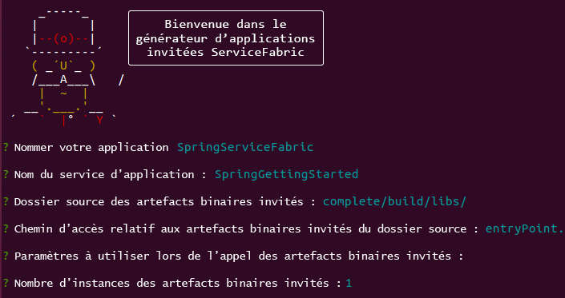
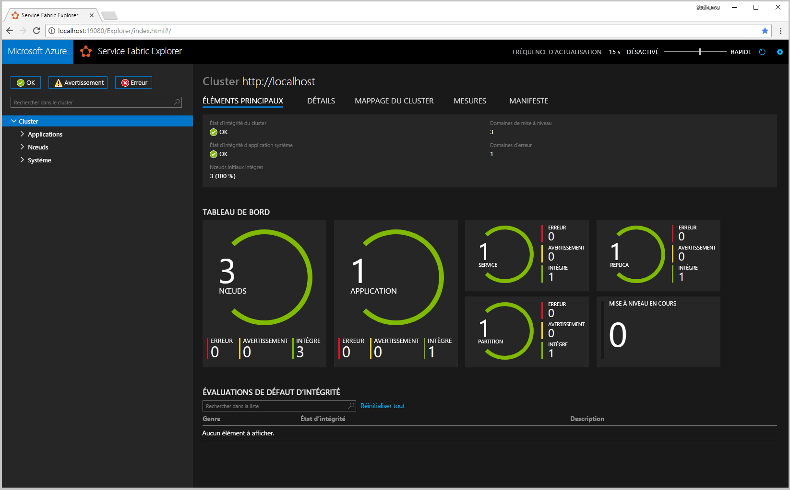
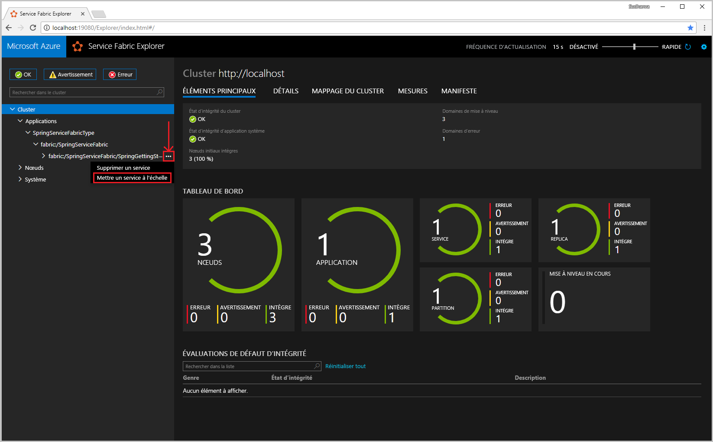
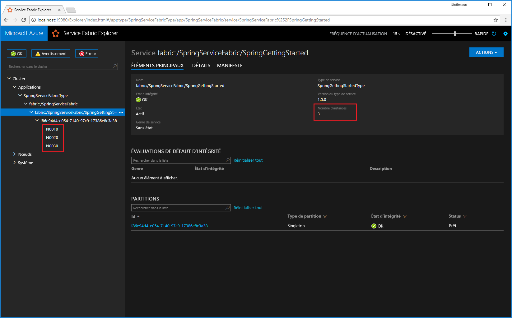
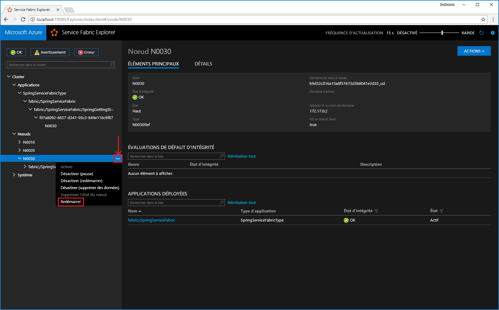
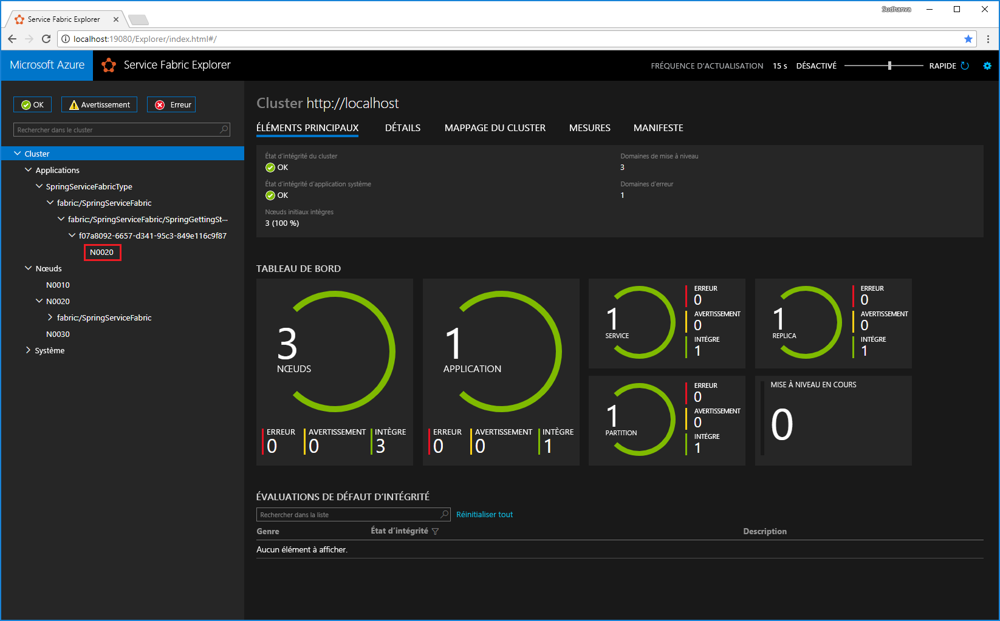

# <a name="quickstart-deploy-a-java-spring-boot-app-on-azure-service-fabric"></a>Démarrage rapide : Déployer une application Java Spring Boot sur Azure Service Fabric

Dans ce guide de démarrage rapide, vous déployez une application Java Spring Boot sur Azure Service Fabric à l’aide d’outils en ligne de commande familiers sur Linux ou MacOS. Azure Service Fabric est une plateforme de systèmes distribués pour le déploiement et la gestion de microservices et de conteneurs. 

## <a name="prerequisites"></a>Conditions préalables requises

#### <a name="linuxtablinux"></a>[Linux](#tab/linux)

- [Environnement Java](https://docs.microsoft.com/azure/service-fabric/service-fabric-get-started-linux#set-up-java-development) et [Yeoman](https://docs.microsoft.com/azure/service-fabric/service-fabric-get-started-linux#set-up-yeoman-generators-for-containers-and-guest-executables)
- [SDK Service Fabric et interface de ligne de commande (CLI) Service Fabric](https://docs.microsoft.com/azure/service-fabric/service-fabric-get-started-linux#installation-methods)
- [Git](https://git-scm.com/downloads)

#### <a name="macostabmacos"></a>[MacOS](#tab/macos)

- [Environnement Java et Yeoman](https://docs.microsoft.com/azure/service-fabric/service-fabric-get-started-mac#create-your-application-on-your-mac-by-using-yeoman)
- [SDK Service Fabric et interface de ligne de commande (CLI) Service Fabric](https://docs.microsoft.com/azure/service-fabric/service-fabric-cli#cli-mac)
- [Git](https://git-scm.com/downloads)

--- 

## <a name="download-the-sample"></a>Télécharger l’exemple

Dans une fenêtre de terminal, exécutez la commande suivante pour cloner l’exemple d’application [Getting Started](https://github.com/spring-guides/gs-spring-boot) de Spring Boot sur votre ordinateur local.

```bash
git clone https://github.com/spring-guides/gs-spring-boot.git
```

## <a name="build-the-spring-boot-application"></a>Générer l’application Spring Boot 
Dans le répertoire *gs-spring-boot/complete*, exécutez la commande ci-après pour générer l’application 

```bash
./gradlew build
``` 

## <a name="package-the-spring-boot-application"></a>Empaqueter l’application Spring Boot 
1. Dans le répertoire *gs-spring-boot* de votre clone, exécutez la commande `yo azuresfguest`. 

1. Entrez les informations suivantes à chaque invite.

    

1. Dans le dossier *SpringServiceFabric/SpringServiceFabric/SpringGettingStartedPkg/code*, créez un fichier appelé *entryPoint.sh*. Ajoutez le code suivant au fichier *entryPoint.sh*. 

    ```bash
    #!/bin/bash
    BASEDIR=$(dirname $0)
    cd $BASEDIR
    java -jar gs-spring-boot-0.1.0.jar
    ```

1. Ajoutez la ressource **Endpoints** dans le fichier *gs-spring-boot/SpringServiceFabric/SpringServiceFabric/SpringGettingStartedPkg/ServiceManifest.xml*.

    ```xml 
        <Resources>
          <Endpoints>
            <Endpoint Name="WebEndpoint" Protocol="http" Port="8080" />
          </Endpoints>
       </Resources>
    ```

    Le fichier *ServiceManifest.xml* ressemble désormais à ceci : 

    ```xml
    <?xml version="1.0" encoding="utf-8"?>
    <ServiceManifest Name="SpringGettingStartedPkg" Version="1.0.0"
                     xmlns="http://schemas.microsoft.com/2011/01/fabric" xmlns:xsd="https://www.w3.org/2001/XMLSchema" xmlns:xsi="https://www.w3.org/2001/XMLSchema-instance" >

       <ServiceTypes>
          <StatelessServiceType ServiceTypeName="SpringGettingStartedType" UseImplicitHost="true">
       </StatelessServiceType>
       </ServiceTypes>

       <CodePackage Name="code" Version="1.0.0">
          <EntryPoint>
             <ExeHost>
                <Program>entryPoint.sh</Program>
                <Arguments></Arguments>
                <WorkingFolder>CodePackage</WorkingFolder>
             </ExeHost>
          </EntryPoint>
       </CodePackage>
        <Resources>
          <Endpoints>
            <Endpoint Name="WebEndpoint" Protocol="http" Port="8080" />
          </Endpoints>
       </Resources>
     </ServiceManifest>
    ```

À ce stade, vous avez créé une application Service Fabric pour l’exemple Getting Started de Spring Boot que vous pouvez déployer sur Service Fabric.

## <a name="run-the-application-locally"></a>Exécuter l’application localement

1. Démarrez le cluster local sur des machines Ubuntu en exécutant la commande suivante :

    ```bash
    sudo /opt/microsoft/sdk/servicefabric/common/clustersetup/devclustersetup.sh
    ```

    Si vous utilisez un Mac, démarrez le cluster local à partir de l’image Docker (cette opération implique que vous ayez respecté les [prérequis](https://docs.microsoft.com/azure/service-fabric/service-fabric-get-started-mac#create-a-local-container-and-set-up-service-fabric) pour configurer votre cluster local pour Mac). 

    ```bash
    docker run --name sftestcluster -d -p 19080:19080 -p 19000:19000 -p 25100-25200:25100-25200 -p 8080:8080 mysfcluster
    ```

    Le démarrage du cluster local prend un certain temps. Pour vérifier que le cluster est entièrement opérationnel, accédez à Service Fabric Explorer à l’adresse `http://localhost:19080`. Les cinq nœuds sains indiquent que le cluster local est opérationnel. 
    
    

1. Ouvrez le dossier *gs-spring-boot/SpringServiceFabric*.
1. Exécutez la commande suivante pour vous connecter à votre cluster local.

    ```bash
    sfctl cluster select --endpoint http://localhost:19080
    ```
1. Exécutez le script *install.sh*.

    ```bash
    ./install.sh
    ```

1. Ouvrez votre navigateur web préféré, puis accédez à l’application à l’adresse `http://localhost:8080`.

    

Vous pouvez maintenant accéder à l’application Spring Boot qui a été déployée sur un cluster Service Fabric.

Pour plus d’informations, consultez l’exemple [Getting Started](https://spring.io/guides/gs/spring-boot/) de Spring Boot sur le site web Spring.

## <a name="scale-applications-and-services-in-a-cluster"></a>Mettre à l’échelle les applications et services dans un cluster

Les services peuvent facilement être mis à l’échelle dans un cluster pour prendre en compte une modification de la charge sur les services. Pour mettre à l’échelle un service, vous modifiez le nombre d’instances s’exécutant dans le cluster. Il existe différentes méthode pour mettre à l’échelle vos services. Par exemple, vous pouvez utiliser des scripts ou des commandes de l’interface CLI de Service Fabric (sfctl). Dans les étapes suivantes, utilisez Service Fabric Explorer.

Service Fabric Explorer s’exécute dans tous les clusters Service Fabric et est accessible à partir d’un navigateur, en accédant au port de gestion HTTP (19080) du cluster, par exemple, `http://localhost:19080`.

Pour mettre à l’échelle le service web frontal, procédez comme suit :

1. Ouvrez Service Fabric Explorer dans votre cluster. Par exemple, `http://localhost:19080`.
1. Sélectionnez les points de suspension ( **...** ) en regard du nœud **fabric:/SpringServiceFabric/SpringGettingStarted** dans l’arborescence, puis sélectionnez **Scale Service (Mettre le service à l’échelle)** .

    

    Vous pouvez maintenant choisir de mettre à l’échelle le nombre d’instances du service.

1. Définissez le nombre sur **3**, puis sélectionnez **Scale Service (Mettre le service à l’échelle)** .

    Une autre façon de mettre à l’échelle le service consiste à utiliser la ligne de commande.

    ```bash
    # Connect to your local cluster
    sfctl cluster select --endpoint https://<ConnectionIPOrURL>:19080 --pem <path_to_certificate> --no-verify

    # Run Bash command to scale instance count for your service
    sfctl service update --service-id 'SpringServiceFabric~SpringGettingStarted' --instance-count 3 --stateless 
    ``` 

1. Sélectionnez **fabric:/SpringServiceFabric/SpringGettingStarted** dans l’arborescence, puis développez le nœud de la partition (représenté par un GUID).

    

    Le service possède trois instances, et l’arborescence indique les nœuds sur lesquels elles s’exécutent.

Via cette tâche de gestion simple, vous avez doublé les ressources disponibles pour permettre au service frontal de traiter la charge utilisateur. Il est important de comprendre que vous n’avez pas besoin de plusieurs instances d’un service pour que celui-ci s’exécute de manière fiable. En cas de défaillance d’un service, Service Fabric veille à ce qu’une nouvelle instance du service s’exécute dans le cluster.

## <a name="fail-over-services-in-a-cluster"></a>Services de basculement dans un cluster

Pour illustrer le basculement du service, il est possible de simuler un redémarrage du nœud à l’aide de Service Fabric Explorer. Vérifiez qu’une seule instance de votre service est en cours d’exécution.

1. Ouvrez Service Fabric Explorer dans votre cluster. Par exemple, `http://localhost:19080`.
1. Cliquez sur les points de suspension ( **...** ) en regard du nœud qui exécute l’instance de votre service et redémarrez le nœud.

    
1. L’instance de votre service est alors déplacée dans un autre nœud, sans que votre application subisse d’interruption de service.

    

## <a name="next-steps"></a>Étapes suivantes

Dans ce démarrage rapide, vous avez appris comment :

* Déployer une application Spring Boot sur Service Fabric
* Déployer l’application dans le cluster local
* Mettre à l’échelle avec une montée en puissance parallèle sur plusieurs nœuds
* Effectuer le basculement de votre service sans aucun impact sur la disponibilité

Pour en savoir plus sur l’utilisation des applications Java dans Service Fabric, passez au tutoriel sur les applications Java.

> [!div class="nextstepaction"]
> [Didacticiel : créer et déployer une application avec un service frontal API Web Java et un service principal avec état](./service-fabric-tutorial-create-java-app.md)
