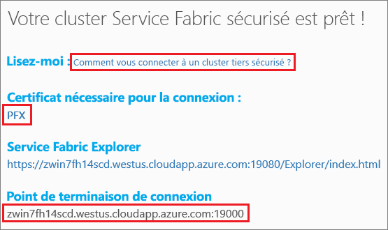
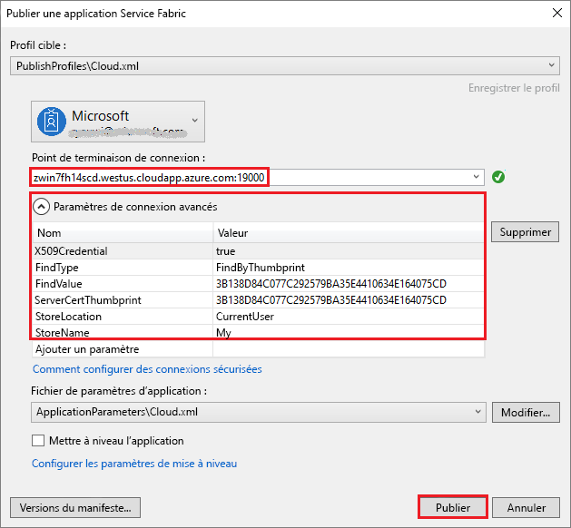

# <a name="tutorial-deploy-a-service-fabric-application-to-a-cluster-in-azure"></a>Tutoriel : Déployer une application Service Fabric sur un cluster dans Azure

Ce tutoriel est le deuxième d’une série. Il vous montre comment déployer une application Azure Service Fabric sur un nouveau cluster dans Azure.

Ce tutoriel vous montre comment effectuer les opérations suivantes :
> [!div class="checklist"]
> * Créer un cluster tiers.
> * Déplacer une application sur un cluster distant à l’aide de Visual Studio.

Dans cette série de didacticiels, nous allons aborder les points suivants :
> [!div class="checklist"]
> * [Créer une application .NET Service Fabric](service-fabric-tutorial-create-dotnet-app.md).
> * Déployer l’application sur un cluster distant.
> * [Ajouter un point de terminaison HTTPS à un service frontal ASP.NET Core](service-fabric-tutorial-dotnet-app-enable-https-endpoint.md).
> * [Configurer CI/CD à l’aide d’Azure Pipelines](service-fabric-tutorial-deploy-app-with-cicd-vsts.md).
> * [Configurer la surveillance et les diagnostics pour l’application](service-fabric-tutorial-monitoring-aspnet.md).

## <a name="prerequisites"></a>Prérequis

Avant de commencer ce tutoriel :

* Si vous n’avez pas d’abonnement Azure, créez un [compte gratuit](https://azure.microsoft.com/free/?WT.mc_id=A261C142F).
* [Installez Visual Studio 2017](https://www.visualstudio.com/) et les charges de travail **Développement Azure** et **Développement web et ASP.NET**.
* [Installez le Kit de développement logiciel (SDK) Service Fabric](service-fabric-get-started.md).

## <a name="download-the-voting-sample-application"></a>Télécharger l’exemple d’application de vote

Si vous n’avez pas créé l’exemple d’application de vote lors de la [première partie de cette série de didacticiels](service-fabric-tutorial-create-dotnet-app.md), vous pouvez le télécharger. Dans une fenêtre de commande, exécutez le code suivant pour cloner le référentiel de l’exemple d’application sur votre ordinateur local.

```git
git clone https://github.com/Azure-Samples/service-fabric-dotnet-quickstart 
```

## <a name="publish-to-a-service-fabric-cluster"></a>Publier sur un cluster Service Fabric

À présent que l’application est prête, vous pouvez la déployer sur un cluster directement à partir de Visual Studio. Un [cluster Service Fabric](https://docs.microsoft.com/en-gb/azure/service-fabric/service-fabric-deploy-anywhere) est un groupe de machines virtuelles ou physiques connectées au réseau, sur lequel vos microservices sont déployés et gérés.

Pour ce didacticiel, vous avez deux options pour le déploiement de l’application de vote vers un cluster Service Fabric à l’aide de Visual Studio :

* Publiez sur un cluster d’essai (partie). 
* Publier sur un cluster existant dans votre abonnement. Vous pouvez créer des clusters Service Fabric via le [portail Azure](https://portal.azure.com), à l’aide des scripts [PowerShell](./scripts/service-fabric-powershell-create-secure-cluster-cert.md) ou [Azure CLI](./scripts/cli-create-cluster.md), ou à partir d’un [modèle Azure Resource Manager](service-fabric-tutorial-create-vnet-and-windows-cluster.md).

> [!NOTE]
> De nombreux services utilisent le proxy inverse pour communiquer entre eux. Le proxy inverse est activé par défaut pour les clusters créés depuis Visual Studio et les clusters tiers. Si vous utilisez un cluster existant, vous devez [activer le proxy inverse dans le cluster](service-fabric-reverseproxy-setup.md).


### <a name="find-the-voting-web-service-endpoint-for-your-azure-subscription"></a>Rechercher le point de terminaison de service web de vote pour votre abonnement Azure

Pour publier l’application de vote sur votre propre abonnement Azure, recherchez le point de terminaison du service web frontal. Si vous utilisez un cluster tiers, connectez-vous au port 8080 à l’aide de l’exemple de vote ouvert automatiquement. Vous n’avez pas besoin de le configurer dans l’équilibreur de charge du cluster tiers.

Le service web frontal est à l’écoute sur un port spécifique. Lorsque l’application est déployée sur un cluster dans Azure, le cluster et l’application s’exécutent derrière un équilibreur de charge Azure. Le port de l’application doit être ouvert à l’aide d’une règle dans l’équilibreur de charge Azure pour le cluster. Le port ouvert envoie le trafic entrant au service web. Le port se trouve dans le fichier **VotingWeb/PackageRoot/ServiceManifest.xml** de l’élément **point de terminaison**. Par exemple, le port 8080.

```xml
<Endpoint Protocol="http" Name="ServiceEndpoint" Type="Input" Port="8080" />
```

Pour votre abonnement Azure, ouvrez ce port à l’aide d’une règle d’équilibrage de charge dans Azure par le biais d’un [script PowerShell](./scripts/service-fabric-powershell-open-port-in-load-balancer.md) ou via l’équilibreur de charge pour ce cluster dans le [portail Azure](https://portal.azure.com).

### <a name="join-a-party-cluster"></a>Rejoindre un cluster tiers

> [!NOTE]
>  Pour publier l’application sur votre propre cluster dans un abonnement Azure, passez à la section [Publier l’application à l’aide de Visual Studio](#publish-the-application-by-using-visual-studio). 

Les clusters tiers sont des clusters Service Fabric gratuits, limités dans le temps et hébergés sur Azure. En outre, ils sont exécutés par l’équipe Service Fabric. Tout le monde peut déployer des applications et en savoir plus sur la plateforme. Le cluster utilise un seul certificat auto-signé pour la sécurité de nœud à nœud et de client à nœud.

Connectez-vous et [rejoignez un cluster Windows](http://aka.ms/tryservicefabric). Pour télécharger le certificat PFX sur votre ordinateur, sélectionnez le lien **PFX**. Sélectionnez le lien **Comment se connecter à un cluster tiers sécurisé ?**, puis copiez le mot de passe du certificat. Le certificat, le mot de passe du certificat et la valeur **Point de terminaison de connexion** sont utilisés dans les étapes suivantes.



> [!Note]
> Le nombre de clusters tiers disponibles par heure est limité. Si vous obtenez une erreur lorsque vous tentez de vous connecter à un cluster tiers, patientez et réessayez. Vous pouvez également suivre les étapes du didacticiel [Déployer une application .NET](https://docs.microsoft.com/azure/service-fabric/service-fabric-tutorial-deploy-app-to-party-cluster#deploy-the-sample-application) pour créer un cluster Service Fabric dans votre abonnement Azure et déployer l’application sur celui-ci. Si vous n’avez pas d’abonnement Azure, vous pouvez créer un [compte gratuit](https://azure.microsoft.com/free/?WT.mc_id=A261C142F).
>

Sur votre ordinateur Windows, installez le certificat PFX dans le magasin de certificats **CurrentUser\My**.

```powershell
PS C:\mycertificates> Import-PfxCertificate -FilePath .\party-cluster-873689604-client-cert.pfx -CertStoreLocation Cert:\CurrentUser\My -Password (ConvertTo-SecureString 873689604 -AsPlainText -Force)


   PSParentPath: Microsoft.PowerShell.Security\Certificate::CurrentUser\My

Thumbprint                                Subject
----------                                -------
3B138D84C077C292579BA35E4410634E164075CD  CN=zwin7fh14scd.westus.cloudapp.azure.com
```

N’oubliez pas l’empreinte numérique pour l’étape suivante.

> [!Note]
> Par défaut, le service frontend web est configuré pour écouter le trafic entrant sur le port 8080. Le port 8080 est ouvert dans le cluster tiers. Si vous devez changer le port de l’application, remplacez-le par l’un des ports ouverts dans le cluster tiers.
>

### <a name="publish-the-application-by-using-visual-studio"></a>Publier l’application à l’aide de Visual Studio

À présent que l’application est prête, vous pouvez la déployer sur un cluster directement à partir de Visual Studio.

1. Dans l’Explorateur de solutions, cliquez avec le bouton droit sur **Voting**. Choisissez **Publier**. La boîte de dialogue **Publier** s’affiche.

2. Copiez le **Point de terminaison de connexion** depuis la page du cluster tiers ou de votre abonnement Azure dans le champ **Point de terminaison de connexion**. Par exemple `zwin7fh14scd.westus.cloudapp.azure.com:19000`. Sélectionnez **Paramètres de connexion avancés**.  Veillez à ce que les valeurs **FindValue** et **ServerCertThumbprint** correspondent à l’empreinte numérique du certificat installé lors d’une étape précédente pour un cluster tiers ou du certificat correspondant à votre abonnement Azure.

    

    Chaque application du cluster doit avoir un nom unique. Les clusters tiers constituent un environnement public partagé, un conflit avec une application existante peut donc se présenter. S’il existe un conflit de noms, renommez le projet Visual Studio et redéployez-le.

3. Sélectionnez **Publier**.

4. Pour accéder à votre application de vote dans le cluster, ouvrez un navigateur et entrez l’adresse du cluster suivie de **:8080**. Vous pouvez également entrer un autre port, si configuré. Par exemple `http://zwin7fh14scd.westus.cloudapp.azure.com:8080`. Vous voyez l’application en cours d’exécution dans le cluster dans Azure. Dans la page web de vote, essayez d’ajouter ou de supprimer des options de vote et de voter pour une ou plusieurs de ces options.

    


## <a name="next-steps"></a>Étapes suivantes

Passez au tutoriel suivant :
> [!div class="nextstepaction"]
> [Activer HTTPS](service-fabric-tutorial-dotnet-app-enable-https-endpoint.md)
