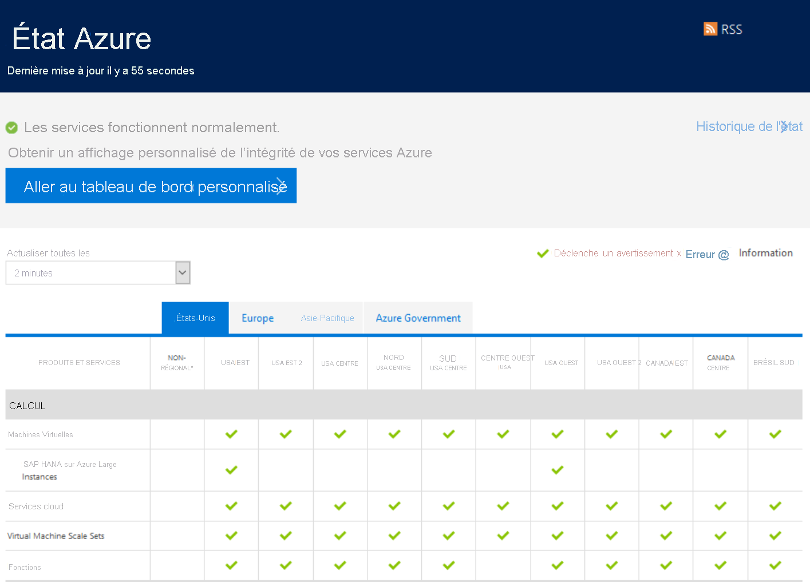
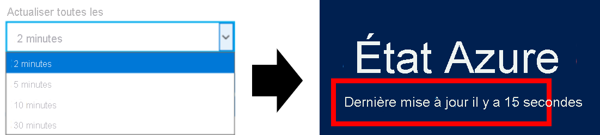

# Vue d’ensemble de l’état Azure

L'[état Azure](https://status.azure.com/status/) vous présente une vue globale de l'intégrité des régions et des services Azure. Avec l’état Azure, vous pouvez obtenir des informations sur la disponibilité du service. L'état Azure est accessible à tous et il est possible de consulter l'ensemble des services qui rendent compte de leur état d'intégrité ainsi que des incidents à fort impact. Toutefois, si vous êtes un utilisateur actif d'Azure, nous vous encourageons vivement à utiliser l'expérience personnalisée d'[Azure Service Health](https://aka.ms/azureservicehealth). Azure Service Health présente toutes les pannes, toutes les activités de maintenance planifiées à venir et tous les avertissements de service.

## Mises à jour de l’état Azure

La page de l’état Azure est mise à jour en temps réel dès que l’intégrité des services Azure change. Si vous laissez la page de l’état Azure ouverte, vous pouvez contrôler la fréquence d’actualisation de l’affichage des nouvelles données. En haut, vous pouvez voir quand la page a été mise à jour pour la dernière fois.

## Historique de l’état Azure

La page de l’état Azure affiche toujours les dernières informations sur l’intégrité, mais vous pouvez afficher des événements plus anciens à l’aide de la [page de l’historique de l’état Azure](https://status.azure.com/status/history/).

Cette page vous permet d’afficher des événements jusqu’à 90 jours dans le passé, notamment une cause racine préliminaire, l’atténuation et les étapes suivantes pour Azure.

## Flux RSS

L’état Azure fournit également [un flux RSS](https://status.azure.com/status/feed/) des modifications de l’intégrité des services Azure auquel vous pouvez vous abonner.

## Étapes suivantes

* Découvrez comment obtenir une vue plus personnalisée de l’intégrité Azure avec [Service Health](./service-health-overview.md).
* Découvrez comment obtenir une vue plus granulaire de l’intégrité de vos ressources Azure spécifiques avec [Resource Health](./resource-health-overview.md).
