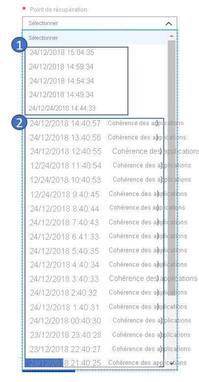

# Questions courantes : Récupération d'urgence d'Azure vers Azure

Cet article répond aux questions courantes sur la récupération d’urgence de machine virtuelle Azure dans une autre région Azure avec [Azure Site Recovery](site-recovery-overview.md).

## Général

### Comment les tarifs Azure Site Recovery sont-ils fixés ?

Pour plus d’informations, voir [Tarification d’Azure Site Recovery pour les machines virtuelles](https://azure.microsoft.com/blog/know-exactly-how-much-it-will-cost-for-enabling-dr-to-your-azure-vm/).

### Fonctionnement du niveau Gratuit d'Azure Site Recovery

Chaque instance protégée avec Azure Site Recovery est gratuite pendant les 31 premiers jours de protection. À l’issue de cette période, la protection de chaque instance est facturée aux taux de [Tarification d’Azure Site Recovery pour les machines virtuelles](https://azure.microsoft.com/blog/know-exactly-how-much-it-will-cost-for-enabling-dr-to-your-azure-vm/).

### Pendant les 31 premiers jours, d'autres frais Azure sont-ils facturés ?

Oui. Oui, bien qu’Azure Site Recovery soit gratuit pendant les 31 premiers jours d’une instance protégée, des frais peuvent s’appliquer pour Stockage Azure, les transactions de stockage et les transferts de données. Des frais de calcul Azure peuvent également être facturés pour une machine virtuelle récupérée. Pour obtenir des informations complètes sur la tarification, voir [Tarification d’Azure Site Recovery](https://azure.microsoft.com/pricing/details/site-recovery).

### Quelles sont les meilleures pratiques pour la récupération d’urgence de machines virtuelles Azure ?

1. [Comprendre l’architecture Azure vers Azure](azure-to-azure-architecture.md)
1. [Examiner les configurations prises en charge et non prises en charge](azure-to-azure-support-matrix.md)
1. [Configurer la récupération d’urgence pour les machines virtuelles Azure](azure-to-azure-how-to-enable-replication.md)
1. [Exécuter un test de basculement](azure-to-azure-tutorial-dr-drill.md)
1. [Effectuer une restauration automatique et un basculement vers la région primaire](azure-to-azure-tutorial-failover-failback.md)

### Comment la capacité est-elle garantie dans la région cible ?

L’équipe Site Recovery et l’équipe de gestion de la capacité Azure planifient une capacité d’infrastructure suffisante. Lorsque vous démarrez un basculement, les équipes vous aident également à vous assurer que les instances de machine virtuelle protégées par Site Recovery se déploient dans la région cible.

## Réplication

### Puis-je répliquer des machines virtuelles activées via le chiffrement de disque Azure ?

Oui. Site Recovery prend en charge la récupération d’urgence des machines virtuelles pour lesquelles le chiffrement Azure Disk Encryption est activé. Lorsque vous activez la réplication, Azure copie l’ensemble des clés de chiffrement de disque et des secrets requis de la région source vers la région cible dans le contexte utilisateur. Si vous ne disposez pas des autorisations appropriées, votre administrateur de la sécurité peut utiliser un script pour copier les clés et les secrets.

- Site Recovery prend en charge Azure Disk Encryption pour les machines virtuelles Azure exécutant Windows.
- Site Recovery prend en charge Azure Disk Encryption version 0.1 dont le schéma requiert Azure Active Directory (Azure AD). Site Recovery prend également en charge la version 1.1 qui ne requiert pas Azure AD. [Apprenez-en davantage sur les schémas d’extension pour Azure Disk Encryption](../virtual-machines/extensions/azure-disk-enc-windows.md#extension-schema).
  - Pour Azure Disk Encryption version 1.1, vous devez utiliser les machines virtuelles Windows avec des disques managés.
  - [En savoir plus](azure-to-azure-how-to-enable-replication-ade-vms.md) sur l’activation de la réplication pour les machines virtuelles chiffrées.

### Puis-je répliquer des machines virtuelles vers un autre abonnement ?

Oui, vous pouvez répliquer des machines virtuelles Azure vers un autre abonnement du même locataire Azure AD.

Configurez la récupération d’urgence [entre abonnements](https://azure.microsoft.com/blog/cross-subscription-dr) en sélectionnant un autre abonnement au moment de la réplication.

### Puis-je répliquer des machines virtuelles Azure épinglées à une zone vers une autre région ?

Oui, vous pouvez [répliquer des machines virtuelles épinglées à une zone](https://azure.microsoft.com/blog/disaster-recovery-of-zone-pinned-azure-virtual-machines-to-another-region) vers une autre région.

### Puis-je exclure des disques ?

Oui, vous pouvez exclure des disques au moment de la protection à l’aide de PowerShell. Pour plus d’informations, voir [comment exclure des disques de la réplication](azure-to-azure-exclude-disks.md).

### Puis-je ajouter de nouveaux disques à des machines virtuelles répliquées et activer la réplication pour ces disques ?

Oui, l’ajout de nouveaux disques à des machines virtuelles répliquées et l’activation de la réplication pour ceux-ci sont pris en charge pour les machines virtuelles Azure dotées de disques managés. Lorsque vous ajoutez un nouveau disque à une machine virtuelle Azure activée pour la réplication, l’intégrité de la réplication de la machine virtuelle affiche un avertissement. Cet avertissement indique qu’un ou plusieurs disques sur la machine virtuelle sont disponibles pour la protection. Vous pouvez activer la réplication pour les disques ajoutés.

- Si vous activez la protection pour les disques ajoutés, l’avertissement disparaît après la réplication initiale.
- Si vous n’activez pas la réplication pour le disque, vous pouvez ignorer l’avertissement.
- Si vous basculez une machine virtuelle dotée d’un disque ajouté pour laquelle la réplication est activée, il y a des points de réplication. Les points de réplication affichent les disques qui sont disponibles pour la récupération.

Supposons, imaginons qu’une machine virtuelle dispose d’un seul disque et que vous en ajoutez un nouveau. Il peut y avoir un point de réplication créé avant l’ajout du disque. Ce point de réplication indique qu’il se compose de « 1 sur 2 disques ».

Site Recovery ne prend pas en charge le « retrait à chaud » d’un disque d’une machine virtuelle répliquée. Si vous retirez un disque d’une machine virtuelle, vous devez désactiver puis réactiver la réplication pour la machine virtuelle.

### À quelle fréquence puis-je répliquer vers Azure ?

La réplication de machines virtuelles Azure vers une autre région Azure est continue. Pour plus d’informations, consultez [Architecture de réplication Azure vers Azure](https://docs.microsoft.com/azure/site-recovery/azure-to-azure-architecture#replication-process).

### Puis-je répliquer des machines virtuelles au sein d’une même région ? J’ai besoin de cette fonctionnalité pour migrer des machines virtuelles.

Vous ne pouvez pas utiliser une solution de récupération d’urgence d’Azure vers Azure pour répliquer des machines virtuelles au sein d’une même région.

### Puis-je répliquer des instances de machine virtuelle vers n’importe quelle Azure ?

Site Recovery vous permet de répliquer et récupérer des machines virtuelles entre deux régions quelconques au sein du même cluster géographique. Les clusters géographiques sont définis en gardant à l’esprit la souveraineté et la latence des données. Pour plus d’informations, consultez le [tableau de prise en charge régionale](https://docs.microsoft.com/azure/site-recovery/azure-to-azure-support-matrix#region-support) de Site Recovery.

### Site Recovery nécessite-t-il une connexion Internet ?

Non. Site Recovery ne nécessite pas de connexion Internet. En revanche, il requiert un accès aux URL et aux plages d’adresses IP Site Recovery, comme indiqué dans [Informations sur les réseaux dans la récupération d’urgence de machines virtuelles Azure](https://docs.microsoft.com/azure/site-recovery/azure-to-azure-about-networking#outbound-connectivity-for-urls).

### Puis-je répliquer une application disposant d’un groupe de ressources distinct pour des niveaux distincts ?

Oui, vous pouvez répliquer l’application et conserver la configuration de récupération d’urgence dans un groupe de ressources distinct.

Par exemple, si votre application conserve l’application, la base de données et le web de chaque niveau dans un groupe de ressources distinct, vous devez sélectionner l’[Assistant Réplication](https://docs.microsoft.com/azure/site-recovery/azure-to-azure-how-to-enable-replication#enable-replication) à trois reprises pour protéger tous les niveaux. Site Recovery réplique ces trois niveaux dans trois groupes de ressources différents.

## Stratégie de réplication

### Qu’est-ce qu’une stratégie de réplication ?

Une stratégie de réplication définit les paramètres de l’historique de rétention des points de récupération. La stratégie définit également la fréquence des captures instantanées de cohérence des applications. Par défaut, Azure Site Recovery crée une nouvelle stratégie de réplication avec les paramètres par défaut suivants :

- 24 heures pour l’historique de rétention des points de récupération.
- 60 minutes pour la fréquence des captures instantanées cohérentes au niveau application.

[Apprenez-en davantage sur les paramètres de réplication](https://docs.microsoft.com/azure/site-recovery/azure-to-azure-tutorial-enable-replication#configure-replication-settings).

### Qu’est-ce qu’un point de récupération cohérent en cas d’incident ?

Un point de récupération de cohérence en cas d’incident contient les données sur disque comme si vous aviez débranché le cordon d’alimentation du serveur lors de la capture instantanée. Le point de récupération de cohérence en cas d’incident n’inclut rien de ce qui était en mémoire lors de la capture instantanée.

Aujourd’hui, la plupart des applications peuvent récupérer correctement à partir de captures instantanées cohérentes en cas d’incident. Un point de récupération cohérent en cas d’incident ne suffit généralement pas pour des systèmes d’exploitation de base de données et des applications telles que des serveurs de fichiers, des serveurs DHCP et des serveurs d’impression.

### Quelle est la fréquence de génération de points de récupération cohérents en cas d’incident ?

Site Recovery crée un point de récupération cohérent en cas d’incident toutes les 5 minutes.

### Qu’est-ce qu’un point de récupération cohérent au niveau application ?

Les points de récupération cohérents au niveau application sont créés à partir de captures instantanées cohérentes au niveau application. Des points de récupération de cohérence des applications capturent les mêmes données que des captures instantanées de cohérence en cas d’incident, ainsi que de toutes les données en mémoire et toutes les transactions en cours.

En raison de leur contenu supplémentaire, les captures instantanées de cohérence des applications sont davantage sollicitées et prennent le plus de temps. Les points de récupération cohérent au niveau application sont recommandés pour des systèmes d’exploitation de base de données et des applications telles que SQL Server.

### Quel est l’impact des points de récupération cohérents au niveau de l'application sur les performances de cette dernière ?

Les points de récupération de cohérence des applications capturent toutes les données en mémoire et en cours. Étant donné que les points de récupération capturent ces données, ils nécessitent une infrastructure telle que VSS sur Windows pour suspendre l’application. Si le processus de capture est fréquent, cela peut affecter les performances lorsque la charge de travail est déjà occupée. Nous déconseillons d’utiliser une fréquence faible pour les points de récupération de cohérence des applications en lien avec des charges de travail autres que de bases de données. Même pour une charge de travail de base de données, une heure suffit.

### Quelle est la fréquence minimale de génération de points de récupération cohérents en cas d’incident sur les applications ?

Site Recovery peut créer un point de récupération de cohérence des applications généré à une fréquence minimale d’une heure.

### Comment les points de récupération sont-ils générés et enregistrés ?

Pour comprendre comment Site Recovery génère les points de récupération, voyons un exemple de stratégie de réplication. Cette stratégie de réplication utilise un point de récupération avec une fenêtre de rétention de 24 heures et une capture instantanée de cohérence des applications à la fréquence d’une heure.

Site Recovery crée un point de récupération cohérent en cas d’incident toutes les 5 minutes. Vous ne pouvez pas modifier cette fréquence. Pour la dernière heure, vous pouvez choisir parmi 12 points de cohérence en cas d’incident et 1 point de cohérence des applications. Au fil du temps, au-delà de la dernière heure, Site Recovery élague les points de récupération pour n’en enregistrer qu’un seul par heure.

La capture d’écran suivante illustre cet exemple. Dans la capture d’écran :

- Au cours de la dernière heure, la fréquence des points de récupération est de 5 minutes.
- Au-delà de la dernière heure, Site Recovery ne conserve qu’un seul point de récupération.

   

### Jusqu’à quand peut remonter la récupération ?

Le point de récupération le plus ancien que vous pouvez utiliser remonte à 72 heures.

### J’ai une stratégie de réplication de 24 heures. Que se passe-t-il si un problème empêche Site Recovery de générer des points de récupération pendant plus de 24 heures ? Mes points de récupération antérieurs sont-ils perdus ?

Non, Site Recovery conserve tous vos points de récupération antérieurs. En fonction de la fenêtre de rétention des points de récupération, Site Recovery ne remplace le point le plus ancien que s’il génère de nouveaux points. En raison de ce problème, Site Recovery ne peut pas générer de nouveaux points de récupération. Tant qu’il n’y a pas de nouveaux points de récupération, tous les anciens points subsistent une fois la fenêtre de rétention atteinte.

### Une fois la réplication activée sur une machine virtuelle, comment modifier la stratégie de réplication ?

Accédez à **Coffre Site Recovery** > **Infrastructure Site Recovery** > **Stratégies de réplication**. Sélectionnez la stratégie à modifier, modifiez-la, puis enregistrez les modifications. Toute modification s’applique également à toutes les réplications existantes.

### Tous les points de récupération sont-ils une copie complète ou différentielle de la machine virtuelle ?

Le premier point de récupération qui est généré possède la copie complète. Les points de récupération successifs ont des modifications d’ordre différentiel.

### L’accroissement de la période de rétention des points de récupération augmente-t-elle le coût de stockage ?

Si vous allongez la période de rétention de 24 à 72 heures, Site Recovery enregistre les points de récupération pendant 48 heures supplémentaires. Cette durée supplémentaire occasionne des frais de stockage. Par exemple, un point de récupération unique peut avoir des modifications différentielles de 10 Go avec un coût par Go de 0,16 USD par mois. Les frais supplémentaires sont alors de 1,60 × 48 USD par mois.

## Cohérence multimachine virtuelle

### Définition de la cohérence multimachine virtuelle

La cohérence multimachine virtuelle veille à ce que le point de récupération soit cohérent entre toutes les machines virtuelles répliquées.

Site Recovery fournit une option de **cohérence multimachine virtuelle** qui crée un groupe de réplication de toutes les machines.

Lorsque vous basculez les machines virtuelles, celles-ci disposent de points de récupération de cohérence en cas d’incident et de cohérence des applications.

Pour savoir comment [activer la cohérence multimachine virtuelle](https://docs.microsoft.com/azure/site-recovery/azure-to-azure-tutorial-enable-replication#enable-replication-for-a-vm), voir le tutoriel.

### Puis-je basculer une seule machine virtuelle à l’intérieur d’un groupe de réplication avec cohérence multimachine virtuelle ?

En sélectionnant l’option **Cohérence multimachine virtuelle**, vous indiquez que l’application a une dépendance sur toutes les machines virtuelles au sein d’un groupe. Le basculement d’une machine virtuelle unique n’est pas autorisé.

### Combien de machines virtuelles puis-je répliquer dans un groupe de réplication avec cohérence multimachine virtuelle ?

Vous pouvez répliquer 16 machines virtuelles ensemble dans un groupe de réplication.

### Quand dois-je activer la cohérence multimachine virtuelle ?

La cohérence multimachine virtuelle étant une fonction faisant un usage intensif du processeur, son activation peut affecter les performances de la charge de travail. Ne l’utilisez que si les machines exécutent la même charge de travail et si vous avez besoin de cohérence entre plusieurs machines virtuelles. Par exemple, si vous avez deux instances SQL Server et deux serveurs web dans une application, vous n’avez besoin de cohérence multimachine virtuelle que pour les instances SQL Server.

### Pouvez-vous ajouter une machine virtuelle en cours de réplication à un groupe de réplication ?
Vous pouvez ajouter une machine virtuelle à un nouveau groupe de réplication tout en activant la réplication. Vous pouvez également ajouter une machine virtuelle à un groupe de réplication existant tout en activant la réplication. Toutefois, vous ne pouvez pas ajouter une machine virtuelle en cours de réplication à un nouveau groupe de réplication ou à un groupe de réplication existant.
 
## Basculement

### Comment est assurée la capacité dans la région cible pour les machines virtuelles Azure ?

L’équipe Site Recovery et l’équipe de gestion de la capacité Azure planifient une capacité d’infrastructure suffisante. Lorsque vous démarrez un basculement, les équipes vous aident également à vous assurer que les instances de machine virtuelle protégées par Site Recovery se déploient dans la région cible.

### Le basculement est-il automatique ?

Le basculement n’est pas automatique. Vous pouvez lancer des basculements d’un simple clic dans le portail ou en utilisant [PowerShell](azure-to-azure-powershell.md).

### Puis-je conserver une adresse IP publique après un basculement ?

Vous pouvez conserver l’adresse IP publique de l’application de production après un basculement.

Lorsque vous impliquez une charge de travail dans le processus de basculement, vous devez attribuer une ressource IP publique Azure à la charge de travail. La ressource IP publique Azure doit être disponible dans la région cible. Vous pouvez attribuer la ressource IP publique Azure manuellement, ou vous automatiser cette opération avec un plan de récupération. Découvrez comment [configurer des adresses IP publiques après un basculement](concepts-public-ip-address-with-site-recovery.md#public-ip-address-assignment-using-recovery-plan).

### Puis-je conserver une adresse IP privée pendant un basculement ?

Oui, vous pouvez conserver l’adresse IP privée. Par défaut, quand vous activez la reprise d’activité pour les machines virtuelles Azure, Site Recovery crée des ressources cibles en fonction des paramètres de ressources sources. Pour des machines virtuelles Azure configurées avec des adresses IP statiques, Site Recovery tente d’approvisionner la même adresse IP pour la machine virtuelle cible si elle n’est pas utilisée.
Apprenez-en davantage sur la [conservation des adresses IP pendant un basculement](site-recovery-retain-ip-azure-vm-failover.md).

### Après un basculement, pourquoi le serveur reçoit-il une nouvelle adresse IP ?

Site Recovery tente de fournir l’adresse IP au moment du basculement. Si une autre machine virtuelle prend cette adresse, Site Recovery définit l’adresse IP suivante disponible comme cible.

Apprenez-en davantage sur la [configuration du mappage réseau et de l’adressage IP pour les réseaux virtuels](azure-to-azure-network-mapping.md#set-up-ip-addressing-for-target-vms).

### Que sont les points de récupération **Dernier (objectif de point de récupération le plus faible)**  ?

L’option **Dernier (objectif de point de récupération le plus faible)** commence par traiter toutes les données envoyées au service Site Recovery. Une fois que le service a traité les données, il crée un point de récupération pour chaque machine virtuelle avant de basculer vers celle-ci. Cette option fournit l’objectif de point de récupération (RPO) le plus bas. La machine virtuelle créée après le basculement comprend toutes les données répliquées sur le service Site Recovery depuis le déclenchement du basculement.

### L’option **Dernier (objectif de point de récupération le plus faible)** a-t-elle un impact sur l’objectif de délai de récupération (RTO) de basculement ?

Oui. Site Recovery traitant toutes les données en attente avant le basculement, cette option a un objectif de délai de récupération supérieur à celui d’autres options.

### Que signifie l’option **Dernier point traité** dans les points de récupération ?

L’option **Dernier point traité** bascule toutes les machines virtuelles du plan vers le dernier point de récupération que Site Recovery a traité. Pour voir le dernier point de récupération d’une machine virtuelle spécifique, cochez **Derniers points de récupération** dans les paramètres de la machine virtuelle. Cette option fournit un objectif de délai de récupération faible, car aucun temps n’est consacré à traiter les données non traitées.

### Que se passe-t-il si ma région primaire subit une panne inattendue ?

Vous pouvez déclencher un basculement après la panne. Site Recovery n’a pas besoin de connexion à partir de la région primaire pour opérer le basculement.

### Quel est l’objectif de délai de récupération d’un basculement de machine virtuelle ?

Site Recovery à un [objectif de délai de récupération de 2 heures en vertu du contrat de niveau de service](https://azure.microsoft.com/support/legal/sla/site-recovery/v1_2/). Toutefois, le plus souvent, Site Recovery opère le basculement des machines virtuelles en quelques minutes. Vous pouvez calculer l’objectif de délai de récupération en accédant aux travaux de basculement qui indiquent le temps qu’a pris la récupération de la machine virtuelle. Pour l’objectif de délai de récupération du plan de récupération, voir la section suivante.

## Plans de récupération

### Qu’est-ce qu’un plan de récupération ?

Les plans de récupération dans Site Recovery orchestrent la récupération par basculement des machines virtuelles. Ils aident également à rendre la récupération toujours précise, répétable et automatisée. Un plan de récupération répond aux besoins suivants :

- Définition d’un groupe de machines virtuelles qui basculent ensemble
- Définition des dépendances entre les machines virtuelles afin que l’application opère avec précision
- Automatisation de la récupération en même temps qu’actions manuelles personnalisées afin que des tâches autres que le basculement des machines virtuelles puissent également être accomplies.

Apprenez-en davantage sur la [création d’un plan de récupération](site-recovery-create-recovery-plans.md).

### Comment le séquencement est-il effectué dans un plan de récupération ?

Dans un plan de récupération, vous pouvez créer plusieurs groupes pour effectuer le séquencement. Le basculement intervient groupe après groupe. Les machines virtuelles d’un même groupe basculent ensemble, suivies de celles d’un autre groupe. Pour savoir comment modéliser une application à l’aide d’un plan de récupération, consultez [À propos des plans de récupération](recovery-plan-overview.md#model-apps).

### Comment trouver l’objectif de délai de récupération d’un plan de récupération ?

Pour vérifier l’objectif de délai de récupération d’un plan de récupération, testez le basculement du plan de récupération, puis accédez aux **travaux Site Recovery**.
Dans l’exemple suivant, voir le travail **SAPTestRecoveryPlan**. Le travail a pris 8 minutes et 59 secondes pour basculer toutes les machines virtuelles et effectuer les actions spécifiées.

### Puis-je ajouter des runbooks Automation au plan de récupération ?

Oui, vous pouvez intégrer des runbooks Azure Automation dans votre plan de récupération. Apprenez-en davantage sur l’[ajout de runbooks Azure Automation](site-recovery-runbook-automation.md).

## Reprotection et restauration automatique

### J’ai basculé de la région primaire vers une région de récupération d’urgence. Les machines virtuelles d’une région de récupération d’urgence sont-elles protégées automatiquement ?

Non. Non, lorsque vous [basculez](https://docs.microsoft.com/azure/site-recovery/azure-to-azure-tutorial-failover-failback) des machines virtuelles Azure d’une région vers une autre, les machines virtuelles démarrent dans la région de reprise d’activité après sinistre en état non protégé. Pour restaurer automatiquement les machines virtuelles vers la région primaire, vous devez [reprotéger](https://docs.microsoft.com/azure/site-recovery/azure-to-azure-how-to-reprotect) les machines virtuelles dans la région secondaire.

### Au moment de la reprotection, Site Recovery réplique-t-il la totalité des données de la région secondaire vers la région primaire ?

Cela dépend de la situation. Si la machine virtuelle de la région source existe, seules les différences entre le disque source et le disque cible sont synchronisées. Site Recovery calcule les différentiels en comparant les disques, puis transfère les données. Ce processus prend généralement plusieurs heures. Pour plus d’informations sur ce qui se passe lors de la reprotection, voir [Reprotection d’instances de machine virtuelle Azure basculées vers la région primaire](https://docs.microsoft.com/azure/site-recovery/azure-to-azure-how-to-reprotect#what-happens-during-reprotection).

### Combien de temps prend la restauration automatique ?

Une fois la reprotection effectuée, la restauration automatique prend à peu près le même temps que le basculement de la région primaire vers une région secondaire.

## Capacité

### Comment est assurée la capacité dans la région cible pour les machines virtuelles Azure ?

L’équipe Site Recovery et l’équipe de gestion de la capacité Azure planifient une capacité d’infrastructure suffisante. Lorsque vous démarrez un basculement, les équipes vous aident également à vous assurer que les instances de machine virtuelle protégées par Site Recovery se déploient dans la région cible.

### Site Recovery fonctionne-t-il avec les instances réservées ?

Oui, vous pouvez acheter des [instances réservées de machine virtuelle](https://azure.microsoft.com/pricing/reserved-vm-instances/) dans la région de récupération d’urgence, que les opérations de basculement du service Site Recovery utiliseront. Aucune configuration supplémentaire n’est nécessaire.

## Sécurité

### Les données de réplication sont-elles envoyées vers le service Site Recovery ?

Non, le service Site Recovery n’intercepte pas de données répliquées et ne dispose d’aucune information sur ce qu’exécutent vos machines virtuelles. Seules les métadonnées nécessaires pour coordonner la réplication et le basculement sont envoyées au service Site Recovery.

Le service Site Recovery est certifié ISO 27001:2013, 27018, HIPAA et DPA. Il fait actuellement l’objet des évaluations SOC2 et JAB FedRAMP sont en cours.

### Site Recovery chiffre-t-il la réplication ?

Oui, le chiffrement en transit et le [chiffrement au repos dans Azure](https://docs.microsoft.com/azure/storage/storage-service-encryption) sont tous deux pris en charge.

## Étapes suivantes

- [Consultez les conditions requises pour la prise en charge d’Azure vers Azure](azure-to-azure-support-matrix.md).
- [Configurer la réplication d’Azure vers Azure](azure-to-azure-tutorial-enable-replication.md).
- Si, après avoir lu cet article, vous avez des questions, posez-les sur le [forum Azure Recovery Services](https://social.msdn.microsoft.com/Forums/azure/home?forum=hypervrecovmgr).
