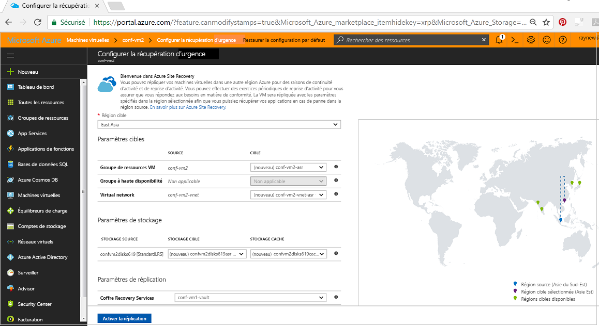
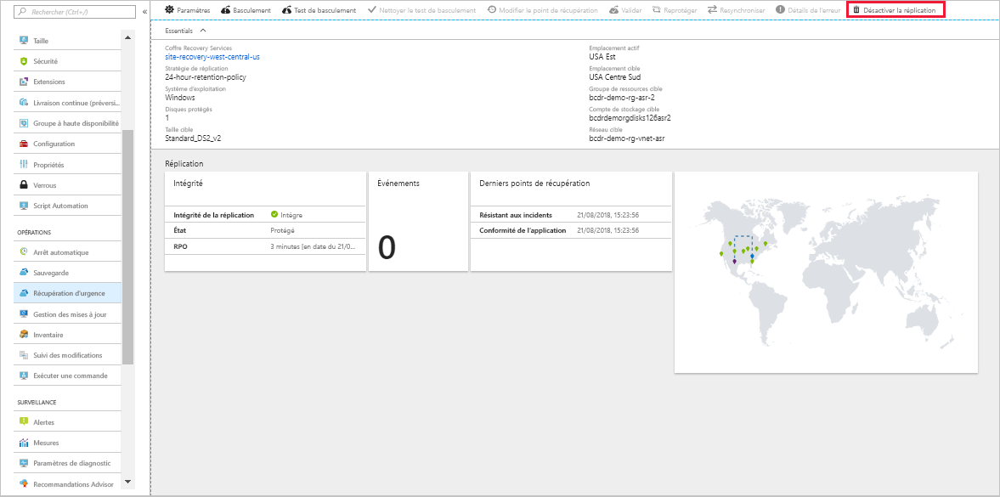

# Configurer la récupération d’urgence vers une région Azure secondaire pour une machine virtuelle Azure

Le service [Azure Site Recovery](site-recovery-overview.md) contribue à votre stratégie de récupération d’urgence et de continuité d’activité en garantissant le bon fonctionnement et la disponibilité de vos applications métier pendant les interruptions planifiées et non planifiées. Site Recovery gère et orchestre la récupération d’urgence des machines locales et des machines virtuelles Azure, notamment la réplication, le basculement et la récupération.

Ce démarrage rapide explique comment configurer la récupération d’urgence pour une machine virtuelle Azure en la répliquant vers une autre région.

Si vous n’avez pas d’abonnement Azure, créez un [compte gratuit](https://azure.microsoft.com/free/?WT.mc_id=A261C142F) avant de commencer.

> [!NOTE]
> Cet article sert de procédure pas à pas rapide pour les nouveaux utilisateurs. Il propose la méthode la plus rapide avec les options par défaut et une personnalisation minimale. Pour une procédure pas à pas complète, accédez au tutoriel [Activer la réplication](azure-to-azure-tutorial-enable-replication.md).

## Connexion à Azure

Connectez-vous au [portail Azure](https://portal.azure.com).

## Activer la réplication des machines virtuelles Azure

1. Dans le menu du portail Azure, sélectionnez **Machines virtuelles**, ou recherchez et sélectionnez *Machines virtuelles* sur n’importe quelle page. Sélectionnez la machine virtuelle à répliquer.
2. Dans **Opérations**, sélectionnez **Récupération d’urgence**.
3. Dans **Configurer la récupération d’urgence** > **Région cible**, sélectionnez la région cible vers laquelle vous allez effectuer la réplication.
4. Pour ce démarrage rapide, acceptez les autres paramètres par défaut.
5. Sélectionnez **Réviser + lancer la réplication**. Ensuite, sélectionnez **Démarrer la réplication** pour démarrer un travail afin d’activer la réplication pour la machine virtuelle.

   

## Vérifier les paramètres

Une fois le travail de réplication terminé, vous pouvez vérifier l’état de la réplication, modifier les paramètres de réplication et tester le déploiement.

1. Dans le menu du portail Azure, sélectionnez **Machines virtuelles**, ou recherchez et sélectionnez *Machines virtuelles* sur n’importe quelle page. Sélectionnez la machine virtuelle que vous souhaitez vérifier.
2. Dans **Opérations**, sélectionnez **Récupération d’urgence**.

   Vous pouvez vérifier l’intégrité de la réplication, les points de récupération qui ont été créés ainsi que les régions sources et cibles sur la carte.

   

## Nettoyer les ressources

La réplication de la machine virtuelle dans la région principale cesse quand vous désactivez la réplication pour cette machine :

- Les paramètres de réplication source sont automatiquement nettoyés. L’extension Site Recovery installée sur la machine virtuelle dans le cadre de la réplication n’est pas supprimée et doit être supprimée manuellement.
- La facturation Site Recovery pour la machine virtuelle cesse.

Arrêtez la réplication comme suit :

1. Dans le menu du portail Azure, sélectionnez **Machines virtuelles**, ou recherchez et sélectionnez *Machines virtuelles* sur n’importe quelle page. Sélectionnez la machine virtuelle que vous souhaitez modifier.
2. Dans **Récupération d’urgence**, sélectionnez **Désactiver la réplication**.

   

## Étapes suivantes

Dans ce démarrage rapide, vous avez répliqué une seule machine virtuelle vers une région secondaire. À présent, réessayez la réplication de plusieurs machines virtuelles Azure à l’aide d’un plan de récupération.

> [!div class="nextstepaction"]
> [Configurer la récupération d’urgence pour les machines virtuelles Azure](azure-to-azure-tutorial-enable-replication.md)
