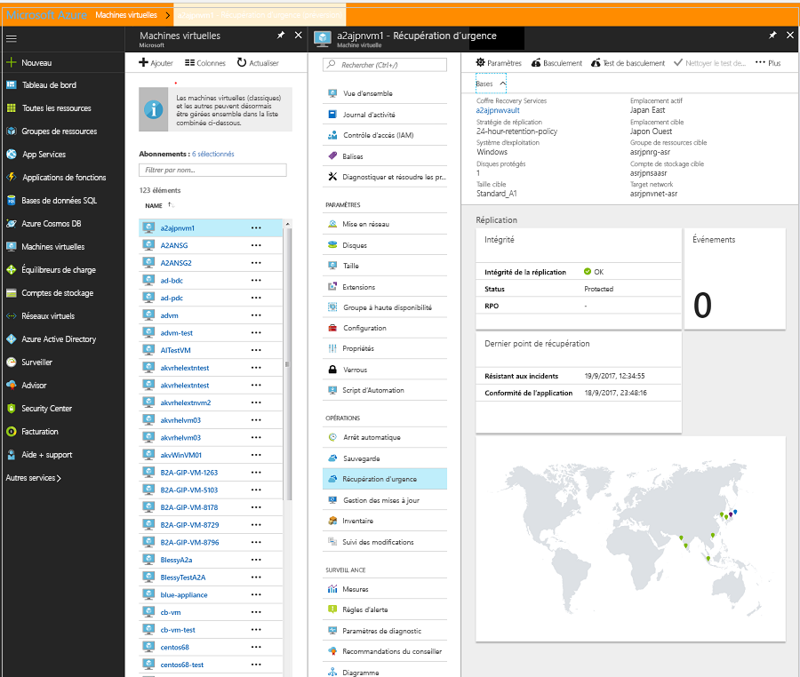

# Déplacer des machines virtuelles Azure vers des zones de disponibilité
Les zones de disponibilité dans Azure contribuent à protéger les applications et les données contre des échecs du centre de données. Chaque zone de disponibilité est composée d’un ou de plusieurs centres de données équipés d’une alimentation, d’un refroidissement et d’un réseau indépendants. Pour garantir la résilience, il existe un minimum de trois zones distinctes dans toutes les régions activées. La séparation physique des zones de disponibilité au sein d’une région contribue à protéger les applications et les données contre des échecs du centre de données. Avec les zones de disponibilité, Azure offre un Contrat de niveau de service (SLA) de 99,99 % en lien avec la durée de fonctionnement des machines virtuelles. Les zones de disponibilité sont prises en charge dans certaines régions, comme indiqué dans [Régions prenant en charge les zones de disponibilité](../availability-zones/az-region.md).

Si vous avez déployé vos machines virtuelles en tant qu’*instance unique* dans une région spécifique, et souhaitez améliorer leur disponibilité en les déplaçant vers une zone de disponibilité, vous le pouvez en utilisant Azure Site Recovery. Cette action peut encore être catégorisée comme suit :

- Déplacer des machines virtuelles à instance unique vers des zones de disponibilité dans une région cible
- Déplacer des machines virtuelles d’un groupe à haute disponibilité vers des zones de disponibilité dans une région cible

> [!IMPORTANT]
> Actuellement, Azure Site Recovery prend en charge le déplacement des machines virtuelles d’une région à une autre. Il prend uniquement en charge le déplacement entre les zones d’une région, dans quelques régions. [Plus d’informations](./azure-to-azure-how-to-enable-zone-to-zone-disaster-recovery.md)

## Vérifier les conditions préalables

- Vérifiez si la région cible [prend en charge les zones de disponibilité](../availability-zones/az-region.md). Vérifiez que votre choix de [combinaison de région source/région cible est pris en charge](./azure-to-azure-support-matrix.md#region-support). Prenez une décision éclairée concernant a région cible.
- Assurez-vous que vous comprenez [l’architecture et les composants du scénario](azure-to-azure-architecture.md).
- Examinez les [exigences et les limites de prise en charge](azure-to-azure-support-matrix.md).
- Vérifiez les autorisations du compte. Si vous venez de créer votre compte Azure gratuit, vous êtes l’administrateur de votre abonnement. Si vous n’êtes pas l’administrateur de l’abonnement, demandez à l’administrateur de vous affecter les autorisations dont vous avez besoin. Pour activer la réplication d’une machine virtuelle et copier éventuellement des données vers la cible à l’aide d’Azure Site Recovery, vous devez disposer des autorisations suivantes :

    1. Autorisations de créer une machine virtuelle dans des ressources Azure. Le rôle prédéfini *Contributeur de machines virtuelles* dispose de ces autorisations, à savoir :
        - L’autorisation de créer une machine virtuelle dans le groupe de ressources sélectionné
        - L’autorisation de créer une machine virtuelle dans le réseau virtuel sélectionné
        - L’autorisation d’écrire dans le compte de stockage sélectionné

    2. Autorisations de gérer des tâches Azure Site Recovery. Le rôle *Collaborateur Site Recovery* dispose de toutes les autorisations nécessaires pour gérer les actions Site Recovery dans un coffre Recovery Services.

## Préparer les machines virtuelles sources

1. Vos machines virtuelles doivent utiliser des disques managés si vous voulez pouvoir les déplacer vers une zone de disponibilité à l’aide de Site Recovery. Vous pouvez convertir des machines virtuelles Windows existantes utilisant des disques non managés de façon à ce qu’elles utilisent des disques managés. Procédez de la manière décrite dans [Convertir les disques non managés d’une machine virtuelle Windows en disques managés](../virtual-machines/windows/convert-unmanaged-to-managed-disks.md). Assurez-vous que le groupe à haute disponibilité est configuré en tant que groupe *managé*.
2. Assurez-vous que tous les certificats racines les plus récents sont présents sur les machines virtuelles Azure à déplacer. À défaut, la copie de données vers la région cible ne peut pas être activée en raison de contraintes de sécurité.

3. Pour les machines virtuelles Windows, installez-y toutes les mises à jour de Windows les plus récentes afin que tous les certificats racines approuvés s’y trouvent. Dans un environnement déconnecté, suivez les processus Windows Update et de mise à jour de certificat standard en vigueur au sein de votre organisation.

4. Pour des machines virtuelles Linux, suivez les instructions fournies par votre distributeur Linux pour obtenir les certificats racines approuvés les plus récents et la dernière liste de révocation de certificats sur la machine virtuelle.
5. Veillez à ne pas utiliser de proxy d’authentification dans le but de contrôler la connectivité réseau pour les machines virtuelles que vous voulez déplacer.

6. Si la machine virtuelle que vous tentez de déplacer n’a accès à Internet, ou si elle utilise un proxy pare-feu pour contrôler l’accès sortant, vérifiez la configuration requise dans [Configurer la connectivité réseau sortante](azure-to-azure-tutorial-enable-replication.md#set-up-outbound-network-connectivity-for-vms).

7. Identifiez la topologie du réseau source et les ressources que vous utilisez actuellement pour la vérification, à savoir les équilibreurs de charge, les groupes de sécurité réseau et l’adresse IP publique.

## Préparer la région cible

1. Vérifiez que votre abonnement Azure vous permet de créer des machines virtuelles dans la région cible utilisée pour la récupération d’urgence. Au besoin, contactez le support technique pour activer le quota requis.

2. Assurez-vous que votre abonnement dispose de suffisamment de ressources pour prendre en charge des machines virtuelles de tailles correspondant à vos machines virtuelles source. Si vous utilisez Site Recovery pour copier des données vers la cible, Site Recovery choisit une machine virtuelle cible de la même taille ou d’une taille aussi proche que possible.

3. Créez une ressource cible pour chaque composant identifié dans la topologie du réseau source. Cette action garantit qu’après le passage à la région cible, vos machines virtuelles offriront les mêmes fonctionnalités et caractéristiques que celles qui étaient disponibles dans la région source.

    > [!NOTE]
    > Azure Site Recovery détecte et crée automatiquement un réseau virtuel et un compte de stockage quand vous activez la réplication pour la machine virtuelle source. Vous pouvez également pré-créer ces ressources et les affecter à la machine virtuelle dans le cadre de l’étape d’activation de la réplication. En revanche, vous devez créer manuellement toutes les autres ressources mentionnées ci-après dans la région cible.

     Les documents suivants décrivent comment créer les ressources réseau les plus couramment utilisées dont vous avez besoin, en fonction de la configuration de la machine virtuelle source.

    - [Groupes de sécurité réseau](../virtual-network/manage-network-security-group.md)
    - [Équilibreurs de charge](../load-balancer/index.yml)
    - [Adresse IP publique](../virtual-network/virtual-network-public-ip-address.md)
    
   Pour tous les autres composants réseau, reportez-vous à la [documentation](../index.yml?pivot=products&panel=network) sur la mise en réseau.

    > [!IMPORTANT]
    > Veillez à utiliser un équilibreur de charge redondant interzone dans la cible. Pour en savoir plus, lisez le document [Standard Load Balancer et zones de disponibilité](../load-balancer/load-balancer-standard-availability-zones.md).

4. Si vous souhaitez tester la configuration avant de passer à la région cible, vous devez [créer manuellement un réseau hors production](../virtual-network/quick-create-portal.md) dans la région cible. Nous recommandons cette approche parce qu’elle minimise l’interférence avec le réseau de production.

## Activer la réplication
Les étapes ci-dessous vous guident dans l’utilisation d’Azure Site Recovery pour activer la réplication de données dans la région cible, avant d’opérer leur déplacement final vers les zones de disponibilité.

> [!NOTE]
> Ces étapes conviennent pour une seule machine virtuelle. Vous pouvez les étendre à plusieurs machines virtuelles. Accédez au coffre Recovery Services, sélectionnez **+ Répliquer**, puis choisissez les machines virtuelles appropriées.

1. Dans le portail Azure, sélectionnez **Machines virtuelles**, puis choisissez la machine virtuelle que vous souhaitez déplacer vers les zones de disponibilité.
2. Dans **Opérations**, sélectionnez **Récupération d’urgence**.
3. Dans **Configurer la récupération d’urgence** > **Région cible**, sélectionnez la région cible vers laquelle vous allez effectuer la réplication. Vérifiez que cette région [prend en charge](../availability-zones/az-region.md) les zones de disponibilité.

    

4. Sélectionnez **Suivant : Paramètres avancés**.
5. Choisissez les valeurs appropriées pour l’abonnement, le groupe de ressources de machine virtuelle et le réseau virtuel cibles.
6. Dans la section **Disponibilité**, choisissez la zone de disponibilité vers laquelle vous souhaitez déplacer la machine virtuelle. 
   > [!NOTE]
   > Si vous ne voyez pas l’option Groupe à haute disponibilité ou Zone de disponibilité, vérifiez que les [conditions préalables](#prepare-the-source-vms) sont remplies et que la [préparation](#prepare-the-source-vms) des machines virtuelles sources est terminée.
  
    

7. Sélectionnez **Activer la réplication**. Cette action démarre un travail consistant à activer la réplication pour la machine virtuelle.

## Vérifier les paramètres

Une fois le travail de réplication terminé, vous pouvez vérifier l’état de la réplication, modifier les paramètres de réplication et tester le déploiement.

1. Dans le menu Machine virtuelle, sélectionnez **Récupération d’urgence**.
2. Vous pouvez vérifier l’intégrité de la réplication, les points de récupération qui ont été créés, ainsi que les régions sources et cibles sur la carte.

   

## Tester la configuration

1. Dans le menu de la machine virtuelle, cliquez sur **Récupération d’urgence**.
2. Sélectionnez l’icône **Test de basculement**.
3. Dans **Test de basculement**, sélectionnez un point de récupération à utiliser pour le basculement :

   - **Dernier point traité** : bascule la machine virtuelle vers le dernier point de récupération qui a été traité par le service Site Recovery. L’horodatage est affiché. Cette option, avec laquelle aucun temps n’est passé à traiter les données, offre un objectif de délai de récupération faible (RTO).
   - **Dernier point de cohérence des applications** : cette option bascule toutes les machines virtuelles vers le dernier point de récupération de cohérence des applications. L’horodatage est affiché.
   - **Personnalisé** : sélectionnez n’importe quel point de récupération.

3. Sélectionnez le réseau virtuel Azure cible vers lequel vous voulez déplacer les machines virtuelles Azure afin d’y tester la configuration. 

    > [!IMPORTANT]
    > Pour le test, bous vous recommandons d’utiliser un réseau machines virtuelles Azure distinct du réseau de production dans la région cible vers laquelle vous comptez déplacer vos machines virtuelles.

4. Pour commencer à tester le déplacement, sélectionnez **OK**. Pour suivre la progression, sélectionnez la machine virtuelle afin d’afficher ses propriétés. Vous pouvez également sélectionner le travail **Test de basculement** dans le nom du coffre > **Paramètres** > **Travaux** > **Travaux Site Recovery**.
5. Une fois le basculement terminé, la machine virtuelle Azure de réplication apparaît dans le portail Azure > **Machines virtuelles**. Vérifiez que la machine virtuelle est en cours d’exécution, qu’elle est correctement dimensionnée et qu’elle est connectée au réseau approprié.
6. Si vous souhaitez supprimer la machine virtuelle créée pour tester le déplacement, sélectionnez **Nettoyer le test de basculement** sur l’élément répliqué. Cliquez sur **Notes** pour consigner et enregistrer d’éventuelles observations sur le test.

## Opérer le déplacement vers la région cible et confirmer

1.  Dans le menu de la machine virtuelle, cliquez sur **Récupération d’urgence**.
2. Sélectionnez l’icône **Basculement**.
3. Dans **Basculement**, sélectionnez **Dernier**. 
4. Sélectionnez **Arrêter la machine avant de commencer le basculement**. Site Recovery tente d’arrêter la machine virtuelle source avant de déclencher le basculement. Le basculement est effectué même en cas d’échec de l’arrêt. Vous pouvez suivre la progression du basculement sur la page **Tâches**. 
5. Une fois le travail terminé, vérifiez que la machine virtuelle apparaît bien dans la région Azure cible comme prévu.
6. Dans **Éléments répliqués**, cliquez avec le bouton droit sur la machine virtuelle > **Valider**. Cette étape termine le processus de déplacement vers la région cible. Attendez que le travail de validation soit terminé.

## Supprimer les ressources dans la région source

Accédez à la machine virtuelle. Sélectionnez **Désactiver la réplication**. Cette action met fin au processus de copie des données pour la machine virtuelle.  

> [!IMPORTANT]
> Effectuez l’étape qui précède pour éviter d’être facturé pour la réplication Azure Site Recovery après le déplacement. Les paramètres de réplication source sont automatiquement nettoyés. Notez que l’extension Site Recovery installée dans le cadre de la réplication n’est pas supprimée et doit être supprimée manuellement.

## Étapes suivantes

Dans ce didacticiel, vous avez amélioré la disponibilité d’une machine virtuelle Azure en la déplaçant vers un groupe à haute disponibilité ou une zone de disponibilité. Vous pouvez à présent configurer la récupération d’urgence pour la machine virtuelle déplacée.

> [!div class="nextstepaction"]
> [Configurer la récupération d’urgence après la migration](azure-to-azure-quickstart.md)
