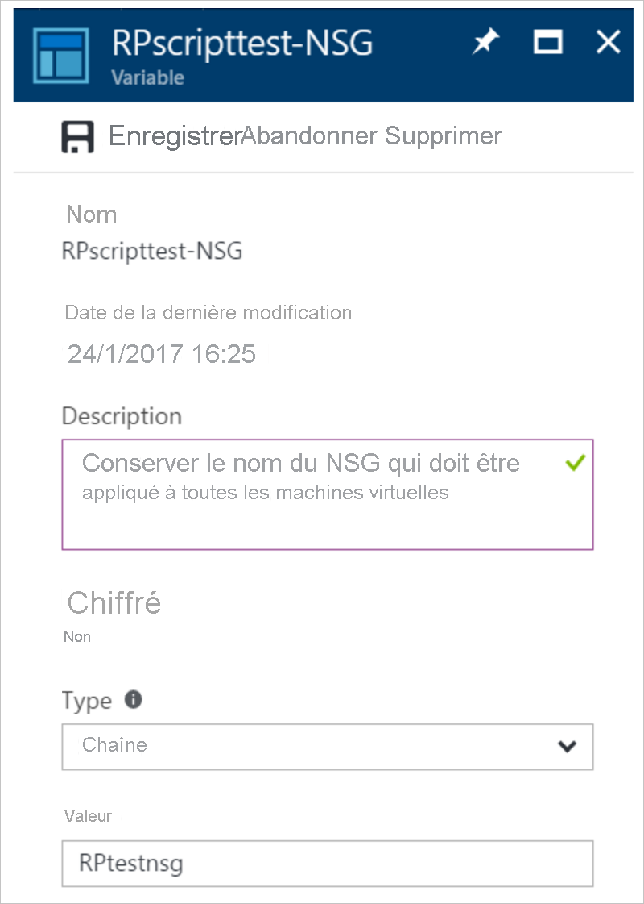
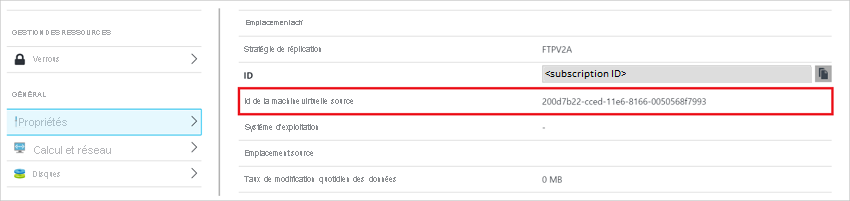

# <a name="add-azure-automation-runbooks-to-recovery-plans"></a>Ajouter des runbooks Azure Automation à des plans de récupération

Cet article explique comment intégrer des runbooks Azure Automation afin d'étendre des plans de récupération [Azure Site Recovery](site-recovery-overview.md). Nous allons vous apprendre à automatiser des tâches de base qui nécessitent habituellement une intervention manuelle, et à passer d'une opération de récupération en plusieurs étapes à une seule action n'impliquant qu'un seul clic.

## <a name="recovery-plans"></a>Plans de récupération 

Vous pouvez utiliser des plans de récupération lors du basculement d'ordinateurs locaux ou de machines virtuelles Azure. Les plans de récupération vous aident à définir un processus de récupération systématique qui définit le mode de basculement des machines, ainsi que leurs modes de démarrage et de récupération après un basculement. 

La récupération d'applications volumineuses peut être complexe. Les plans de récupération permettent d'imposer un ordre afin que la récupération soit toujours précise, reproductible et automatisée. Vous pouvez automatiser les tâches d'un plan de récupération à l'aide de scripts, ainsi que de runbooks Azure Automation. Il peut par exemple s'agir de la configuration de paramètres sur une machine virtuelle Azure après un basculement, ou de la reconfiguration d'une application en cours d'exécution sur la machine virtuelle.

- [Découvrez d’autres informations](recovery-plan-overview.md) sur les plans de récupération.
- [Découvrez-en plus](../automation/automation-runbook-types.md) sur les runbooks Azure Automation.


## <a name="runbooks-in-recovery-plans"></a>Runbooks dans les plans de récupération

Vous ajoutez un compte Azure Automation et des runbooks à un plan de récupération. Le runbook est appelé lors de l'exécution du plan de récupération.

- Le compte Automation peut se trouver dans n'importe quelle région Azure, et doit être associé au même abonnement que le coffre Site Recovery. 
- Un runbook peut être exécuté dans un plan de récupération lors du basculement d'un emplacement principal vers un emplacement secondaire, ou lors de la restauration automatique d'un emplacement secondaire vers un emplacement principal.
- Les runbooks d'un plan de récupération sont exécutés par séries, l'un après l'autre, dans l'ordre défini.
- Si les runbooks d'un plan de récupération configurent des machines virtuelles pour qu'elles démarrent dans différents groupes, le plan de récupération ne se poursuit que lorsqu'Azure indique que toutes les machines virtuelles sont en cours d'exécution.
- L'exécution des plans de récupération se poursuit, même si un script échoue.

### <a name="recovery-plan-context"></a>Contexte de plan de récupération

Lorsqu'un script s'exécute, il injecte un contexte de plan de récupération dans le runbook. Le contexte contient les variables résumées dans le tableau.

| **Nom de la variable** | **Description** |
| --- | --- |
| RecoveryPlanName |Nom du plan de récupération. Utilisé dans les actions basées sur le nom. |
| FailoverType |Spécifie s'il s'agit d'un test ou d'un basculement de production. 
| FailoverDirection | Spécifie si la récupération est opérée sur un emplacement principal ou secondaire. |
| GroupID |Identifie le numéro de groupe dans le plan de récupération lorsque celui-ci est en cours d'exécution. |
| VmMap |Tableau de toutes les machines virtuelles dans le groupe. |
| Clé VMMap |Clé unique (GUID) pour chaque machine virtuelle. |
| SubscriptionId |ID de l’abonnement Azure dans lequel la machine virtuelle a été créée. |
| ResourceGroupName | Nom du groupe de ressources dans lequel se trouve la machine virtuelle.
| CloudServiceName |Nom du service cloud Azure sous lequel la machine virtuelle a été créée. |
| RoleName |Nom de la machine virtuelle Azure. |
| RecoveryPointId|Timestamp de la récupération de la machine virtuelle. |

>[!Note]
>La valeur de la variable « FailoverDirection » est « PrimaryToSecondary » en cas de basculement, et « SecondaryToPrimary » en cas de restauration automatique.

L’exemple suivant montre une variable de contexte :

```
{"RecoveryPlanName":"hrweb-recovery",
"FailoverType":"Test",
"FailoverDirection":"PrimaryToSecondary",
"GroupId":"1",
"VmMap":{"7a1069c6-c1d6-49c5-8c5d-33bfce8dd183":
    { "SubscriptionId":"7a1111111-c1d6-49c5-8c5d-111ce8dd183",
    "ResourceGroupName":"ContosoRG",
    "CloudServiceName":"pod02hrweb-Chicago-test",
    "RoleName":"Fabrikam-Hrweb-frontend-test",
    "RecoveryPointId":"TimeStamp"}
    }
}
```

Si vous souhaitez accéder à toutes les machines virtuelles VMMap d'une boucle, vous pouvez utiliser le code suivant :

```
$VMinfo = $RecoveryPlanContext.VmMap | Get-Member | Where-Object MemberType -EQ NoteProperty | select -ExpandProperty Name
$vmMap = $RecoveryPlanContext.VmMap
    foreach($VMID in $VMinfo)
    {
        $VM = $vmMap.$VMID                
            if( !(($VM -eq $Null) -Or ($VM.ResourceGroupName -eq $Null) -Or ($VM.RoleName -eq $Null))) {
            #this check is to ensure that we skip when some data is not available else it will fail
    Write-output "Resource group name ", $VM.ResourceGroupName
    Write-output "Rolename " = $VM.RoleName
            }
        }
```


Le blog d'Aman Sharma, [Harvesting Clouds](http://harvestingclouds.com) (Exploitation des clouds), contient un exemple utile de [script de contexte de plan de récupération](http://harvestingclouds.com/post/script-sample-azure-automation-runbook-for-asr-recovery-plan/).


## <a name="before-you-start"></a>Avant de commencer

- Si vous ne connaissez pas Azure Automation, vous pouvez vous [inscrire](https://azure.microsoft.com/services/automation/) et [télécharger des exemples de scripts](https://azure.microsoft.com/documentation/scripts/).
- Veillez à ce le compte Automation dispose des modules suivants :
    - AzureRM.profile
    - AzureRM.Resources
    - AzureRM.Automation
    - AzureRM.Network
    - AzureRM.Compute

    Les versions de tous les modules doivent être compatibles. La méthode la plus simple consiste à toujours utiliser les dernières versions de tous les modules.


## <a name="customize-the-recovery-plan"></a>Personnaliser un plan de récupération

1. Dans le coffre, sélectionnez **Plans de récupération (Site Recovery)** .
2. Pour créer un plan de récupération, cliquez sur **+ Plan de récupération**. [Plus d’informations](site-recovery-create-recovery-plans.md) Si vous disposez déjà d'un plan de récupération, choisissez de l'ouvrir.
3. Sur la page du plan de récupération, cliquez sur **Personnaliser**.

    

2. Cliquez sur les points de suspension (...) en regard de **Groupe 1 : Démarrer** > **Ajouter une action de publication**.
3. Dans **Action d'insertion**, vérifiez que **Script** est sélectionné, et spécifiez un nom pour le script (**Hello World**).
4. Spécifiez un compte Automation et sélectionnez un runbook. Pour enregistrer le script, cliquez sur **OK**. Le script est ajouté à **Group 1: Post-steps**.


## <a name="reuse-a-runbook-script"></a>Réutiliser un script de runbook

Vous pouvez utiliser le même script de runbook dans plusieurs plans de récupération en ayant recours à des variables externes. 

- Les [variables Azure Automation](../automation/shared-resources/variables.md) permettent de stocker des paramètres pour l'exécution d'un plan de récupération.
- En ajoutant le nom de plan de récupération en tant que préfixe à la variable, vous pouvez créer des variables individuelles pour chaque plan de récupération. Ensuite, utilisez les variables en tant que paramètres.
- Vous pouvez modifier un paramètre sans changer le script, mais en modifiant la façon dont le script fonctionne.

### <a name="use-a-simple-string-variable-in-a-runbook-script"></a>Utiliser une variable chaîne simple dans un script de runbook

Dans cet exemple, un script accepte l'entrée d'un groupe de sécurité réseau et l'applique aux machines virtuelles d'un plan de récupération. 

1. Pour que le script puisse détecter le plan de récupération en cours d'exécution, utilisez le contexte de plan de récupération suivant :

    ```
    workflow AddPublicIPAndNSG {
        param (
              [parameter(Mandatory=$false)]
              [Object]$RecoveryPlanContext
        )

        $RPName = $RecoveryPlanContext.RecoveryPlanName
    ```

2. Notez le nom du groupe de sécurité réseau et le groupe de ressources. Ces variables sont utilisées en tant qu'entrées pour les scripts de plan de récupération. 
1. Dans Ressources du compte Automation, créez une variable pour stocker le nom du groupe de sécurité réseau. Ajoutez un préfixe au nom de la variable, avec le nom du plan de récupération.

    

2. Créez une variable pour stocker le nom du groupe de ressources du groupe de sécurité réseau. Ajoutez un préfixe au nom de la variable, avec le nom du plan de récupération.

    


3.  Dans le script, utilisez le code de référence suivant pour obtenir les valeurs des variables :

    ```
    $NSGValue = $RecoveryPlanContext.RecoveryPlanName + "-NSG"
    $NSGRGValue = $RecoveryPlanContext.RecoveryPlanName + "-NSGRG"

    $NSGnameVar = Get-AutomationVariable -Name $NSGValue
    $RGnameVar = Get-AutomationVariable -Name $NSGRGValue
    ```

4.  Utilisez les variables figurant dans le runbook pour appliquer le groupe de sécurité réseau à l’interface réseau de la machine virtuelle basculée :

    ```
    InlineScript {
    if (($Using:NSGname -ne $Null) -And ($Using:NSGRGname -ne $Null)) {
            $NSG = Get-AzureRmNetworkSecurityGroup -Name $Using:NSGname -ResourceGroupName $Using:NSGRGname
            Write-output $NSG.Id
            #Apply the NSG to a network interface
            #$vnet = Get-AzureRmVirtualNetwork -ResourceGroupName TestRG -Name TestVNet
            #Set-AzureRmVirtualNetworkSubnetConfig -VirtualNetwork $vnet -Name FrontEnd `
            #  -AddressPrefix 192.168.1.0/24 -NetworkSecurityGroup $NSG
        }
    }
    ```


Pour chaque plan de récupération, créez des variables indépendantes afin de pouvoir réutiliser le script. Ajoutez un préfixe en utilisant le nom du plan de récupération. 

Si vous souhaitez obtenir un script complet, de bout en bout, pour ce scénario, consultez [ce script](https://gallery.technet.microsoft.com/Add-Public-IP-and-NSG-to-a6bb8fee).


### <a name="use-a-complex-variable-to-store-more-information"></a>Utiliser une variable complexe pour stocker plus d’informations

Selon les scénarios, vous ne pourrez peut-être pas toujours créer de variables distinctes pour chaque plan de récupération. Imaginez un scénario dans le cadre duquel vous souhaitez disposer d'un script unique pour attribuer une adresse IP publique sur des machines virtuelles spécifiques. Dans un autre scénario, vous pourriez vouloir appliquer différents groupes de sécurité réseau à différentes machines virtuelles (au lieu de toutes). Notez les points suivants :

- Vous pouvez créer un script réutilisable pour n'importe quel plan de récupération.
- Chaque plan de récupération peut avoir un nombre variable de machines virtuelles.
- Par exemple, une récupération SharePoint a deux serveurs frontaux. Une application métier n’a qu’un seul serveur frontal.
- Dans ce scénario, vous ne pouvez pas créer des variables distinctes pour chaque plan de récupération.

Dans l'exemple suivant, nous créons une [variable complexe](/powershell/module/servicemanagement/azure.service/set-azureautomationvariable) sur le compte Azure Automation.

Pour ce faire, nous spécifions plusieurs valeurs à l'aide d'Azure PowerShell.

1. Dans PowerShell, connectez-vous à votre abonnement Azure :

    ```
    Connect-AzureRmAccount
    $sub = Get-AzureRmSubscription -Name <SubscriptionName>
    $sub | Select-AzureRmSubscription
    ```

2. Pour stocker les paramètres, créez la variable complexe en utilisant le nom du plan de récupération :

    ```
    $VMDetails = @{"VMGUID"=@{"ResourceGroupName"="RGNameOfNSG";"NSGName"="NameOfNSG"};"VMGUID2"=@{"ResourceGroupName"="RGNameOfNSG";"NSGName"="NameOfNSG"}}
        New-AzureRmAutomationVariable -ResourceGroupName <RG of Automation Account> -AutomationAccountName <AA Name> -Name <RecoveryPlanName> -Value $VMDetails -Encrypted $false
    ```

3. Dans cette variable complexe, **VMDetails** est l’ID de machine virtuelle de la machine virtuelle protégée. Pour obtenir l’ID de machine virtuelle, dans le portail Azure, affichez les propriétés de la machine virtuelle. La capture d’écran suivante affiche une variable qui stocke les détails de deux machines virtuelles :

    

4. Utilisez cette variable dans votre runbook. Si le GUID de machine virtuelle indiqué figure dans le contexte du plan de récupération, appliquez le groupe de sécurité réseau à la machine virtuelle :

    ```
    $VMDetailsObj = (Get-AutomationVariable -Name $RecoveryPlanContext.RecoveryPlanName).ToObject([hashtable])
    ```

4. Dans votre runbook, parcourez les machines virtuelles du contexte du plan de récupération. Vérifiez l’existence de la machine virtuelle dans **$VMDetailsObj**. Si la variable existe, accédez à ses propriétés pour appliquer le groupe de sécurité réseau :

    ```
        $VMinfo = $RecoveryPlanContext.VmMap | Get-Member | Where-Object MemberType -EQ NoteProperty | select -ExpandProperty Name
        $vmMap = $RecoveryPlanContext.VmMap

        foreach($VMID in $VMinfo) {
            $VMDetails = $VMDetailsObj[$VMID].ToObject([hashtable]);
            Write-output $VMDetails
            if ($VMDetails -ne $Null) { #If the VM exists in the context, this will not be Null
                $VM = $vmMap.$VMID
                # Access the properties of the variable
                $NSGname = $VMDetails.NSGName
                $NSGRGname = $VMDetails.NSGResourceGroupName

                # Add code to apply the NSG properties to the VM
            }
        }
    ```

Vous pouvez utiliser le même script pour différents plans de récupération. Entrez des paramètres différents en stockant la valeur correspondant à un plan de récupération dans différentes variables.

## <a name="sample-scripts"></a>Exemples de scripts

Pour déployer les exemples de scripts sur votre compte Automation, cliquez sur le bouton **Déployer sur Azure**.

[](https://aka.ms/asr-automationrunbooks-deploy)

Cette vidéo fournit un autre exemple. Elle montre comment récupérer une application WordPress à deux niveaux dans Azure :


> [!VIDEO https://channel9.msdn.com/Series/Azure-Site-Recovery/One-click-failover-of-a-2-tier-WordPress-application-using-Azure-Site-Recovery/player]


## <a name="next-steps"></a>Étapes suivantes

- Découvrez-en plus sur le [compte d'identification Azure Automation](../automation/manage-runas-account.md).
- Consultez les [exemples de scripts Azure Automation](https://gallery.technet.microsoft.com/scriptcenter/site/search?f%5B0%5D.Type=User&f%5B0%5D.Value=SC%20Automation%20Product%20Team&f%5B0%5D.Text=SC%20Automation%20Product%20Team).
- [En savoir plus](site-recovery-failover.md) sur l’exécution des basculements.
