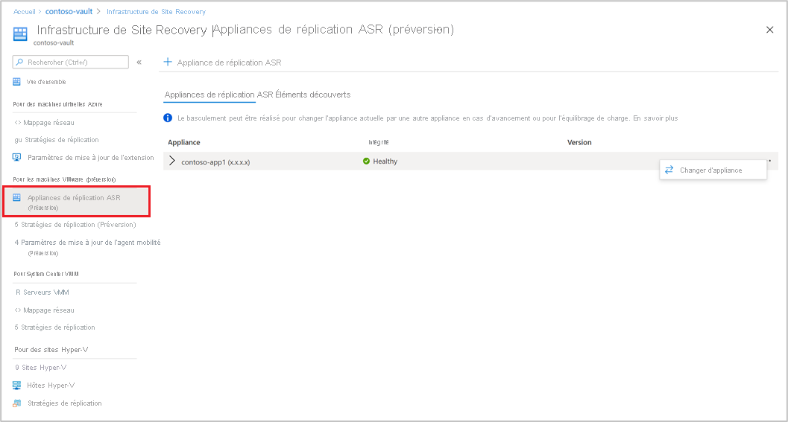

# Configuration de la récupération d’urgence sur Azure de machines virtuelles VMware locales – Préversion

Cet article explique comment activer la réplication des machines virtuelles VMware locales pour la récupération d’urgence sur Azure avec le service [Azure Site Recovery](site-recovery-overview.md) – Préversion.

Pour savoir comment configurer la récupération d’urgence dans les versions Azure Site Recovery Classic, consultez le [tutoriel](vmware-azure-tutorial.md).

Il s’agit du troisième tutoriel d’une série qui montre comment configurer la reprise d’activité sur Azure pour des machines virtuelles VMware locales. Dans le tutoriel précédent, nous avons [préparé l’environnement VMware local](vmware-azure-tutorial-prepare-on-premises.md) à la reprise d’activité sur Azure.

Dans ce tutoriel, vous allez apprendre à :

> [!div class="checklist"]
> * Configurer les paramètres de la réplication source
> * Configurer les paramètres de la cible de réplication
> * Activer la réplication d’une machine virtuelle VMware

> [!NOTE]
> Les tutoriels vous montrent le chemin de déploiement le plus simple pour un scénario. Ils utilisent les options par défaut lorsque cela est possible et n’affichent pas tous les paramètres et chemins d’accès possibles. Pour obtenir des instructions détaillées, consultez l’article de la section Procédures dans la table des matières de Site Recovery.

## Bien démarrer

La réplication de VMware vers Azure comprend les procédures suivantes :

- Connectez-vous au [portail Azure](https://portal.azure.com/).
- Pour commencer, accéder au [Portail Azure en version préliminaire](https://aka.ms/rcmcanary), puis suivre la procédure décrite dans les sections suivantes
- Préparer un compte Azure
- Préparer l’infrastructure
- [Créer un coffre Recovery Services](./quickstart-create-vault-template.md?tabs=CLI)
- [Déployer une appliance de réplication Azure Site Recovery](deploy-vmware-azure-replication-appliance-preview.md)
- Activer la réplication

## Préparer un compte Azure

Pour créer et inscrire l’appliance de réplication Azure Site Recovery, il vous faut un compte doté des autorisations suivantes :

- Autorisations Contributeur ou Propriétaire sur l’abonnement Azure
- Des autorisations permettant d’inscrire des applications Azure Active Directory (AAD).
- Autorisations Propriétaire ou Contributeur et Administrateur de l’accès utilisateur sur l’abonnement Azure pour créer un coffre de clés, utilisé pendant la migration VMware sans agent

Si vous venez de créer un compte Azure gratuit, vous êtes le propriétaire de votre abonnement. Si vous n’êtes pas le propriétaire de l’abonnement, demandez-lui de vous attribuer les autorisations requises.

Pour attribuer les autorisations requises, procédez comme suit :

1. Sur le Portail Azure, recherchez **Abonnements**. Sous **Services**, sélectionnez la zone de recherche **Abonnements** pour rechercher l’abonnement Azure requis.

2. Sur la page **Abonnements**, sélectionnez l’abonnement dans lequel vous avez créé le coffre Recovery Services.

3. Dans l’abonnement, sélectionnez **Contrôle d’accès** (IAM) > **Vérifier l’accès**. Dans **Vérifier l’accès**, recherchez le compte d’utilisateur correspondant.

4. Dans **Ajouter une attribution de rôle**, sélectionnez **Ajouter**, le rôle Contributeur ou Propriétaire, puis le compte. Ensuite, sélectionnez **Enregistrer**.

5. Pour pouvoir inscrire l’appliance de réplication Azure Site Recovery, vous devez vous assurer que votre compte Azure dispose de l’autorisation d’inscrire des applications AAD.

**Pour attribuer les autorisations requises, procédez comme suit** :

1. Dans le portail Azure, accédez à **Azure Active Directory** > **Utilisateurs** > **Paramètres utilisateur**. Dans **Paramètres utilisateur**, vérifiez que les utilisateurs Azure AD peuvent inscrire des applications (défini sur *Oui* par défaut).

2. Si les paramètres **Inscriptions d’applications** ont la valeur *Non*, demandez au locataire ou à l’administrateur général d’affecter l’autorisation nécessaire. L’administrateur général/le locataire peuvent également attribuer le rôle Développeur d’applications à un compte pour permettre l’inscription d’une application AAD.

## Préparation de l’infrastructure – Configuration de l’appliance de réplication Azure Site Recovery

Vous devez [configurer une appliance de réplication Azure Site Recovery dans l’environnement local](deploy-vmware-azure-replication-appliance-preview.md) pour acheminer les communications de l’agent de mobilité.

## Activation de la réplication des machines virtuelles VMware

Une fois que vous avez ajouté une appliance de réplication Azure Site Recovery à un coffre, vous pouvez commencer à protéger les machines.

Vérifiez que les [prérequis](vmware-physical-azure-support-matrix.md) sur le stockage et la mise en réseau sont respectés.

Pour activer la réplication, procédez comme suit :

1. Sélectionnez **Site Recovery** dans la section **Bien démarrer**. Dans la section VMware, cliquez sur **Activer la réplication (préversion)** .

2. Choisissez le type de machine que vous souhaitez protéger avec Azure Site Recovery.

   > [!NOTE]
   > En préversion, la prise en charge est limitée aux machines virtuelles.

   

3. Après avoir choisi les machines virtuelles, sélectionnez le serveur vCenter Server ajouté à l’appliance de réplication Azure Site Recovery, inscrit dans ce coffre.

4. Ensuite, recherchez le nom des machines virtuelles sources à protéger. Pour passer en revue les machines virtuelles sélectionnées, sélectionnez **Ressources sélectionnées**.

5. Après avoir sélectionné la liste des machines virtuelles, sélectionnez **Suivant** pour passer aux paramètres de la source. Sélectionnez alors l’appliance de réplication et les informations d’identification de la machine virtuelle. Ces informations d’identification permettent au serveur de configuration d’envoyer l’agent de mobilité sur la machine virtuelle pour effectuer l’activation d’Azure Site Recovery. Veillez à ce que les informations d’identification choisies soient correctes.

   >[!NOTE]
   >Pour le système d’exploitation Linux, assurez-vous de fournir les informations d’identification racines. Pour le système d’exploitation Windows, c’est un compte d’utilisateur doté de privilèges Administrateur qui doit être ajouté. Ces informations d’identification sont utilisées pour envoyer le service de mobilité sur la machine source pendant l’opération d’activation de la réplication.

   

6. Sélectionnez **Suivant** pour indiquer les propriétés de la région cible. Par défaut, l’abonnement au coffre et le groupe de ressources du coffre sont sélectionnés. Vous pouvez choisir l’abonnement et le groupe de ressources de votre choix. C’est là que seront déployées vos machines sources lors du basculement.

   

7. Ensuite, vous pouvez sélectionner un réseau Azure existant ou créer un réseau cible à utiliser pendant le basculement. Si vous sélectionnez **Créer**, le panneau contextuel Créer un réseau virtuel s’ouvre. Il vous est demandé de fournir des informations sur l’espace d’adressage et le sous-réseau. Ce réseau sera créé dans l’abonnement cible et le groupe de ressources cible sélectionnés à l’étape précédente.

8. Ensuite, indiquez les informations relatives au réseau de test de basculement.

   > [!NOTE]
   > Veillez à ce que le réseau de test de basculement soit différent du réseau de basculement. Ainsi, ce dernier reste facilement disponible en cas de sinistre réel.

9. Sélectionnez le stockage.

    - Compte de stockage de cache : maintenant, choisissez le compte de stockage de cache utilisé par Azure Site Recovery à des fins de préproduction, pour mettre en cache et stocker les journaux avant d’écrire les modifications sur les disques managés.

      Par défaut, un nouveau compte de stockage de type LRS v1 est créé par Azure Site Recovery pour la première opération d’activation de la réplication d’un coffre. Pour les opérations suivantes, le même compte de stockage de cache est réutilisé.
    -  Disques managés

       Par défaut, des disques managés HDD Standard sont créés dans Azure. Vous pouvez personnaliser le type de disque managé en sélectionnant **Personnaliser**. Veillez à [choisir le type de disque approprié](../virtual-machines/disks-types.md#disk-type-comparison) en fonction des besoins de l’entreprise et des IOPS des disques de la machine source. Pour plus d’informations sur la tarification, consultez le document sur la [tarification des disques managés](https://azure.microsoft.com/pricing/details/managed-disks/).

       >[!NOTE]
       > Si vous installez manuellement le service de mobilité avant d’activer la réplication, vous pouvez modifier le type de disque managé au niveau du disque. Sinon, par défaut, un seul type de disque managé peut être choisi au niveau de la machine.

10. Créez une nouvelle stratégie de réplication si nécessaire.

     Une stratégie de réplication par défaut est créée sous le coffre avec une rétention de point de récupération de 72 heures et une fréquence de cohérence au niveau application de 4 heures.  Vous pouvez créer une nouvelle stratégie de réplication en fonction de vos exigences de RPO.

     - Sélectionnez **Créer nouveau**.

     - Entrez le Nom.

     - Entrez la **Rétention des points de récupération** en heures.

     - Sélectionnez **Fréquence des instantanés cohérents au niveau application en heures** en fonction des besoins de l’entreprise.

     - Sélectionnez **OK** pour enregistrer la stratégie.

     Une fois créée, la stratégie peut être utilisée pour protéger les machines sources choisies.

11. Après avoir choisi la stratégie de réplication, sélectionnez **Suivant**. Passez en revue les propriétés sources et cibles. Sélectionnez **Activer la réplication** pour lancer l’opération.

    

    Une tâche est créée pour activer la réplication des machines sélectionnées. Pour suivre la progression, accédez à Tâches Site Recovery dans le coffre Recovery Services.

## Étapes suivantes
Après avoir activé la réplication, exécutez une simulation pour vérifier que tout fonctionne comme prévu.
> [!div class="nextstepaction"]
> [Effectuer un test de récupération d’urgence](site-recovery-test-failover-to-azure.md)