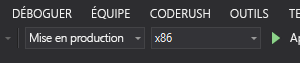

# Démarrage rapide : Créer une application HoloLens avec Azure Spatial Anchors, en C++/WinRT et DirectX

Ce démarrage rapide explique comment créer une application HoloLens à l’aide d’[Azure Spatial Anchors](../overview.md) en C++/WinRT et DirectX. Azure Spatial Anchors est un service de développement multiplateforme qui vous permet de créer des expériences de réalité mixte en utilisant des objets qui conservent leur emplacement sur les appareils. Quand vous aurez terminé, vous aurez une application HoloLens capable d’enregistrer et de rappeler une ancre spatiale.

Vous découvrirez comment effectuer les actions suivantes :

> [!div class="checklist"]
> * Créer un compte Spatial Anchors
> * Configurer l’identificateur et la clé du compte Spatial Anchors
> * Déployer et exécuter sur un appareil HoloLens

[!INCLUDE [quickstarts-free-trial-note](../../../includes/quickstarts-free-trial-note.md)]

## Prérequis

Pour suivre ce guide de démarrage rapide, veillez à avoir :
- Une machine Windows dotée de <a href="https://www.visualstudio.com/downloads/" target="_blank">Visual Studio 2019</a> avec la charge de travail de **développement pour la plateforme Windows universelle** et le composant **SDK Windows 10 (version 10.0.18362.0 ou plus récente)** . Vous devez aussi installer <a href="https://git-scm.com/download/win" target="_blank">Git pour Windows</a> et <a href="https://git-lfs.github.com/">Git LFS</a>.
- L’[extension Visual Studio (VSIX) C++/WinRT](https://aka.ms/cppwinrt/vsix) pour Visual Studio doit être installée à partir de [Visual Studio Marketplace](https://marketplace.visualstudio.com/).
- Un appareil HoloLens avec le [mode développeur](https://docs.microsoft.com/windows/mixed-reality/using-visual-studio) activé. L’appareil utilisé dans cet article est un HoloLens doté de la [mise à jour Windows 10 de mai 2020](https://docs.microsoft.com/windows/mixed-reality/whats-new/release-notes-may-2020 ). Pour mettre à jour votre appareil HoloLens vers la dernière version, ouvrez l’application **Paramètres**, accédez à **Mise et sécurité**, puis sélectionnez le bouton **Vérifier les mises à jour**.
- Votre application doit définir la fonctionnalité **spatialPerception** dans son manifeste AppX.

[!INCLUDE [Create Spatial Anchors resource](../../../includes/spatial-anchors-get-started-create-resource.md)]

## Ouvrir l’exemple de projet

[!INCLUDE [Clone Sample Repo](../../../includes/spatial-anchors-clone-sample-repository.md)]

Ouvrez `HoloLens\DirectX\SampleHoloLens.sln` dans Visual Studio.

## Configurer l’identificateur et la clé du compte

L’étape suivante configure l’application pour qu’elle utilise votre identificateur et votre clé de compte. Vous les avez copiés dans un éditeur de texte pendant la [configuration de la ressource Spatial Anchors](#create-a-spatial-anchors-resource).

Ouvrez `HoloLens\DirectX\SampleHoloLens\ViewController.cpp`.

Localisez le champ `SpatialAnchorsAccountKey` et remplacez `Set me` par la clé du compte.

Localisez le champ `SpatialAnchorsAccountId` et remplacez `Set me` par l’identificateur du compte.

Recherchez le champ `SpatialAnchorsAccountDomain` et remplacez `Set me` par le domaine du compte.

## Déployer l’application sur votre HoloLens

Pour **Configuration de la solution**, choisissez **Mise en production**, pour **Plateforme de solution** choisissez **x86**, puis sélectionnez **Appareil**  dans les options de cible de déploiement.

Si vous utilisez HoloLens 2, utilisez **ARM64** comme **plateforme de solution** au lieu de **x86**.

Allumez l’appareil HoloLens, connectez-vous, puis connectez l’appareil au PC au moyen d’un câble USB.

Sélectionnez **Déboguer** > **Démarrer le débogage** pour déployer votre application et commencer le débogage.

Suivez les instructions dans l’application pour placer et rappeler une ancre.

Dans Visual Studio, arrêtez l’application en sélectionnant **Arrêter le débogage** ou en appuyant sur **Maj+F5**.

[!INCLUDE [Clean-up section](../../../includes/clean-up-section-portal.md)]

[!INCLUDE [Next steps](../../../includes/spatial-anchors-quickstarts-nextsteps.md)]

> [!div class="nextstepaction"]
> [Tutoriel : Partager Spatial Anchors sur des appareils](../tutorials/tutorial-share-anchors-across-devices.md)
